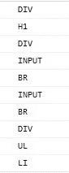
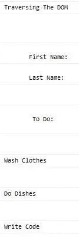

# 什么是 JavaScript NodeIterator API？

> 原文：<https://javascript.plainenglish.io/what-is-the-javascript-nodeiterator-api-c4443b79b492?source=collection_archive---------4----------------------->

## 遍历 DOM 树节点


Photo by [Todd Quackenbush](https://unsplash.com/@toddquackenbush?utm_source=unsplash&utm_medium=referral&utm_content=creditCopyText) on [Unsplash](https://unsplash.com/s/photos/tree?utm_source=unsplash&utm_medium=referral&utm_content=creditCopyText)

这里有两个遍历 DOM 的 JavaScript API。他们是[节点迭代器](https://developer.mozilla.org/en-US/docs/Web/API/NodeIterator)和[树行者](https://developer.mozilla.org/en-US/docs/Web/API/TreeWalker)。两者都可以**返回给定根节点下的节点列表**。他们很相似，但也有一些不同。

> 两者的核心目的都是过滤和查找所需的节点

> `**NodeIterator**`接口表示 DOM 子树中节点的**列表**成员的迭代器。节点将按文档顺序返回。
> 
> `**TreeWalker**`对象表示文档**子树**的节点以及它们内部的位置。

**为了使本文简短，我们将把重点放在 NodeIterator API 上。**

# 节点迭代器 API

使用文档接口的 **createNodeIterator()** 方法创建 **NodeIterator** 对象。

语法是，

```
const nodeIterator = document.createNodeIterator(root, whatToShow, filter);
```

如图所示，这个方法有三个参数。

*   *根节点*，它保存了我们想要过滤的所有节点。
*   第二个参数，*whatoshow*，是一个*构建的* ***-*** *，在 filter* 中使用了 **NodeFilter** 对象的常量。
*   第三个参数， *filter* ，是一个返回 [**NodeFilter**](https://developer.mozilla.org/en-US/docs/Web/API/NodeFilter) 对象的函数，用于**选择**相关节点。在这里，您可以指定自定义标准来帮助决定**接受**、**拒绝**或**跳过**节点。

上面的第二个参数指的是*常量*。这些是 [**NodeFilter**](https://developer.mozilla.org/en-US/docs/Web/API/NodeFilter) 对象的常量，格式为 NodeFilter.CONSTANT。

*   节点过滤器。SHOW_TEXT(显示文本节点)
*   节点过滤器。SHOW_ELEMENT(显示元素节点)

当使用这些时，不匹配的节点被跳过*、*第一级过滤*。* ***常数*** *的完整列表可以在* [*这里*](https://developer.mozilla.org/en-US/docs/Web/API/NodeIterator) *找到。*

由于 NodeIterator 是一个**迭代器**，它为我们提供了一个循环遍历节点的方法。nextNode()。

> 简单地说，我们在 DOM 中指定一个起点，遍历 DOM，寻找符合内置过滤器和定制过滤器标准的节点。

## 示例-显示元素

创造出下面的**index.html**

```
<!DOCTYPE html>
<html lang="en"><head>
    <meta charset="UTF-8">
    <meta name="viewport" content="width=device-width, initial-scale=1.0">
    <title>Document.createNodeIterator</title>
</head><body>
    <div id='main'>
    <h1>Traversing The DOM</h1> <div>
       First Name:<input type='text'><br/>
       Last Name:<input type='text'><br/>
    </div>
    <br/>
    <div>
        To Do:
        <ul>
            <li>Wash Clothes</li>
            <li>Do Dishes</li>
            <li>Write Code</li>
        </ul>
    </div></div>
    <script src="index.js"> </script></body>
</html>
```

接下来创建下面的 **index.js**

```
window.onload = ()=> {
    // The starting node
    getNodesStartingAt(document.querySelector('#main'));
}function getNodesStartingAt(myRoot) {const nodeIterator = document.createNodeIterator(
        myRoot,
        NodeFilter.SHOW_ELEMENT,
        (node) => {
            // ACCEPT, REJECT OR SKIP based on
            // custom criteria
            return NodeFilter.FILTER_ACCEPT;
        }
    );let currentnode;while (currentnode = nodeIterator.nextNode()) {
        console.log(currentnode.tagName);
    }
}
```

**试运行**

打开 index.html。

打开浏览器的控制台窗口，观察输出。



Output for NodeFilter**.SHOW_ELEMENT**

**尝试通过修改函数调用来改变**起始根，如下所示:

```
getNodesStartingAt(document.body);
```

**尝试通过改变如下循环来改变**console . log()的输出，

```
while (currentnode = nodeIterator.nextNode()) {
        **console.log(currentnode.innerHTML);**
    }
```

**尝试更改**节点过滤器。NodeFilter 的常数。SHOW_TEXT 和 console.log()输出到 nodeValue。请参见下面的粗体项目。

```
window.onload = ()=> {
    // The starting node
    getNodesStartingAt(document.body);
}function getNodesStartingAt(myRoot) {const nodeIterator = document.createNodeIterator(
        myRoot,
       ** NodeFilter.SHOW_TEXT,**
        (node) => {
            // ACCEPT, REJECT OR SKIP based on
            // custom criteria
            return NodeFilter.FILTER_ACCEPT;
        }
    );let currentnode;while (currentnode = nodeIterator.nextNode()) {
      **  console.log(currentnode.nodeValue);**
    }
}
```

这产生了，



Output for NodeFilter.**SHOW_TEXT**

我们将在另一篇文章中讨论树行者，但这里是一个快速浏览。

# TreeWalker API

> 这两个接口的主要区别在于，树遍历器呈现的是子树中节点的**面向树的视图**，而不是迭代器的**面向列表的视图。**

TreeWalker 还有一些额外的方法。

*   **前一个节点** -(也在节点迭代器中。)移动到并返回当前节点的前一个节点。
*   **nextNode** -(也在 NodeIterator 中。)移动到经过筛选的节点集合中的下一个节点并返回。
*   **parentNode** -移动并返回当前节点的父节点。
*   **firstChild** -移动并返回当前节点的第一个子节点。
*   **lastChild** -移动并返回当前节点的第一个子节点。
*   **previousSibling** -移动并返回当前节点的前一个兄弟节点。
*   **nextSibling** -移动到当前节点的下一个兄弟节点并返回。

TreeWalker 有四个论点。前三个与 NodeIterator 相同。语法是，

```
document.createTreeWalker(root, whatToShow, filter, **entityExpandBol**)
```

最后一个参数是一个布尔参数，指定是否应该扩展实体引用。

**示例**

使用相同的 index.html，但将 index.js 更改如下。

```
window.onload = ()=> {
    // The starting node
    getNodesStartingAt(document.querySelector('#main'));
}function getNodesStartingAt(myRoot) {const treeWalker = document.createTreeWalker(
        myRoot,
       NodeFilter.SHOW_ELEMENT,
        (node) => {
            // ACCEPT, REJECT OR SKIP based on
            // custom criteria
            return NodeFilter.FILTER_ACCEPT;
        }
    );let currentnode;
    while (currentnode = treeWalker.nextNode()) {
        console.log(currentnode.tagName);
    } 
```

# 结论:

定位全部或部分 DOM 树的能力对于底层检查和潜在的 DOM 操作非常有用。简单地说，这就是现代应用程序一直在做的事情，例如 SPA。

大部分功能将来自于第三个参数**、**定制过滤器**。正是在这里，我们可以根据我们选择的任何标准来接受、拒绝或跳过。**

我鼓励您尝试使用**常量**过滤器(第二个参数)、**自定义**过滤器(第三个参数)以及更复杂的 HTML 文档。

**感谢您的阅读和快乐编码！**

在 Medium 上阅读所有你想要的文章，并通过成为 Medium 会员来帮助我继续写作，每月只需 5 美元。

[](https://bobtomlin-70659.medium.com/membership) [## 通过我的推荐链接加入灵媒——重力井(罗伯·汤姆林)

### 作为一个媒体会员，你的会员费的一部分会给你阅读的作家，你可以完全接触到每一个故事…

bobtomlin-70659.medium.com](https://bobtomlin-70659.medium.com/membership)