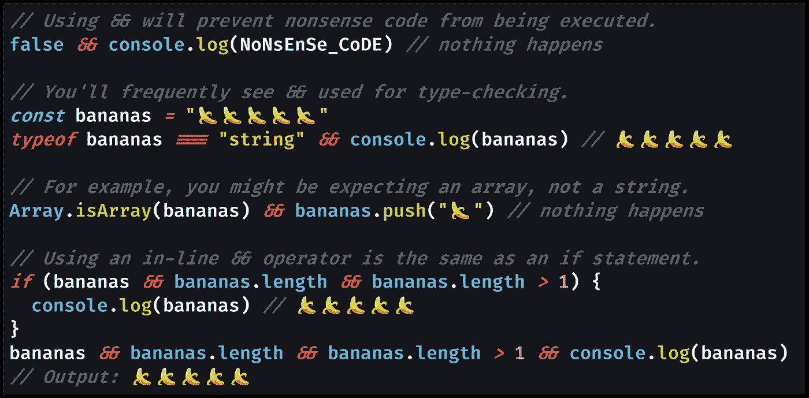
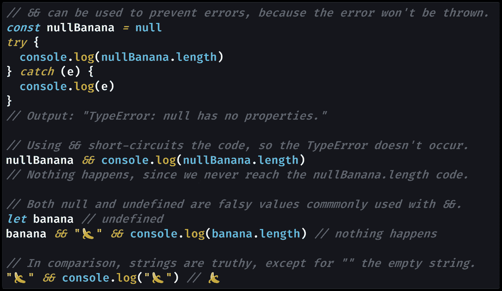

# JavaScript 中的短路操作符是什么？(&&，逻辑与)

> 原文：<https://javascript.plainenglish.io/what-is-the-short-circuit-operator-in-javascript-logical-and-7ee0e8dc8bc8?source=collection_archive---------1----------------------->

## 你会在 JavaScript 代码中经常看到“短路操作符”，尤其是在 React JSX 中。使用`&&`，falsy 值将“短路”给定的代码行，导致执行停止。

Photo by [Lucas Santos](https://unsplash.com/@_staticvoid?utm_source=medium&utm_medium=referral) on [Unsplash](https://unsplash.com?utm_source=medium&utm_medium=referral)

# 为什么你需要短路代码

在 React 中有一段时间我不明白的是如何有条件地呈现 React 组件。

当你编写[JSX 代码](https://reactjs.org/docs/introducing-jsx.html)(看起来像 HTML 的部分，由 React 组件的[渲染函数](https://reactjs.org/docs/react-component.html#render)返回)时，你不能像在 JavaScript 中一样使用`[if](https://developer.mozilla.org/en-US/docs/Web/JavaScript/Reference/Statements/if...else)`语句。

这似乎打破了计算机编程的基本规则之一。编程语言都有“开关”(像`if`这样的条件)，循环，以及做数学的能力。

如果没有将代码分支到不同路径的能力，如何编写响应用户的 React JSX 代码呢？

这是深入理解 JavaScript 语言的机制对提高 React 开发人员的能力非常有用的时候之一。

当您编写 JSX 代码时，React 会将 JSX 翻译成一系列对`[React.createElement()](https://reactjs.org/docs/react-without-jsx.html)`的函数调用。([在 React 17 的](https://docs.google.com/spreadsheets/d/1WCH-k0MOwSR1ielMQi4q-QhAmnpss4O24TO57m8DDCM/edit#gid=966652394)中，即改成了[一个新的 JSX 变换](https://reactjs.org/blog/2020/09/22/introducing-the-new-jsx-transform.html#whats-different-in-the-new-transform)、`jsx()`，但概念是一样的。).

这就是在 JSX 不能使用`if`语句的技术原因:React 不知道如何将`if`翻译成`createElement()`(或`jsx()`)函数调用。谢天谢地，JavaScript 有一个工具可以“短路”一行代码的执行:`&&`(和)。

# (重新)介绍短路操作符，`&&`

`&&`(逻辑 AND)运算符——也称为“[短路运算符](https://developer.mozilla.org/en-US/docs/Web/JavaScript/Reference/Operators/Logical_AND#Short-circuit_evaluation)”——是每个开发人员都熟悉的东西。

您使用像`if`语句和`while`循环这样的`&&`内部条件来连接[布尔](https://medium.com/javascript-in-plain-english/how-to-check-for-a-boolean-in-javascript-98fdc8aec2a7)表达式。结果是[逻辑表达式“AND”](https://en.wikipedia.org/wiki/Logical_conjunction):由`&&`连接的两个表达式都需要返回[真值](https://medium.com/coding-in-simple-english/what-are-truthy-values-in-javascript-e037bdfa76f8)才能进入条件表达式。

然而，您可能没有预料到“短路”行为:我没有。短路操作的意思是如果下一个表达式被`&&`加入，JavaScript 在[一个 falsy 值](https://medium.com/coding-at-dawn/what-are-falsy-values-in-javascript-ca0faa34feb4)后停止执行。

你可以很容易地想象一种编程语言在继续之前评估与`&&`相关的两个表达式。虽然效率不高，但似乎有道理。然而，这不是 JavaScript 的工作方式；JavaScript 从左到右计算，会短路。

这意味着您可能会有无意义的代码或在`&&`之后抛出错误的东西，而 JavaScript 并不在乎。这实际上非常强大，尤其是在类型检查的时候。您可以想象在通过在一行上使用`&&`连接两个表达式来访问数组之前，[使用`Array.isArray()`检查数组](https://medium.com/javascript-in-plain-english/how-to-check-for-an-array-in-javascript-6ad20f7a0e21)。

# 使用短路操作器`&&`代替`if`

使用短路操作符`&&`的另一种方式是使用它有条件地执行一行代码，而根本不使用`if`语句。

让我们看几个使用`&&`演示短路执行的代码示例。

[View raw code](https://gist.github.com/DoctorDerek/00a8f9376c50f59825cb11ddf220f84b) as GitHub Gist

正如我们在第一个代码示例中看到的，使用`&&`的结果与使用一个`if`语句后跟一个`{}` [代码块](https://developer.mozilla.org/en-US/docs/Web/JavaScript/Reference/Statements/block)是一样的。

[View raw code](https://gist.github.com/DoctorDerek/72ce6e43b563a82ea3a34a2729443918) as a GitHub Gist

当 JavaScript 从左到右读取给定行上的代码时，任何后跟`&&`的 falsy 值都会缩短执行时间。

> “逻辑 AND 表达式从左到右计算，使用以下规则测试可能的‘短路’计算:
> 
> `(some falsy expression) && *expr*`对 falsy 表达式进行短路求值；
> 
> 短路意味着上面的`*expr*`部分没有被**求值**，因此这样做的任何副作用都不会生效(例如，如果`*expr*`是一个函数调用，则调用永远不会发生)。”— [MDN 文档](https://developer.mozilla.org/en-US/docs/Web/JavaScript/Reference/Operators/Logical_AND#Short-circuit_evaluation)

正如我提到的，你通常会在 React JSX 代码中看到`&&`，React 组件或 HTML 元素只在某些情况下才会被呈现:`shouldBeRenderedBoolean && <ComponentToRender />`。

对于一些人来说，使用`&&`会非常明显(*“喜欢，咄”*)，但我花了一段时间才明白“短路执行”是什么意思。我发现`&&`几乎和[一样令人困惑](https://medium.com/better-programming/making-sense-of-vs-in-javascript-f9dbbc6352e3) `[==](https://medium.com/better-programming/making-sense-of-vs-in-javascript-f9dbbc6352e3)` [和](https://medium.com/better-programming/making-sense-of-vs-in-javascript-f9dbbc6352e3) `[===](https://medium.com/better-programming/making-sense-of-vs-in-javascript-f9dbbc6352e3)`的区别。

希望本教程能帮助你理解这个关键的 JavaScript 概念。短路评估可以让我们写出[简单的代码](https://medium.com/better-programming/why-you-should-make-your-code-as-simple-as-possible-3b35e89f137)，只要我们明白`&&`到底是怎么工作的。

**编码快乐！**🔭`&&`🌌`===`🆒

[Derek Austin](https://www.linkedin.com/in/derek-austin/)博士是《职业编程:如何在 6 个月内成为一名成功的 6 位数程序员 》一书的作者，该书现已在亚马逊上架。