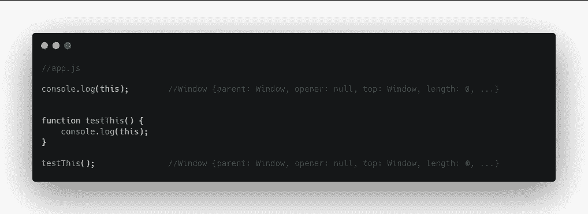
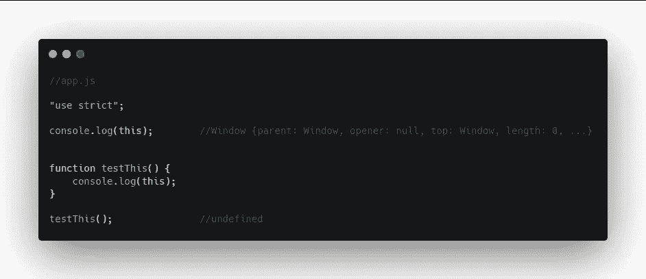
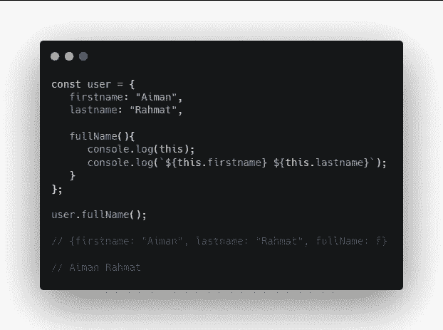
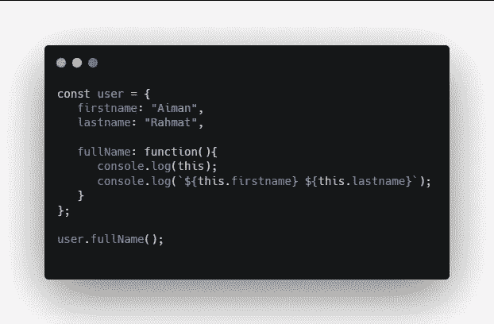
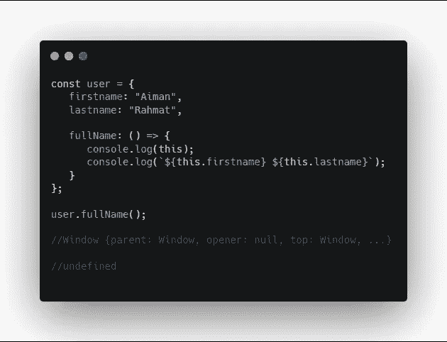
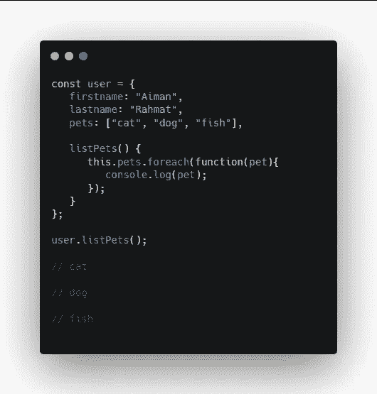
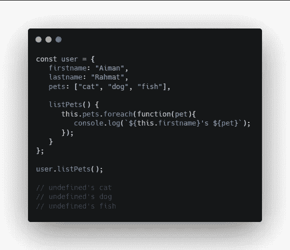
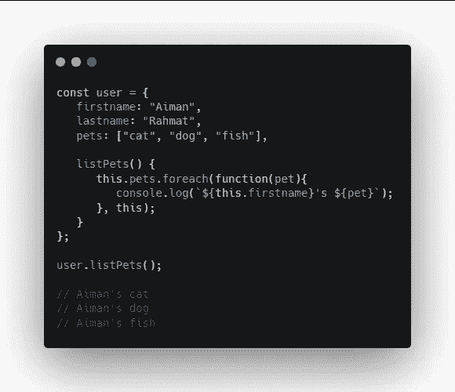
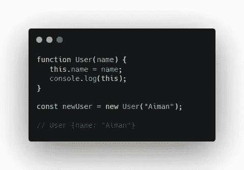

# JavaScript 中的‘this’是什么？

> 原文：<https://javascript.plainenglish.io/what-is-this-in-javascript-a64c754695e6?source=collection_archive---------9----------------------->

## 理解 JavaScript 中的 **this**

Photo by [Prateek Katyal](https://unsplash.com/@prateekkatyal?utm_source=medium&utm_medium=referral) on [Unsplash](https://unsplash.com?utm_source=medium&utm_medium=referral)

# JavaScript 中的 **this** 是什么？

它是执行当前函数的对象。所以在没有任何上下文的情况下，**这个**指的是浏览器中的全局对象，也就是窗口。

在标准函数中呢？**该**再次引用全局对象窗口，因为该功能是从全局对象执行的。

如果我们将`use strict`添加到我们的代码中，那么我们将会阻止**这个**在函数中的绑定。但是注意，在函数之外，**这个**仍然引用全局窗口对象。

现在，让我们看一个对象方法。

这里我们有一个使用`fullName`方法的用户对象。在对象中，**这个**现在指的是它被调用的对象。在第一个 console.log 中，我们获取整个对象，在第二个日志中，我们使用模板字符串获取名字和姓氏。

记住这个将要引用的**的一个简单方法是查看调用函数或方法的那一行。函数或方法左边的东西就是这个**将要绑定的**(参考`user.fullName()`)。**

这是编写相同方法的另一种方式。这里我们定义了函数，但是如果我们使用一个箭头函数呢？理解箭头函数如何工作以及何时使用和不使用它们是很重要的。

在这种情况下，我们不会使用 arrow 函数，因为 arrow 函数总是绑定到全局对象。这一次，在我们的第一个 console.log 中，我们得到了`window`对象，在第二个日志中，我们得到了`undefined`。

现在让我们在用户对象中添加一个宠物数组，然后添加一个新方法来列出每只宠物。因为我们现在知道在这个上下文中**这个**将指对象，我们可以使用`this.pets.foreach()`。然后我们将创建一个函数并记录每只宠物。

但是现在如果我们也想在宠物前面加上用户名呢？所以我们想让它说“艾曼的猫/狗/鱼”。

在这个上下文中，在`foreach`方法中，我们有另一个函数，它不绑定到原始对象，而是绑定到全局对象。

所以在这个例子中，因为我们使用了`foreach`，我们可以传递一个参数。所以我们将传入原始的 **this** ，它引用了对象，现在它像预期的那样工作了。

需要注意的是，并不是每个方法都支持参数。

最后，让我们看一个构造函数。

这里我们有一个**用户**函数，它接受一个名称参数，然后将`this.name`赋给这个名称。然后它记录**这个**。为了初始化构造函数，我们创建了一个新用户的常量，它等于`new User()`，我们给它传递了一个名字。

通过使用`new`，我们创建了一个对象，它用我们传递给它的名字返回这个对象。