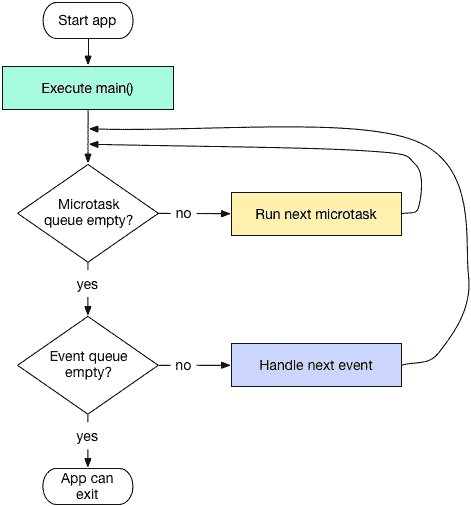

# Vue.nextTick 是什么？

> 原文：<https://javascript.plainenglish.io/what-is-vue-nexttick-89d6878c1162?source=collection_archive---------5----------------------->

## 我使用 nextTick 改善用户体验的经验


# Vue.nextTick()在 Vue.js 官方文档中是什么

*根据 vue.js 官方文件(*[*https://vuejs.org/v2/api/#Vue-nextTick*](https://vuejs.org/v2/api/#Vue-nextTick)*)*

*   将回调推迟到下一个 DOM 更新周期之后执行
*   更改一些数据后立即使用它来等待 DOM 更新

## vue . next tick([回调，上下文])

*   **立即，DOM 更新，回调……**

> 所以我觉得 nextTick 和 DOM 立即更新有关，对吧？

*   承诺、异步/等待也可用

> 很好。我理解这个概念。那么为什么我一定要知道呢？？


Photo by [bruce mars](https://unsplash.com/@brucemars?utm_source=medium&utm_medium=referral) on [Unsplash](https://unsplash.com?utm_source=medium&utm_medium=referral)

# 如何在现实生活中使用 Vue.nextTick()

## **First Gif**


> 和...相对

## **第二 Gif**


> 你能看出区别吗？

**第一个 gif 使用$nextTick 方法**

example.js

*   如果用户点击 gifs 上的**上传**文本，则执行 **handleFiles** 功能
*   这是一个 Promise 函数，本质上是设置目录&在创建的目录上上传文件，而`isFileUploaded`是一个触发 UI 更改的状态


Photo by [Natasha Vasiljeva](https://unsplash.com/@nlo_nata?utm_source=medium&utm_medium=referral) on [Unsplash](https://unsplash.com?utm_source=medium&utm_medium=referral)

*   第二个 gif 有一个 UX 问题，它看起来像是页面被**冻结了**，因为在所有的承诺都被达成之前，UI 没有任何变化(这可能需要 ms 到几秒钟的时间)
*   我首先认为，在 Promise API 调用`await carfsModule.setupSubDirectory()`之前编写一个更新`isFileUploaded`状态**的代码将会解决这个问题**

```
this.isFileUploaded = true;const directory = await carfsModule.setupSubDirectory();/// ...
```

> 但这并不奏效

*   `isFileUploaded`状态在 **AFTER /同时**Promise API 解析【为**Second Gif】**
*   我用**这个解决问题。$ next tick)(**
*   **此。$nextTick()。**

```
this.isFileUploaded = true; // does not work until all Promise are resolved
await this.$nextTick(); // console.log(this.isFileUploaded) // true    const directory = await carfsModule.setupSubDirectory();
```

# process.nextTick in Node.js

*在 node.js 中，nextTick 帮助其回调函数先于 Event 循环中的其他回调函数执行*

产出为

```
nextTick
promise
timeout
immediate
```

*   `process.nextTick`先于`setImmediate`或`setTimeout`执行
*   此外，已解析的承诺比`setImmediate`或`setTimeout`具有更高的优先级

# 回到我们的例子

***nextTick*** *优先于****promise . resolve****，****setTimeout****，****set immediate***

让我们来看看这个例子

产量为

```
helloworld3
helloworld5
nextTick
promise
timeout
```

换句话说， **isFileUploaded** 状态将优先从`false`转换为`true`,而不管它在函数中的位置

*   **微任务:** `process.nextTick`和`Promise`常被称为微任务



> 希望你喜欢阅读


Photo by [Jan Tinneberg](https://unsplash.com/@craft_ear?utm_source=medium&utm_medium=referral) on [Unsplash](https://unsplash.com?utm_source=medium&utm_medium=referral)