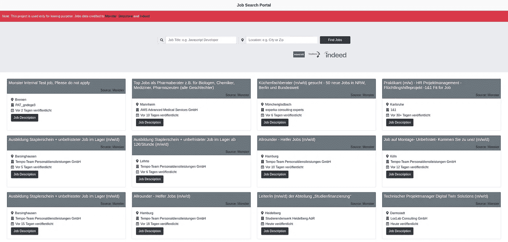
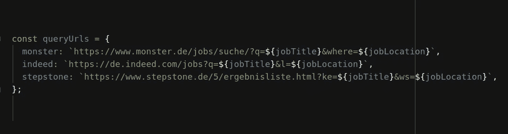
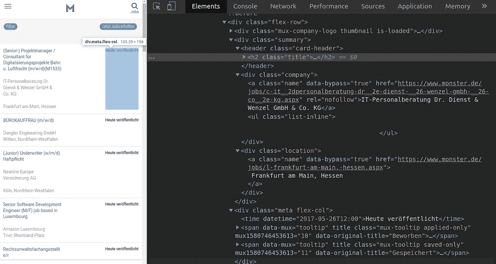
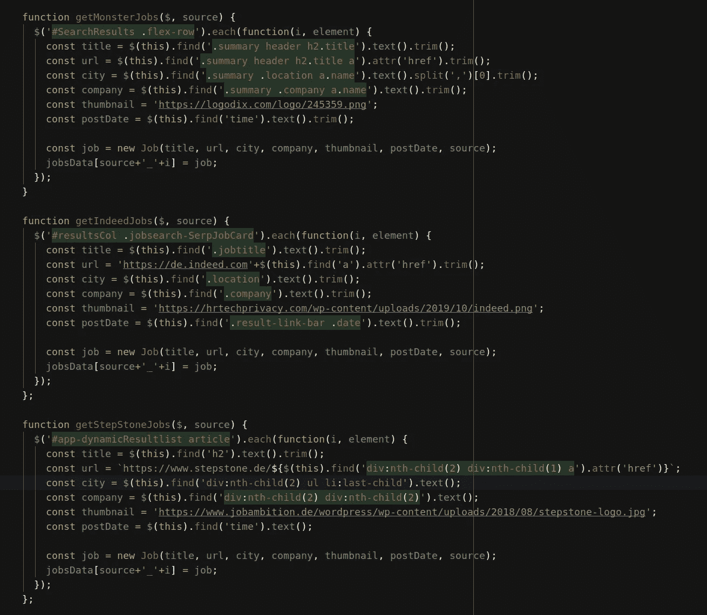

# 如何使用 Node.js 抓取网站&使用 Node.js 和 React 创建一个网页抓取器

> 原文：<https://javascript.plainenglish.io/what-is-web-scraping-and-how-to-scrap-a-website-using-node-6e82da37b3f5?source=collection_archive---------1----------------------->

# **什么是网页抓取简单来说:**

网络抓取是从目标网站提取数据的技术。帮助你抓取数据的一段代码被称为刮刀。在这篇文章中，我们将了解一个现实生活中的 web scraper 的例子。这个刮刀的工作演示可以为您提供源代码。先了解一下，再在现实生活中检验。


source: [https://www.promptcloud.com/blog/what-is-web-scraping/](https://www.promptcloud.com/blog/what-is-web-scraping/)

# 如何用 Node 刮一个网站？如何使用 Node 和 React 创建 Web Scraper？

例如，我们正在寻找工作，市场上有很多求职平台，如[**step stone . de**T5、](https://www.stepstone.de/en/)[**indeed.com**](https://de.indeed.com/?r=us)和**[**monster . de**](https://www.monster.de/)。假设我们正在柏林寻找 PHP 开发人员的工作。我们不想访问每一个求职平台，搜索相同的工作。相反，我们创建了一个 job scraper，它将为我们完成这项工作，并将这三个目标网站的结果返回给我们( [stepstone.de](https://www.stepstone.de/en/) 、[indeed.com](https://de.indeed.com/?r=us)和 [monster.de](https://www.monster.de/) )。多酷啊！**

****

**[https://jobsearchportal.herokuapp.com/](https://jobsearchportal.herokuapp.com/)**

**在本教程中，我将使用 [**Node.js**](https://nodejs.org/en/) 作为后端，使用 [**React.js**](https://reactjs.org/) 作为前端应用。**

****

**User Input form for searching jobs**

**用户在输入表单中输入**职位**和**职位**并点击**查找职位**按钮。幕后发生的事情很有意思。当用户单击按钮时，post 请求被发送到节点服务器，其中包含用户输入。在节点服务器代码中，我们使用三个目标网站的用户输入创建了三个自定义 URL，如下所示。**

**[**链接到文件**](https://gitlab.com/hammad038/jsp/-/blob/master/routes/api/jobs.js)**

****

**Custom URL queries for Monster, Indeed and StepStone**

**这些网址只会帮助我们刮目标网站的第一页上列出的工作结果。为了获得更多的结果，我们肯定可以研究 URL 参数，这将在目标网站的每个页面上给我们更多的结果。**

**现在我们将使用一个 [npm](https://en.wikipedia.org/wiki/Npm_(software)) 包 [Axios](https://www.npmjs.com/package/axios) 向这三个 URL 发送一个 HTTP 请求，它将返回目标网站的 HTML 主体作为响应。现在我们将使用另一个包， [cheerio](https://www.npmjs.com/package/cheerio) ，它是 core [jQuery](https://jquery.com/) 的子集，它将帮助我们收集相关数据。然后将作业添加到一个全局变量 **jobsData 中。**完成对所有目标网站的抓取后，节点服务器将 **jobsData** 返回给前端 React 应用。**

**我在 Axios 上使用 ES6 promises 发送了三个 HTTP 请求。当所有三个请求都完成时，它返回 **queryHtml** 作为响应。响应 queryHtml 是一个包含三项的数组:`queryHtml[0].data`是 Monster 的 Html，类似地`queryHtml[1].data`和 `queryHtml[2].data`包含了 Indeed 和 StepStone 的 HTML 字符串。然后将这 3 个数组项传递给 cheerio.load，将它们解析成 HTML，这样我们就可以在后面的步骤中获取所需的数据。**

**[**链接到文件**](https://gitlab.com/hammad038/jsp/-/blob/master/routes/api/jobs.js)**

****

**HTTP request to Monster, Indeed and StepStone**

**仅供参考，我已经向您展示了 Monster.de 求职结果页面。在这里，我们可以在浏览器检查模式下看到标题、发布日期、公司和其他相关信息的 DOM 元素结构。**

****

**DOM element of Monster.de for Job Search Results**

**函数 **getMonsterJobs** 将得到两个参数。第一个参数 **$** 是 cheerio 准备的 DOM，第二个参数 **source** 是目标网站怪物。要理解下面给出的这个函数，您应该具备 jQuery 的基本知识。在收集了关于作业的所需信息后，我们将这个新作业添加到 **jobsData** 全局对象中。我们将对 Indeed 和 StepStone 执行相同的分析，并将创建函数**getindexedjobs**和 **getStepStoneJobs** ，并将作业结果添加到 jobsData 全局对象中。**

**[**链接到文件**](https://gitlab.com/hammad038/jsp/-/blob/master/routes/api/jobs.js)**

****

**DOM elements scraping functions for Monster, Indeed and StepStone**

**所以让我们回到前端应用程序，试着看看节点服务器在抓取后的响应是如何显示在前端的。当用户提交带有职位和工作地点的求职表单时，将执行以下代码。**

**[**链接到文件**](https://gitlab.com/hammad038/jsp/-/blob/master/client/src/components/JobSearch.js)**

```
onSubmit = (e) => {
  e.preventDefault();
  const {jobTitle, jobLocation} = this.state;
  const userInput = {jobTitle, jobLocation}
  this.setState({loading: true});

  axios
    .post('/api/jobs', userInput)
    .then(res => {
      this.setState({
        jobsData: res.data.jobsData,
        loading: false
      });
    })
    .catch(err => *console*.log(err));
}
```

**以下代码在名为 **JobSearch** 的类组件中的 React 应用程序中执行。它包含状态**作业数据**和**加载**。在提交表单时，一个 HTTP post 请求被发送到包含 **userInput** (jobTitle 和 jobLocation)的节点服务器。作为回应，我们得到了粗略的就业数据。然后，我们更新组件中的状态 **jobsData** 。 **loading** 状态被设置为 true 以显示微调器以获得良好的用户体验，并且在我们从节点服务器获得响应后被设置回 false。现在我们的州有了 **jobsData** ，我们将它作为道具传递给子组件 **JobCard** ( [链接到文件](https://gitlab.com/hammad038/jsp/-/blob/master/client/src/components/JobCard.js))。该组件以卡片的形式显示搜索结果。**

**[**演示**](https://jobsearchportal.herokuapp.com/) 和**源代码**正在等着你，所以看看它们，请让我知道它是否有助于你理解网页抓取。**

# **关于作者**

**我在 [Lucid 担任全栈开发人员。工作室](https://medium.com/u/cb727ce3b3c0?source=post_page-----4ef4ecbdcc1b--------------------------------)我非常有兴趣学习并与社区分享我的知识。如果你喜欢我的工作，那就在 LinkedIn 上联系我:Sayyed Hammad Ali 。**

```
*// HASTA LA VISTA BABY
//                      ______
//                    <((((((\\\
//                    /      . }\
//                    ;--..--._|}
// (\                 '--/\--'  )
//  \\                | '-'  :'|
//   \\               . -==- .-|
//    \\               \.__.'   \--._
//    [\\          __.--|       //  _/'--.
//    \ \\       .'-._ ('-----'/ __/      \
//     \ \\     /   __>|      | '--.       |
//      \ \\   |   \   |     /    /       /
//       \ '\ /     \  |     |  _/       /
//        \  \       \ |     | /        /
//         \  \      \        /*
```

## **进一步阅读**

**[](/top-5-instant-data-scraping-tools-for-easy-web-scraping-2f3d1c4b07f0) [## 轻松抓取网页的五大即时数据抓取工具

### 光明数据，ParseHub，Apify，Octopase，Mozenda。有大量的即时网页抓取工具可供选择。如何挑选…

javascript.plainenglish.io](/top-5-instant-data-scraping-tools-for-easy-web-scraping-2f3d1c4b07f0) [](/best-tool-for-web-scraping-beautifulsoup-vs-regex-vs-advanced-web-scrapers-50b8fb92950d) [## 最佳网络抓取工具:beautiful soup vs . Regex vs . Advanced Web Scrapers

### BeautifulSoup、正则表达式或高级 web scraper——哪一个是 web 抓取的最佳工具？深潜…

javascript.plainenglish.io](/best-tool-for-web-scraping-beautifulsoup-vs-regex-vs-advanced-web-scrapers-50b8fb92950d) [](/overcoming-3-major-web-scraping-challenges-that-developers-face-1e664ffe4783) [## 克服开发者面临的 3 大网络抓取挑战

### 如何克服 3 个主要的网络抓取限制—动态网站、网站交互和指纹管理…

javascript.plainenglish.io](/overcoming-3-major-web-scraping-challenges-that-developers-face-1e664ffe4783) [](https://plainenglish.io/blog/5-use-cases-of-web-scraping-in-ecommerce) [## 电子商务中网络抓取的 5 个用例

### 利用 web scraper 可以让您的组织鸟瞰行业趋势。这有无数…

简明英语. io](https://plainenglish.io/blog/5-use-cases-of-web-scraping-in-ecommerce) [](/automate-web-scraping-with-an-easy-to-use-browser-extension-cb6073f1e61d) [## 使用易于使用的浏览器扩展自动抓取网页

### 如何使用 Listly，一个初学者友好的无代码工具，轻松实现 web 抓取过程的自动化。

javascript.plainenglish.io](/automate-web-scraping-with-an-easy-to-use-browser-extension-cb6073f1e61d) 

*更多内容请看*[***plain English . io***](https://plainenglish.io/)*。报名参加我们的* [***免费周报***](http://newsletter.plainenglish.io/) *。关注我们关于*[***Twitter***](https://twitter.com/inPlainEngHQ)[***LinkedIn***](https://www.linkedin.com/company/inplainenglish/)*[***YouTube***](https://www.youtube.com/channel/UCtipWUghju290NWcn8jhyAw)*[***不和***](https://discord.gg/GtDtUAvyhW) *。*****