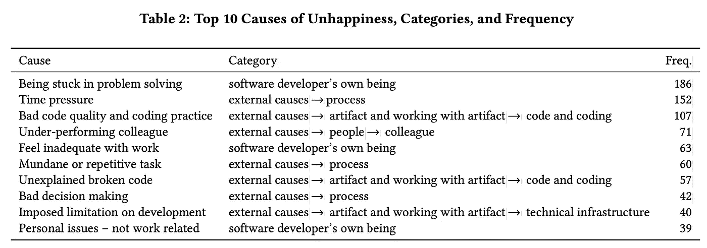

# 什么让开发者开心？

> 原文：<https://javascript.plainenglish.io/what-make-developers-happy-64c9862b4c03?source=collection_archive---------15----------------------->

## 8 与管理相关的外部因素

Photo by [Kelly Sikkema](https://unsplash.com/@kellysikkema?utm_source=medium&utm_medium=referral) on [Unsplash](https://unsplash.com?utm_source=medium&utm_medium=referral)

在科技行业，开发人员加入和离开一个组织有各种各样的原因，比如停滞不前的职业发展、糟糕的项目管理、有毒的工作环境、没有归属感等等。这些都是导致开发者最根本问题的滑坡——不快乐。

开发人员的不快通常会被老板和经理忽略。他们专注于交付产品以满足他们的 KPI(关键性能指标),而忽略了开发人员精神状态的重要性。开发人员的不快不能简单地通过更高的工资、奖金或额外的福利来补偿。

没有人总是快乐的。有起有落。我们不时会面临困难、阻碍和挑战。我们希望在黑暗隧道的尽头是希望之光。

但是，如果没有这种希望，谁也受不了多久。如果这种不快乐不断积累并达到极限，开发商将决定寻找另一个更好的地方。在一个组织内，当开发人员的快乐不断受到损害时，开发人员开始一个接一个地离开组织。

Top 10 Causes of Unhappiness, Categories, and Frequency ([https://arxiv.org/pdf/1703.04993.pdf](https://arxiv.org/pdf/1703.04993.pdf))

上表来自一项名为[的关于软件开发人员不快乐的研究](https://arxiv.org/pdf/1703.04993.pdf)。作为一名 6 年多的软件工程师，我完全可以理解所有这些原因。在这个故事里，我不打算谈论开发者自身的存在因素。相反，我将把重点放在**那些让开发人员不高兴的管理因素**上。

# 1.办公室政治

根据《韦氏大词典》的定义，办公室政治是用来在企业或公司内获得或保持权力或优势的活动、态度或行为。

人们不是为了公司的发展而一起工作，而是为了自己的利益而互相竞争。人们互相吹毛求疵，背后捅刀子。人们基于情感和联系工作。政治发生在大多数工作场所，尤其是在企业界。公司越大，政治就越复杂，解决起来也越困难。即使在拥有最好的工程标准之一的谷歌，政治也是不可避免的。

Photo by [Tamara Gak](https://unsplash.com/@tamara_photography?utm_source=medium&utm_medium=referral) on [Unsplash](https://unsplash.com?utm_source=medium&utm_medium=referral)

政治是开发者最不想处理的事情。事实上，我们对此无能为力。它带来的只有沮丧。我们不擅长政治，否则，我们本可以成为政治家。作为一名开发人员，我们是处理人际互动最不专业的人。我们的工作基于逻辑。我们的目标是推出最佳工程标准，打造最优秀的产品和服务。我们从不建立任何系统来破坏公司内部的另一个系统。

政治的一个丑陋的例子是人们没有实际努力工作就得到提升。日复一日辛勤工作的开发人员得不到任何晋升或奖金，而擅长演示和社交的人却窃取了所有的荣誉。当公司没有明确的精英制度来提拔人时，它只看最终结果而不看过程。

再比如公司里开发者的稀缺。当多个团队为他们的交付而竞争时，每个团队的负责人会想尽一切办法要求/窃取/强迫开发人员为他们自己的项目工作。最终，开发人员迫于压力不得不同时进行多个项目。

# 2.紧迫的期限

时间就是金钱——这是生意场上的黄金法则之一。越早进入市场，你就越占上风。为什么你要花 6 个月的时间来发布一个产品，而你却可以让开发者用 3 个月的时间来交付它？

Photo by [Robert Bye](https://unsplash.com/@robertbye?utm_source=medium&utm_medium=referral) on [Unsplash](https://unsplash.com?utm_source=medium&utm_medium=referral)

为公司工作的开发人员经常处于这种压力下。我们被期望(或被施压)在下班后甚至周末工作。虽然我们可能会得到高得多的报酬，但我们肯定不快乐。

我们不是在找借口慢慢做事。开发者也很看重时间。但是我们的时间观念与管理层的不同。我们现在花时间编写高质量的代码，以节省将来修复 bug 的时间。

> 为什么我们从来没有时间把事情做好，却总是有时间重做？
> 
> –匿名

在紧张的时间表下编写代码会导致糟糕的代码质量。当给我们的时间很短时，我们只是写一些有用的东西，或者从现有的东西中复制粘贴。如果我们有更多的时间，我们可以考虑重构或任何更好的方法。

当我们没有时间的时候，我们要牺牲的下一件事就是编写测试。编写测试可能会花费与编写实际代码一样多的时间。然而，测试将我们从错误中拯救出来，并使代码可维护。

当没有任何合适的测试集时，我们无法放心地重构代码。代码很容易被破解。我们最终没有重构任何东西。代码质量下降，导致生产中出现更多的 bug。

作为开发人员，我们为自己的代码感到自豪。我们不喜欢处理结构不良的代码。我们也不乐意把我们杂乱的、错误的代码交给下一个团队。

# 3.漫长的审批流程

当项目经理催促开发人员交付特性时，每个批准过程似乎都要花费很长时间。我们没有时间等到所有的事情都被批准后再开始工作。

即使在 UI 原型被批准之前，我们也没有选择开始构建 UI。利益相关者需要几周或几个月的时间来批准，他们对 UI/UX 一无所知，却给出荒谬的反馈。然后我们不得不继续返工，陷入永无止境的反馈循环。

Photo by [Macau Photo Agency](https://unsplash.com/@macauphotoagency?utm_source=medium&utm_medium=referral) on [Unsplash](https://unsplash.com?utm_source=medium&utm_medium=referral)

我们有一个创新的想法，可能需要一周的时间来实施，但我们必须等待老板的老板的老板(以及更多人)的评估和批准。人力、预算、基础设施、部署、安全、法律等等都在审批队列中。这个想法的火花很快就会熄灭，被人遗忘。

不要误解我可以跳过这些过程的想法。它们仍然是必需的，但可以缩短。层级结构和非结构化工作流是审批流程冗长的原因。如果把自主权交给较低层的人，这个过程会更快。我们可以更快地送货。大家都很开心。

# 4.会议和会议

没有人喜欢被困在不愉快的会议中。会议是快速解决问题的方式之一，而不是通过人与人之间的沟通。所以管理层的人往往会滥用会议。

Photo by [Campaign Creators](https://unsplash.com/@campaign_creators?utm_source=medium&utm_medium=referral) on [Unsplash](https://unsplash.com?utm_source=medium&utm_medium=referral)

对支付服务有疑问吗？别担心。安排与构建支付服务的所有 5 位开发人员会面。哦，等等，既然这是一个缩放会议，为什么不多拉几个已经将支付服务集成到他们的系统中的开发者呢？万一开发人员都答不上来，那我们就把邀请扩展到首席工程师兼 CTO 吧！

> 效率最低的人通常是最赞成召开会议的人。
> 
> 托马斯·索维尔

对我们开发人员来说，会议是我们效率最低的时候。花更多的时间在无用的会议上，花更少的时间写有意义的代码。下面这些会议类型肯定会惹恼开发者:

*   **毫无准备的会议** —组织者没有明确的议程。组织者让人们参加会议，希望他们能想出一些办法。尴尬的沉默时刻时有发生。组织者经常跑题，把会议拖得不必要的长。
*   **零背景会议** —开发人员被拉到一个他们没有背景的会议上。组织者在会议前没有给开发者足够的简报或背景。开发人员会意外地收到问题。
*   **零互动**会议——一大群人参加会议，但只有两三个人发言。其余大部分是开发人员，在整个会议中保持沉默。大多数开发人员实际上并不需要出席会议，但他们是为了出席而被邀请的。
*   奇数小时会议——早会迫使开发人员早起。午餐前的会议让开发人员很恼火。午饭后的会议让开发者与食物抗争。一天结束时的会议往往会超时，破坏我们下班后的个人生活。

# 5.与非技术人员一起工作

有这样一个面向开发者的面试问题——*向一个 5 岁的孩子解释 OOP 的概念*。开发人员应该向客户等非技术人员解释技术内容。

然而，每天与缺乏技术知识的项目经理一起工作是一件非常讨厌的事情。软件工程的项目经理应该有相当多的技术知识。如果没有，公司应该给他们提供强制性培训。

Photo by [CoWomen](https://unsplash.com/@cowomen?utm_source=medium&utm_medium=referral) on [Unsplash](https://unsplash.com?utm_source=medium&utm_medium=referral)

如果没有足够的技术知识，向经理解释事情需要更多的努力和更长的时间。更糟糕的情况是项目经理根本没有编码背景。他们不仅假设一个简单的特性可以在一两天内完成，而且他们也不理解构建可伸缩的架构、可重用的组件、测试等的努力。

他们要么总是质疑我们的技术决策，要么推动快速和肮脏的解决方案:

*   *为什么你需要这么多天来实现这个？*
*   *我们将来会担心的。现在你只需要尽可能快地建造它。*

作为开发者，我们知道自己在做什么。我们更喜欢可维护和可扩展的长期解决方案。只有在其他方法都不起作用的情况下，快速肮脏的解决方案才是最后的手段。

> 软件和大教堂大同小异——首先我们建造它们，然后我们祈祷。
> 
> 山姆·雷德温

# 6.重复

*不要重复自己(干)* —开发者应该遵循的黄金原则之一。不仅仅适用于编码，也适用于开发者做的一切。

> 故意不在这里插入任何图像，因为它有点重复。
> 
> 我😛

我们不喜欢解决同样的问题，所以我们编写测试来自动化这个过程。我们不喜欢每次都部署相同的堆栈，所以我们构建管道。我们不喜欢每次都构建相同的管道，所以我们编写一个云模板来创建这些管道。

所有这些都需要公司的大力支持。这些内部项目并不像面向消费者的产品那样直接产生利润，但是它们为重复做同样的事情节省了巨大的隐性成本。如果公司看不到建立所有这些软件工程基础的价值，开发人员继续为公司工作是非常令人沮丧的。

# 7.做非开发人员的事情

开发人员主要受雇于编码。有时，我们帮助项目经理创造一些吉拉故事，撰写技术文档，向相关方提供技术解决方案。这些没问题。

有时当没有设计师在场时，开发人员会被要求做一些设计工作，比如 Photoshop、裁剪图像、编辑视频等等。开发人员被要求组织公司社交聚会。当公司不想支付额外的劳动力成本时，开发商甚至被要求移动或组装家具。这些是**不是**好吧。

Photo by [Kelly Sikkema](https://unsplash.com/@kellysikkema?utm_source=medium&utm_medium=referral) on [Unsplash](https://unsplash.com?utm_source=medium&utm_medium=referral)

当开发人员做非开发人员的工作时，我们没有得到充分利用。我们不能骄傲地把那些东西写进简历。做非开发人员的工作占用了我们宝贵的办公时间去做我们应该做的事情。

# 8.严格获取资源

资源授权是安全性和便利性的平衡。开发人员通常访问的常见资源有:

*   代码库(Github、BitBucket)
*   门票(吉拉、特雷罗)
*   CI/CD 管道(詹金斯，CircleCI)
*   用户界面原型(Invision，Figma)
*   文档(合流、Google Drive、One Drive)

每当我们点击一个与我们分享的链接，它显示 **403 访问被拒绝！**真的很烦。

Photo by [Juraj Lenoch](https://unsplash.com/@jaylazyy?utm_source=medium&utm_medium=referral) on [Unsplash](https://unsplash.com?utm_source=medium&utm_medium=referral)

什么更讨厌？我们团队中的任何人，即使是项目经理，都没有权力立即授予我们许可。我们必须提交一份申请，通常需要几个小时才能得到受理。对于一家分支机构位于不同时区的全球性公司，控制访问的人可能位于 12 小时时区之后。我们需要的请求只能在第二天得到批准。啊！

最讨厌的是什么？我们不能在工作电脑上安装任何软件。我们无法下载任何安装程序。每次当我们想安装东西时，我们都必须通过技术支持。同样，审批过程需要几天时间。

> 我:你能帮我在电脑上安装**纱**吗？
> 
> 技术支持:**纱**不在批准的软件列表上。使用 **NPM** 代替。

什么？！我们作为开发者，知道什么是恶意。

对高度敏感的资源(如包含客户个人数据的数据库)设置限制是合理的。除此之外，我上面列出的资源应该可以通过 SSO(单点登录)自动供所有开发人员访问。

开发人员应该能够访问所有的代码库。它帮助开发人员理解一个系统是如何工作的，而不需要**安排会议**去询问其他开发人员(听起来熟悉吗？☝️).

如果我们偶然发现了一个 bug 或者需要一个新特性，我们也可以提交 pull 请求。这就是开源项目的工作方式。如果一个公司不采用这种开源的理念，就没有跨团队的协作，开发者也就有一点学习的机会。

为什么一个公司要相信它的开发者拥有所有的代码？有些开发者难道不会下载完所有代码就离开公司吗？答案很简单。软件工程公司最有价值的资产不是代码。**是开发商**。比起代码，公司更应该保护开发人员的安全。无论一段代码有多好，它总是可以重写的，但要取代一个好的开发人员要难得多。

# 最终想法

谢谢你读到这里。如果你是管理层的，我们希望你能理解我们的痛苦。这并不是从管理层来批评大家。我曾经和伟大的项目经理一起工作过，他们把开发人员看得和项目一样重要。我也曾在视开发者为一等公民的公司工作过。

事情可以改善，但需要时间和管理层的理解。

这绝对不是导致开发人员不愉快的管理因素的详尽列表。如果你是开发人员，还有什么让你不开心的？以上哪些因素最让你产生共鸣？下面分享一下你的想法。