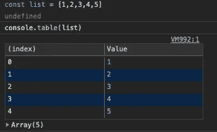
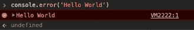

# 控制台 API 中还有哪些方法？

> 原文：<https://javascript.plainenglish.io/what-other-methods-are-available-in-the-console-api-4a5cc388bce2?source=collection_archive---------9----------------------->

## 超越 console.log()

Created using canva.com

是的，你没看错标题，除了代码中的 *console.log()* 之外，控制台 API 还能做什么？

你曾经控制台登录过控制台即 ***console.log(控制台)*** 。

相信我，即使是我也不会那样做，除非有人告诉我这样做。好了，无聊的内容说够了，让我们看看控制台对象中有哪些可用的方法。

## 1.console.assert()

*   基本上 *console.assert()* 有两个参数，一个是断言(布尔值)，另一个是消息。
*   当断言为假时，它在控制台中打印消息。如果断言为真，则消息不会记录在控制台中

## 2.console.dir()

*   它接受一个对象作为参数。
*   当您在控制台中打印窗口对象时，对象的打印格式非常难看，所以使用一个 *console.dir()* 在一个带有漂亮三角形的分层列表中列出窗口对象。

## 3.console.table()

*   它接受一个数组或对象，并以一种漂亮的表格格式显示它们。该表包含列 s——索引和值。
*   如果给定数据是一个数组，则索引列是数组的索引位置，值是每个索引处的元素。
*   如果给定的数据是一个对象，那么 index 列包含键名称，values 列包含相应键的值。

## 4.console.count()

*   它记录了调用***console . count()***的次数。
*   它将 label 作为可选参数来显示带有给定标签的计数，否则，它使用 default 作为标签文本。

## 5.console.countReset()

*   用于复位*控制台的计数值。*
*   它将标签作为可选参数，并重置相应标签的计数值。
*   否则，它重置默认标签计数值。

## 6.console.trace()

*   在浏览器控制台中打印调用堆栈并不好，是的，你可以用 *console.trace()* 来做。
*   它打印堆栈跟踪，直到您在代码中使用了 *console.trace()* 的地方。

## 7.console.time()

*   它在浏览器中启动计时器，为此我们需要传递一个唯一的标签来标识计时器。
*   我们可以使用这种方法来跟踪操作完成需要多长时间。

## 8.console.timeLog()

*   它打印先前启动的计时器。
*   为了做到这一点，我们需要传递这个标签，这个标签应该与启动计时器时的标签相同。

## 9.console.timeEnd()

*   是的，你猜对了，如果不是没问题。
*   因此 *console.timeEnd()* 用于停止之前启动的计时器，我们需要传递标签名称，标签名称应该与启动计时器时的名称相同。

## 10.console.error()

*   它以错误格式打印给定值。
*   有时在 javaScript 中使用 promises 时，我们会捕捉错误并打印出来，但是错误日志看起来像控制台中的普通文本。
*   使用 *console.error()* 将以错误格式打印错误。

你觉得这个帖子有用吗？上面讲解的控制台 API 你学会了吗？尽管如此，JavaScript 中还有其他控制台 API。更多信息请参考 [MDN](https://developer.mozilla.org/en-US/docs/Web/API/Console) 。

感谢阅读🚀。
👨‍💻推特 |⚓️ [LinkedIn](https://www.linkedin.com/in/kishoreio/) |🌐 [Kishore.io](https://kishore.io/)

## 简单英语的 JavaScript

你知道我们有四种出版物吗？通过[**plain English . io**](https://plainenglish.io/)找到他们——通过关注我们的出版物和 [**订阅我们的 YouTube 频道**](https://www.youtube.com/channel/UCtipWUghju290NWcn8jhyAw) **来表达爱意吧！**