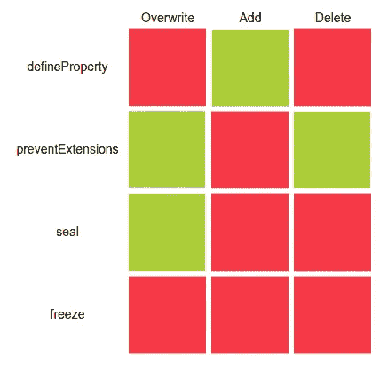

# 关于 JavaScript 中的不可变对象，人们不知道的是

> 原文：<https://javascript.plainenglish.io/what-people-dont-know-about-immutable-objects-in-javascript-74f737bcdcb6?source=collection_archive---------2----------------------->

J avaScript (JS)也是函数式编程(FP)语言。FP 的核心概念之一是不可变对象，这对其他编程范例，例如面向对象编程(OOP)也有很多好处。

在本文中，我将向您解释不同类型的不可变对象，以及如何用 JavaScript 实现不可变对象。


Photo by [Jack O'Rourke](https://unsplash.com/@jacklikethings?utm_source=medium&utm_medium=referral) on [Unsplash](https://unsplash.com?utm_source=medium&utm_medium=referral)

让我们先从可变对象开始:可变对象是在声明后可以修改的对象。例如，foo 是一个可变对象:

```
let foo = {
    a: "b"
};
let bar = foo;
bar.a = "c";console.log(foo.a); // c
```

默认情况下，JS 中的自定义对象是可变的。可变对象的问题是改变对象的值会传播到它的所有引用。这被称为副作用，会导致难以调试的错误。

另一方面，不可变对象是一个在声明之后不能被改变的对象。默认情况下，数学、日期、数字和字符串在 JS 中是不可变的，这意味着您不能删除、添加或覆盖它们的属性。例如，您想将字符串`Hello`与`world`连接起来，如下所示:

```
let foo = "Hello" + "world";
console.log(foo); // Hello world
```

字符串`Hello`未被修改。相反，创建了一个新字符串。原来的`Hello`保持不变。

有些人认为用关键字`const`创建的常量是不可变的对象:

```
const foo = {
  a: "x"
};foo = {
  a: "y"
}; // error
```

如果您试图重新分配它，上面的代码会抛出一个错误。有些人认为这就是不变性含义。但事实并非如此，如下例所示:

```
const foo = {
  a: "x"
};foo.a = "y";
console.log(foo.a); // y
```

`const`在 JS 里只表示不能重新分配。所以，`const`中的“常量”部分只指指针——你不能改变指针。但是，正如您在上面看到的，您仍然可以更改对象的属性。这不仅适用于自定义对象，也适用于内置对象，如数组。

在 JavaScript 中，创建不可变对象有不同的方法。

## 定义属性

在 JS 中，对象具有(隐藏的)属性`writeable`和`configurable`，您可以手动将其设置为`false`，从而防止改变或删除值:

```
const immutableFoo = {};
Object.defineProperty(immutableFoo, "a", {
  value: "d",
  writable: false,
  configurable: false
});console.log(immutableFoo.a); // d
immutableFoo.a = "z";
delete immutableFoo.a;
console.log(immutableFoo.a); // d
```

但是，您仍然可以向对象添加新属性

## 预防高血压

如果您想防止向对象添加新属性，并保持对象的其余属性不变，您可以这样做:

```
const immutableFoo = {
  a: "e"
};
Object.preventExtensions(immutableFoo);immutableFoo.b = "z";
console.log(immutableFoo.b); // undefined
```

但是`preventExtensions`并不能阻止你的属性被覆盖或者被删除。

## 海豹

`Object.seal()`创建一个“密封”的对象，这意味着它接受一个对象并调用`Object.preventExtension()`。除此之外，它设置所有对象的属性为`configurable: false`。通过这样做，您既不能添加也不能删除属性。

```
const immutableFoo = {
  a: "e"
};
Object.seal(immutableFoo);
immutableFoo.b = "z";
console.log(immutableFoo.b); // undefinedimmutableFoo.a = "999";
delete immutableFoo.a;
console.log(immutableFoo.a); // 999
```

但是您仍然可以更改属性值。

## 冻结

使用 freeze，您可以在 JS 中创建真正不可变的对象，这意味着您不能删除、添加或覆盖对象的属性。

```
const immutableFoo = {
  a: "e"
};
Object.freeze(immutableFoo);
immutableFoo.b = "z";
console.log(immutableFoo.b); // undefinedimmutableFoo.a = "999";
delete immutableFoo.a;
console.log(immutableFoo.a); // e
```

因此，在 JS 中，有一些方法可以模拟不可变对象的各个方面。但是只有一种方法能够在 JS 中创建完全不可变的对象。下面是这些方法的总结，以及它们覆盖了不可变属性的哪一部分。只有`Object.freeze()`能够阻止所有形式的变异。所以，如果你想在 JS 中创建不可变的对象，只能选择`Object.freeze()`。



如果你有任何问题，请在下面评论并告诉我。