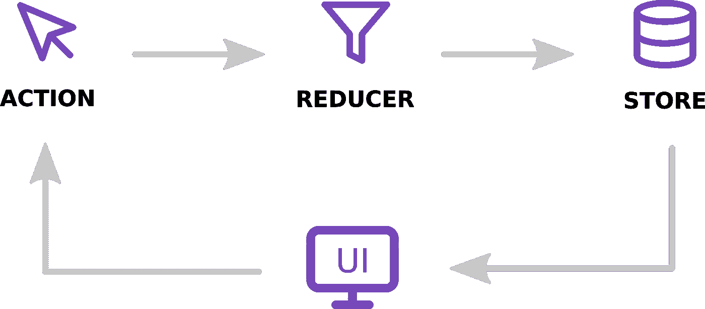
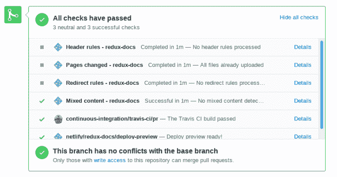

# 引擎盖下的 Redux 是什么样子

> 原文：<https://javascript.plainenglish.io/what-redux-looks-like-under-the-hood-98636de046d4?source=collection_archive---------1----------------------->



Redux 是一个被数百万人使用的状态管理库[。它提供了一种简单的方法来管理您的全局状态，订阅它并安全地更新它。你们大多数人都知道它是什么，但没有多少人知道它是如何工作的。在这篇文章中，我将向你展示这个项目是如何构建的，它是如何编写的，以及它背后的哲学。在阅读结束时，您可以期望了解 Redux 是如何设计的，并能够自由阅读其源代码。](https://npm-stat.com/charts.html?package=redux&from=2018-07-01&to=2019-10-23)

UPD(2020 年 2 月 2 日): [Mark Erikson，](https://github.com/markerikson) Redux core maintainer 伸手在内容上做了一些笔记，我也做了相应的修改。最重要的是，`master`分支拥有 Redux 的 TypeScript 版本，但是移植还没有完成，发布的 Redux 包仍然是 vanilla JS。

在您继续阅读之前，有一个合理的警告:Redux 是用 TypeScript 编写的，在本文的其余部分，我将假设您了解 TS 知识。我也不会解释如何使用 Redux，所以如果你从未听说过它，我建议先阅读文档。不过你不需要知道 React，因为我纯粹是在处理 Redux。最后，我不属于 Redux 团队，也不是核心贡献者。我开过几个 pr，但这篇文章纯粹是我的主观看法，你们不要当官方看待。

文书工作完成后，让我们开始研究源代码。如果你想在你的电脑上继续，我建议克隆/分叉官方 Redux repo。

# 项目结构

在探索源代码本身之前，让我向您展示这个项目是如何构建的。与任何节点包一样，它有一个`package.json`文件:

我省略了几个部分(`keywords`和`devDependencies`)，因为它们现在不重要。那么，仅仅看着`package.json`我们能学到什么呢？嗯，这个包的名字是`redux` (duh)，它在麻省理工学院的许可下是开源的，它唯一的依赖项是`@babel/runtime`，它正在用`jest`进行测试。通过检查脚本部分，我们看到源代码用[更漂亮的](https://prettier.io/)格式化，用 [eslint](https://eslint.org/) 标记，用[类型脚本](https://github.com/Microsoft/TypeScript)编译，用 [rollup](https://rollupjs.org/guide/en/) 打包。执行所有检查和测试的综合脚本是`prepare`脚本。在项目根中随意运行`npm run prepare`(如果您已经克隆了 repo)并观察输出。如果开发人员没有搞砸任何事情，它应该执行以下任务:

1.  清理输出目录(`/dist /types /es /coverage /lib`)
2.  静态检查 TypeScript 类型
3.  用更漂亮的检查格式
4.  用 ESlint 检查代码质量
5.  使用汇总构建生产版本
6.  用 Jest 测试项目

您可能会感到困惑，为什么我们需要将 redux 构建到产品版本中。毕竟，它被导入到项目中，而项目本身在以后会被编译成产品版本。这是 redux 跨运行时(不同版本的节点、浏览器、其他 JS 运行时)和 JS 运行时内不同环境(例如测试)工作所必需的。这是一个很好的实践，我鼓励你在开发自己的库时使用像`rollup`或`bob`这样的工具。

`main`、`unpkg`和`module`属性为不同的运行时指定入口点。对于常规节点，使用`main`。`unpkg`用于 [unpkg](https://unpkg.com/) 打包器，`module`用于支持 ES6 模块的 never 环境。这一切都有可能是因为`rollup`。最后，`types`属性指向 TypeScript 类型定义，以在任何导入 Redux 的项目中提供林挺和类型检查。

这就是目前我们需要 package.json 提供的所有内容。我们的下一站是配置文件。这些都是不言自明的，但我还是要回顾一下，以防万一:

*   `.babelrc`-Babel trans piler 配置文件，该文件指定了代码应该如何传输以及期望的兼容性级别
*   `.editorconfig` -大多数主要代码编辑器和 ide 都理解的公共配置文件。用于在开发机器之间实现一致性
*   `.eslintignore`，`.eslintrc.js`-ESLint 的配置文件。指定使用的规则和忽略的文件
*   `.gitbook.yaml`-git book 的配置，一个 markdown 文档解决方案(我不确定它是否被实际使用)
*   `.prettierrc`-config for appellister，指定代码格式化的规则
*   `.travis.yml` -为 TravisCI 配置，设置环境并告诉 Travis 运行什么脚本(这是`prepare`脚本)
*   `netlify.yml`-Netlify 配置，用于部署包含文档的网站
*   `rollup.config.js` -指定目标和目录映射的汇总配置
*   `tsconfig.json` -类型脚本传输程序的配置

在这一节中，我要讲的最后一件事是目录结构。以下是项目根目录中的目录及其用途的列表:

*   `build, dist, es, lib, types` -我之前提到的生产版本输出
*   `docs` -降价格式的 API 文档
*   `examples` -真实世界使用示例的集合。每一个都是一个独立的 NPM 包。
*   `website` -一个 [Docasaurus](https://docusaurus.io/) 驱动的文档网站。提供网站本身并从/docs 文件夹中获取文档。一个独立的 NPM 包装
*   `src` -源代码(最后)

现在您应该知道像 Redux 这样受欢迎且稳定的库是如何构建的了。现在我将谈谈它如何与 CI/CD 配合使用。

# 项目基础设施

该项目托管在 ReduxJS 组织内的 Github 上。它包括其他的配套库，比如 [react-redux](https://github.com/reduxjs/react-redux) 、 [reselect](https://github.com/reduxjs/reselect) 和 [redux-toolkit](https://github.com/reduxjs/redux-toolkit) 。

正在使用的 CI 解决方案是 TravisCI，您可以在这里监控它[。它在每个拉请求时触发，并运行我前面介绍过的`prepare`脚本。这确保了测试总是通过，回购中的代码总是被一致地格式化，并且没有引入回归。](https://travis-ci.org/reduxjs/redux)



文档存放在 Netlify 上，它也运行一些检查。对于每个 pull 请求，它检查源代码中是否存在不安全的 http 链接，并在一个临时 URL 上部署新的 docs 版本，这样每个人都可以查看并协作。

我没有找到任何 CD 解决方案来发布新的包版本，也没有任何自动化的版本增量，所以我假设这是手动完成的。UPD:已确认，没有版本控制/发布自动化。

# 核心功能

现在终于到了钻研源代码的时候了。我们从`src/index.ts`开始。为了方便起见，这个文件只是从其余文件中导入所有定义，并从一个地方重新导出它们。下面是清单(稍微简化了一点):

这里发生了什么应该很清楚了。第 1-8 行是您应该熟悉的核心 Redux 函数的导入。接下来，在第 10 到 39 行，类型定义被重新导出。TypeScript 开发人员使用它们来定义严格的类型存储、减少器和动作创建器。最后，在第 41–48 行有主导出，在 JS 和 TS 环境中使用，包含核心特性。到目前为止，一切顺利。

## 创建商店

接下来，我们来探究一下`createStore`函数，其源代码位于 src/createStore.ts(简体):

您可以在第 16–25 行看到函数类型签名。它看起来非常混乱，因为它严重依赖于类型泛型。这样做是为了使 TS 环境中的严格类型化成为可能，代价是源代码的可读性。`S`是根状态本身的类型定义，`A`是动作的通用定义(注意，它扩展了`Action`以确保每个动作都有定义的类型)。我现在不讨论`Ext`和`StateExt`。

第 26–54 行是验证逻辑。它检查:

1.  您没有通过多个增强器(第 26–35 行)。这样做是为了简化逻辑，这就是为什么你必须使用`applyMiddleware`将多个中间件合并成一个。
2.  检查初始状态是否是一个函数，在这种情况下，它被视为一个增强器(第 37–40 行)
3.  如果增强子存在，检查它是否是一个函数。如果是，将自身作为参数传递给增强器(给它一个提供自定义逻辑的机会)并返回。如果它不是一个函数，抛出一个错误，因为它没有意义(第 45–54 行)。

既然文章名为“代码评审”，我也将给出一些评论和我对代码质量的看法。我会立刻将验证逻辑移到`createStore`函数之外。它现在有 280 行，对于一个功能来说，这是太多的行和责任了。尽管我不打算在本文中讨论单元测试(但是如果我应该的话，请告诉我)，这使得测试尤其困难。UPD:有人向我指出，验证逻辑在其他任何地方都不被使用，让它可重用是没有意义的。我同意，但是我关心的主要是可读性。不要误解我的意思，它的可读性很好，我只是在寻找进一步提高它的方法。

在第 56–60 行，您可以看到正在设置的核心变量。`currentReducer`被设置为`reducer`(保存你作为参数传递的根规约)，`currentState`保存状态对象，`isDispatching`，告诉你一个动作是否正在被调度。我们还有`currentListeners`和`nextListeners`，乍一看很混乱。监听器是回调函数，当一个动作被调度时被触发(即使它没有改变状态的内容)。`currentListeners`保存这类回调函数的列表，在调度时使用。`currentListeners`是不可变的，这意味着您不能直接更改它的内容，但是您可以重新分配整个列表。`nextListeners`是可变的，是`currentListeners`的浅拷贝。每当您添加或删除一个侦听器时，它都会改变`nextListeners`。最后，当您调度一个动作时，就在触发回调之前，`nextListeners`被分配给`currentListeners`(第 206 行)。这样做是为了防止在分派操作时与添加/删除侦听器相关联的并发错误。令人困惑的部分是，如果有这样的保护，为什么我们需要检查`subscribe` / `unsubscribe`函数中的`isDispatching`？这是一个以太代码或注释的问题，在这种情况下证明[是无用的。](https://everyday.codes/best-practices/improve-code-readability-by-getting-rid-of-comments/)

`ensureCanMutateNextListeners`(第 69-73 行)函数检查`nextListeners`和`currentListeners`是否引用同一个对象，如果是，则复制一个`currentListeners`的浅拷贝并将其分配给`nextListeners`。它在`nextListeners`的任何突变之前被调用，以确保这些变化不会传播到`currentListeners`，原因我在前面解释过。

第 80-87 行的`getState`函数对您来说应该很熟悉:您可能在代码中的某个地方使用过它。这也很简单:检查是否有任何动作正在调度，如果没有，返回当前状态。不鼓励您直接使用它而不是依赖像 react-redux 这样的订阅者/包装器的原因正是因为如果有任何东西被调度，它就会抛出。当编写异步代码或使用中间件如`redux-thunk`时，这将是特别痛苦的。作为旁注:不要混淆`redux-thunk`提供的`getState`功能和直接在商店对象上调用`getState`。`redux-thunk`将提供必要的保护，确保您不会以异常结束。

UPD: `redux-thunk`本身不提供任何保护，但是从架构上来说，因为它包装了`dispatch`函数，所以它们是不需要的:`getState`保证在 thunk 中是合法的。

在第 115–153 行，我们有订阅功能。它实现了我前面介绍的监听器功能。这也非常简单:检查是否有任何东西被分派(尽管这似乎是多余的),然后将新的侦听器推到`nextListeners`列表中。它返回一个`unsubscribe`函数，被调用者将使用该函数将自己从监听器列表中删除。它检查监听器是否仍然被订阅(以防被调用者存储了对 `unsubscribe`的引用并多次调用它)，检查是否有任何东西正在被分派，如果一切都清除了，就从`nextListeners`中删除监听器。)将`currentListeners`设置为`null`。这样做是为了绝对确保不再调用未订阅的侦听器。这似乎是多余的(因为在任何正常情况下都不应该发生)，但我相信开发人员有充分的理由这样做。

最后，调度功能(第 180–213 行)，这是 redux 状态的圣杯。首先是第 181-186 行，它将检查动作是否是一个简单的对象。也就是说，如果操作是可序列化的。这对 redux 的概念非常重要，并允许其他很酷的特性，如持久化状态或时间旅行。接下来(第 188–193 行)确保动作定义了一个`type`属性，因为没有它，动作就没有任何意义。最后，一个熟悉的检查，如果有任何东西被分派。现在，redux 代码库中最重要的几行:

```
try { 
  isDispatching = true 
  currentState = currentReducer(currentState, action) 
} finally { 
  isDispatching = false 
}
```

它首先将`isDispatching`标志设置为 true，并对状态应用一个动作。您可以看到没有对状态可变性的检查(如果从 reducer 收到的引用指向相同的状态)，而且，我认为应该有一个。不是一个抛出错误的错误，但至少记录一个警告。在减少状态之后，不管情况如何，`isDispatching`标志被恢复为真。

设置完成后，在第 218 行调度“@@INIT”动作。这样做是为了用缩减器的初始状态填充状态。由于您无法导入此操作类型，因此无法为其添加切换用例，这将在返回初始状态的切换用例中强制执行默认分支。

最后，所有东西都被组合成一个由`createStore`函数返回的`store`对象。全部完成！

## 应用中间件

我们要看的下一个函数是 applyMiddleware。它允许为动作分派过程注入定制逻辑。你可能会把它和`redux-thunk`、`redux-saga`、`redux-logger`等中间件配合使用。下面是它的源代码(简体):

这个文件比 redux 代码库的其余部分要短得多。`applyMiddleware`函数接受要应用的中间件列表，并返回一个将在`createStore`中调用的回调函数(第 47 行)。这个函数接受`createStore`函数本身并返回另一个回调(！).这最后一个回调将接受与`createStore`函数相同的参数集，并将使用`createStore`函数创建存储，并将中间件附加到其上。至少我认为这是一个不必要的复杂性。我认为这种逻辑对于中间件来说有些过头了，但是它确实允许进行更多的微调，这可能是其他中间件存储增强器所需要的。另一个问题是' @@INIT '动作将在应用中间件之前在`createStore`函数中调度。

在第 14 行，通过调用`createStore`函数来创建存储，调用方式与第一次调用的方式相同，除了增强器之外，这次它们没有被传递。在第 15 行，创建了虚拟`dispatch`功能。它抛出一个错误，直到函数返回，以确保在构建中间件时没有任何事情发生。

在第 22–25 行，创建了`middlewareAPI`对象。它公开了来自存储区的 getState 函数和自定义调度函数。它将被传递给中间件，给它们自定义行为的干预点。例如，redux-thunk 将这些函数注入到异步动作创建器中。

第 26–27 行创建了中间件链。这是通过遍历`middlewares`列表并使用之前创建的`middlewareAPI`对象调用每个中间件来完成的。这个链是一个函数列表，这些函数接受一个动作，对它做一些事情(例如，等待)并返回一个动作，这个动作可能是也可能不是最初的那个动作。在第 27 行，返回前的最后一行，`dispatch`函数被中间件组成的链覆盖。组合意味着函数列表变成一个函数，将它们一个接一个地链接起来。这是通过`compose`函数完成的，它也是 redux 代码库的一部分。

最后，store 对象被解包，dispatch 函数被覆盖，您的增强 redux 存储准备就绪！

# 结束语

这篇文章已经比我预期的要长，所以我现在要结束了。有几个方面和功能我没有介绍，但是通过这篇文章中的知识，你将能够自己理解它们。我要说 Redux 是一个编写优雅的库，它非常简洁，代码清晰，非常感谢它的众多贡献者。谢谢你的阅读，让我知道我接下来应该解剖什么库！