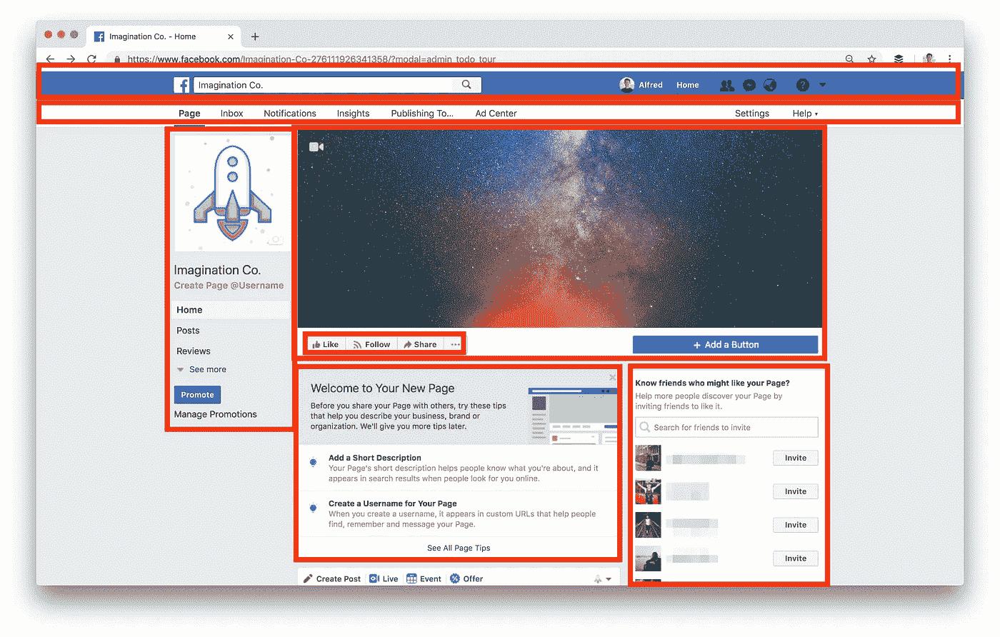

# 我应该为我的第一个 React 项目构建什么？

> 原文：<https://javascript.plainenglish.io/what-should-i-build-for-my-first-reactjs-project-4c575d04728?source=collection_archive---------0----------------------->

## 简单的项目想法会让你思考

“你不会循规蹈矩地学习走路。你在实践中学习，在跌倒中学习。”
― ***理查德·布兰森***

# 我认为当今软件开发人员面临的最大挑战不仅仅是学习一门新的计算机语言，而是当他们感觉已经掌握了这门语言之后，到底要构建什么。

例如，我发现学习 ReactJS 的最好方法不是通过记忆它的文档，而是从我自己的项目开始，当我需要帮助时参考文档。

软件行业竞争激烈，并且总是随着新工具、语言、框架和库的出现而发展，这就需要**程序员**去研究趋势，并随着趋势的变化而学习。用不了多久，初创公司就会发现并雇佣这些积极的开发人员为一个全新的应用程序奠定基础，他们愿意为绝对最好的开始支付大笔费用。对 HTML、CSS 和 Javascript 等语言的需求将会一直存在，但我预测，几年后将会有如此多的程序员在寻找工作，这些语言将不再足以获得工作(或者，如果它们获得了工作，预期报酬将低于市场标准)。我还相信，如果你名下有几个 React 项目是**完成的**，那么你已经展示了令人满意的理解水平，你应该被允许在简历中的某个地方引用 React 和 NPM。React 开发人员面试不仅仅是测试你的理解水平，更像是“你构建了什么项目？”，这是更重要的问题。

通过阅读这篇文章，我假设您已经主动开始学习 ReactJS 的基础知识。我从我的 Lynda.com 账户开始学习 React，这个账户是 LinkedIn 的专业技能在线学习平台，基本计划每月大约 25 美元。然而，这不是我唯一的教育来源，因为我也认为 Youtube 大学是现代程序员的有效知识库(如果你能找到正确的视频，当然不会掉进兔子洞)。在我读完 React 的文档，完成了他们的井字游戏项目，学习了 Lynda 的课程，看了大量的视频之后，我终于觉得自己准备好承担一个自己的项目了。

这是我遇到最大障碍的地方，在谷歌搜索了几个星期的示例项目后，我得出结论，我的第一个项目必须是一个简单的项目，唯一的目标是获得更多的重复。这个想法不仅是为了提高你的编码技能，而且是为了编写一行又一行的代码，并让自己在这个新技能上如鱼得水(就像搬进一个新公寓，你计划在那里完成所有的工作)。你还没有考虑出售你制造的东西，你只是通过建造来学习。

以下是我在学习 ReactJS 的基础知识后构建的一些项目:

# **1)在 React 教程中重新构建示例项目，无需查看任何步骤**

ReactJS 有一个[教程](https://reactjs.org/tutorial/tutorial.html)，教你如何构建一个全功能的 400 像素乘 400 像素井字游戏，目标是将基本原理付诸实践，让你“在反应中思考”。

因为你从实践中学到了最好的东西，所以你需要把工作放在这里，并按照创建这个游戏的步骤做两次。对我来说，第一次构建已经够难了，好在他们在教程结束时提供了[完成的项目](https://codepen.io/gaearon/pen/gWWZgR?editors=0010)，以防我卡住。一旦你按照说明第一次构建了游戏，我要求你删除那些文件，在 NPM 建立一个新的项目(或者在 Babel 中清除 JS 标签),然后不看任何步骤就重建项目，看看你完成了多少。重复多？一点点，但是如果你觉得是这样的话，那么理论上对你来说这应该是在公园散步。这需要批判性思维，而且这可能是模拟你工作的最好方式，也是让你得到一个属于自己的项目的最好方式。两次构建项目总是帮助我学习新技术，因为它们允许我找到捷径，建立更好的基础，并绕过我第一次犯的错误。

# 2)在 React 中建立自己的网站

这不仅会让你成为一个更好的 React 开发人员，而且其结果可以成为你的营销工具，并为那些希望雇佣你的雇主提供概念证明！React 文档中包含了你需要学习如何创建一个基于组件的网站的所有内容。当你是一个新的 React 开发者时，说起来容易做起来难，当然网站的设计部分可能不是你的专长。但同样，这个想法是写一行又一行的代码。这里有一个[模板](https://colorlib.com/wp/template/amplify/)你可以为这个练习下载。(免责声明:此模板仅用于练习，并不意味着是您的新网站，除非您愿意在单击“下载”时保留页脚注明)。

如果您创建了一个全新的 React 项目，您将获得一个 index.js 文件、一个 app.js 文件和一个 index.html 文件。复制刚刚下载的 index.html 元素中的内容，粘贴到 src/app.js 中的

元素中:

从“React”导入 React；

“导入”。/app . CSS '；

函数 App() {

返回(

**//在此粘贴 HTML。**

);

}

导出默认应用程序；

将网站内容粘贴到 app.js 后，您需要:

*   确保所有的**输入**和 **img** 标签都有一个“/”(例如:
*   **类**的所有实例都更改为**类名**
*   所有的脚本和样式引用都被复制到 React 项目的**index.html**文件中
*   将所有下载的网站的 scss、字体、图像、css、js 文件夹移动到 React 项目的 **public** 文件夹

这应该会在 React 环境中重新创建网站，现在您可以将网站的各个部分分解成组件。这个练习帮助我更好地理解了基于组件的架构以及虚拟 DOM 是如何工作的。

# 3)重建脸书页面布局

是的，你没看错，用一个他们花了几年时间开发的库来重建创造者的网站。说出一个更难的挑战，我会等…这并没有你想象的那么难，因为这里的目标只是创建静态的****布局**而不是它的动态部分。忽略消息传递能力、数据获取和后端(除非你准备好迎接挑战，然后向你脱帽致敬，去吧)。但是今天，让我们来看看下面的一个样本组页面，看看我是如何把它分成几个部分的:**

****

**我要求你先用 HTML 和 CSS 创建布局，然后在 React 中重新创建，将布局分解成如上所示的组件。我强烈建议在这个练习中回顾一下[组件](https://reactjs.org/docs/components-and-props.html)基础知识和[代码分割](https://reactjs.org/docs/code-splitting.html#code-splitting)，因为这将使你的 App.js 文件变得拥挤，并在你构建你的项目时使事情变得复杂。你甚至可以决定把它们分成更小的部分，这是非常好的。**

**如果您能够成功地重新创建这个布局，那么您可以尝试动态部分，构建主页，添加按钮功能，等等。ReactJS 的美妙之处在于它包含了 NPM，在这里你可以导入你可能不知道如何自己构建的常用组件。**

**以下是您现在可以添加到项目中的[组件](https://reactjsexample.com/)的列表。**

**这三个练习将使你成为一名更好的 ReactJS 程序员，并有望激发出原创项目的灵感。**

## **进一步阅读**

** [## 帮助您在 React 中更快开发的 5 种工具和实践

### React 工具、技巧和最佳实践将帮助您更快地构建应用

javascript.plainenglish.io](/5-tools-practices-to-help-you-develop-faster-in-react-b884c1b20fc2)** 

***更多内容看* [***说白了。报名参加我们的***](https://plainenglish.io/) **[***免费周报***](http://newsletter.plainenglish.io/) *。关注我们关于* [***推特***](https://twitter.com/inPlainEngHQ)[***LinkedIn***](https://www.linkedin.com/company/inplainenglish/)*[***YouTube***](https://www.youtube.com/channel/UCtipWUghju290NWcn8jhyAw)*[***不和***](https://discord.gg/GtDtUAvyhW) *。*******