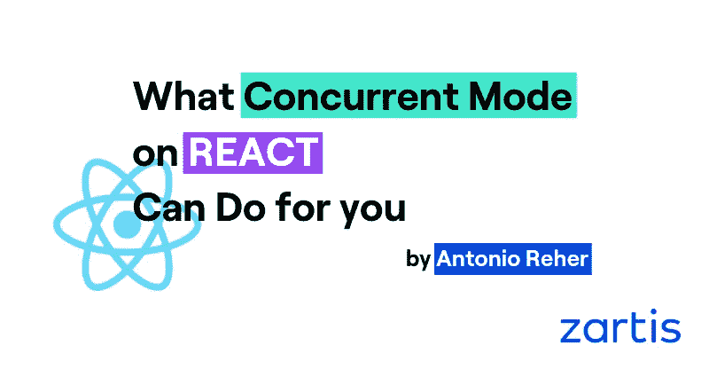
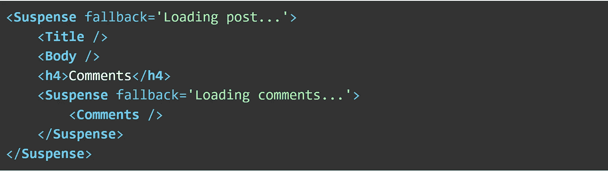
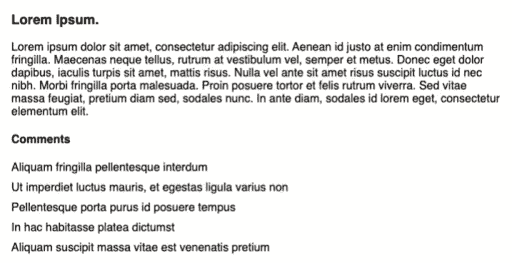
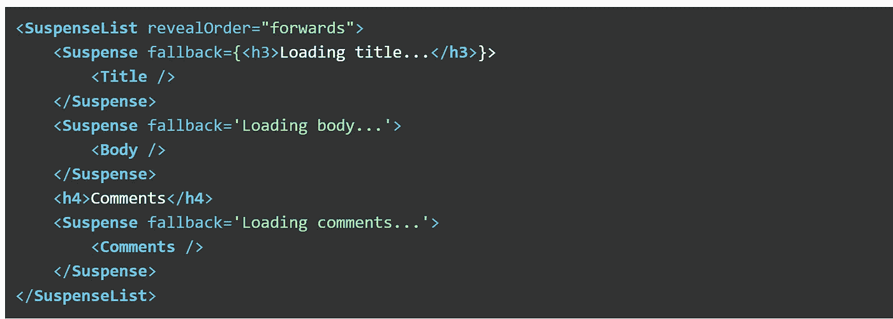
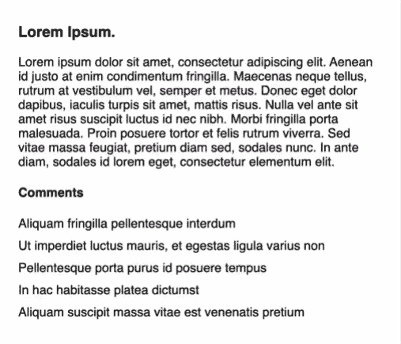
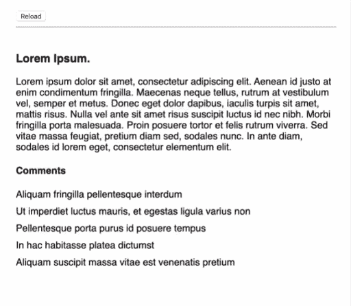
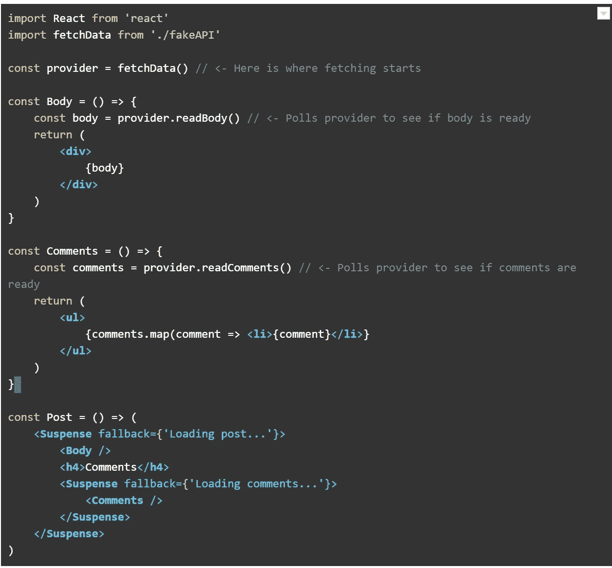

# React 上的并发模式能为您做些什么

> 原文：<https://javascript.plainenglish.io/what-the-concurrent-mode-on-react-can-do-for-you-c9ac7e46c436?source=collection_archive---------5----------------------->

**看来 React 又来了。他们新的并发模式范例将在今年发布。**

还记得 2019 年 2 月，我们都在忙着学钩子吗？是的，非常喜欢。终于有了一个很好的借口来摆脱类组件及其令人困惑的命名生命周期方法，简化代码并增强可读性，这让人感到耳目一新。这次的流行语是并发。因此，我收集了所有的官方文档和一些例子，并坐下来弄清楚这对基于 React 的项目意味着什么。

# TL；速度三角形定位法(dead reckoning)

并发模式引入了一组工具，帮助我们重新思考获取数据和代码的方式。

它也将让产品团队有机会加入到精心安排获取数据的乐趣中。

# 为什么选择并发模式

我发现的最好的例子是过滤列表。想象一下，一长串条目要花很长时间才能呈现出来。现在假设我们有一个过滤列表的文本输入字段。每次我们改变输入，React 都会重新渲染组件，触发列表的重绘。如果列表*足够昂贵*，输入域很快就会变得滞后和无响应，因为 UI 库一次只呈现一件事:输入域的重新呈现必须等待列表完成。

到目前为止，我们已经解决了几个问题:

1.  我们可以限制输入的 **onChange** 处理程序，仅在一定数量的更改后重新呈现列表，这将为我们的文本输入释放执行时间，
2.  或者我们可以去抖，这意味着只有当用户完成输入时列表才会改变。

这两种解决方案看起来都有点不太好，我们所做的只是隐藏了一个延迟，这是由于在输入的意外行为背后有一个性能较差的浏览器。此外，在更快的应用程序和机器上，延迟不明显，当用户键入一个键时，输入不会触发重新呈现。

# 什么是并发模式

进入并发模式。这一新功能的目的是保持对用户交互的反应，避免滞后，这归结为增强最终用户的体验。

有了并发，组件呈现过程就变成了*可中断* : React 可以选择哪个更新最重要，中断其余的，然后一旦完成就回来完成它的工作；就像厨师会优先处理等待的订单一样。

# 焦虑

React 还引入了悬念，它采用了 [React 16.6](https://reactjs.org/blog/2018/10/23/react-v-16-6.html) 中提供的**悬念**组件，并引入了一个新的变化:该组件可以告诉 React 何时准备好进行渲染。当它存在时，React 将使它脱离挂起模式，并在页面上呈现它。

那又怎样？首先想到的是，我们必须重新思考如何编排数据获取。“加载状态”不再属于组件，而是属于呈现它的父组件。

并发模式 API 还有一些技巧。官方文档非常清晰和完整，充满了有用的例子，但我将引用突出的例子。

# 悬念界限

一个**悬念**组件使用一个**回退**道具来告诉 React 当其子组件被挂起时要呈现什么，这可以是文本或 JSX:你可能想用一个微调器或其他视觉提示来替换被挂起的组件。我们如何在视图上组织**暂停**组件将影响加载状态如何传递给用户，以及组件脱离暂停状态时出现的顺序。注意**悬念**组件也可以嵌套。

在这个例子中，一篇博客文章将被挂起，直到标题和正文准备好被呈现。一旦可见，**评论**将暂停并显示其回退。

# 获得正确的顺序

当组件在同一层级时，**暂停列表**会告诉它们出现的顺序。例如，您可能希望博文正文出现在评论之前，因此我们将暂停的组件包装在一个**suspend elist**中，这将确保各个部分按顺序出现。

在这种情况下，我们将设置主体在标题到达之前到达。当然，这不是我们想要的呈现方式，所以我们可以将它们设置在一个**suspend elist**中。

随着数据的加载，组件将依次退出暂停状态。

## 转换到挂起状态

并发模式 API 的另一个优点是钩子 **useTransition** ，它允许我们转换到一个处于挂起状态的组件。假设你点击一个按钮来查看一个*昂贵的*组件。向按钮添加一个微调器和一个禁用的属性可能会有用几毫秒，而不会触发视图变化，然后转换到挂起的组件，从而在调用者和挂起的组件之间划分等待时间。如果组件提前脱离挂起状态，它可以在流中呈现，而不需要回退。

这是一个非常有用的解决方案，可以避免视图中充满悬浮组件和加载指示器。事实上，React 文档预测 **useTransition** 将会非常普遍；人们基本上可以在所有触发组件挂起的 UI 元素中使用它(参见[这里的](https://reactjs.org/docs/concurrent-mode-patterns.html#baking-transitions-into-the-design-system))。

# 渲染时获取数据

这可能是并发模式最有趣的附加功能。我们都习惯于以两种方式之一获取数据:

1.  在 **componentDidMount** 或 **useEffect** 中，呈现视图的加载状态，然后获取数据，或者
2.  在父组件中，这意味着一旦数据准备好就要呈现组件。

悬念允许你在渲染时**获取数据。假设我们从你的 API 加载一篇博客文章，你有一个主体和一个评论组件。有了悬念，您可以在组件开始呈现时开始获取数据，暂停任何等待数据到达的内容。**

正如您在示例中看到的，当第一次加载 **Post** 组件时，数据获取开始。随着正文和评论开始出现，他们各自的观点从悬念中走出来，并在帖子中呈现出来。

这反过来又打开了新的可能性，例如急切加载(参见关于这一点的 [React 文档](https://reactjs.org/docs/concurrent-mode-suspense.html#start-fetching-early))，我们可以尝试*猜测*用户的下一个动作将是什么，并相应地开始获取。直接从 [React docs](https://reactjs.org/blog/2019/11/06/building-great-user-experiences-with-concurrent-mode-and-suspense.html#fetch-in-event-handlers) 中:我们可以假设，如果在路由器链接上发生了 **mousedown** 或 **mouseover** 事件，比如**<Link to = "/posts/5 "/>**，用户很可能会点击它，因此这将是开始为 id = 5 的帖子获取数据的好时机。

## **总之**

这太令人兴奋了。如你所知，Hooks 心中有开发者。并发模式，或者至少是我们目前所知道的，似乎是产品团队对数据加载编排进行更深入分析的好机会:转换、加载器的编排，以及哪些数据与准系统呈现相关。

我们还必须重新思考组件如何使用数据，组件状态的哪些部分对呈现最重要，以及哪些部分可以等待 react 的人们称之为高优先级和低优先级状态。

最后一个想法是关于[错误边界](https://reactjs.org/docs/error-boundaries.html):如果你还没有实现它们，你应该实现它们。悬念使用它们来提醒在渲染和数据获取阶段遇到的任何错误。

> 各位，API 调用中不再有 try {} catch {}块。

*最初发表于*[T5【https://www.zartis.com】](https://www.zartis.com/untethering-webapps-with-observables-rxjs/)*。*

*作者*:

 [## Antonio Reher -技术主管- Zartis | LinkedIn

### 查看世界上最大的职业社区 LinkedIn 上的 Antonio Reher 的个人资料。安东尼奥有 6 份工作列在…

www.linkedin.com](https://www.linkedin.com/in/antonioreher/) 

## 简单英语的 JavaScript

喜欢这篇文章吗？如果有，通过 [**订阅我们的 YouTube 频道**](https://www.youtube.com/channel/UCtipWUghju290NWcn8jhyAw) **获取更多类似内容！**