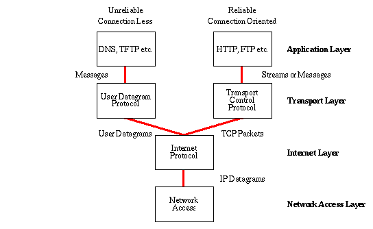
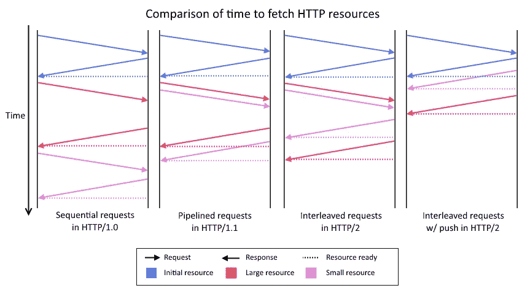
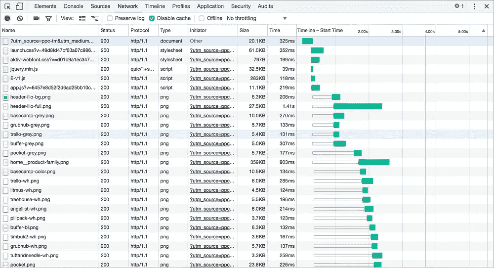
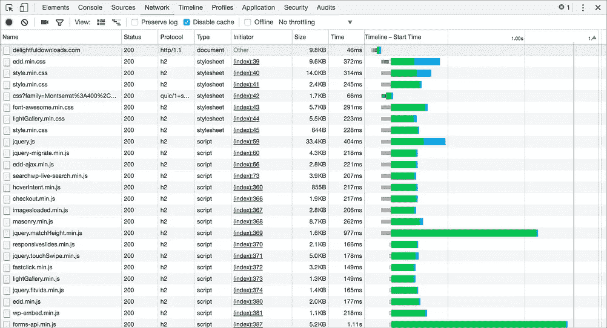

# 图像精灵和级联资产发生了什么变化？

> 原文：<https://javascript.plainenglish.io/what-the-heck-happened-to-image-sprites-and-concatenated-assets-794d8633279d?source=collection_archive---------5----------------------->

## 前端性能优化

## 一些最佳实践现在已经不是最好的了——现在是 2020 年。

Photo by [Ross Findon](https://unsplash.com/@rossf?utm_source=unsplash&utm_medium=referral&utm_content=creditCopyText) on [Unsplash](https://unsplash.com/s/photos/change?utm_source=unsplash&utm_medium=referral&utm_content=creditCopyText)

今天早上，我被拖进了一个倒退的星期四。我在 StyleMePretty 开始了我的职业生涯，当时我是一名全栈开发人员，StyleMePretty 是一个婚礼和生活方式博客，2015 年由 AOL 所有。是的，你没听错，美国在线还活着。我以前从未有过真正的 web 开发经验，我在工作中必须做的第一件事就是使用“图像精灵”对大量图片的网站进行优化。

如果你以前没有听说过它们，图像精灵是一种优化技术，用于减少对服务器的请求数量和减少带宽。你基本上是通过使用图像精灵工具将几个小图像拼接在一起来创建图像的。一个 CSS 表单，在 X 轴和 Y 轴上显示图像精灵上较小图像的坐标，可以帮助您在网站上显示原始图像。

另一种类似的技术是资产串联——将较小的 JS 和 CSS 文件合并在一起。从某种意义上来说，图像精灵和连接的资源服务于相同的目的。它们都通过捆绑在一起减少了来自浏览器的小网络请求的数量。

图像精灵和链接资产(JS 或 CSS)有一个很大的缺点。如果一个图标发生变化，整个 sprite 表都会发生变化，因此客户端必须使其缓存无效。JS、CSS 或其他资产也是如此。在大多数情况下，避免所有额外的握手和其他 TCP 开销带来的性能收益超过了这些缺点。

> 减少页面组件的数量是“性能黄金法则”。

我最喜欢的一本关于 web 应用优化的书斯托扬·斯特凡诺夫的《T2 速度之书》引用了这句话。它当然是在 HTTP/1 时代写的。如今，与减少请求数量恰恰相反的做法受到了鼓励。像 Webpack 这样的模块捆绑工具可以让你进行代码分割，图像精灵甚至已经不存在了(它们可能仍然有用，但并不普遍),资产连接听起来像个笑话。

# 什么变了？

The Internet Protocol Suite (Source: W3.org)

互联网从未像现在这样充满活力。就在过去的 5 年里，互联网协议套件的应用层经历了重大变化。统治互联网 20 多年的 HTTP/1 在 2015 年被 HTTP/2 取代，目前约有 98%的浏览器支持它。截至 2020 年 10 月，HTTP/3 草案经历了多次修订。这意味着我们也必须快速适应新的优化。

HTTP/1 和 HTTP/2 之间的区别是一个广为人知的话题，这里的是一个有趣的读物。我们感兴趣的 HTTP/2 的关键特性有 ***复用*** 和 ***服务器推送*** 。多路复用允许客户端通过单个 TCP 连接发送多个请求，而无需等待响应。服务器推送则更进一步，它允许服务器甚至在客户机请求资源之前就发送资源。客户端可以拒绝推送的资源。

Request/Response mechanisms in HTTP/1 vs HTTP/2 (Source: [Scott Logic Blog](https://blog.scottlogic.com/2014/11/07/http-2-a-quick-look.html))

如上面的时序图所示，HTTP/2 多路复用允许 web 应用程序通过一个 TCP 连接向服务器发送多个请求，并以任意顺序接收响应。这改变了一切。如果您查看任何支持 HTTP/2 的 web 应用程序的 network 选项卡，您将不再看到熟悉的请求瀑布。资源是并行下载的。

HTTP/1 waterfall vs HTTP/2 parallel network requests (Source: [SpinupWP](https://spinupwp.com/performance-best-practices-http2/))

右边的图片解释了为什么现在推荐把你的代码分割成更小的块。一个大文件，而不是多个小文件，会减慢你第一次有意义的绘画的时间，并对其他重要指标产生负面影响。使用 ***渐进式加载*** 等设计模式可以优化用户体验和应用性能，只需在最初加载页面最关键的部分，然后在用户导航或与页面交互时请求额外的资源。

> 速度是一个特点。确实是非常重要的一个。

HTTP/3 即将问世，它比 HTTP/2 有几处增强。它基于谷歌开发的全新传输层协议 QUIC。一旦 HTTP/3 被广泛采用，很难预测我们今天利用的优化是否仍然有效。老实说，这是我作为开发人员最喜欢的部分。永远不要停止学习，因为互联网永远不会停止教学。