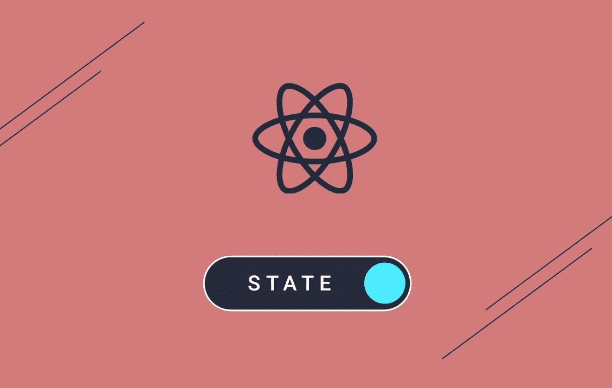
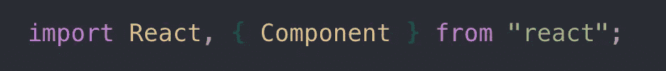
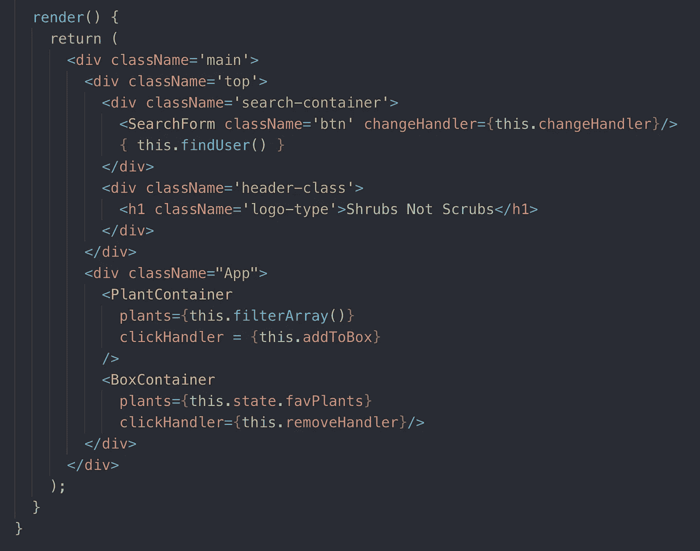

# 虚拟 DOM 到底是什么？

> 原文：<https://javascript.plainenglish.io/what-the-heck-is-the-virtual-dom-3ef1ae4a950b?source=collection_archive---------1----------------------->

source: react-js.us

如果你在 React 工作过，你一定听说过虚幻的虚拟 DOM，，但是它到底是什么，它和普通的 DOM 有什么不同？

首先，让我们后退一步，看看 DOM。

> “文档对象模型(DOM)是 HTML 和 XML 文档的编程接口。它表示页面，以便程序可以更改文档结构、样式和内容。DOM 将文档表示为节点和对象。这样，编程语言就可以连接到页面。”
> 
> *-MDN 网络文档*

本质上，我们使用 JavaScript 来处理和操作页面上的节点元素，而 DOM 允许我们建立这种联系。

什么是节点？一切。一切都是一个节点。从最里面的文本到文档本身，DOM 上的所有东西都是一个节点。

基本 JS DOM 操作的最大问题是 DOM 不能在给定时刻更新任何一个项目，它必须重新呈现所有内容来改变一件事。最重要的是，随着越来越多的 JS 框架变得流行和快速，这种操作变得缓慢和过时。因此，随着单页面应用程序和框架的通用性增加，必须有更好的方法来管理这一点…进入虚拟 DOM！

> 虚拟 DOM (VDOM)是一个编程概念，其中 UI 的理想或“虚拟”表示保存在内存中，并通过 ReactDOM 等库与“真实”DOM 同步。这个过程叫做[对账](https://reactjs.org/docs/reconciliation.html)。
> 
> 这种方法启用了 React 的声明式 API:您告诉 React 您希望 UI 处于什么状态，它确保 DOM 匹配该状态。这抽象出了属性操作、事件处理和手动 DOM 更新，否则您将不得不使用它们来构建您的应用程序。"
> 
> *直接来源于-ReactJS 文档*

我们创建虚拟 DOM 的方式是通过 React 组件。通过将 react 中的组件导入到我们的应用程序中，我们可以访问组件。

要使任何 HTML 代码成为静态 React 组件，只需要在 React 的`render()`方法中返回 HTML 代码。这是以 JSX 的形式完成的，它类似于 JavaScript 和 HTML 的混合。Render 是 react 的生命周期方法之一，你可以在这里阅读更多关于[的内容](https://reactjs.org/docs/state-and-lifecycle.html)，但是现在我们知道 render 是我们代码中开始构建 React 元素树的地方。

每当应用程序中的状态改变时，虚拟 DOM 开始改变/添加/更新它的元素树，而实际 DOM 保持不变。然后，React 将我们的虚拟 DOM 树与“快照”或虚拟 DOM 树的先前状态进行比较。这个过程被称为“差异”

最后，React 只改变那些在真实 DOM 上已经改变的元素。

**source:** [**https://www.oreilly.com/library/view/learning-react-native/9781491929049/ch02.html**](https://www.oreilly.com/library/view/learning-react-native/9781491929049/ch02.html)

从本质上讲，React 去掉了繁琐的 DOM 树遍历，并做了这些底层的事情，使开发人员做任何事情都更容易，并且运行起来更加高效和流畅。

概括一下:

*   尽管 DOM 操作是交互式 web 的核心，但它比大多数现代 JS 操作和框架都要慢。
*   虚拟 DOM 本质上是位于更新的 DOM 之上的 DOM 的副本。
*   对于每个 DOM 对象，都有一个对应的虚拟 DOM 对象，它们具有相同的属性，只是缺少实际改变屏幕内容的能力，这就是为什么它要快得多。
*   我们通过使用 JSX 来写入虚拟 DOM，它是 JS，看起来很像直接的 HTML 来编写 react elements——表示真实 DOM 元素的元素。
*   当我们改变状态时，虚拟 DOM 在更新真实 DOM 之前会检查虚拟 DOM 中哪些元素发生了变化，哪些元素没有发生变化。这就叫差异化。
*   实际上，React 不需要遍历 DOM 树，而是为您做底层的工作。