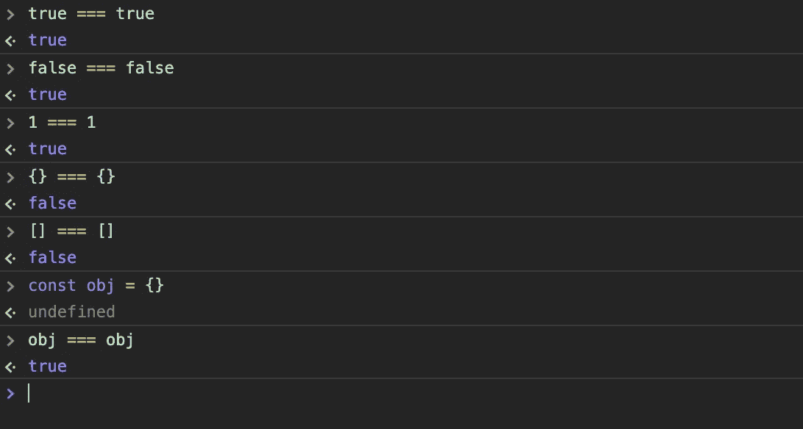

# 关于 React 钩子依赖，我们应该知道什么

> 原文：<https://javascript.plainenglish.io/what-we-should-know-about-react-hook-dependencies-f219af221ccf?source=collection_archive---------8----------------------->

## 优化应用性能

Photo by [Oskar Yildiz](https://unsplash.com/@oskaryil?utm_source=unsplash&utm_medium=referral&utm_content=creditCopyText) on [Unsplash](https://unsplash.com/?utm_source=unsplash&utm_medium=referral&utm_content=creditCopyText)

Hook 是 React 中一个非常棒的特性。它们允许你使用 state 和其他 [React](https://en.reactjs.org) 函数而不用写一个类。它优化了我们的应用程序并提高了性能。不幸的是，性能优化总是伴随着收益的损失。当然，如果你恰当地使用钩子功能。

为了正确使用钩子，我们必须深入钩子的依赖关系。所以我想给大家展示一下和`useMemo`和`useCallback`一起使用它们的两种情况。

# 指称平等

JavaScript 在比较非原始对象时会产生奇怪的结果。

Comparisons

React 使用`[Object.is](https://developer.mozilla.org/en-US/docs/Web/JavaScript/Reference/Global_Objects/Object/is)`来比较组件。和`===`结果很像。因此，当我们在 React 组件中定义一个对象时，它将不会与上次定义同一个对象时的引用相同。即使它具有相同的属性和相同的值。让我们回顾一下下面的例子:

如果这种重新渲染是一种开销很大的操作，它会降低性能。如果一个零件被重新渲染，它将重新渲染整个组件树。让我们用两种方法来解决这个问题。

# 防止重新渲染

`useEffect`将在每次渲染时对选项进行参照等式检查，因为选项每次都是新的。因此，当选项在渲染之间改变时，它总是会告诉我们真相，然后在每次渲染后都会调用`useEffect` 回调，而不仅仅是在名称和状态改变时。

我们可以这样解决:

# 使用非原始依赖关系

这是一个很好的解决方案，但是如果我们有非原语(对象/数组/函数/等等)参数，我们该怎么办呢？

当我们在`useEffect`依赖关系中使用对象和函数时，它会重新渲染我们的组件并损害性能。在这种情况下，我们可以用`useMemo`和`useCallback`来修复它们。

太好了！现在我们知道了如何在 React 组件中优化和使用钩子。

# 结论

感谢阅读，希望这篇文章对你有用。编码快乐！

# 资源

 [## 何时使用备忘录和使用回拨

### 性能优化总是有代价的，但并不总是有好处的。让我们谈谈成本和…

kentcdodds.com](https://kentcdodds.com/blog/usememo-and-usecallback)  [## 看看 React useMemo 挂钩

### 你可能已经见过，和 React 钩子一起发布的，一个叫做 useMemo 的奇怪钩子。这个奇怪的，👽外星人👽…

鳄鱼. io](https://alligator.io/react/usememo/)  [## 介绍钩子-反应

### 钩子是 React 16.8 中的新增功能。它们允许您使用状态和其他 React 特性，而无需编写类。这个…

en.reactjs.org](https://en.reactjs.org/docs/hooks-intro.html)