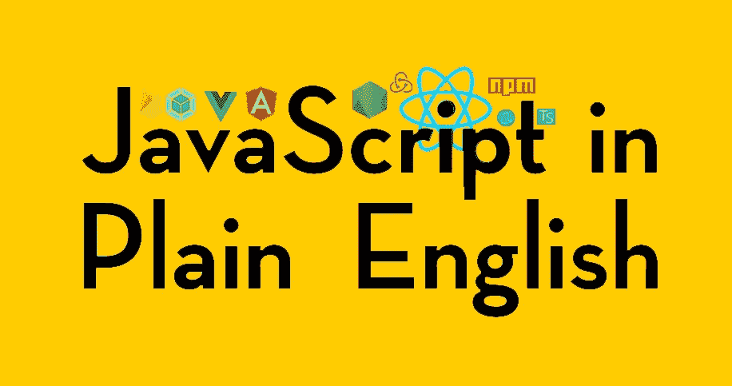

# 你想看什么？

> 原文：<https://javascript.plainenglish.io/what-would-you-like-to-see-9e7ef487fc24?source=collection_archive---------0----------------------->

## 请准确地告诉我们您想阅读的内容！

# 作为我们在 JSIPE 持续发展的一部分，我们希望您向我们提出您想了解更多的话题？

你，我们的读者，就像我们的作者一样，是我们团队的一部分，我们希望你有能力影响我们的方向。

**我们未来的计划包括一个播客和一个 YouTube 频道**，所以如果你想让我们的团队就一些事情进行长时间的讨论，那么**也许你可以为我们推荐一集播客！**或者你可能想看某个特定主题的系列教程——**也许你可以为 YouTube 视频推荐一个主题**！

或者，也许你想掌控这些领域中的一个——如果是这样，一定要让我们知道，也许你最终会成为这些渠道中的一个的主持人。

## 请留下您的评论和建议！✍️