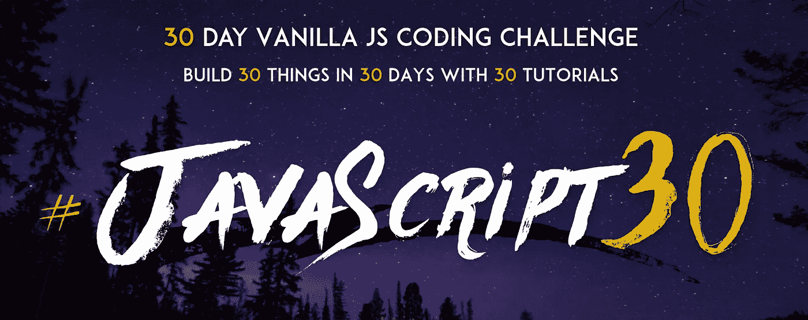
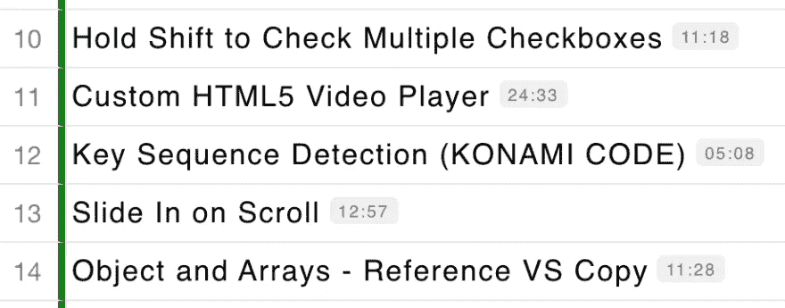
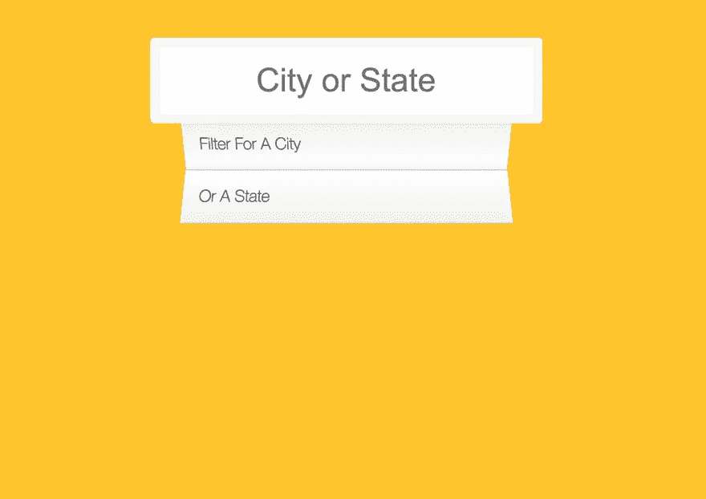
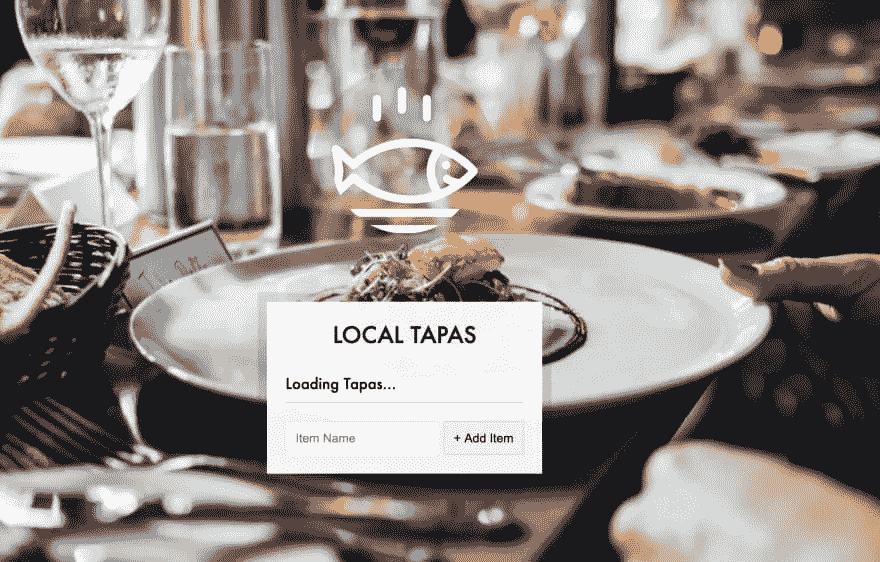
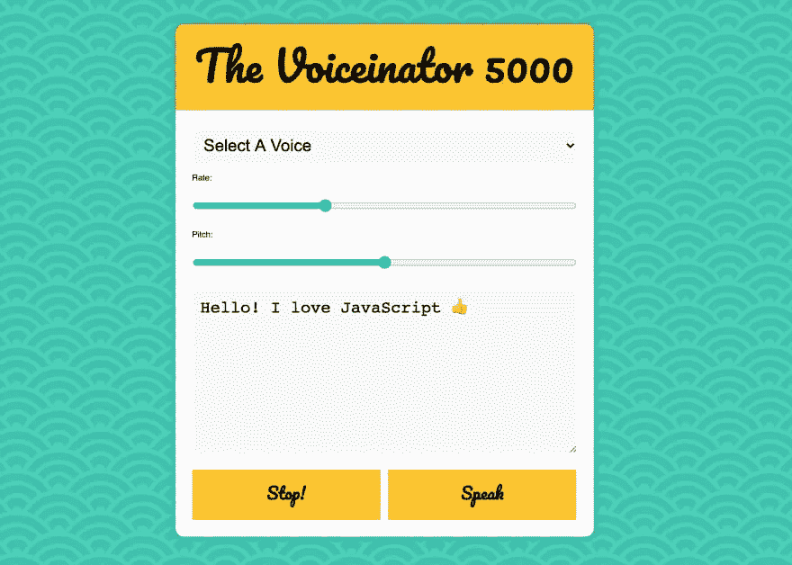
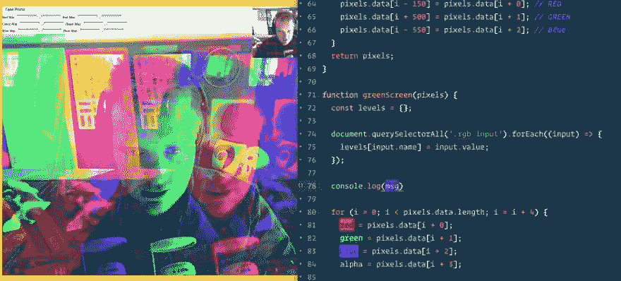
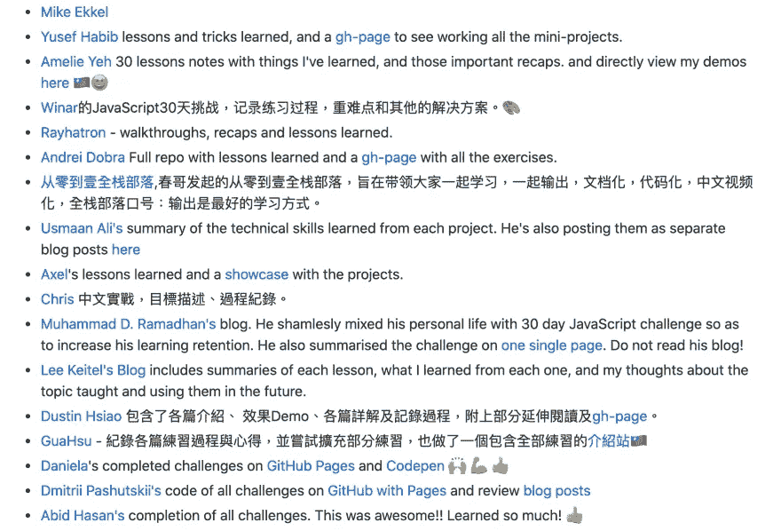

# JavaScript30 挑战赛 30 天你能获得什么

> 原文：<https://javascript.plainenglish.io/what-you-can-achieve-after-30-days-of-javascript30-challenge-c03603cae4d3?source=collection_archive---------13----------------------->



Free JavaScript tutorial by Wes Bos

普通 JavaScript 并不像看上去那样简单。

至少这是我在 30 天内完成韦斯·博斯的 [JavaScript30 挑战](https://javascript30.com/)后发现的。

如果你没有听说过 JavaScript30 Challenge，这是一个由 30 个编码练习/挑战组成的**免费**视频教程，每个练习/挑战都专注于一个特定的 JavaScript 特性。

那么，通过完成这些挑战，你能获得什么呢？以下是我自己有价值的经历中的 7 个要点:

# 1.节省时间和金钱

我有没有提到这个教程是 **100%免费的**？此外，大多数视频不到 20 分钟长，你甚至可以在 5 分钟内构建一个看起来很酷的功能！



# 2.和韦斯·博斯一起笑

笑声是会传染的。再加上韦斯·博斯在整个教程中充满热情的语调，你一定会有一个愉快的编码之旅。

作为旁注，正是通过这个教程，我发现了关于[“坏蛋”CSS 颜色](http://bada55.io/)。

# 3.建立在漂亮的设计之上

说到 CSS，每个课程都有独特的预建 CSS 样式，这使得每个功能在您开始编码之前就已经具有视觉吸引力。

这对视觉学习者来说是一个不可抗拒的奖励。



# 4.创造控制台魔法

还记得[我之前的帖子](https://levelup.gitconnected.com/beyond-console-log-3-ways-to-format-console-outputs-in-javascript-a345918519aa)中关于格式化控制台输出超过`console.log`的多种方法吗？如果没有 JavaScript30 教程，我不会知道所有这些。

为了说明，这里有一个`console.table()`的快速演示:

```
┌─────────┬─────────────┬───────────────┬──────┬────────┐
│ (index) │    first    │     last      │ year │ passed │
├─────────┼─────────────┼───────────────┼──────┼────────┤
│    0    │  'Albert'   │  'Einstein'   │ 1879 │  1955  │
│    1    │   'Isaac'   │   'Newton'    │ 1643 │  1727  │
│    2    │  'Galileo'  │   'Galilei'   │ 1564 │  1642  │
│    3    │   'Marie'   │    'Curie'    │ 1867 │  1934  │
│    4    │ 'Johannes'  │   'Kepler'    │ 1571 │  1630  │
│    5    │ 'Nicolaus'  │ 'Copernicus'  │ 1473 │  1543  │
│    6    │    'Max'    │   'Planck'    │ 1858 │  1947  │
│    7    │ 'Katherine' │  'Blodgett'   │ 1898 │  1979  │
│    8    │    'Ada'    │  'Lovelace'   │ 1815 │  1852  │
│    9    │ 'Sarah E.'  │    'Goode'    │ 1855 │  1905  │
│   10    │   'Lise'    │   'Meitner'   │ 1878 │  1968  │
│   11    │   'Hanna'   │ 'Hammarström' │ 1829 │  1909  │
└─────────┴─────────────┴───────────────┴──────┴────────┘
```

# 5.超越键盘和鼠标点击

你知道吗，你可以用普通的 JavaScript 创建一个自拍器，一个网络摄像头，或者一个变声器？



# 6.见证窗口对象的力量

当然，你可以在这个强大的 Web API 上浏览文档。但是，没有什么比将这些物体和属性投入实际使用并观察它们发光更好的了。

# 7.探索世界各地编码员的旅程

在台湾出生和长大，我很高兴看到一些台湾的 flags🇹🇼人出现在贡献者/学习者名单中。看到其他人如何使用不同的方法来应对同样的挑战也很有趣。



作为一个快速学习 JavaScript 基础知识并投身于 JavaScript 框架的人，30 天的挑战让我真正体会到了普通 JavaScript 的强大。

最重要的是，在数周的算法和数据结构研究之后，它给了我一个愉快的改变。

向 Wes Bos 和那些分享他们旅程的人大声呼喊 [JavaScript30 GitHub repo](https://github.com/wesbos/JavaScript30) ！