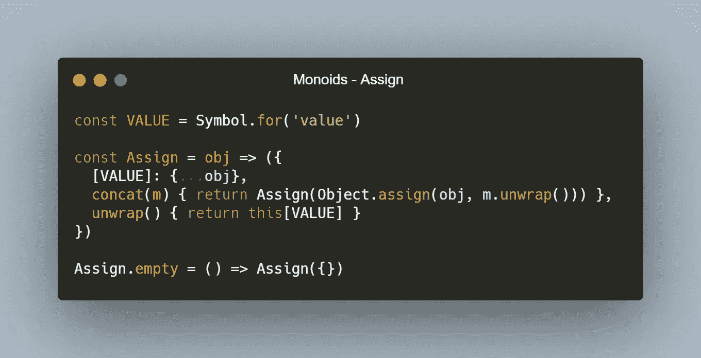
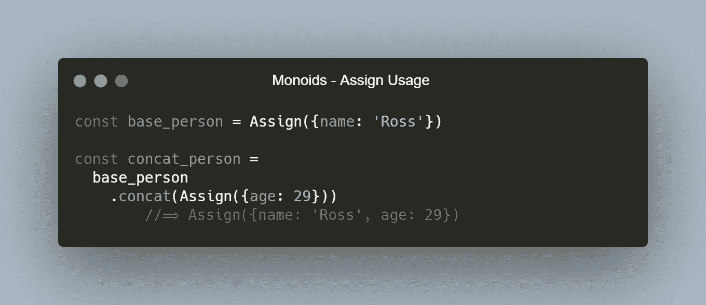
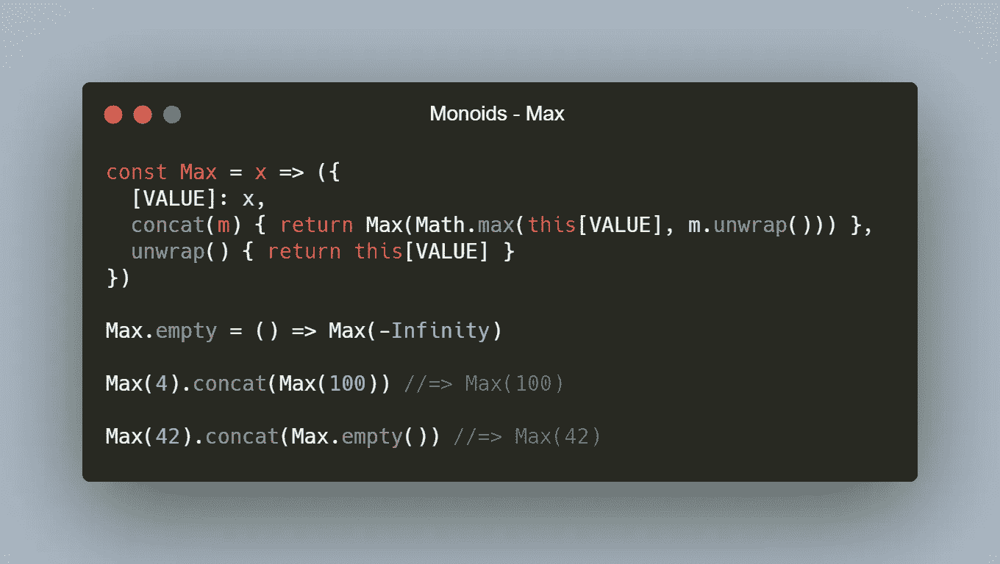
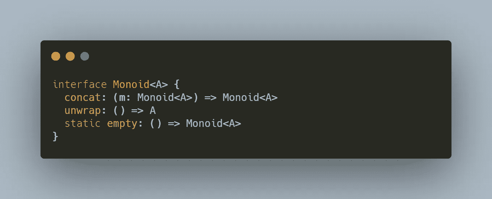
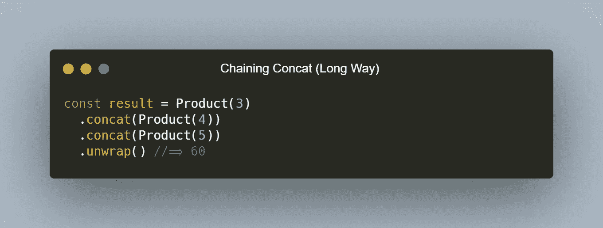
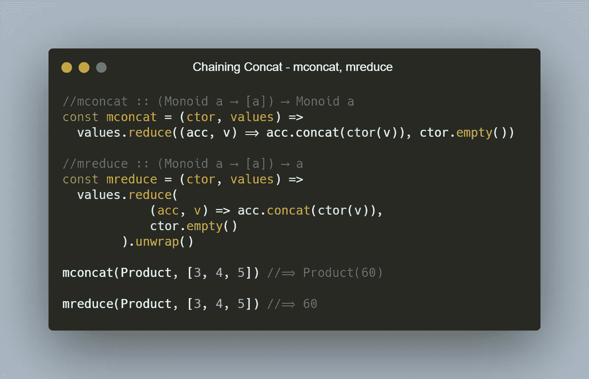

# 什么是幺半群？

> 原文：<https://javascript.plainenglish.io/whats-a-monoid-c8b11bde89a3?source=collection_archive---------7----------------------->

## 让我们封装二进制运算

Photo by [Alexander Sinn](https://unsplash.com/@swimstaralex?utm_source=medium&utm_medium=referral) on [Unsplash](https://unsplash.com/?utm_source=medium&utm_medium=referral)

现在所有优秀的 JS 人员都喜欢函数式编程。我的许多读者已经知道了单子，以及它的其他函子朋友。但是，你偶尔会看到的另一个类似的词呢——幺半群。Monoid 在网络上比 Monad 更难以捉摸。你不会找到太多关于这个话题的好材料。但是，它们仍然是计划生育范畴理论的重要组成部分。

> 幺半群封装一个二进制运算。

我喜欢认为幺半群是二进制运算的封装。您可以*连接*幺半群实例，产生一个具有合并的基础值的新幺半群。您也可以将其简化为基本值，就像 Monad *一样。*让我们尝试手工滚动几个幺半群，以了解它们都是关于什么的。我们将从一个有趣的开始，它存在于有对象的语言中——这里有一个 JavaScript 赋值:

The Assign Monoid defined in JavaScript.

Assign 拿起一个物体，把它包在一个漂亮的盒子里。我总是用符号隐藏数据类型的基础值。符号对于每个符号来说都是唯一的，就像 GUID 一样，并且只能通过一些特殊的反射功能或者通过访问符号本身来观察(提示:不要让您的符号在代码库中面向用户)。就像我之前说的，你可以把类似幺半群的实例连接在一起。`concat`获取相同类型的幺半群(在本例中为赋值)，并使用合并的值创建一个新的幺半群。它封装了一个二进制对象分配操作。我们必须打开提供的 Monoid 来完成这个操作，就像链接 Monads 一样。我们以后会更多地讨论单子和幺半群的关系。为了方便起见，我还包括了一个`empty`构造函数。它们有点不同于函子——它们没有将`map`变形到它们的容器上下文中；它们只是封装了一个二进制函数。

请注意我是如何使用扩展语法将参数克隆到赋值的基础值中的。这是一个安全网，因为 JavaScript 中的对象是引用类型——如果您使用`=`运算符将一个对象分配给两个不同的变量，这两个变量将*引用*同一个对象:

Explanation of referential equality.

因此，修改一个变量将会修改引用的对象，从而改变任何引用该对象的变量的值。这不是很好，我们想要 FP 中透明的不可变数据，所以为了确保我们不会变异引用，我只是把它复制到一个新的对象中，就像`myObj3`一样，这个新的对象又会引用堆中的不同对象。

所以，在我继续讲另一个幺半群之前，让我们先玩一会儿赋值。

Playing around with the Assign Monoid.

现在让我们试试另一个幺半群——Max。它采用一个数值，并在连接时返回两者的最大数值:

The Max Monoid defined in JavaScript.

你很容易想到最小值、和、乘积、商、Eq，甚至更多的幺半群。实际上任何二元运算都可以变成幺半群。

这导致我们为幺半群定义一个接口！尽管接口在 JavaScript 世界中并不存在，但它是在任何编程语言中思考问题抽象的一种强有力的方式。抽象是更好编程的关键。让我们来定义这个接口:

The Monoid Interface.

`concat`接受与调用者相同类型的幺半群，并返回一个相同类型的新幺半群，该幺半群表示您的二元运算的合并值。`unwrap`让我们进入单核盒的内容，`empty`允许我们拥有一个*单元*构造器。基本等同于那个幺半群可以表示的恒等式值。因此，Sum `empty`将为 0，乘积或商将为 1，Max 将为 0(假设为正值)，Min 将为无穷大，依此类推。*(注:我用* `*static*` *来表示* `*empty*` *与构造函数关联，而不是与实例关联)*

最终，您会希望将这些链接在一起:

One way to chain calls to concat.

但是看看所有散布函数调用和最后的展开。我们可以做得更好。输入`mconcat`，和`mreduce`。一些有趣的功能名称。它们分别意味着幺连接和幺归约。

mconcat and mreduce definitions.

它们做的事情基本相同，但是`mconcat`将值留在容器中，而`mreduce`将值取出。注意我们需要空的构造函数！那个`empty`构造函数允许我们对任何幺半群使用`mconcat`和`mreduce`。这就是为什么它是幺半群接口的一部分。

您可以看到使用我们闪亮的新功能后,`concat`的调用链看起来和感觉上都好了很多。一旦你理解了`mconcat`和`mreduce`的含义，它就比那些大组的连接更加易读，它们的名字是这些函数中唯一真正奇怪的部分。除此之外，他们很清楚自己要做什么。

> 那么这和单子有什么关系呢？

让我们用那个让每个人都疯狂的关于单子的古老描述——“单子只是函子范畴中的幺半群。”我们现在知道了幺半群，以及它们如何封装一个二元运算，以及如何归约到它们的内部值。我们知道函子和它们的能力。嗯，等等…你怎么称呼一个可以解开其内容的函子？嘿，那是单子！这就是幺半群是函子范畴中幺半群的原因。封装的操作是容器上下文内容上的形态(函数)的应用。现在我们称它为`map`，而不是`concat`。我认为`map`是合适的——它的名字暗示你可能得到一个不同类型的容器，或者从类型`a`到类型`b`的*映射*。

我希望这篇文章有助于明确什么是幺半群，以及它与幺半群的关系。下次见，FP on，朋友们！