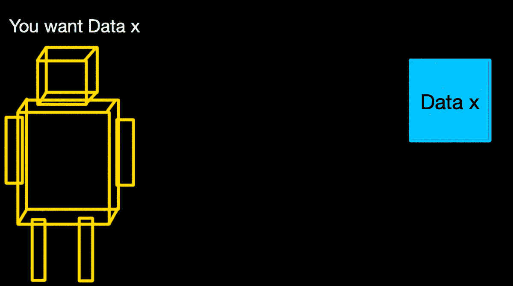
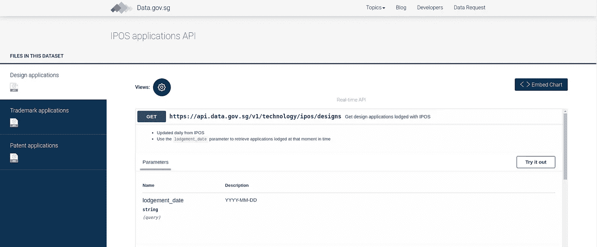
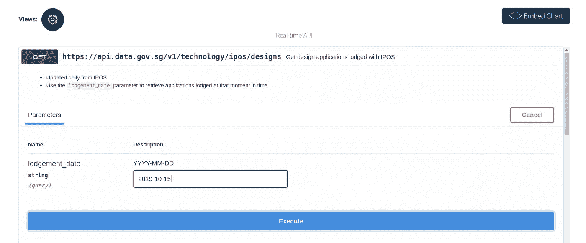
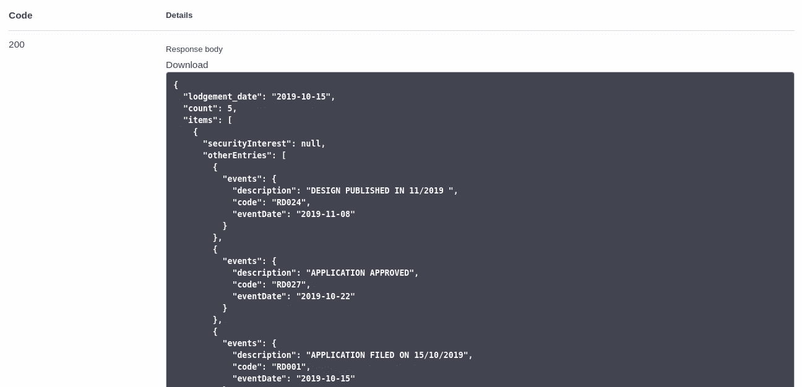
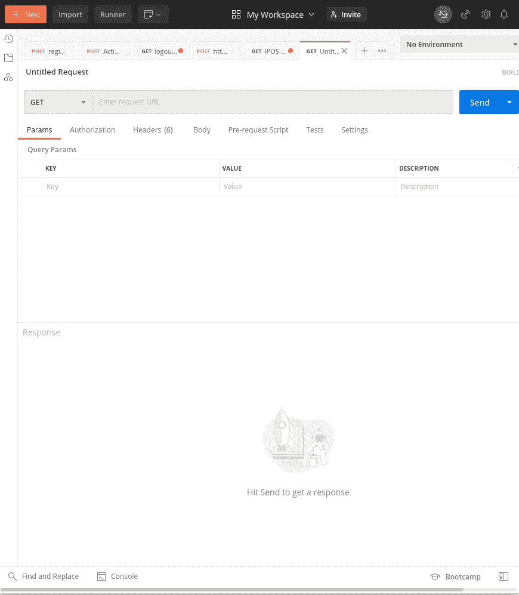
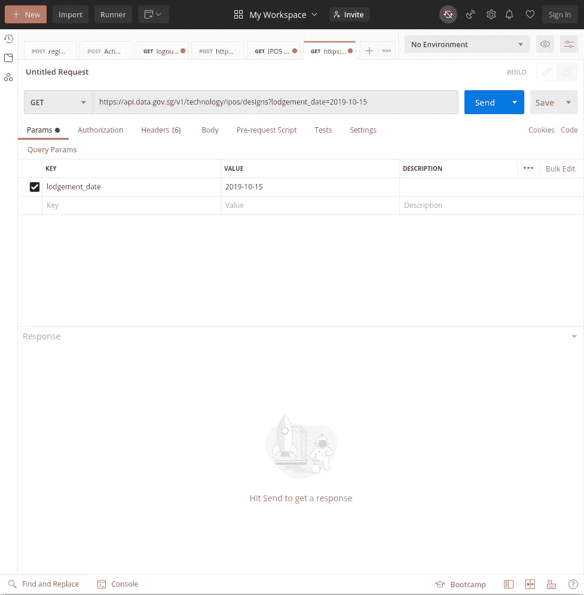
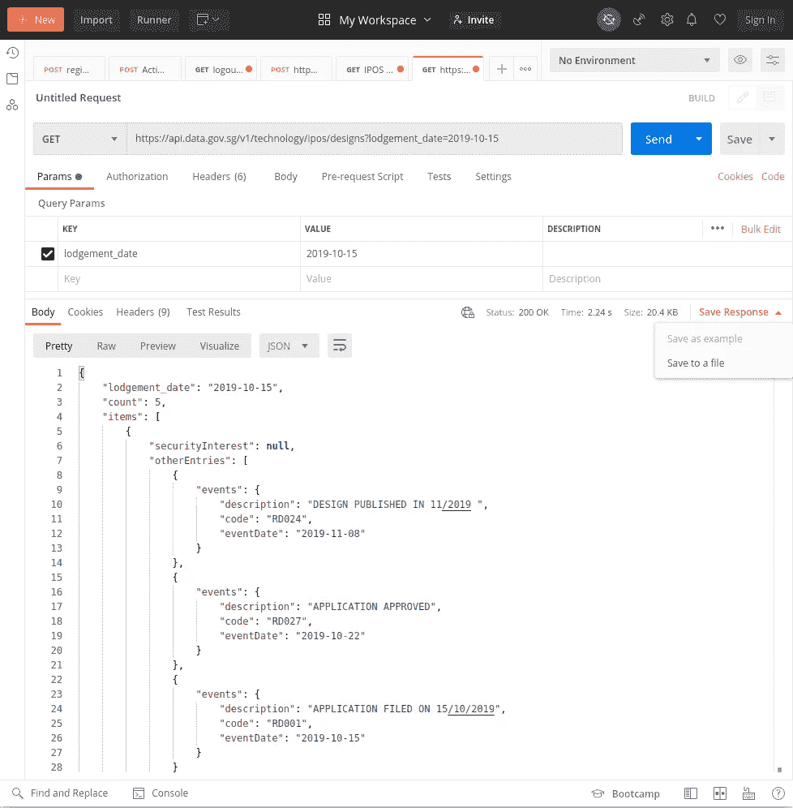
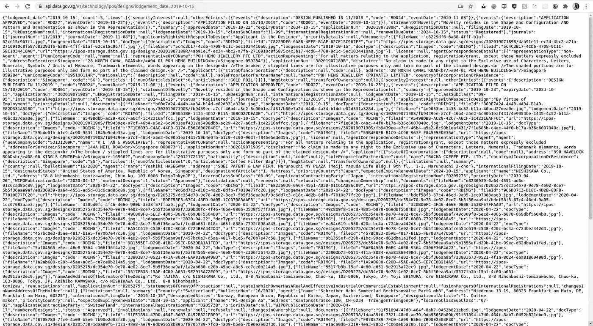
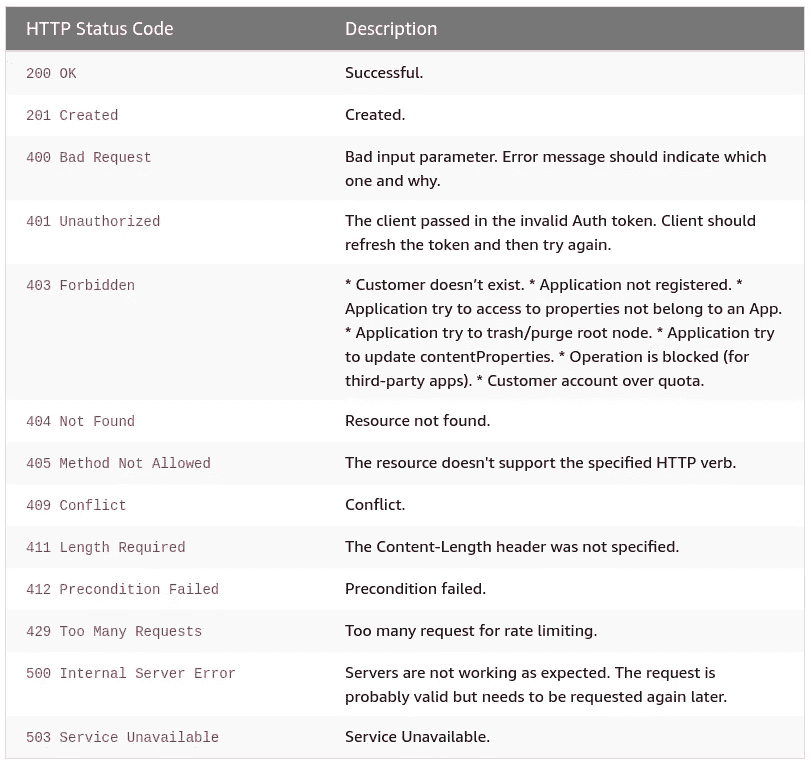

# 什么是 API？用 2 分钟的例子解释

> 原文：<https://javascript.plainenglish.io/whats-an-api-explained-with-a-2-minute-example-2c18b32b1103?source=collection_archive---------5----------------------->

## 任何人都可以试用(2 分钟内)

The author really tried :,)

最近，我的一个商业背景的朋友问了我一个问题“什么是 API ”,当我解释这个问题时，我意识到我真正理解它的唯一时间点是我调用 API 的时候。

这就是为什么在这篇文章中，我将尝试用一个简单易懂的例子来解释什么是(应用程序编程接口)API。

但在此之前，为了完整起见，让我先复制粘贴一下教科书中关于 API 的定义:)

根据维基百科，

> 应用编程接口是定义多个软件中介之间的交互的计算接口。它定义了可以进行的调用或请求的种类、如何进行、应该使用的数据格式、应该遵循的约定等等。

还有一个非常常见的术语——REST API。REST 代表具象状态转移，通常与 SOAP(一种更复杂的协议)形成对比。REST 是一组轻量级的架构原则，为 REST 设计的 API(RESTful API)将以这些格式返回数据请求——HTML、XML、纯文本和 JSON。JSON 是最常见和首选的，因为它容易被计算机和人阅读。我们将关注 REST API。

好的，就这样，我们开始吧！

本指南需要的是:

1.  一些在线 API 数据集(我们将使用这个[链接](https://data.gov.sg/dataset/ipos-apis)，它将向您返回提交给新加坡知识产权局的设计申请)。我用这个是因为我发现这个网站对初学者非常友好，没有任何麻烦。
2.  发出 API 请求的东西。我正在使用[邮差](https://www.postman.com/)，因为我已经安装了它(它的界面也很容易使用)。但是你可以使用在线 API 请求工具或者其他应用程序，比如[失眠](https://insomnia.rest/)。

1 和 2 的替代方案将在本文末尾列出。

所以如果你点击下面的链接——[https://data.gov.sg/dataset/ipos-apis](https://data.gov.sg/dataset/ipos-apis)，在页面加载上你会看到:

Fig 1 — Screenshot taken by Author from Data.gov.sg

这个网站的有趣之处在于，你可以点击“尝试”按钮，尝试在这个网站上提出 GET 请求。所以点击之后，

Enter a date — Screenshot taken by Author from Data.gov.sg

We get status 200 and the data returned in JSON format — Screenshot from Data.gov.sg

就是这样。我们刚刚发出了 GET API 请求。

如果我们所在的网站没有这样的界面呢？

那么我们将不得不使用 API 请求程序。(在这种情况下，我使用的是 Postman，因为它的标志非常可爱+用户友好的界面)

在 Postman 上，创建新请求或无标题请求:

Untitled request

然后，我们粘贴请求 URL 和查询参数，如图 1 所示。

Paste in the query parameters and the request URL

然后我们得到一个响应，JSON 响应很好地呈现给我们:

Returns a 200 OK (means it’s successful)

也许值得一提的是，你在技术上也可以直接抛出链接([https://api.data.gov.sg/v1/technology/ipos/designs?)lodgement_date=2019-10-15](https://api.data.gov.sg/v1/technology/ipos/designs?lodgement_date=2019-10-15) )你会得到同样的回复:

问题是它看起来真的很乱，通常我们会在我们的应用程序或 smth 中进行 API 调用，我们会处理我们得到的 JSON 对象/响应，并对它做一些事情。

Other possible returns — Taken from AWS — [link](https://developer.amazon.com/docs/amazon-drive/ad-restful-api-response-codes.html)

我们得到了 200 OK，这意味着我们的 API 请求被成功处理并返回。根据您提出的请求，您可以得到上表中列出的其他类型的响应。

还有其他 HTTP 方法，如 POST、PUT、DELETE 和 PATCH，但我发现自己最常使用 POST、GET 和 DELETE。如果你想了解更多，请点击这个[链接](https://restfulapi.net/http-methods/)。

我认为我在开始时发现的令人困惑的事情之一是整个“参数”、“授权”、“头”之类的东西。我们已经在上面的例子中演示了如何使用 Params，所以我将简单地提到头的一个常见用例——用于授权。

您看到了我们通过上面一个简单的 API 请求访问在线数据集是多么容易。如果我们只想让特定的人访问它，或者让它变得更加私密，那该怎么办？

答案是使用授权头。

因此发出请求的客户端必须在发出请求时提供正确的凭证。服务器将检查它是正确的还是错误的。只有当凭证正确时，才会返回 200 OK 和请求的响应正文。

本文到此为止！我真的希望它是信息:)

您可以使用的一些在线数据集:

*   【https://data.world/datasets/api 
*   [https://www.data.gov/developers/apis](https://www.data.gov/developers/apis)
*   [https://www . freecodecamp . org/news/https-medium-freecodecamp-org-best-free-open-data-sources-any one-can-use-a65b 514 b 0f 2d/](https://www.freecodecamp.org/news/https-medium-freecodecamp-org-best-free-open-data-sources-anyone-can-use-a65b514b0f2d/)
*   [https://www . programmable web . com/news/10-top-open-data-APIs/brief/2019/12/08](https://www.programmableweb.com/news/10-top-open-data-apis/brief/2019/12/08)

其他 API 测试工具:

*   https://www.apirequest.io/(在线)
*   [https://apitester.com/](https://apitester.com/)(在线)
*   https://reqbin.com/[(在线)](https://reqbin.com/)
*   [https://medium . com/@ alicealdaine/top-10-API-testing-tools-rest-soap-services-5395 CB 03 CFA 9](https://medium.com/@alicealdaine/top-10-api-testing-tools-rest-soap-services-5395cb03cfa9)

再次感谢您的阅读和…

快乐的 API 请求！ʕ•́ᴥ•̀ʔっ♡