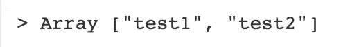
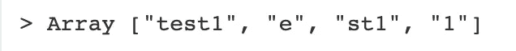
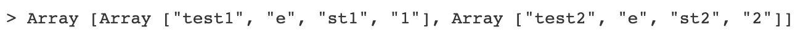
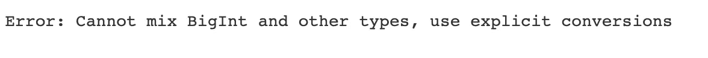
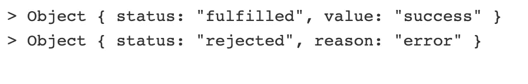
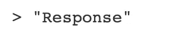
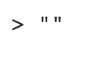

# 2020 年的 JavaScript 将会怎样？

> 原文：<https://javascript.plainenglish.io/whats-coming-to-javascript-in-2020-c2a02cf52d01?source=collection_archive---------1----------------------->

## 审查 TC39 第 4 阶段提案

Photo by [MontyLov](https://unsplash.com/@montylov?utm_source=medium&utm_medium=referral) on [Unsplash](https://unsplash.com?utm_source=medium&utm_medium=referral)

大家好，最近，*可选链接*和*无效合并*在 *TC39* 工艺上被提升到第 4 阶段。这让我对明年的 JavaScript*非常兴奋。*

本文涵盖了目前处于第 4 阶段的[提案](https://github.com/tc39/proposals/blob/master/finished-proposals.md)，预计于 2020 年发布。

## [string . prototype . match all](https://github.com/tc39/proposal-string-matchall)

使用粘性或全局正则表达式，最终在一个字符串上有多个捕获组，这可能很棘手。 *String.prototype.match* 如果包含全局标志，并且如果它只是第一个完整匹配，并且它的捕获组被返回，则不会返回捕获组。

String.prototype.match

The output of String.prototype.match with global flag.

The output of String.prototype.match without global flag.

使用*string . prototype . match all*可以保证返回所有匹配和捕获组。

String.prototype.matchAll

The output of String.prototype.matchAll

## [BigInt](https://github.com/tc39/proposal-bigint)

在 *BigInt* 推出之前， *JavaScript* 能用 *Number* 原语准确表示的最大数是 2⁵ -1 ( *MAX_SAFE_INTEGER* )。

随着 *BigInt* 的引入， *JavaScript* 现在有了一个新的原语，允许表示大于 2⁵的数字

您可以创建一个 *BigInt* ，方法是在您的数字后面附加一个‘n’或使用 BigInt()函数。

Using a BigInt

*   *BigInt* 不严格等于 *Number* 但可以强制等于。
*   做除法之类的运算时，总会四舍五入到 0。
*   无法与*号*交互操作。

Trying to interoperate BigInt with Number

The output of attempting to interoperate BigInt with Number

## [globalThis](https://github.com/tc39/proposal-global)

在 *JavaScript* 世界中，访问全局对象一直是一个令人头疼的问题。根据您使用的环境，您必须熟悉语法的使用。这种情况总是给编写可移植代码带来一些困难，并经常导致像 *getGlobal* 这样的模式。

getGlobal function

有了 *globalThis* ，现在你可以不用担心你在什么环境下，访问你的全局对象。

globalThis

## [诺言.一切已了结](https://github.com/tc39/proposal-promise-allSettled)

想象一下，你有多个承诺，并想在它们都结束后采取任何行动，不管它们是实现了还是被拒绝了。 *Promise.allSettled* 给你一个承诺，当所有给定的承诺都被满足(*履行*或*拒绝*)时，返回一个包含每个承诺结果的数组。

Promise.allSettled

Promise.allSettled output

## [动态导入](https://github.com/tc39/proposal-dynamic-import)

曾经想在运行时加载一个模块，取决于特定的条件？使用动态导入，您可以。

你所要做的就是调用导入，给它一个说明符。之后，它将为该模块返回一个承诺。

Dynamic Import

与静态导入不同，在静态导入中，您必须提供一个字符串作为动态导入的说明符，因为所有工作都是在运行时完成的，您可以向它传递一个模板文本。

Dynamic Import using a template literal

## [无效合并](https://github.com/tc39/proposal-nullish-coalescing)

如果我要求您访问一个属性，并在该属性访问结果为空或未定义的情况下给我一个默认值，您会怎么做？

通常，我们会利用“||”运算符，如下例所示:

pre-Nullish coalescing

这有什么问题？假设您收到的不是 null 或 undefined，而是一个 falsy 值。

pre-Nullish coalescing Falsy issue

Output for the pre-Nullish coalescing Falsy issue snippet

在这种情况下，我们会希望得到属性输出，但是，由于它们是假值，所以我们会得到右侧的表达式输出。

无效合并解决了这个问题。如果属性为空或未定义，则返回右侧表达式；如果不是，那么它忽略它是否被评估为 falsy 或 truthy 并返回它。

*Using Nullish coalescing*

Output using Nullish *coalescing*

## [可选链接](https://github.com/tc39/proposal-optional-chaining)

尝试访问属性值会有一些约束。其中之一是保证给定的属性存在。直到现在，如果我们想要验证属性是否存在，我们必须检查一些条件。

Pre Optional Chaining

使用*可选链接*，您可以使用'？.'执行可选的属性访问。下面的例子将具有与上面的*未定义的*完全相同的输出。

Optional Chaining

很神奇，对吧？*可选链接*为一些更可读的代码打开了大门，我迫不及待地想每天使用它。

## 结论

如果你想试试这些建议，其中一些已经可以在一些引擎上找到，而另一些现在才开始实现，所以它们还不可用。但是，如果你有兴趣，你可以使用一些巴别塔插件，让你尝试的建议。

我希望你喜欢并关注下一篇文章。

周末愉快！