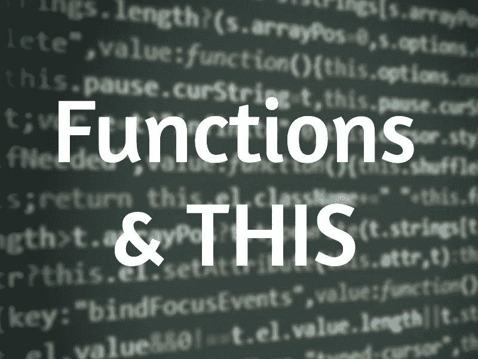

# “this”关键字在不同的上下文中如何变化

> 原文：<https://javascript.plainenglish.io/whats-function-got-to-do-with-this-7ab2633fb4a5?source=collection_archive---------2----------------------->



并非所有的功能都是平等的。我们如何使用函数会影响它的上下文和范围。学习更多关于函数的知识是了解 JavaScript 如何评估`this`的一个很好的方法，这确实值得单独的系列。

首先，一些基础术语。或者，如果您已经知道它们，那么可以跳过一半直接跳到常规的 vs arrow 和 DOM 事件。

# **宣言 vs 表情**

**声明:**

一个**函数声明**(或函数语句)。当它执行时，它**被提升**到封闭函数的顶部。因此您可以在声明函数之前调用它。

```
function myfunc() {}
```

**表达式:**

这是一个带有匿名函数的**函数表达式。函数表达式是赋给变量的函数。更重要的是， ***它没有被吊起*** 。只有当解释器读到这一行时，它才会被调用。因此在声明之前，您将无法引用它。**

```
var myfunc = function() {}
```

一个更紧凑的版本是一个箭头函数(稍后在中会有更多)。

```
var myfunc = () => {}
```

您可以创建一个带有命名函数的**函数表达式，这样您就可以在函数体中调用该命名函数。这对于编写递归函数很有用。**

```
var myfunc = function named() {}
```

**表情:生活版**

一个**生命函数**是一个函数表达式，一旦被定义就运行。它是一个由一组`()`包装的`function()`，向解释器发出信号，表示它应该被视为一个函数表达式，最后一组`()`调用函数。

```
(function() {
  // code here
})()
```

或者

```
(() => {
  // code here
})()
```

你也可以给生命传递参数

```
(function(name) {
  console.log(‘hello’, name);
  // hello Tom
})(“Tom”);
```

# **匿名 vs 具名**

**匿名:**

堆栈跟踪中的**匿名函数**将隐式使用定义上下文的名称作为函数名。

```
var myfunc = function() {}
```

**命名为:**

堆栈跟踪中一个名为**的函数**将使用函数名作为上下文，这使得调试更加可靠。当您有一个命名的函数表达式时，它的上下文并不局限于封闭环境。但是它可以访问封闭上下文的全局声明和变量。

```
var greeting = function(name) {
   var sayHello = function phrase() { return ‘hello ‘ + name };
   console.log(sayHello())
}greeting('Jaime')
//output: hello Jaime
```

现在让我们来看看函数的两种基本类型。理解这种差异对于实现对象方法、回调和组合等模式非常重要。

# **常规 vs 箭头**

> **☕tl；dr:** 两者的主要区别在于**箭头函数**是一个没有自己绑定到`this`、`arguments`或`super` 的函数表达式，也没有`new.target`。Arrow 函数不能使用内置方法 [bind()](https://developer.mozilla.org/en-US/docs/Web/JavaScript/Reference/Global_Objects/Function/bind) 、 [apply()](https://developer.mozilla.org/en-US/docs/Web/JavaScript/Reference/Global_Objects/Function/apply) 和 [call()](https://developer.mozilla.org/en-US/docs/Web/JavaScript/Reference/Global_Objects/Function/call) 来改变其上下文。Arrow 函数也没有“property”关键字。
> 
> 那么为什么要使用 arrow 函数而不是它简洁的语法呢？回调等用例特别适合依赖于词法范围而不是执行上下文的函数。

让我们深入了解一下 **tl 之外的内容；dr** 来看看`this`是如何详细改变上下文的，以及为什么。

**常规:**

```
function regular() {}
```

一个**常规函数**可以是命名的也可以是匿名的(见上文)。

它是*可构造的*，因为你可以使用`new()`关键字创建一个新对象。它还带有一个局部变量`arguments`。这两者都不能用箭头函数来实现。

```
function myFunction() {
  if(arguments) {
    console.log(argument[0]);
  }
}const newObject = new myFunction(1); //returns 1
```

在常规函数中，`this`被绑定到它的执行上下文或者调用函数的对象。这使得它特别适合作为对象方法。

```
const myMethod = {
  username: “Tommy”,
  callName: function() {
    console.log(“hello :”, this.username);
  }
};myMethod.callName();
//output: “hello Tommy”
```

**箭头:**

一个**箭头功能**写成`()=>{}`。

Arrow 函数不是可构造的，而是可调用的。这意味着您不能使用`new`关键字。它也没有一个`prototype`属性。

一般来说，它比常规函数更适合于函数式编程。一个关键原因是它没有自己与`this`的绑定。正因为如此，内置的原型方法 *bind/call/apply* 不能用于重新设置上下文。Arrow 函数可以使用`call()`和`apply()`简单地调用函数并传递参数。并且`bind()`对箭头功能没有影响。

与常规函数不同，Arrow 函数的`this`绑定到词法范围或定义它的地方。词法范围的限制使得 arrow 函数不适合对象方法。

使用前面的`myMethod`示例作为箭头功能来说明:

```
const myMethod = {
  username: “Tommy”,
  callName: () => {
    console.log(this);
    console.log(this.username);
  }
};myMethod.callName();//output: Window or global object
//output: undefined
```

但是，没有自己的`this`绑定的 arrow 函数实际上非常适合回调函数。

例如，假设我们修改`myMethod.callName`以具有回调超时功能:

```
const myMethod = {
  username: “Tommy”,
  callName: function() {
   console.log(“hello :”, this.username);

   setTimeout(function() {
     console.log(“call again: “, this.username);
   }, 1000);
  }
};myMethod.callName();//output: “hello Tommy”
//output: “call again: “ undefined
```

在超时中，我们得到一个`undefined`，因为`this.username`在执行上下文中不存在。

> **⏳超时提示:**如果我们在`setTimeout`函数中`console.log(this)`，我们将得到窗口或者全局对象(或者如果在严格模式下是未定义的)。为什么？因为**规则默认绑定**和**隐式绑定**。如果使用对象上下文调用函数，即`myMethod.callName()`，则隐式绑定适用。但是超时函数是一个未经修饰的普通函数调用，这意味着默认绑定是有效的。在这种情况下，`this`是全局对象。

在使用 arrow 函数之前，我们将通过将`this`重新分配给一个局部变量来修复超时函数:

```
const myMethod = {
  username: “Tommy”,
  callName: function() {
    var that = this;

    console.log(“hello :”, that.username);
    setTimeout(function() {
      console.log(“call again: “, that.username);
    }, 1000);
  }
};
```

或者对这个简单示例之外的内容同时使用重新分配和重新绑定:

```
...callName: function () {
  var self = this; function logDelayed() {
    console.log(“delayed: “, this.username);
  }

  setTimeout(logDelayed.bind(self), 1000);}
...
```

在任一解决方案中，正确的结果将被记录:

```
myMethod.callName();//output: “hello Tommy”
//output: “call again: Tommy”
```

可以解决，但是有太多的障碍，容易出问题。😓

从 ES6 开始，我们只需要把传递给`setTimeOut`的回调函数转换成箭头函数。

```
const myMethod = {
  username: “Tommy”,
  callName: function() {
    console.log(this.username);

    setTimeout(() => {
       console.log(“call again: “, this.username);
    }, 1000);
  }
};myMethod.callName();//output: “hello Tommy”
//output: “call again: Tommy”
```

由于回调是一个箭头函数，`this`现在来自词法范围，这意味着回调是在这里定义的。开发者对箭头功能如此兴奋的原因之一！🤩

# **更多关于常规的，箭头函数&这个跟 DOM 事件**

到目前为止，我们已经深入了解了 arrow 函数和常规函数之间的区别。关键在于理解 JavaScript 中的`this`是如何计算的。

为了进一步探究这个主题中的细微差别，我认为我们可以使用一个非常常见的回调应用程序— DOM event。

在前端开发中，这是我们需要用回调来构建的最基本的特性。

对于示例，我们将使用普通的 JavaScript 实现。

**1。绑定到 DOM 元素的事件回调:**

我们希望绑定在 DOM 对象本身上。它被称为**动态上下文**，其中`this`在每次调用函数时都会发生变化。**不适合箭头功能。**

我们详细过一遍。

我们在 DOM 中有两个按钮:

```
<button class=”button buttonA”>Button</button>
<button class=”button buttonB”>Button</button>
```

当按钮被单击时，我们希望将单词“Button”改为“Button Clicked ”:

```
const buttonActions = {
   changeText: () => this.innerHTML = “Button Clicked”;
};
```

我们用一个*引用*到`changeText`的方法将事件监听器附加到:

```
document
  .querySelector(“.buttonA”)
  .addEventListener(‘click’, buttonActions.changeText);document
  .querySelector(“.buttonB”)
  .addEventListener(‘click’, buttonActions.changeText);
```

有用吗？号码🙅当我们点击任何按钮时，什么也没有发生。

因为在这里使用箭头函数将`this`绑定到全局窗口对象，即引用对象的词法范围。

要通过执行上下文绑定到按钮 DOM 对象，解决方案是简单地将`changeText`绑定到一个常规函数。

```
changeText: function() {
  this.innerHTML = “Button Clicked”;
}
```

存储的引用调用现在将 button DOM 对象作为上下文。

> **⏳超时侧注:**为什么使用对函数`buttonActions.changeText`的引用而不是直接调用`buttonActions.changeText()`？因为我们希望只有当它被点击时才调用函数。否则，当 DOM 呈现时，`buttonActions.changeText()`将被调用。

**2。绑定到对象方法的事件回调:**

一个相反的用例是，我们希望执行上下文总是在回调方法上，而不是在 DOM 对象上。

当然，常规函数似乎也是这里的选择？是的，但不完全是。

我们又有了两个按钮和一个 div 元素来充当简单的计数器:

```
<button class=”button buttonA”>Increase Count</button>
<button class=”button buttonB”>Decrease Count</button><div class=”counter”></div>
```

我们定义了增加和减少计数器的方法:

```
const buttonActions = {
  count: 0,
  increment: function () {
    let n = ++this.count;
    console.log(“counter: “, n);
    document.querySelector(“.counter”).innerHTML = n;
  }, decrement: function () {
   if(this.count > 0) {
     let n = — this.count;
     console.log(“counter: “, n);
     document.querySelector(“.counter”).innerHTML = n;
   }
 }
};
```

我们对这两种方法都使用常规函数，因为我们希望它们共享对`count`值的访问。

现在我们附上点击事件作为参考:

```
document
  .querySelector(“.buttonA”)
  .addEventListener(“click”, buttonActions.increment);document
  .querySelector(“.buttonB”)
  .addEventListener(“click”, buttonActions.decrement);
```

光看这个，我们就知道有问题。🤨

执行上下文现在是按钮 DOM 对象本身。如果我们现在运行它，在点击时，我们会看到一个不需要的输出，因为`this.count`未定义:

```
//output: “counter: “ NaN
```

为了解决这个问题，我们有几种解决方案。

**解决方案 1** —我们使用 ***显式绑定*** 来设置回调的上下文。

```
//Increase buttondocument
  .querySelector(“.buttonA”)
  .addEventListener(“click”, buttonActions.increment.bind(buttonActions));
```

现在，通过使用`bind()`，我们已经明确地将上下文设置为`buttonActions`对象。当我们单击“增加”按钮时，应该会看到所需的变化。这是一种确定而清晰的设置上下文的方式。

> **⏳超时提示:**通常对于事件和异步回调，我们使用`bind()`，因为它意味着返回一个函数供以后执行。`call()`和`apply()`用于立即调用一个函数。

**解决方案 2** —我们实际上可以使用**箭头函数**回退到 ***隐式绑定*** 并包含 buttonActions 对象的执行上下文。

```
//Decrease Buttondocument
  .querySelector(“.buttonB”)
  .addEventListener(“click”, () => buttonActions.decrement());
```

减少计数按钮现在也可以正常工作了。因为箭头函数回调没有`this`上下文，所以 JavaScript 将隐含地推断执行上下文是`decrement`所属的对象(buttonActions)。

这同样清晰简洁。

**解决方案 3** —在按钮元素上使用**内联事件处理程序**。🙃

```
<button onclick=”buttonActions.increment()”>Increase Count</button><button onclick=”buttonActions.decrement()”>Decrease Count</button>
```

嗯，这是一个解决方案，但如果我们的 HTML 元素不能使用任何事件处理程序属性，那么不推荐使用它，也不太可能有用。

尽管如此，我想我会把这个扔进去玩玩！并指出另一个潜在的困惑。

如果你阅读关于[内联事件处理器](https://developer.mozilla.org/en-US/docs/Web/JavaScript/Reference/Operators/this#In_an_inline_event_handler)的 API 参考文档，它说:

*>当代码被内联事件处理程序调用时，它的 this 被设置为放置监听器的 DOM 元素。*

那么我们怎么能指望`onclick=”buttonActions.increment()”`像当时那样工作呢？

因为内联事件处理程序作为匿名常规函数执行，并返回提供的回调函数。

它相当于这样的东西:

```
var inlineEventHandler = function() {
  return buttonActions.increment()
}// when user invoke the event on the buttoninlineEventHandler();
```

因此，如果我们将`this`作为参数传递给`buttonActions.increment(this)`来注销它，我们会看到参数的值确实是 DOM 对象按钮。因为来自匿名函数的`this`确实属于它的执行上下文，按钮。

然而，`increment`方法内部引用的`this`本身是*隐式*绑定到其执行上下文`buttonActions`对象。

请记住，正则函数的执行上下文可以在分配给对象后隐式设置。

好玩吧。当然了。

最后一个有趣的问题——

```
var logName = {
  name: 'Jon',
  say: function() {
   console.log(this.name)
 }
};var setLogName = {
  name: 'Dany',
  say: logName.say
}<button onclick=”setLogName.say()”>Say Name</button>
```

控制台中的输出是什么？

是`Dany`。

我们已经大致了解了函数。不仅探究了***常规**和**箭头**功能的不同，还探究了*为什么*重要的是掌握它们对改变上下文和范围的影响。*

*这里涉及的主题将在下一篇关于**类函数**和**工厂函数**的优缺点的[文章中直接有用。](https://medium.com/javascript-in-plain-english/class-factory-and-object-prototypes-b4a7fff7dba8)*

*[](https://medium.com/javascript-in-plain-english/class-factory-and-object-prototypes-b4a7fff7dba8) [## JavaScript 中的类、工厂和对象原型

### 类和工厂函数中的对象原型继承。

medium.com](https://medium.com/javascript-in-plain-english/class-factory-and-object-prototypes-b4a7fff7dba8) 

## **用简单英语写的 JavaScript 笔记**

我们已经推出了三种新的出版物！请关注我们的新出版物:[**AI in Plain English**](https://medium.com/ai-in-plain-english)，[**UX in Plain English**](https://medium.com/ux-in-plain-english)，[**Python in Plain English**](https://medium.com/python-in-plain-english)**——谢谢，继续学习！**

**我们也一直有兴趣帮助推广高质量的内容。如果您有一篇文章想要提交给我们的任何出版物，请发送电子邮件至[**submissions @ plain English . io**](mailto:submissions@plainenglish.io)**，并附上您的 Medium 用户名，我们会将您添加为作者。另外，请让我们知道您想加入哪个/哪些出版物。*****