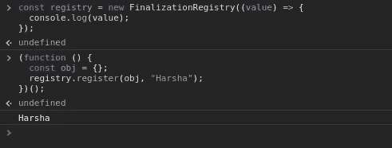

# ES2021 有什么新功能？

> 原文：<https://javascript.plainenglish.io/whats-new-in-es2021-99921c01f220?source=collection_archive---------1----------------------->

## 随时了解 2021 年 JavaScript 即将推出的新特性


Photo by [Ekaterina Shevchenko](https://unsplash.com/@shekatherine?utm_source=medium&utm_medium=referral) on [Unsplash](https://unsplash.com?utm_source=medium&utm_medium=referral)

自 2015 年以来，JavaScript 每年都会不断收到新功能的更新。虽然 ES2021/ES12 将于明年发布，但我们已经可以看到未来的发展，因为许多功能已经达到[阶段 4(完成)规范](https://tc39.es/process-document/#:~:text=Spec%20compliant-,4,in%20the%20formal%20ECMAScript%20standard)，并将包含在规范中。在本文中，我将讨论已经达到第四阶段并添加到 Google Chrome V8 引擎中的功能。

# 字符串.原型. replaceAll

`String.prototype.replace`是一个现有的方法，允许我们用其他东西替换字符串中的模式。在这个方法中需要记住的一点是，当我们替换一个模式时，只有该模式在字符串中的第一次出现才会被替换。为了替换所有的出现，我们使用 **RegEx** 来达到同样的目的。

```
const str = 'I love Javascript and Javascript is awesome!';
str.replace('Javascript', 'coding');
// "I love coding and Javascript is awesome!"// Alternate solution to replace all occurrences
str.replace(/Javascript/g, 'coding');
// "I love coding and coding is awesome!"
```

这些年来，还没有像 replaceAll 这样的方法，不用正则表达式就能替换所有出现的内容。ES2021 引入了这种新方法来克服这一障碍。

```
const str = 'I love Javascript and Javascript is awesome!';
str.replaceAll('Javascript', 'coding');
// "I love coding and coding is awesome!"
```

# 承诺。任何

**Promise.any()** 方法接受一个承诺列表，并在遇到列表中的第一个已解析承诺时立即返回值。如果所有的承诺都被拒绝，那么它将抛出一个`AggregatedError`消息。

```
Promise.any(promises).then(
  (first) => {
    // Any of the promises was fulfilled.
  },
  (error) => {
    // All of the promises were rejected.
  }
);
```

这种方法与`Promise.race`不同，因为在`race`中，当一个给定的承诺**解决**或**拒绝**时，承诺会短路一次，但在这里，如果任何一个承诺被履行，承诺就会被解决，只有当**所有**承诺都被拒绝时，承诺才会被拒绝。

这里有一个例子可以证明这一点:

```
Promise.any([new Promise((resolve, reject) => setTimeout(reject, 200, 'One')),new Promise((resolve, reject) => setTimeout(resolve, 1000, 'Two')),new Promise((resolve, reject) => setTimeout(resolve, 2000, 'Three'))]).then((value) => console.log(`Result - ${value}`)).catch((err) => console.log(err)); // OUTPUT
// Result - Two
```

# 逻辑赋值运算符

逻辑赋值运算符用赋值运算符组合逻辑运算(`&&`、`||`或`??`)。

## 1.带&&运算符的逻辑赋值运算符

如果`a`和`b`都为真，则`a &&= b`将返回`b`，否则将返回`a`。换句话说，只有当 LHS 值为真时，它才会将 RHS 变量值赋给 LHS 变量。

示例:

```
let a = 1;
let b = 2;a &&= b// Ora && (a = b)// Or if(a) {
  a = b
}// OUTPUT
// 2
```

## 2.带有||运算符的逻辑赋值运算符

如果`a`为真，`a ||= b`将返回`a`，否则将返回`b`。换句话说，只有当 LHS 值为 falsy 时，它才会将 RHS 变量值赋给 LHS 变量。

示例:

```
let a;
let b = 2;a ||= b// Ora || (a = b)// Orif(!a) {
  a = b
}// OUTPUT
// 2
```

## 3.逻辑赋值运算符。？操作员

`??`也被称为**无效** **合并**运算符，它检查值是`null`还是`undefined`。如果`a`为`null`或`undefined`，则`a ??= b`将返回`b`，否则将返回`b`。换句话说，只有当 LHS 值为`null`或`undefined`时，它才会将 RHS 变量值赋给 LHS 变量。

示例:

```
let a;
let b = 2;a ??= b// Ora ?? (a = b)// Orif(!a) {
  a = b
}// OUTPUT
// 2
```

# 数字分隔符

**数字分隔符**将通过使用`_`字符在各组数字之间提供分隔，使读取数值变得更容易。

```
rs = 1_00_000;
// 100000
```

这只是作为一种表示，因为开发人员更容易通读代码。

# WeakRefs

`WeakRef`代表弱引用。弱引用的主要用途是实现**缓存**。

因为 JavaScript 是一种垃圾收集语言，如果一个变量不再可达，GC 会自动删除它。作为一个好的实践，我们不希望在很长一段时间内保留很多内容。我们可以允许内存被垃圾收集，以后如果我们再次需要它，我们可以生成一个新的缓存。

示例:

```
// callback function
const callback = () => {
  const obj = {
    name: "Harsha"
  };
  console.log(obj);
}// IIFE function to print the object after 3 secs
(async function(){
  await new Promise((resolve) => {
    setTimeout(() => {
      callback(); // {name: "Harsha"}
      resolve();
    }, 3000);
  });
})();
```

上面的例子可能看起来很复杂。但是，这其实很简单。这段代码基本上在 3 秒钟后调用一个回调函数，该函数打印一个对象。每当我们调用回调函数时，`obj`仍然存在于内存中。为了有效地管理**缓存**，我们可以使用`WeakRef`。

```
// callback function
const callback = () => {
  const obj = new WeakRef({    
    name: "Harsha"  
  });  
  console.log(obj.deref().name);
}// IIFE function to print the object after 2 and 5 secs
(async function(){
  await new Promise((resolve) => {
    setTimeout(() => {
      callback(); // Guaranteed to print "Harsha"
      resolve();
    }, 2000);
  });

  await new Promise((resolve) => {
    setTimeout(() => {
      callback(); // No Gaurantee that "Harsha" is printed
      resolve();
    }, 5000);
  });
})();
```

在`WeakRef`中，使用`deref()`方法读取参考值。第一次将打印该值，第二次不保证会打印出来，因为它可能已经被 GC 清除了。

# 终结注册表

`FinalizationRegistry`允许程序员注册对象被垃圾收集后调用的回调函数。据说是`WeakRef`的配套功能。

```
const registry = new FinalizationRegistry((value) => {
  console.log(value);
});
```

这里`registry`是`FinalizationRegistry`的一个实例。传递给`FinalizationRegistry`的回调函数在对象被垃圾收集时被触发。

示例:

```
(function () {
  const obj = {};
  registry.register(obj, "Harsha");
})();
```

当`obj`被垃圾收集时，`"Harsha"`被传递给回调函数并打印在控制台中。



When the garbage is collected Harsha is printed out

# 国际号码。列表格式

`Intl.ListFormat`对象是支持语言敏感列表格式的对象的构造函数。它接受两个参数——第一个参数是区域设置，第二个参数是具有两个属性(样式和类型)的 options 对象。看一个例子比用语言解释要容易得多:

```
const list = ['King', 'Queen', 'Jack'];

new Intl.ListFormat('en', { style: 'long', type: 'conjunction' }).format(list);
// King, Queen and Jack

new Intl.ListFormat('en', { style: 'short', type: 'disjunction' }).format(list);
// King, Queen or Jack
```

您也可以尝试其他语言。

# Intl 的日期样式和时间样式选项。日期时间格式

现在，我们可以使用`dateStyle`和`timeStyle`来请求给定长度的特定于地区的日期和时间。我们只需要将它们作为选项传递，其余的就可以处理了。

```
// short
new Intl.DateTimeFormat("en" , {
  timeStyle: "short"
}).format(Date.now())
// "6:35 PM"

// medium
new Intl.DateTimeFormat("en" , {
  timeStyle: "medium"
}).format(Date.now())
// "6:35:13 PM"

// long
new Intl.DateTimeFormat("en" , {
  timeStyle: "long"
}).format(Date.now())
// "6:35:55 PM GMT+5:30"
```

对于`dateStyle`，这里有几个例子:

```
// short
new Intl.DateTimeFormat("en" , {
  dateStyle: "short"
}).format(Date.now())
// "11/19/20"

// medium
new Intl.DateTimeFormat("en" , {
  dateStyle: "medium"
}).format(Date.now())
// "Nov 19, 2020"

// long
new Intl.DateTimeFormat("en" , {
  dateStyle: "long"
}).format(Date.now())
// "November 19, 2020"
```

# **结论**

作为一名开发人员，了解任何编程语言的新特性是很重要的。我希望，我已经给了你一个简短的想法，什么都还没有到来。

感谢您阅读并在评论中删除您最喜欢的功能！