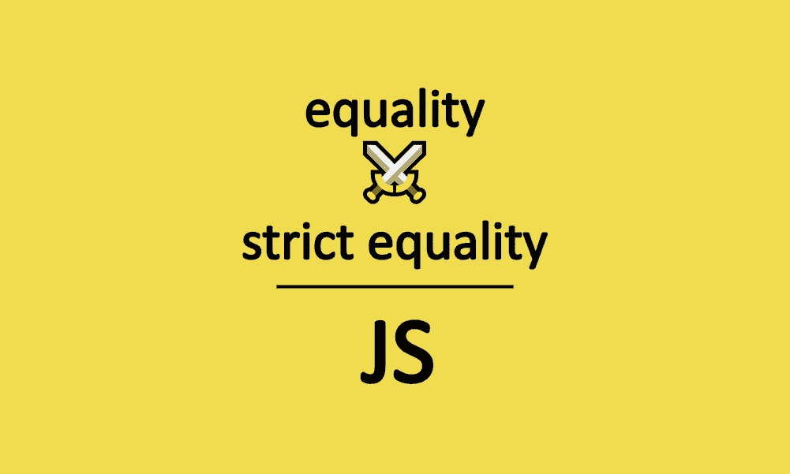
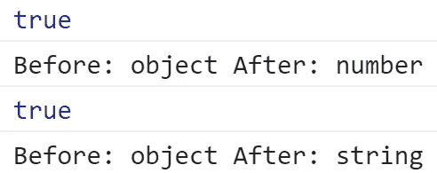

# 两倍等于或三倍等于

> 原文：<https://javascript.plainenglish.io/whats-the-right-way-to-check-equality-in-javascript-1c799c6078b4?source=collection_archive---------2----------------------->

## Java Script 语言

## 在 JavaScript 中检查相等性

The Equality and the Strict Equality operators in JavaScript (Image by the author)

在 JavaScript 中，可以使用`==`或`===`检查任意两个对象的相等性。两个操作符都检查给定的两个对象是否相等，但方式完全不同。

下面，您可以详细地看到每个操作符如何检查给定的两个对象是否相等。

# 相等运算符(==)

相等运算符(`**==**`)比较两个操作数，检查它们是否相等，并返回一个布尔结果。如果操作数属于不同的类型，它会在检查相等性之前尝试转换操作数。

## 你可以在下面看到等号运算符( **==** )是如何试图比较两个操作数的。

## 不同类型

*   如果您比较一个字符串和一个数字，它会在比较之前尝试将字符串转换为数字。

*   当一个操作数是布尔值，另一个是数字时，它试图将布尔值转换为字符串，因此`true`转换为`1`，而`false`转换为`0`。

*   当其中一个操作数是对象，而另一个是字符串或数字时，它会尝试使用`valueOf()` 或`toString()`将**对象转换为原始类型**。

Output for checking equality of an object and a string/number (Screenshot by author)

## 目标

当两个操作数都是对象时，只有当两个操作数引用同一个对象时，结果才会是`true`。

## 空且未定义

当一个操作数是`null`，另一个是`undefined`时，返回`true`。

> **注:**`null`为赋值，但表示为空或不存在。而`undefined`表示该变量已声明但未赋值。因此，在检查相等性的情况下，它们都不引用任何值。

## 其他情况

对于所有其他场景，比较如下。

*   只有当两个操作数中的**字符及其序列**相同时，字符串才相等。

*   如果数值相同，则数字相等，除了`+0`和`-0`的情况，它们被视为相等。如果任一操作数为`NaN`，则返回`false`。

*   只有当两个操作数都是`true`或`false`时，布尔值**和**才相等。

# 严格相等运算符(===)

严格相等运算符比较两个操作数以检查它们是否相等，并返回一个布尔结果。它认为不同类型的操作数是不同的，并且在比较之前不会尝试将它们转换为一个公共类型。

## 您可以在下面看到严格相等运算符(===)是如何比较两个操作数的。

## **不同类型**

当两个操作数的类型不同时，它返回`false`。

Output for operands of different types (Screenshot by author)

## **对象**

当两个操作数都是对象时，只有当两个操作数引用同一个对象时，它才返回`true`。

Output for objects (Screenshot by author)

## 空或未定义

当两个操作数都是`null`或`undefined`时，返回`true`。

Output for null and undefined (Screenshot by author)

## 数字

在数值比较的情况下，当任一操作数为`NaN`时，返回`false`。

Output for a Nan and a number (Screenshot by author)

## 其他情况

在所有其他场景中，比较如下。

*   如果数字具有相同的数值，则它们相等，除了在`+0`和`-0`的情况下，它们相等。

Output for numbers (Screenshot by author)

*   当两个操作数在同一序列中有**相同的字符时，字符串是相等的。**

Output for strings (Screenshot by author)

*   当两个操作数都是`true`或`false`时，布尔值相等。

Output for boolean values (Screenshot by author)

# 结论

让我们总结一下你在这篇文章中学到了什么:

*   如您所见，等式运算符是如何工作的，使用时需要小心，因为在检查等式之前，它会尝试将值转换为相同的数据类型。
*   在某些情况下，使用相等运算符可能不会产生预期的结果，这可能会导致代码功能出现意外问题。
*   严格相等通过考虑给定对象的值和类型来检查它们是否相等。
*   在严格相等的情况下，您可以确保它检查给定的两个操作数是否相等，而不执行任何后台转换。
*   所以，如果你需要通过考虑操作数的值和类型来检查等式，那么使用严格的等式是正确的方法。
*   毫无疑问，当你检查`null`和`undefined`是否相等时，你可以使用相等运算符。

# 资源

*   [MDN web 文档中的等式](https://developer.mozilla.org/en-US/docs/Web/JavaScript/Reference/Operators/Equality)
*   在 [MDN web 文档中严格相等](https://developer.mozilla.org/en-US/docs/Web/JavaScript/Reference/Operators/Strict_equality)
*   [MDN 网络文档](https://developer.mozilla.org/en-US/docs/Web/JavaScript/Equality_comparisons_and_sameness)中的比较与平等

感谢阅读，快乐学习！

## 简单英语的 JavaScript

喜欢这篇文章吗？如果有，通过 [**订阅获取更多类似内容解码，我们的 YouTube 频道**](https://www.youtube.com/channel/UCtipWUghju290NWcn8jhyAw) **！**