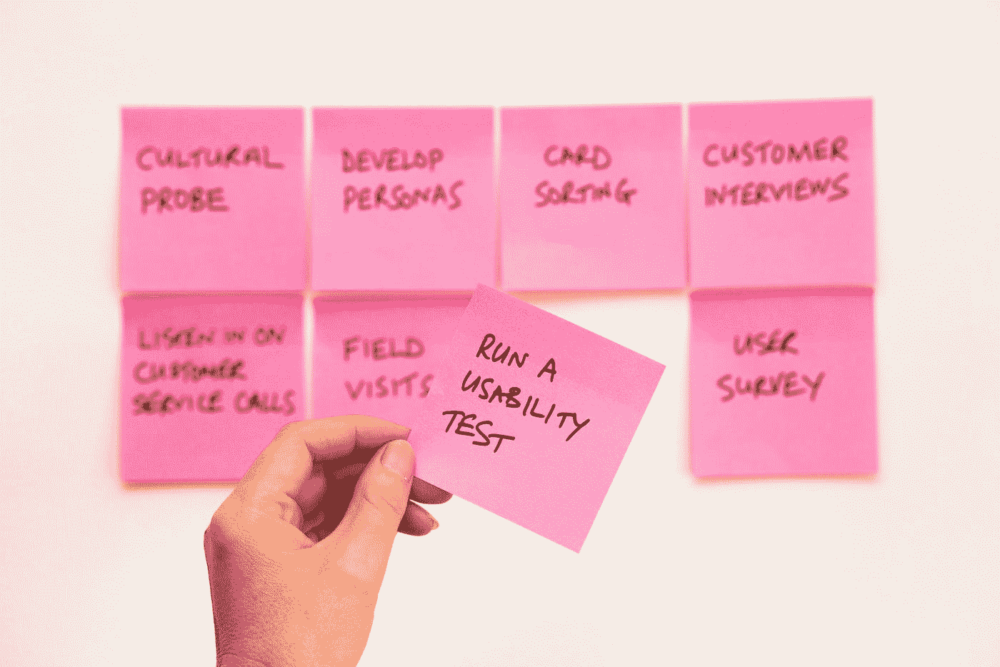

# 当 80%的代码覆盖率不够时。

> 原文：<https://javascript.plainenglish.io/when-80-percent-code-coverage-is-not-enough-843a92260bdc?source=collection_archive---------4----------------------->

## 如何为你的 web 应用程序编写一个以上的单元(声纳)测试？



Photo by [David Travis](https://unsplash.com/@dtravisphd?utm_source=medium&utm_medium=referral) on [Unsplash](https://unsplash.com?utm_source=medium&utm_medium=referral)

多年来，字体端开发人员一直试图遵循一些最佳实践，用传统的服务器实践来测试他们的代码。这些实践中的大多数都需要编写一个单元测试，然后确保它们覆盖了大部分代码。然后，团队会将此发送给静态检查器，以查看他们是否有覆盖率，并根据一些任意的标准检查代码。声纳就是一个很好的例子。为了提高性能，常见的做法是添加一些 URL 端点，并让系统访问这些端点一段时间，然后查看响应时间。这种类型的测试对于 API 来说是非常好的，但是它并不是网站的全部。

首先，对于一个网站来说，80%的代码覆盖率是一个非常随意的数字。例如，假设我正在为一个输入字段创建一个 web 组件，并且我有一个基类。

```
import {BaseInput} from '../base-input.js'
export class NewInput extends BaseInput {
  constructor(){
    super();
    try {
      if(this.x === 1) {
        console.log('1');
      }
      this.innerHTML = '<h1>Hello Word</h1>';} catch (error) {
      console.log(error);
    }
  }
}
if(!customElement.get('new-input')){
  customElement.define('new-input',NewInput);
}
```

在这段代码中，有一个 catch 语句很难用大多数单元测试框架来测试。如果您在您的测试框架上使用了一个预处理器构建系统，那么您将从 BaseInput 中获得您必须覆盖的所有代码。最后，你有 if 语句，你可以把它放在一行中，但是这可能会弄乱你的覆盖行，所以你不要这样做。最重要的是，你在这里测试了什么。测试不仅仅是编写一个单元测试来获得代码覆盖率的分数。有可访问性，可用性，它看起来怎么样，自从上次签入以来视觉上做的事情。这些场景通常不是仅仅通过单元测试就能解决的，而且在 UAT 测试中也不会被发现。这里还有两种方法可以让你的前端测试框架发挥更大的作用。

让我们以一个简单的按钮为例。

按钮是红色的，在标签之间有文本。当你悬停在按钮上时，它会变绿并变大。仅仅通过将它添加到测试中，您就可以获得 100%的覆盖率。

我要添加的第一种测试是感知差异测试。在这里，我们尝试获取网页的快照，并将其与之前的快照进行比较。一个例子是在 Chrome 中打开 DevTools 并给你的页面拍一张快照。对页面进行一些更改后，拍摄第二个快照图像。现在，如果你对两幅图像进行逐个像素的比较，这将是一个感知测试。

有许多库可以做这种类型的测试，但是这个例子中我将使用 differencify。Differencify 建立在木偶师的基础上。我的例子是，我将使用 Jasmine 作为我的测试跑步者。首先让我们安装 differencify。

```
npm install --save-dev differencify
```

创建您的 Jasmine 测试

这个测试中发生了什么？Differencify 对象是木偶对象的扩展。您在木偶对象上拥有的所有功能都将在差异对象上拥有。

```
const Differencify = require('differencify');const differencify = new Differencify({});
```

然后我们初始化这个对象并给它一个名字。然后，我们需要将按钮添加到页面中

```
browser = differencify.init({
  testName: 'Test hover on button will turn it green',
  chain: false,
  headless: true,
});
jasmine.DEFAULT_TIMEOUT_INTERVAL = 10000;
await browser.launch();
page = await browser.newPage();
await page.setBypassCSP(true);
await page.setViewport({ width: 1600, height: 1200 });
await page.addScriptTag({ path: 'SimpleButton.js' });
const bodyhandle = await page.$('body');
await page.evaluate(element => {
  element.innerHTML = `<simple-button >Test Button</simple-button>`;
}, bodyhandle);
```

神奇的是，我们给页面上的按钮拍了一张快照。

```
const result1 = await browser.toMatchSnapshot(image);
expect(result1).toBeTruthy();
```

这将创建一个名为 differencify _ reports 的目录。此目录是存储快照映像的位置。如果有先前的图像，它会将这个图像与先前的图像进行比较，并返回图像是否相同。

最后一步是将鼠标悬停在按钮上，并在鼠标悬停在按钮上时拍摄按钮的快照。

```
const button = await page.evaluateHandle(() => {
  const btn = document
    .querySelector('simple-button')
    .shadowRoot.querySelector('button');
  return btn;});
await button.hover();
await page.waitFor(2000);
const image = await page.screenshot({ path: 'hover.png' });
const result2 = await browser.toMatchSnapshot(image);
expect(result2).toBeTruthy();
```

您现在已经对您的元素进行了一些视觉测试。对元素的任何更改都将显示在 differencify _ report 目录中。这是检查元素中微小变化的一个很好的方法。

我想对我的元素应用的下一组测试是可访问性。为此，我将使用 axe-core 库。这个库和 axe coconut 插件或者 lighthouse 用的一样。要安装这个添加斧头木偶师

```
npm install --save-dev axe-puppeteer
```

你可能已经注意到它正在使用木偶师。因此，我们可以使用 differencify，例如，我们的木偶版本。

这个测试中唯一显著的不同是我们添加了 AxePuppeteer 行来分析我们的页面，并且只在报告中包含我们的按钮。报告将返回一个包含所有分析结果的大型 JSON。在我的例子中，我创建了一个函数来遍历报告，只查找失败的问题。

通过这两种测试实践，您将能够更全面地测试您的 web 元素。另一种测试需求是性能，但是我将把它留给另一个博客来讨论。