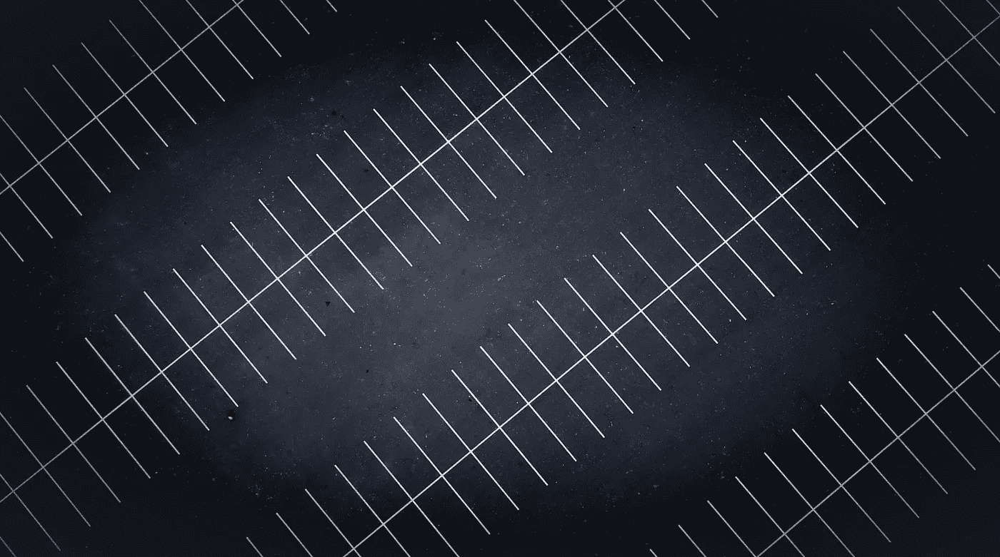

# 在 JavaScript 中何时以及为什么应该使用地图而不是对象

> 原文：<https://javascript.plainenglish.io/when-and-why-you-should-use-a-map-instead-of-an-object-in-javascript-6c345028b3ca?source=collection_archive---------0----------------------->



Photo by [Martin Sanchez](https://unsplash.com/@zekedrone?utm_source=unsplash&utm_medium=referral&utm_content=creditCopyText) on [Unsplash](https://unsplash.com/s/photos/parking-spots?utm_source=unsplash&utm_medium=referral&utm_content=creditCopyText)

映射是一种经典的数据结构，其中数据以键/值对的形式存储:

```
const map = new Map();
map.set('key', 'value'); // Map(1) {"key" => "value"}
map.get('key'); // 'value'
```

JavaScript 对象是属性的集合，属性是一个键/值对:

```
const someObject = {};
someObject.key = 'value';
someObject.key; // 'value'
```

定义和行为非常接近，以至于令人困惑。更令人困惑的是，地图是 ES6 的附加功能，所以很长时间以来，除了使用对象来实现类似地图的行为之外，没有其他解决方案。那么为什么现在要费心使用地图，而不是坚持使用传统的 JavaScript 对象呢？

# 键的类型

JavaScript 对象只接受两种类型的键:字符串和符号。您可以使用 anothe 类型的键，但是 JavaScript 会隐式地将其转换为字符串:

```
const object = { };
object[true] = 'value';
object[1] = 'value';
object[{'key': 'value'}] = 'value';Object.keys(object); // ["1", "true", "[object Object]"]
```

另一方面，map 将接受任何类型的键，并将保留键类型。

```
const map = new Map();
map.set(1, 'value');
map.set(true, 'value');
map.set({'key': 'value'}, 'value');for (const key of map.keys()) {
  console.log(key);
}
// 1
// true
// {key: "value"}
```

# 原型字段

与地图不同，物体不仅仅是你所看到的。虽然映射只包含您定义的键/值对，但对象带有一些来自其原型的内置属性:

```
const newObject = {};
newObject.constructor; // ƒ Object() { [native code] }
```

当你没有正确地迭代你的对象属性时，它会导致问题。它还会产生有趣的错误:

```
const countWords = (words) => {
  const counts = { };
  for (const word of words) {
    counts[word] = (counts[word] || 0) + 1;
  }
  return counts;
};const counts = countWords(['constructor', 'creates', 'a', 'bug']);/* {constructor: "function Object() { [native code] }1", creates: 1, a: 1, bug: 1} */
```

(这个例子的灵感来自丹·范德卡姆的《有效打字稿》一书)

# 循环

地图是可迭代的，可以直接迭代。例如，您可以在地图上使用`forEach`循环:

```
const map = new Map();
map.set('key1', 'value1');
map.set('key2', 'value2');
map.set('key3', 'value3');map.forEach((value, key) => {
  console.log(key, value);
});// key1 value1
// key2 value2
// key3 value3
```

或者直接进入`for ... of ...`循环:

```
for(const entry of map) {
  console.log(entry);
}// ["key1", "value1"]
// ["key2", "value2"]
// ["key3", "value3"]
```

另一方面，对象不是直接可迭代的。尝试迭代一个会导致错误:

```
const object = {
  key1: 'value1',
  key2: 'value2',
  key3: 'value3',
};for(const entry of object) {
  console.log(entry);
}// Uncaught TypeError: object is not iterable
```

您需要一个额外的步骤来检索它的键、值或条目:

```
for(const key of Object.keys(object)) {
  console.log(key);
}// key1
// key2
// key3 for(const value of Object.values(object)) {
  console.log(value);
}// value1
// value2
// value3 for(const entry of Object.entries(object)) {
  console.log(entry);
}// ["key1", "value1"]
// ["key2", "value2"]
// ["key3", "value3"]
```

你也可以在一个对象上使用`for ... in ...`循环来迭代它的键:

```
for(const key in object) {
  console.log(key);
}// key1
// key2
// key3
```

# 元素顺序和大小

一个地图保持跟踪它的大小，使它在 O(1)中可访问。

```
const map = new Map();
map.set('key1', 'value1');
map.set('key2', 'value2');
map.set('key3', 'value3');map.size; // 3
```

要得到一个对象的属性数，你需要手工迭代它，使它为 O(n ), n 是属性数。

地图也保持键的顺序。正如您在前面的例子中所看到的，遍历一个 map 会按照插入的顺序返回键。对于对象来说，情况并非如此。从 ES6 开始，字符串和符号键以正确的顺序保留，但 JavaScript 转换为字符串的其他类型的键则不是这样:

```
const object = { };
object['key1'] = 'value1';
object['key0'] = 'value0';
object; // {key1: "value1", key0: "value0"}object[20] = 'value20';
object; // {20: "value20", key1: "value1", key0: "value0"}
```

它们是对象和贴图之间的基本区别，在决定使用什么来解决您的问题时，您需要考虑这些区别。如果您需要使用字符串和符号以外的其他类型的键，那么映射就是解决方案。

如果您需要迭代条目，尤其是如果顺序很重要，那么映射也是需要认真考虑的。地图在大集合和频繁的添加和删除上通常也更有性能，所以如果没有什么违背它的话，最好选择地图。

另一方面，如果您正在处理少量的属性，一个对象可能就足够了，尤其是当您需要在 JSON 之间进行转换时。因为映射键可以是任何类型，所以没有将它们转换成 JSON 的本地方法。如果你需要给它添加逻辑(方法)，那么一个对象是最好的选择。

# **简明英语团队的一份说明**

你知道我们有四种出版物吗？给他们一个关注来表达爱意:[**JavaScript in Plain English**](https://medium.com/javascript-in-plain-english)[**AI in Plain English**](https://medium.com/ai-in-plain-english)[**UX in Plain English**](https://medium.com/ux-in-plain-english)[**Python in Plain English**](https://medium.com/python-in-plain-english)**——谢谢，继续学习！**

**我们还推出了一个 YouTube，希望你能通过 [**订阅我们的简明英语频道**](https://www.youtube.com/channel/UCtipWUghju290NWcn8jhyAw) 来支持我们**

**一如既往,“简明英语”希望帮助推广好的内容。如果您有一篇文章想要提交给我们的任何出版物，请发送电子邮件至[**submissions @ plain English . io**](mailto:submissions@plainenglish.io)**，并附上您的媒体用户名和您感兴趣的内容，我们将会回复您！****