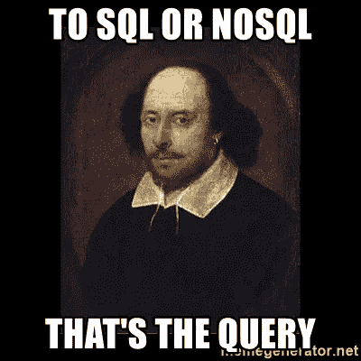
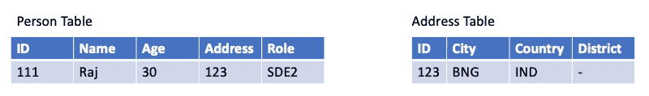
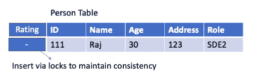

# 何时选择 SQL 和 NoSQL

> 原文：<https://javascript.plainenglish.io/when-to-choose-sql-and-nosql-ef60468bb853?source=collection_archive---------4----------------------->



如果有人问你为什么选择 NoSQL 数据库而不是 SQL，你可以参考下面的建议，这些建议描述了在分布式系统架构中，你应该何时以及为什么选择这样的数据库。这不是两者之间的比较，但最重要的是在您的应用中何时选择一个

# SQL:

主要部分是我们可以与具有相同属性的不同表建立关系，并且可以进行规范化。当您的应用程序需要大量更新和删除记录时，这个数据库非常有用。选择 RDBMS 的理由很少，比如数据一致性(ACID)和读取优化。

## 1.插入是昂贵的



A person table in a SQL database

因此，无论何时在 SQL 数据库中执行插入操作，都需要通过移动指针将数据一个接一个地插入到上面的列中，并且还需要借助连接**将地址表中的数据映射到人员表，这是一个开销很大的操作。**

## 2.模式不容易改变



to insert another column we need to add locks to maintain consistency

假设在上表中，如果您想要插入另一列或类似 rating 的属性，您需要添加一个称为“锁”的东西来保持一致性，这在 SQL 数据库中也是一个开销很大的操作。

## 3.不是为规模而建

大多数 SQL 数据库不是为水平扩展而构建的，扩展 SQL 数据库是很困难的。因此，使用该数据库的大多数用户仍然有一组用户，但不建议在大型分布式系统中使用。

## 4.阅读优化

SQL 数据库是读优化的，这意味着如果你想找到在你的公司工作的不到 30 岁的人的年龄，你只需要移动你的指针到表中的年龄列，然后做一个最小的操作来找到计数。

## 5.数据一致性

数据一致性总是维护者，因为它们给了我们酸性属性。ACID 总是有保证的，这就是为什么交易系统使用这个数据库进行金融交易

## 6.连接很容易构建:

SQL 数据库是为内部连接、外部连接、左外部连接等连接而构建的。如上图所示，两个表之间的关系禁止外键和主键关联。

# NoSQL:

这个数据库系统已经被许多大公司用作他们的主要数据库。数据以 JSON 格式存储，而不是以表格形式存储。每个 JSON 对象都是一个由 ObjectID 作为主键表示的文档。上面的表格模式将在 NoSQL 重写为一个文档，它将包含:

```
{
"key":111,
"name":"Raj",
"age":30,
"address":{
   "city":"BNG",
   "country":"IND"
},
"role:"SDE2"
}
```

## 1.插入更便宜

整行都变成了一个文档，它将保存上面每一列的键绑定。这里，我们将不会与地址表有任何外键关系，而整个地址键对象将只像 JSON 嵌套一样在父对象中保存数据。因为地区列没有数据，所以我们甚至没有存储数据。

因此，当您发送请求或插入数据时，上面的整个 JSON 对象将会在一次插入中被放入数据库。每当你从 NoSQL 拉出一排时，你实际上是拉出了整个物体**,这更便宜。**

## 2.模式很容易改变

```
{
"key":111,
"name":"Raj",
"age":30,
"address":{
   "city":"BNG",
   "country":"IND"
},
"rating:"A"
}
```

在上面的 JSON 文档中，如果您想像在 SQL 中那样插入评级属性，我们可以很容易地插入，而不考虑其他文档。我们可以立即添加。将保持一致性，不需要对文档进行其他更改。

## 3.按比例制造

大多数 NoSQL 数据库都是用水平分区构建的(什么是水平分区？).由于大多数用户希望使用 NoSQL 数据库，他们倾向于扩展他们的应用程序，因此可用性优先于一致性。

## 4.未优化读取

NoSQL 数据库没有经过阅读优化，这意味着如果您想找到在您公司工作的年龄在 30 岁以下的人，数据库会将每个文档返回给您，之后您将需要执行一些昂贵的操作来获取返回值。

## 5.无数据一致性

NoSQL 数据库不保留数据库的 ACID 属性，这就是为什么金融交易是不可能的，因为如果 ACID 和数据的一致性得不到维护，使用它们就没有意义。

## 6.连接很难构建

在 NoSQL 数据库中没有联接的概念，这意味着如果您将两个表中的地址字段相关联，那么您需要转到每个文档并在这两个表中找到地址，然后使用返回的结果合并它们，最终得到您的结果。

谢谢你的阅读！如果您有任何问题，请随时联系 rajrock38@gmail.com，在 [LinkedIn](https://www.linkedin.com/in/rajdeepcoder/) 上与我联系，或者在[media](https://medium.com/@rajrock38)和 [Twitter](https://twitter.com/rajrock38) 上关注我。

如果你觉得这篇文章很有帮助，如果你给它一些掌声，它会有很大的意义👏并分享以帮助他人找到它！请在下面自由发表评论。