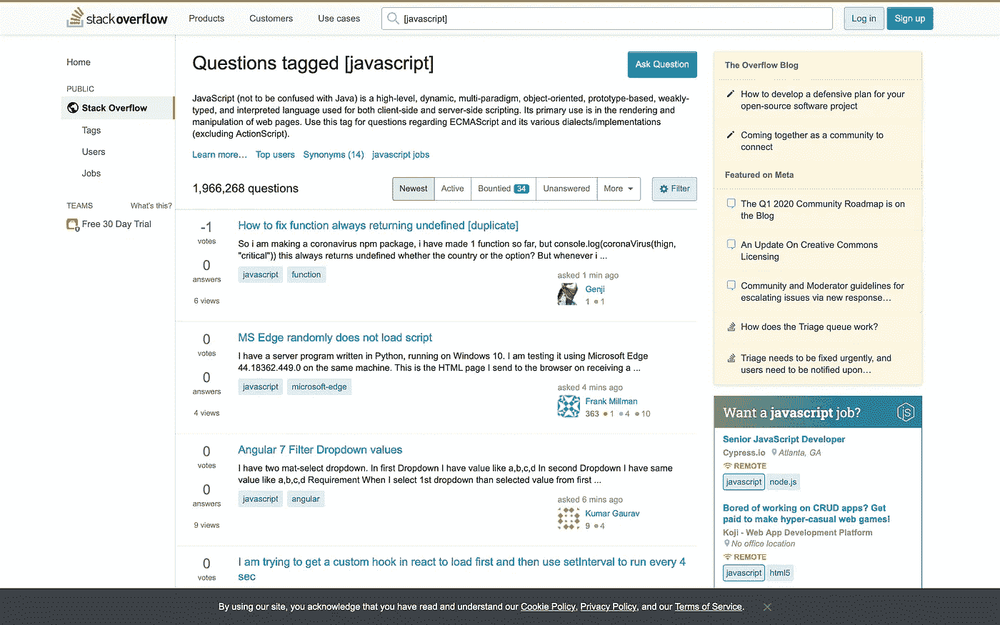
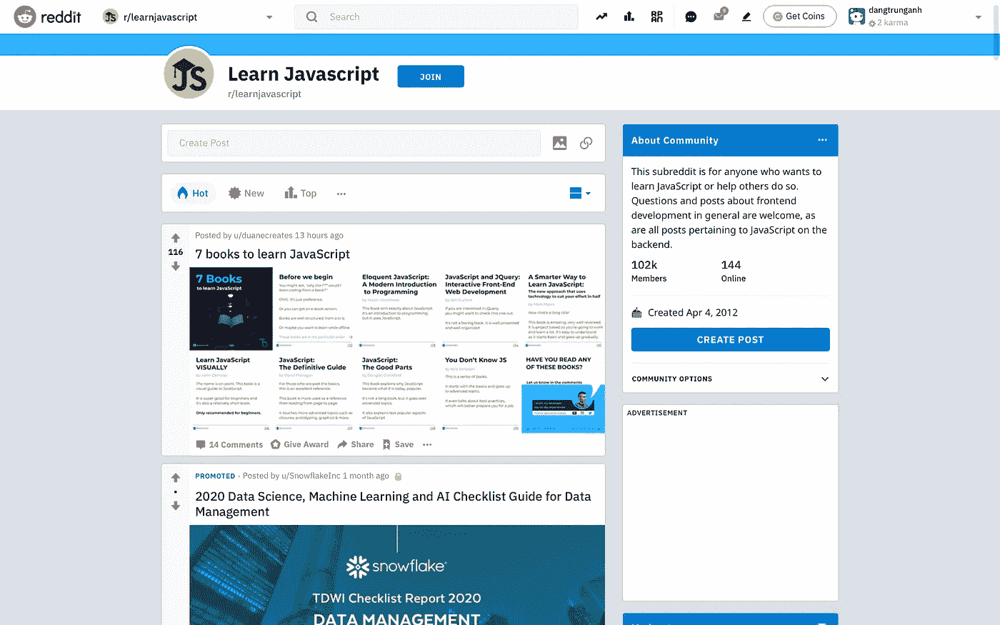
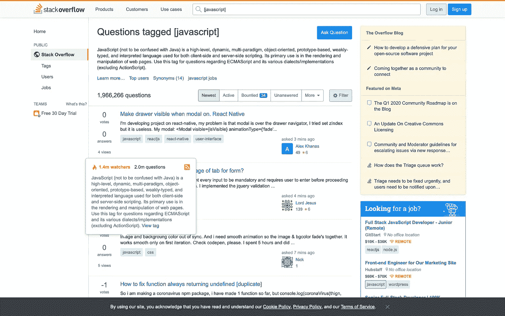
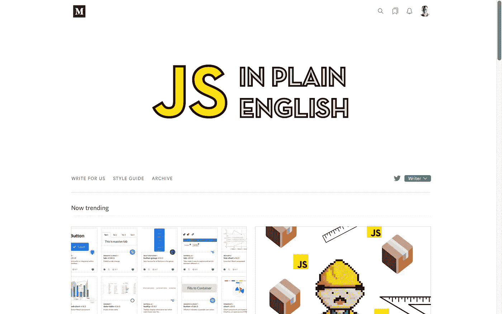

# 在哪里可以找到有用的资源来帮助你学习 JavaScript？

> 原文：<https://javascript.plainenglish.io/where-can-you-find-useful-resources-to-help-you-with-javascript-715b31c32479?source=collection_archive---------6----------------------->

## 互联网上有用学习资源的快速指南

Photo by [nikko macaspac](https://unsplash.com/@nikkotations?utm_source=medium&utm_medium=referral) on [Unsplash](https://unsplash.com?utm_source=medium&utm_medium=referral)

作为初学编码的人，这里有一些你应该收藏的地方。这些地方提供了宝贵的建议、帮助、技巧、提示、修复和一切与 JavaScript 代码相关的东西。

## StackOverFlow

作为互联网上最大的编程社区之一，StackOverFlow 拥有数百万经验丰富和初学的用户，他们随时准备提供帮助和建议。在里面，你可以问关于 JavaScript、脚本、网络和无数其他主题的问题。

在[https://stackoverflow.com/questions/tagged/javascript](https://stackoverflow.com/questions/tagged/javascript)看看吧

## Reddit

许多有经验且严肃的程序员将 Reddit 作为有用信息的来源。里面有许多致力于编码的社区，也有许多编码笑话，那种只有程序员才会知道的笑话。

在 https://www.reddit.com/r/learnjavascript/[了解更多信息](https://www.reddit.com/r/learnjavascript/)

## Quora

Quora 涉及广泛的话题，从谁会赢得大力水手和绿巨人之间的战斗，到如何通过 JavaScript 代码传递工作室密码。登录后，您可以浏览问题，搜索细节并发布您自己的问题。

在 https://www.quora.com/topic/JavaScript-programming-language[查看一下](https://www.quora.com/topic/JavaScript-programming-language)

## 堆叠交换

作为 StackOverFlow 社区网络的一部分，StackExchange 是迄今为止互联网上最大的编程社区。你可以问任何编程的具体问题，并得到专业和方便的回答。

在 https://stackexchange.com[了解更多信息](https://stackexchange.com)

## 代码项目

有文章、讨论、源代码和优秀的社区，CodeProject 当然值得做书签和每天访问。它几乎涵盖了你能想到的每一种编程语言，并且问题能以专业的方式迅速得到解答。

去 https://www.codeproject.com/Tags/Javascript[看看吧](https://www.codeproject.com/Tags/Javascript)

## **用简单英语写的 JavaScript**

简明英语的 JavaScript 包含所有 JavaScript 相关内容的高质量文章，无论是普通的 JS、React、Node、Vue、Svelte、Angular、Webpack、Jest、GraphQL、软件工程等等。

在 https://medium.com/javascript-in-plain-english[了解更多信息](https://medium.com/javascript-in-plain-english)

感谢阅读😘，再见👋，别忘了👏最多 50 次并跟随！