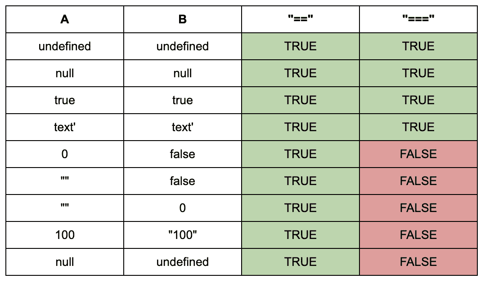

# 我应该在 JavaScript 比较中使用哪个等号运算符？(== vs ===)

> 原文：<https://javascript.plainenglish.io/which-equals-operator-should-i-use-in-javascript-comparisons-vs-c3bc44960518?source=collection_archive---------5----------------------->

## 在 JavaScript == vs ===中比较东西，应该用哪个？


Photo by [Charles “Duck” Unitas](https://unsplash.com/@unitasphotography?utm_source=unsplash&utm_medium=referral&utm_content=creditCopyText) on [Unsplash](https://unsplash.com/s/photos/equals?utm_source=unsplash&utm_medium=referral&utm_content=creditCopyText)

如果`===`不等于`==`那么它等于什么？？？

啊？

[huh? — Giphy](https://giphy.com/)

## 我们来分解一下

首先，让我们定义两个运算符:

*   `===`被称为严格的等式算子
*   `==`是抽象的等式运算符

它们的行为是一样的，因为它们都返回一个布尔值，告诉我们两个表达式是否相等。

```
A === B // returns true or false
Y == Z  // also returns true or false
```

不同之处在于严格相等运算符(===)不进行类型转换(也称为类型强制)。

```
1 == "1" // returns true1 === "1" // returns false as the type is not equal
```

这意味着，要使两个表达式相等，它们必须都是等效值和相同的类型。

*注意:同样适用于不等式检查，* `*!=*` *有严格的等式对应* `*!==*` *。*

## 让我们看一些例子

这在现实中意味着什么？



Examples of equality operator results, feel free to try them out in your browser console!

前四个例子看起来并没有太大的不同。在每一种情况下，我们都在比较相同类型的变量。

这满足了严格相等运算符(===)的条件，其中两个值相等且属于同一类型。

当我们开始比较不同类型的变量时，就变得有趣了。让我们以这个例子为例，比较 0(一个数字)和 false(一个布尔值):

```
0 == false   // This will return true
0 === false  // This will return false 
```

这里，**抽象等式操作符(==)** 可以将两个变量转换成相同的类型，然后检查它们的相等性。

因为 0 等同于 false，所以当转换为布尔值时，等式的两边是相等的。

然而，我们的**严格相等运算符(===)** 不进行类型转换，并确定 Number 不等于 Boolean，因此等式的两边不相等。

这不仅适用于布尔值，正如你在表格中看到的，`100`(一个数字)和`"100"`(一个字符串)被**抽象相等运算符(==)** 归类为相等，而不是被**严格相等运算符(===)** 归类为相等。

## 那么我应该在代码中使用哪一个呢？？

在我看来，以及许多其他更有经验的人看来，最好还是使用**严格的等式运算符(===)。**

它是如何工作的非常清楚，不需要你记住很多疯狂的边缘案例。

抽象的等式操作符(==) 并不总是如你所愿，除非你完全理解所有可能的结果，并且有一些非常古怪的结果。

引用《JavaScript:精彩部分》作者道格拉斯·克洛克福特的话:

> JavaScript 有两组相等运算符:`===`和`!==`，以及它们邪恶的双胞胎`==`和`!=`。好的以你期望的方式工作。如果两个操作数类型相同，值相同，那么`===`产生`true`，而`!==`产生`false`。当操作数属于同一类型时，邪恶的双胞胎会做正确的事情，但是如果它们属于不同类型，他们会试图强制值。他们这样做的规则是复杂的，不可记忆的。

最后，如果您发现自己处于对变量的类型相等性没有信心的情况下，那么它可以帮助您显式地首先强制/转换类型。

例如，假设您正在检查两个数字是否相等，但其中一个可能是字符串或数字类型，请强制自己对其值进行编号:

```
const someValue = VariableA === Number(VariableB)
```

## 参考资料:

*   道格拉斯·克洛克福特的《JavaScript:精彩部分》
*   [JavaScript 等式表](https://dorey.github.io/JavaScript-Equality-Table/)由 [dorey](https://github.com/dorey)
*   [堆栈溢出](https://stackoverflow.com/questions/359494/which-equals-operator-vs-should-be-used-in-javascript-comparisons)一如既往…

## 其他文章:

[](https://medium.com/javascript-in-plain-english/how-to-remove-an-element-from-an-array-in-javascript-54612785295e) [## 如何在 JavaScript 中从数组中移除元素

### 在 JavaScript 中从数组中快速移除元素的两种方法

medium.com](https://medium.com/javascript-in-plain-english/how-to-remove-an-element-from-an-array-in-javascript-54612785295e) [](https://medium.com/@kitson.broadhurst/quickly-set-up-a-theme-in-material-ui-and-access-it-in-your-components-ba0565304887) [## 在 Material-UI 中快速设置一个主题，并在组件中访问它

### 向您的 React 应用程序添加可定制的材质用户界面主题

medium.com](https://medium.com/@kitson.broadhurst/quickly-set-up-a-theme-in-material-ui-and-access-it-in-your-components-ba0565304887)