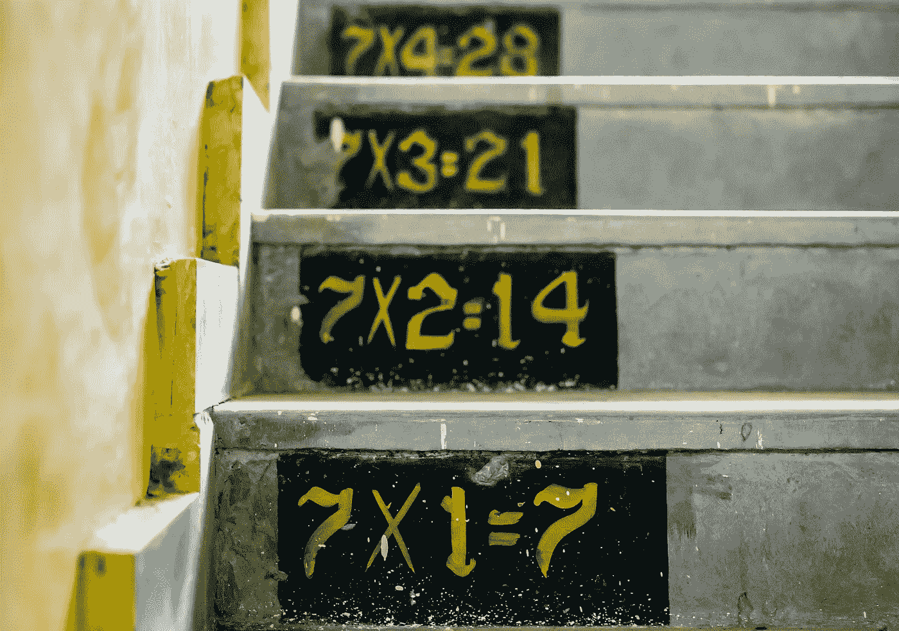
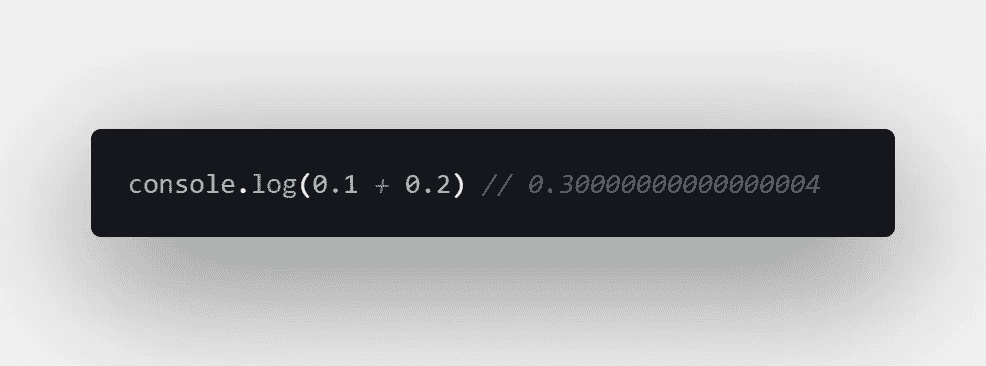
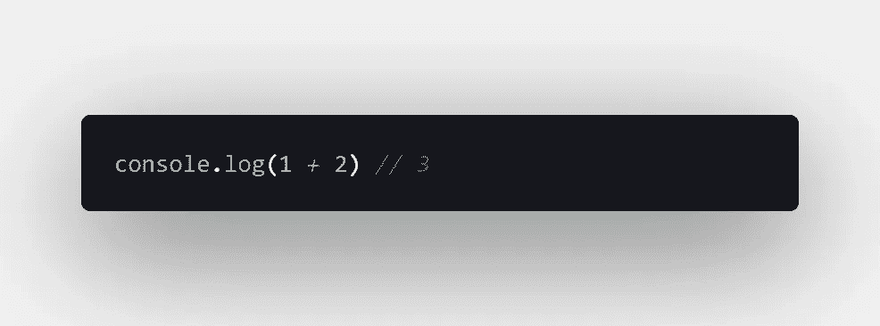
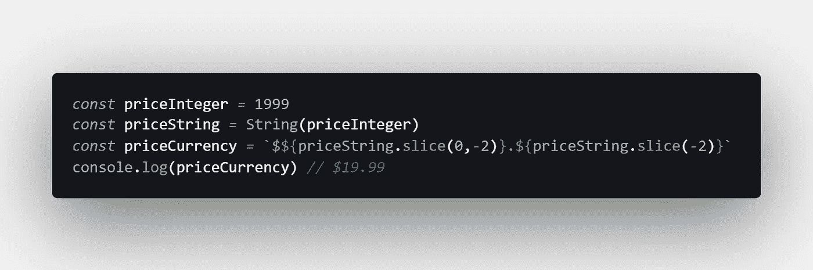
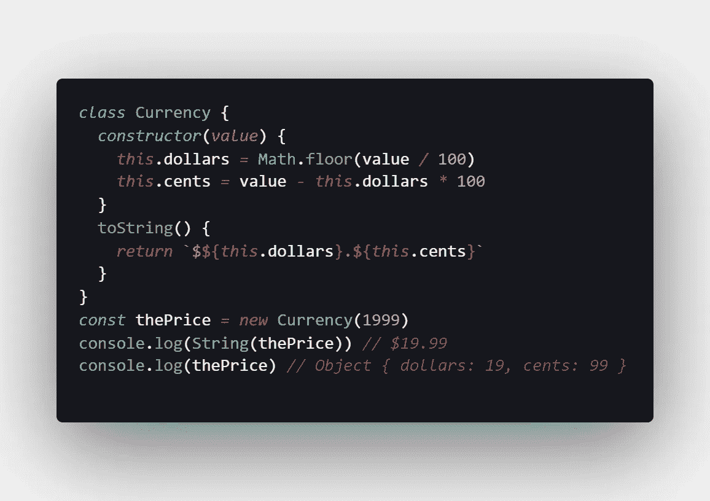
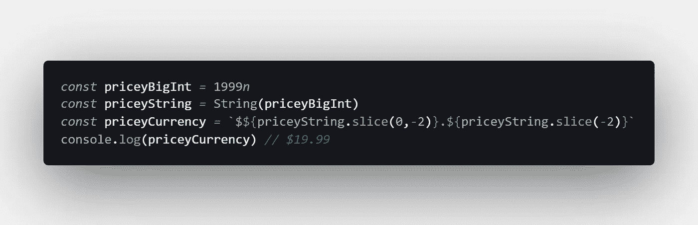

# JavaScript 中为什么 0.1 + 0.2 ≠ 0.3

> 原文：<https://javascript.plainenglish.io/why-0-1-0-2-0-3-in-javascript-d7e218224a72?source=collection_archive---------0----------------------->

## `.1 + .2 === 0.30000000000000004 // true`

## JavaScript 浮点数学有时有点偏离。下面是为什么 0.1 + 0.2 ≠ 0.3 以及如果需要精度可以怎么做。

Photo by [Gayatri Malhotra](https://unsplash.com/@gmalhotra?utm_source=medium&utm_medium=referral) on [Unsplash](https://unsplash.com?utm_source=medium&utm_medium=referral)

如果 1 + 2 = 3，那么 JavaScript 中的 0.1 + 0.2 为什么不= 0.3？答案与计算机科学和浮点数学有关。

如果你从未这样做过，我建议你打开浏览器的控制台，输入`0.1 + 0.2`来查看结果。

不，你不需要调整你的浏览器——根据定义 JavaScript 编程语言的 ECMAScript 标准,这实际上是它应该如何工作的:

> “数字类型正好有 18437736874454810627(即 2^64 - 2^53 + 3)值，表示 IEEE 二进制浮点运算标准中规定的双精度 64 位格式 IEEE 754 值”“ [ECMAScript 语言规范](https://www.ecma-international.org/ecma-262/5.1/#sec-8.5)

JavaScript 使用 [number 原语类型](https://developer.mozilla.org/en-US/docs/Web/JavaScript/Data_structures#Number_type)表示数值，所有 JavaScript 数字实际上都是[浮点](https://www.kidscodecs.com/floating-point-numbers/)值——甚至是整数。

这里的关键点是 JavaScript 实现了浮点运算的 IEEE 标准。让我们看看这是什么意思。

# 这是怎么回事？

> “你的语言没坏，是在做浮点数学。计算机本身只能存储整数，所以它们需要某种方式来表示十进制数。这种表述并不完全准确。这就是为什么，通常情况下，`0.1 + 0.2 != 0.3`— [埃里克·威芬](https://medium.com/u/a2ac2bff6025?source=post_page-----d7e218224a72--------------------------------)在[0.30000000000000004.com](https://0.30000000000000004.com/)

你可能已经熟悉了这样一个事实:在使用计算机时，所有的数字都是二进制的。

在二进制中，值在[基数 2](https://www.mathsisfun.com/definitions/base-numbers-.html) 中表示为一系列 0 和 1，而不是我们通常使用的熟悉的[基数 10](https://www.mathsisfun.com/definitions/base-numbers-.html) 十进制数。

我们得到浮点舍入误差的原因很有趣，它与[循环小数](https://www.mathsisfun.com/definitions/recurring-decimal.html)的概念有关。

分数只能“干净地”存储在作为基数的[质因数](https://www.mathsisfun.com/prime-factorization.html)的[分母](https://www.mathsisfun.com/definitions/denominator.html)中(即没有重复小数的精确值)。

以 10 为基数的质因数是 2 和 5，所以 1/2、1/4、1/5、1/8 & 1/10 可以表达得很干净，但 1/3、1/6、1/7 & 1/9 是循环小数。

以 2 为底数的质因数只有 2，所以只有 1/2 可以清晰地表示出来——其他任何值都变成了重复的小数。

这意味着当我们使用以 10 为基数的十进制数时，比如 0.1 (1/10)，它可以用十进制中的一个位数来表示，但不能用二进制来表示。

唯一能用二进制清晰表达的分数是 0.5 (1/2)。使用 [IEEE-754 浮点转换器](https://www.h-schmidt.net/FloatConverter/IEEE754.html)亲自尝试一下。

# 浮点运算也比较慢

一般来说，浮点在 JavaScript 中的行为不同于整数。例如，在`for`循环中，它们速度较慢。

让我们看两个使用 [jsPerf](https://jsperf.com/) 测试微性能的测试案例:

[View these test cases](https://jsperf.com/floating-point-for-loops-in-javascript) at jsPerf.com

虽然没有很大的区别，但浮点运算平均比使用整数值的基本 for 循环要慢一点。

正如上一节所解释的，这是因为以二进制存储浮点数会增加复杂性。

当然，在您的代码库中没有足够大的差异，但这是 JavaScript 的一个有趣的怪癖。

# 如果你需要准确性呢？

如果您需要 JavaScript 的准确性，比如在处理金融交易时，那么您最好使用整数。

虽然所有的 JavaScript 数字都在内部表示为浮点值，但是在处理整数值时，您不会遇到不准确的情况，至少只要您使用 [MAX_SAFE_INTEGER](https://developer.mozilla.org/en-US/docs/Web/JavaScript/Reference/Global_Objects/Number/MAX_SAFE_INTEGER) ( `2^53 - 1`):

一种方法是只以美分为单位进行计算，例如，将值$19.99 表示为整数 1999。

[View the raw code](https://gist.github.com/djD-REK/682e1bd141de411d45a2b5407b6f324c) as a GitHub Gist

另一种方法是创建一个对象来表示货币，并在幕后使用整数值。例如:

[View the raw code](https://gist.github.com/djD-REK/e9cd9b9ae511d8546754d0190f36718c) as a GitHub Gist

许多库已经用更健壮的方式解决了这个问题，包括 [accounting.js](http://openexchangerates.github.io/accounting.js/) 、 [currency.js](https://currency.js.org/) 、 [money.js](http://openexchangerates.github.io/money.js/) 和[numeric . js](http://numeraljs.com/)。

最后，您可以考虑使用 [BigInt](https://developer.mozilla.org/en-US/docs/Web/JavaScript/Reference/Global_Objects/BigInt) 原始类型，它可以表示任意大的整数(但不是浮点值):

[View the raw code](https://gist.github.com/djD-REK/d898874e54453dea98b2d403c6e34dbe) as a GitHub Gist

[TypeScript 还支持 BigInts](https://www.typescriptlang.org/docs/handbook/release-notes/typescript-3-2.html#bigint) ，因此在 TypeScript 中使用 BigInts 可能是避免意外使用浮点数据的一个好选择。

# 结论

我非常惊讶地得知，由于浮点数学的原因，0.1 + 0.2 在 JavaScript 中实际上应该等于 0.3000000000000004。

这似乎是一个等待发生的错误，但没有明确的解决方法，因为 ECMAScript 规范要求 0.1 + 0.2 ≠ 0.3。

令人欣慰的是，整数数学避免了那些讨厌的舍入误差，所以使用 [JavaScript 数字](https://medium.com/javascript-in-plain-english/how-to-check-for-a-number-in-javascript-8d9024708153)实现准确性是可能的——如果你坚持整数的话。

为了达到任意精度，或者确保永远不会有十进制值，可以考虑使用 JavaScript 的新的 [BigInt](https://medium.com/better-programming/using-javascript-bigint-to-represent-large-numbers-d1ad9f6e0079) 原语类型。

你可能还会发现[精确数学](https://github.com/devrafalko/exact-math)或[数学. js](https://mathjs.org/docs/datatypes/bignumbers.html) 库很有帮助。两者都是为了使用 JavaScript 执行精确的计算。

编码快乐！📏🖥️📐⌨️😄

# 进一步阅读

*   我在上面的货币例子中使用了`String.prototype.slice()`方法。如需解释，请阅读我的文章[在黎明编码](https://medium.com/coding-at-dawn/how-to-select-a-range-from-a-string-a-substring-in-javascript-1ba611e7fc1):

 [## 如何在 JavaScript 中从字符串(子串)中选择范围

### 这里没有捷径可走。要获得子串，使用内置方法 string . prototype . substring(startIndex…

medium.com](https://medium.com/coding-at-dawn/how-to-select-a-range-from-a-string-a-substring-in-javascript-1ba611e7fc1) 

*   [Chewxy](https://medium.com/u/5a679f15f94?source=post_page-----d7e218224a72--------------------------------) 会在 ModernWeb 上教你到底什么是[:](https://modernweb.com/what-every-javascript-developer-should-know-about-floating-points/)

 [## 每个 JavaScript 开发人员应该知道的关于浮点的知识

### 前端开发“每个 JavaScript 开发人员都应该知道的关于浮点在 JavaScript 中的某一点…

modernweb.com](https://modernweb.com/what-every-javascript-developer-should-know-about-floating-points/) 

*   [John V. Petersen](https://medium.com/u/ae3cc20bf644?source=post_page-----d7e218224a72--------------------------------) 在 CODE Magazine 中将 JS 与其他语言[进行比较:](https://www.codemag.com/Article/1811041/JavaScript-Corner-Math-and-the-Pitfalls-of-Floating-Point-Numbers)

 [## JavaScript 角:数学和浮点数的陷阱

### JavaScript 不处理类似 C，C#，VB，Ruby，Python 等的数学函数。，因为 JavaScript 支持一个…

www.codemag.com](https://www.codemag.com/Article/1811041/JavaScript-Corner-Math-and-the-Pitfalls-of-Floating-Point-Numbers) 

*   [塞巴斯蒂安·马鲁奇](https://medium.com/u/659f47157a70?source=post_page-----d7e218224a72--------------------------------)在 AVIO 咨询博客上调查了这个问题[:](https://www.avioconsulting.com/blog/overcoming-javascript-numeric-precision-issues)

 [## 克服 Javascript 数字精度问题

### 在 Javascript 中，所有数字都被编码为双精度浮点数，遵循国际 IEEE 754…

www.avioconsulting.com](https://www.avioconsulting.com/blog/overcoming-javascript-numeric-precision-issues) 

*   萨拉·费卡杜在她的博客上分享了她的个人经历[:](https://medium.com/@sarafecadu/64-bit-floating-point-a-javascript-story-fa6aad266665)

 [## 64 位浮点:一个 JavaScript 故事

### 您有兴趣了解什么是 64 位浮点以及它如何影响您的 JavaScript 代码吗？在这篇文章中…

medium.com](https://medium.com/@sarafecadu/64-bit-floating-point-a-javascript-story-fa6aad266665) 

*   [Max Koretskyi](https://medium.com/u/bd29063a4857?source=post_page-----d7e218224a72--------------------------------) 在一篇文章[中对这个问题进行了深入探讨:](https://indepth.dev/here-is-what-you-need-to-know-about-javascripts-number-type/)

 [## 以下是您需要了解的 JavaScript 的数字类型

### 在这篇文章中，我将详细回答这个问题:为什么 0.1+0.2 不等于 0.3，而 9007199254740992 是…

深度开发](https://indepth.dev/here-is-what-you-need-to-know-about-javascripts-number-type/) 

*   Henri Wijaya 在他的博客 Bashooka 上有一个很棒的助手库列表[:](https://bashooka.com/coding/javascript-libraries-for-formatting-number-currency-time-date/)

 [## 15 个用于格式化数字、货币、时间和日期的 Javascript 库——ba shuoka

### JavaScript 提供了许多从简单到复杂的选项，允许您将数字格式化和显示为…

bashooka.com](https://bashooka.com/coding/javascript-libraries-for-formatting-number-currency-time-date/) 

[德里克·奥斯汀博士](https://www.linkedin.com/in/derek-austin/)是《职业规划:如何在 6 个月内成为一名成功的 6 位数程序员 一书的作者，该书现已在亚马逊上架。