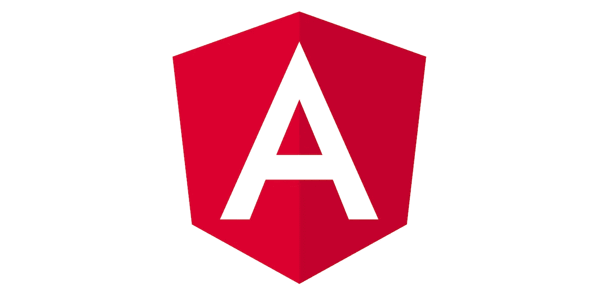

# 为什么 Angular 会是你下一个项目的好搭档

> 原文：<https://javascript.plainenglish.io/why-angular-might-be-the-best-match-for-your-next-project-8163e111cb29?source=collection_archive---------13----------------------->

Giphy

如果你是一名前端开发人员，或者是一名经验丰富的工程师，Angular 可能是你应该考虑的网站开发工具。它对某些种类的项目非常有用。如果你是一名开发人员，你还不太了解 Angular，现在可能是你学习的时候了。

# 为什么要用 Angular？

如果你想知道 Angular 是用来做什么的，那么这篇文章应该可以帮助你。Angular 能够保持其受欢迎程度的部分原因是，作为一个前端工具，它拥有一些您可能会找到的最健壮的组件。

作为开发人员，您可以使用它来编写可读、可维护且易于使用的代码。

然而，尽管 Angular 有这么多优点，你应该明白有时候这个工具对你来说是一种伤害，而不是一种财富。这篇文章是对 Angular 的简单介绍。我们将讨论它的一些优点和缺点，并回顾它的一些更实际的用途。

# 流行的角度应用

因为 Angular 是最流行的软件开发技术之一，所以有很多著名的公司都用它来构建他们的应用程序。

PayPal 就是一个用 Angular 构建的网络应用的例子。PayPal 是一个个人可以通过它在网上互相汇款的系统。而 PayPal 从这些交易中收取象征性的费用来赚钱。

然后，有向上的工作。Upwork 是一个面向自由职业者的招聘平台。Upwork 通过从正在招聘的人和那些希望被聘用的人身上收取佣金来赚钱。

用 Angular 2 制作的应用程序的另一个例子是网飞。网飞是一种订阅服务，付费用户可以获得大量电影、节目和原创内容。

# 角形版本概述

什么是有角？它是一个 web 开发平台，有时也被称为 Angular 2+。它是一个内置的打字稿。它为开发人员提供了几个创建 web 应用程序客户端的工具。

它于 2010 年发布，原名 AngularJS。它是一个 JavaScript 框架，最初是为构建单页面应用程序而创建的。

温泉浴场的受欢迎程度迅速增长。与此同时，AngularJS 框架的恶名也随之而来。不过，最终还是出现了新的工具，比如 React 和 Vue。这些提供了更广泛的功能。他们的成功让 Angular 团队开始考虑改进产品的方法。

2016 年，谷歌推出了全新的、完全重写的 Angular 版本。有一些新特性，比如基于 MAJOR.MINOR. PATCH 方案的语义版本控制。这是一个命令行界面，或 CLI，和一个完全基于组件的架构。真正的缺点是这个版本与之前的版本完全不同，并且它不是向后兼容的。如果开发人员想在他们的项目中使用 Angular 而不是 AngularJS，他们必须重写所有的代码。

下一个版本是 Angular 4。它于 2017 年 3 月上市。这个版本提供了更快的编译速度、更小的代码量和更好的错误修复提醒。此外，它还向后兼容 Angular 2。几个月后，Angular 团队发布了 Angular 的另一个版本，这个版本有构建优化器、依赖性管理更新和改进的编译器。

Angular 6 于 2018 年 5 月发布。它引入了新的 CLI 命令、Ivy 渲染器和 Angular 元素。它还具有 Bazil 编译器特性、ngModelChange 和服务器工人支持。

Angular 7 是 2018 年 10 月份出来的。一些值得注意的特性包括现代化的 CLI 提示符、更好的虚拟滚动、拖放功能和新的 Angular 编译器特性。这是 Angular web framework 的版本，在此之前，它比其他任何版本都更先进。

# 为什么要用 Angular？

如果您现在想知道为什么使用 Angular 对您的下一个项目有意义，那么最新版本中的几个特性可能会引起您的注意。什么是角发育？这是一项发展，让您可以访问以下所有内容。

*   **详细文档**

[Angular 网站文档](https://angular.io/docs)以直观明了的方式详细介绍。用 Angular 构建的网站是以一种许多开发人员容易理解的格式布局的。

*   **谷歌支持**

因为谷歌支持 Angular，如果你在这方面有困难，你可以向他们寻求支持。在这方面有很多资源可以帮助你。Angular development 在搜索引擎巨头的支持下感觉很安全。

*   **庞大的第三方组件生态系统**

第三方软件组件是可重用的。它由原始平台创建者之外的实体出售或分发。因为 Angular 已经存在了十年，所以有许多有用的第三方组件与之对应。

*   **基于组件的架构**

Pexels

基于组件的架构意味着 Angular 是以这样一种方式建立的，即关于系统的广泛功能的关注点是分离的。换句话说，网络的每个方面都有其独特的属性。这使得开发人员在任何给定时间设置和理解各种功能变得更加容易。例如，您可以轻松地与 Angular 中的其他组件共享组件日期。

*   CLI

CLI 是指命令行界面。这是一种通过文本行处理计算机程序命令的方式。这是现存的建立网站的更全面的形式之一。

*   **角形元素**

角度元素是封装为自定义元素的元件。有了它们，你可以用一种框架无关的方式定义 HTML 元素。这些棱角分明的技术是它能够保持流行的主要原因。

*   **常春藤渲染器**

Ivy 是专门为 Angular 开发的渲染管道和视图引擎。视图引擎获取已经编写好的组件和模板，并将它们翻译成常规的 JS 和 HTML。

*   **角状材料**

这是一个为使用 Angular 的开发人员构建的 UI 组件库。它可以帮助你的网站看起来有吸引力，功能一致。这里有一个关于如何在基于角度的应用程序中使用角度材料开始[的练习。](https://medium.com/javascript-in-plain-english/dynamic-tab-based-application-using-angular-material-9f9da7de5732)

*   **依赖注入**

这是一种技术，其中一个对象提供不同对象的依赖性。客户端可以使用它来获得关于他们应该使用什么服务的信息。

*   **角度通用**

这是一个在 Node.js 上将您的应用程序在服务器端呈现为 HTML 的过程。同样，这是为了在您设置站点并准备投入使用时易于兼容。

当然，了解 Angular 之后，你可以期望得到比一般前端开发人员更高的薪水。

# 角度 Cons

使用 Angular 也有一些缺点。下面是一些比较明显的例子。

*   **难学**

有些开发者觉得 Angular 很难学。尽管我们在上一节中提到了许多工具，但其他 web 开发平台似乎更加用户友好。

Giphy

*   **SEO 选项差**

Angular 和 SEO 的问题是，没有新的页面加载通常意味着在浏览器中可见的 URL 不能反映屏幕上的内容。这个问题的原因是，像谷歌这样的搜索引擎总是想索引那些他们认为在已知地址持续存在的内容。

*   **向后兼容的困难**

向后兼容性是一个早期版本的 Angular 可以被覆盖的能力，这样它就可以适应新版本的新工具和流程。尽管许多平台都考虑到了这一点，Angular 在这方面做得并不出色。

*   **时间消耗**

一些开发者也觉得用 Angular 建立一个网站比用 Vue 或 React 等选项花费更多的时间。如果你时间紧迫，你可能会因为这个原因而选择逃避。

# 何时使用角度

AngularJS 有什么好处？嗯，有一些项目比其他项目更适合这个平台。这是一个可行的选择。

*   **企业网络应用**

企业 web 应用程序允许您记录和管理企业或组织的外部和内部运营。设置一个是很好的，因为设置一个可以节省你很多时间。Angular JavaScript 框架是专为适应这类应用而建立的。

*   **具有动态内容的应用**

应用程序上的动态内容是不断变化的内容，而不是一成不变的静态内容。与企业 web 应用程序一样，如果您知道应用程序上的内容会频繁变化，Angular web 开发是一个不错的选择。

*   **渐进式网络应用(pwa)**

渐进式 web 应用程序是使用标准编程语言构建的，如 HTML、CSS 和 JS。随着平台新版本的出现，将 Angular 编程语言转换成这些语言是一个特别关注的领域。这种简单的转换并不总是你从它的竞争对手那里得到的。

# 什么时候不需要棱角？

如果你正在考虑什么时候使用 AngularJS，你也应该知道在某些情况下应该避免使用它。这是其中的一些。

*   **包含静态内容的轻量级网站**

静态内容的轻量级网站恰恰与 Angular 的优势相反。相反，你应该把重点放在有大量编码的网站上，这些网站将会提供动态内容。

*   **SEO 优化网站**

由于我们在上一节提到的原因，如果你专注于站点 SEO，Angular 是一个糟糕的选择。角度设置不能很好地与搜索引擎交互。

*   **短期项目**

Angular 是一个围绕站点持久性的概念构建的平台。如果你需要为一个特定的目的创建一个短期网站，比如宣布一个弹出式销售，那么你当然应该选择另一种方式。

*   **采用微服务设计方法的应用**

微服务架构风格是指开发一套较小的服务，共同组成一个应用程序。每个都有自己的流程。这些应用程序有它们的用途，但如果这是你的意图，Angular 不会是最好的选择。

# 包扎

现在，你知道为什么开始使用 Angular 和什么时候开始使用 Angular 这个问题的答案了。在某些情况下，当你想到一个新的应用程序时，这是非常好的，但它并不适用于所有的应用程序。因此，在你决定是否在 Angular 上构建你的应用之前，提前了解所有这些是值得的。

无论如何，拥有 Angular 的技能和经验使你成为真正受欢迎的前端开发人员。想到这个就开始用！

## **用简单英语写的 JavaScript 笔记**

我们已经推出了三种新的出版物！请关注我们的新出版物: [**AI in Plain English**](https://medium.com/ai-in-plain-english) ，[**UX in Plain English**](https://medium.com/ux-in-plain-english)，[**Python in Plain English**](https://medium.com/python-in-plain-english)**——谢谢，继续学习！**

**我们也一直有兴趣帮助推广高质量的内容。如果您有一篇文章想要提交给我们的任何出版物，请发送电子邮件至[**submissions @ plain English . io**](mailto:submissions@plainenglish.io)**，使用您的 Medium 用户名，我们会将您添加为作者。另外，请让我们知道您想加入哪个/哪些出版物。****