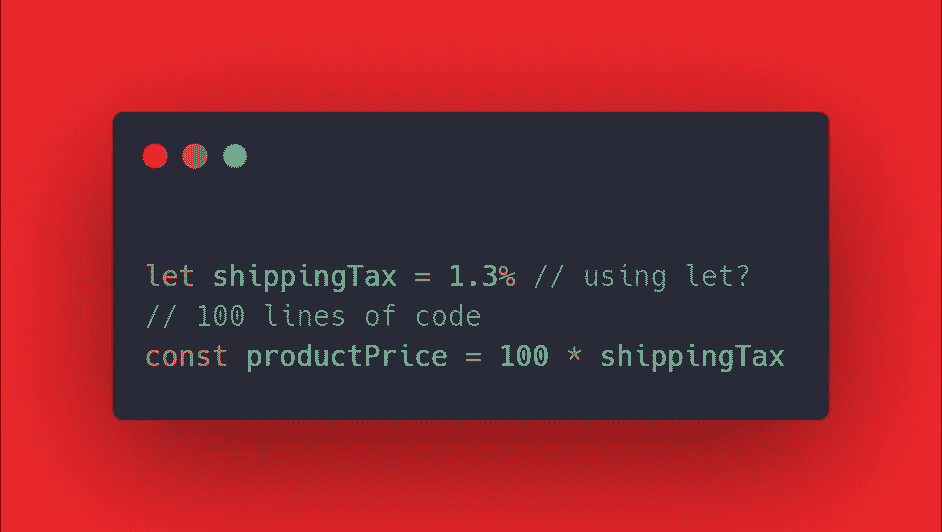
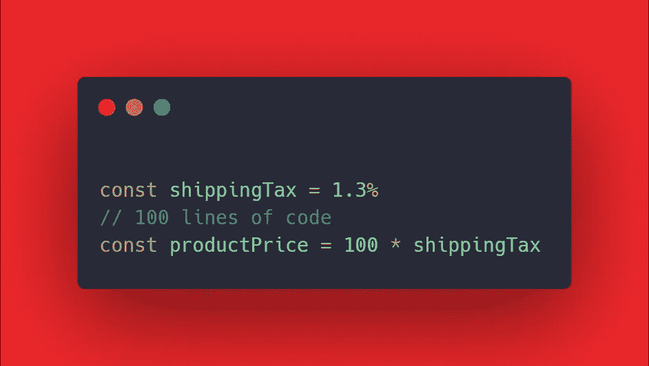

# 为什么“常量”变量需要成为 JavaScript 中的默认选择

> 原文：<https://javascript.plainenglish.io/why-const-variables-need-to-be-your-default-choice-in-javascript-b9fb4a592688?source=collection_archive---------4----------------------->

## 扭转你对变量的看法

在后 [ECMAScript 6](https://www.w3schools.com/js/js_es6.asp) 时代，你可能已经把用`let`或`const`定义的变量概念硬植入了你的大脑。然而，多年过去了，你仍然可以更好地利用这些坚实的语言特性。

> 比如:你在定义你的变量的时候，有没有明确定义过你在这两个关键词之间的默认选项？

你应该真正关心这个问题。因为思考和改进可以让你的代码更加易读。

一般来说，决定使用`const`还是`let`的过程通过一个简单的问题:*“这个变量会随时间变化吗？”。*如果答案是“是”，那么`let`就是选择。否则，您要处理的是一个常量，因此`const`将完成这个任务。

然而，在定义变量时，你可能会认为这种分离并不相关。毕竟，如果你确定你不会修改这个`let`变量，为什么还要麻烦呢？但是实际上，`const`有一个很好的理由表明它是变量的最佳默认选项。

考虑下面的例子:

我知道，100 行代码不应该出现在这么长的代码块中。但是这个摘录只是给你提供一个例子。也许，在定义`shippingTax`时，你会想:“*谁在乎呢，我不会修改它，在这种情况下我会用‘let’*”。但是想想你在定义一个变量的时候想要表达什么。一个清晰的变量名总是可以通过明智的选择`let`或`const`得到改善。通过在这里使用`let`，你说的是:

> 这是我的变量，它有这个名字，因为它有'`let’`,它会随着时间而改变。

因此，你的代码的读者将被迫阅读这 100 行代码，以便在计算`productPrice`之前理解`shippingTax`**所经历的操作。其他税呢？也许在业务逻辑中为用户提供一些折扣？如果没有，而你只是随便用了`let`呢？**

> “‘const’作为变量的默认值是最好的选择。如果这是你想要的，它不仅会阻止价值被重新分配。它会更好地表达它的目的”。

假设您这样写了上面的例子:

你在这里说的要清楚得多。通过使用`const`定义`shippingTax`，您不仅可以安全地防止它被更改，还可以让代码的读者很容易跳过这些行，并确信当`productPrice`被计算出来时会发生什么。**该变量**无意外操作或变更。当你阅读大量的代码时，你会非常感激这一点。让我们不要忘记未来的你，一年后回到代码中的你，或者仅仅是你的同事。

## 结论

本文的重点是向您展示`const`在定义变量时应该如何选择，除非它们必须被修改。它不仅提供了一种安全的方法来防止它们被改变。但这是一个引人注目的清晰方法，可以减轻代码读者的负担，让代码更容易理解。

— *Piero*