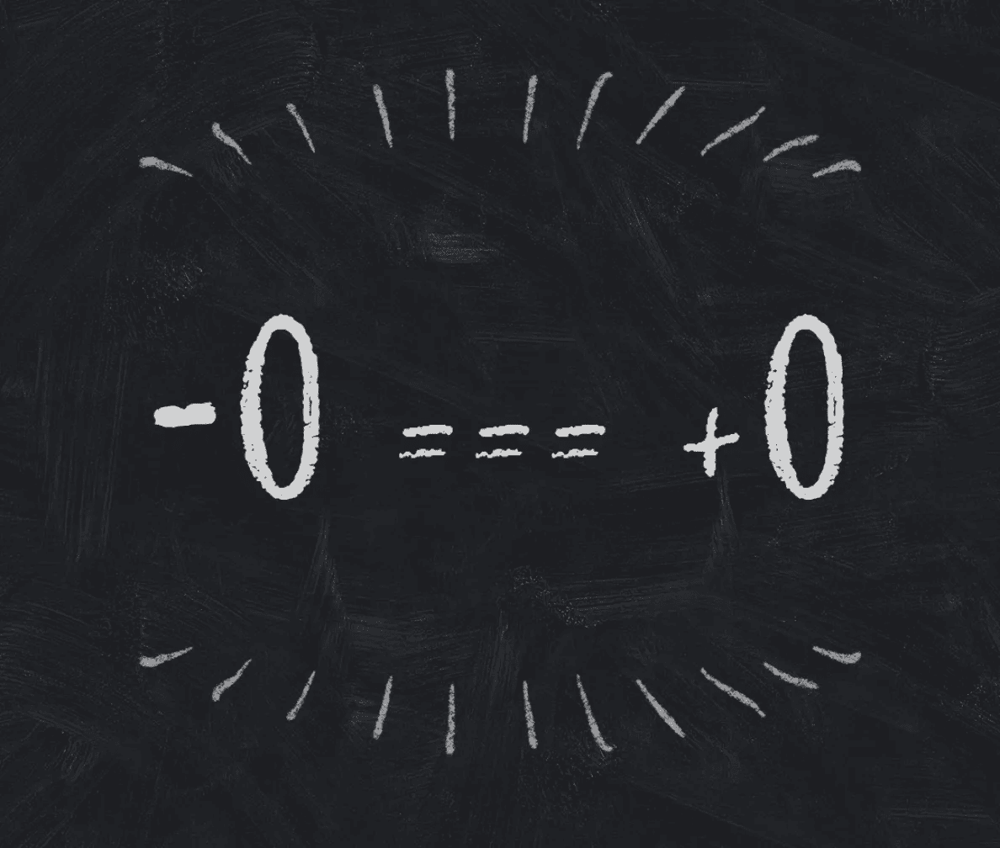

# 为什么 JavaScript 有-0？

> 原文：<https://javascript.plainenglish.io/why-does-javascript-have-0-9b6e1965a075?source=collection_archive---------3----------------------->

## JavaScript 有两个零:-0 和+0。他们在某种程度上既相同又不同。



Using strict equality comparison, -0 and +0 are equal

# 两个零的故事

自从 JavaScript 的早期版本以来，一直有两种方式来执行[相等比较](https://developer.mozilla.org/en-US/docs/Web/JavaScript/Equality_comparisons_and_sameness):

*   使用`==`的抽象相等比较，又名“双相等”
*   使用`===`即“三重相等”进行严格的相等比较

ES6 以`[Object.is](https://developer.mozilla.org/en-US/docs/Web/JavaScript/Reference/Global_Objects/Object/is)`方法的形式提供了第三种选择。它有一些细微的差别，暗示着你甚至不知道你有问题。例如，你如何区分 JavaScript 的两个零？

也许更好的问题是，JavaScript 有两个零？为什么 JavaScript 有两个零？为什么任何语言都有两个零？

其名称为[带符号零](https://en.wikipedia.org/wiki/Signed_zero)。原来 JavaScript 有`-0`的原因是因为它是 [IEEE 754](https://en.wikipedia.org/wiki/IEEE_754) 浮点规范的一部分。两个零也出现在其他语言中，比如 Ruby。

这两个零是:

*   正零`+0`
*   负零`-0`

正如人们所料，上述两种等式比较方法都将它们视为“相同的”。毕竟零就是零。

```
-0 == +0   // true
-0 === +0  // true
```

这就是`Object.is`的用武之地。它将两个零视为不相等。

```
Object.is(+0, -0)  // false
```

在 ES6 之前，仍然可以区分这两个零。看看其他运营商的结果就知道了。

```
-0 > +0  // false
+0 > -0  // false
-0 + -0  // -0
-0 + +0  // +0
+0 + +0  // +0
+1 / -0  // -Infinity
+1 / +0  // +Infinity
```

最后两个操作特别有用。不像 Ruby 或 Python 那样除以零得到一个`ZeroDivisionError`，JavaScript 返回`[Infinity](https://developer.mozilla.org/en-US/docs/Web/JavaScript/Reference/Global_Objects/Infinity)`。现在来看看 MDN 上提供的`Object.is`的 polyfill。

因为在 JavaScript 中除以有符号的零会返回有符号的无穷大，所以可以比较这些结果来区分两个零。

# 资源

*   [负零](https://hackernoon.com/negative-zero-bbd5fd790af3)
*   [关于浮点运算，每个计算机科学家都应该知道的事情](https://docs.oracle.com/cd/E19957-01/806-3568/ncg_goldberg.html)
*   [无事生非的标志位](https://people.freebsd.org/~das/kahan86branch.pdf)

# TLDR

*   JavaScript(和许多语言)有两个带符号的零
*   在 ES6 之前，可以使用`Object.is`来区分它们
*   只有在进行有符号运算时，这种差异才是明显的