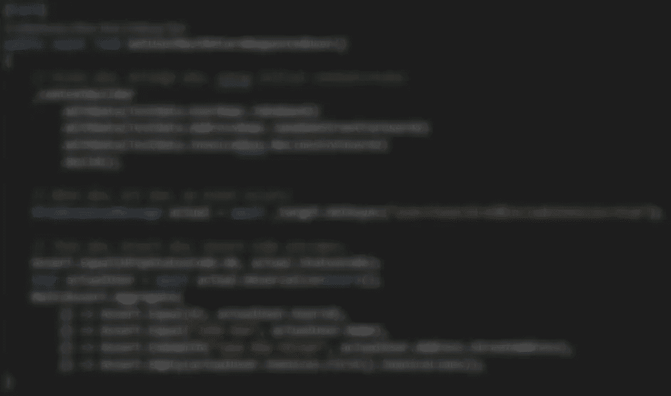
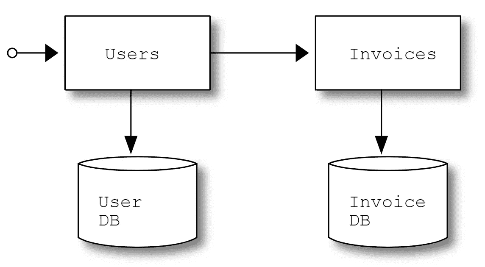
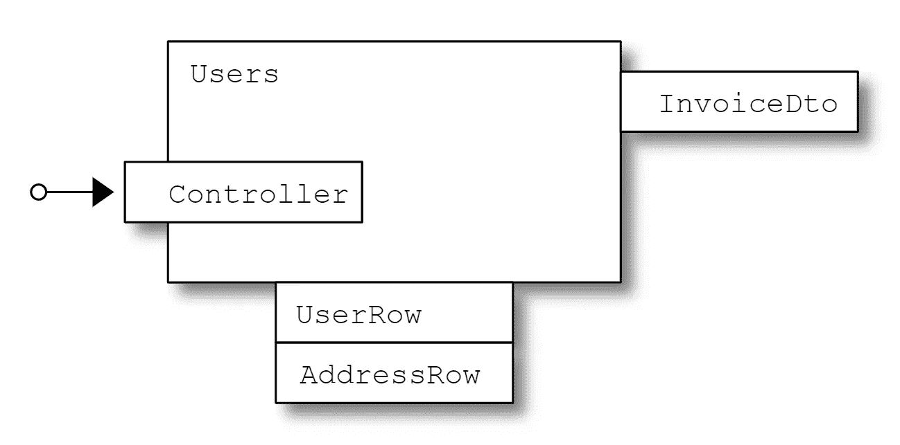

# 为什么不把 BDD 里的‘给’当回事？

> 原文：<https://javascript.plainenglish.io/why-dont-you-take-given-in-bdd-seriously-f168da29f1c?source=collection_archive---------2----------------------->

## 管理测试夹具，实现快速可靠的内存测试

## 马丁·福勒的客体母亲模式再探

This will be clear once you have read this post.

许多开发人员和测试人员认为他们在使用小黄瓜工具进行行为驱动开发，比如[黄瓜](https://cucumber.io/)、 [SpecFlow](https://specflow.org/) 或 [BDDfy](https://bddfy.teststack.net/) 。但是工具本身并不能解决问题。你认为 BDD [的发明者为什么不再使用 Cucumber 和 Jbehave](https://lizkeogh.com/2019/08/27/scenarios-using-custom-dsls/) ？

我认为 BDD 与其说是关于工具，不如说是关于一种思考方式。在这篇文章中，我将关注 BDD 的一个方面，我认为 BDD 社区没有足够重视这个方面——在一个或多个`Given` 语句中声明的*初始上下文*。

一个或多个`Given` 语句的集合是管理测试夹具以进行快速可靠的内存测试的关键。不仅如此，我过去几年的经验表明，这也是管理测试金字塔中所有级别测试的关键。

在本文中，我将主要关注孤立的内存测试。在随后的文章中，我将攀登更高的测试金字塔。

# 类似的工作

我一直在努力寻找解释如何正确处理初始上下文的资料。对于内存中的隔离测试，开发人员倾向于使用模拟框架，为每个测试建立一套全新的模拟。对于端到端集成测试，测试环境通常有一个巨大的测试数据库，可能包含生产数据的*清洗*版本。

为什么开发人员不理解跨测试使用通用设置的好处？为什么测试人员不明白测试的初始状态就是那个——那个测试的初始状态，这并不意味着*庞大数据库中的某个东西使这个测试通过了*？为什么测试人员和开发人员不明白，如果他们至少使用相同的初始状态概念，他们会错过一个密切合作的重要机会？

尽管缺乏直接解决这个话题的资料，我意识到我正站在巨人的肩膀上。Dan North 建议 BDD 测试应该从孤立的测试发展成端到端的测试，Martin Fowler 建议用[对象母模式](https://martinfowler.com/bliki/ObjectMother.html)建立一个通用的测试结构，

> 当您在一个合理规模的系统中编写测试时，您会发现您必须创建大量的示例数据。如果我想测试一个雇员的病假工资计算，我需要一个雇员。但这不仅仅是一个简单的对象——我需要员工的婚姻状况、家属人数、一些就业和工资单历史。这可能需要创建大量的对象。该组数据通常被称为测试夹具。

然后他继续描述一个*对象母*如何产生实例并处理这种测试夹具的生命周期。

我将在下面描述一种在自动化测试中处理测试夹具的方法。我认为 BDD 思维引导我们找到了一种管理测试夹具的方法，这种方法开销很小，并且测试简单易管理。

我将从背景开始，以便设置场景。最后，我将展示一个带有示例测试的 C#项目。带有测试的完整示例项目源代码在公共 GitHub 库中[。](https://github.com/belgaard/UsersSample)

但首先让我们从一个定义开始。马丁·福勒称之为*测试夹具*，我通常称之为*模拟。*最通用的术语是*测试双*，它将涵盖其他变体，如*存根*、*假货*等。在下文中，我将称它们为*测试夹具*，除非当我需要一个合适的动词或引用代码时，在这种情况下，我将引用*模仿*的*模仿*生产代码*。*

# 背景

在 Peter Schuh 和 Stephanie Punke 的论文中有一个如何实现对象母亲模式的例子。虽然他们的理由很充分，但报纸上的一句话让我很困扰，

> [……]对于较大的应用程序，没有人愿意维护一万行的实用程序类

我从来不想编写成千上万行的测试夹具代码，即使是对于一个大型应用程序。那只会导致错误爬进我的测试代码。我希望我的测试代码能够确保可信度，我不希望它成为新的错误来源。也许我不是唯一有这种想法的人，也许这就是为什么这种模式似乎已经被遗忘了？我认为大多数开发人员只是使用一个模仿框架来创建他们的模仿，而从不考虑使用一个对象母亲。

我仍然认为这是一个很好的模式，因为跨测试的一组公共的 fixtures 将使测试更容易阅读。测试也更容易推理，因为读者不需要理解每个测试的独特嘲讽；一旦我理解了我们有一个业务对象，比如说一个名为 John 的用户，他是一个上周被雇用的雇员，我可以在试图理解下一个测试时使用这些知识。这与简单地为每个测试即时创建新的模拟形成了鲜明的对比，这可能很容易做到，但维护起来会很麻烦。

我们需要一种更简单的方法来建立一个对象母亲，这样我们就不会花太多时间去做，在这个过程中引入错误。

如果你想知道为什么我如此关注单元测试的一个小的技术细节，请耐心听我说一会儿。

我向您保证，一旦我们恰当地确定了测试夹具的生命周期，它将对测试金字塔中的所有级别的测试产生深远的影响。它甚至允许我们系统地推理功能测试覆盖率，而不仅仅是行或块覆盖率。

但是首先让我们试着理解为什么我们需要为母亲这个对象写成千上万行代码。

即使是最复杂的遗留系统，在逻辑上也可以看作是由许多子系统组成的。在下文中，我将假设我们的测试将针对这样的子系统。这至少限制了针对给定子系统的一组测试所需的夹具数量。如果你认为测试整个集成系统会更正确，那么就看《T2》集成测试是个骗局，当你确信后再回到这篇文章。

接下来，让我们弄清楚在子系统中的什么地方使用由我们的对象母亲创建的 fixtures。在纯函数实现中，这很容易。由于一个[纯函数](https://www.sitepoint.com/functional-programming-pure-functions/#:~:text=A%20pure%20function%20is%20a,always%20return%20the%20same%20result.)的返回值仅仅依赖于它的输入，我们可以简单地在每个测试中创建和使用 fixtures。拥有一个带有纯功能核心的[子系统并不完全是科幻小说，这是一个伟大的想法。唉，大多数系统都不是这样设计的——目前还不是](https://www.destroyallsoftware.com/screencasts/catalog/functional-core-imperative-shell)

你甚至可以说[拥有测试夹具是一个骗局](https://www.youtube.com/watch?v=7AGQ9dhWCX0)。我不认为这是一个骗局，但我当然相信限制测试夹具的数量是有益的。

由于我们没有一个纯粹的功能核心，我们不能简单地依赖*在每个测试中直接创建和使用*我们的测试夹具。

为了找出我们可以在哪里使用我们的测试夹具，我们需要决定用什么代码来模拟*。我将在这里截断一个很长的讨论，简单地说明子系统的*外部依赖是我们想要模仿的。如果你嘲笑任何介于两者之间的东西，你可能正在嘲笑外部依赖，这是不好的。不信看[请不要嘲笑我](https://m.youtube.com/watch?v=x8sKpJwq6lY)。**

*因此，看起来我们可以摆脱对象母亲，它只提供了相对较小的一组测试夹具，这些夹具代表了子系统的外部依赖性。但是我们仍然希望避免为每个设备编写太多的样板代码。*

*避免太多样板代码的诀窍是接受*值是边界*。我可以推荐主题为的这个演示。换句话说，我们不太关心跨边界传递数据的机制，但是我们非常关心跨边界的值。因此，边界由传递的一组值表示。*

*最后，我们需要弄清楚如何插入测试夹具。因为我们不能简单地在每个测试方法中创建和使用它们，所以我们需要一些魔法来做到这一点。*

*坦白地说，我不喜欢我们的对象母亲处理我们的测试设备的生命周期，因为人们普遍认为这是一项单独的责任。*

*在我看来，毫无疑问——我们正在寻找的魔法是*依赖注入*,我们测试夹具的生命周期应该由阿迪容器*来处理。我强烈推荐 Mark Seemann 关于依赖注入的书。以下是你在这篇文章中需要知道的内容，**

*   *依赖关系在[组合根](https://blog.ploeh.dk/2011/07/28/CompositionRoot/)中*声明*。*
*   *依赖关系被*注入*到构造函数中。*

*这里有一个技巧:在生产代码中声明组合根中的任何外部依赖，然后在测试组合根中覆盖表示外部依赖的声明。*

*最终的结果是您的子模块带有为其外部依赖性模拟的测试装置。*

*我听到你说，那是集成测试，不是单元测试。我不会[争辩这一点](https://www.youtube.com/watch?v=jKGjOE_7bYI)，我只是指出我们将会有*隔离测试*，这些测试可以在内存中运行，可靠而快速。术语*隔离测试*是许多人更喜欢的，而不是*单元测试*。*

*虽然你可能更喜欢称之为集成测试或单元测试，但我称之为 L0 测试，因为这是我编写的最低级别的测试，就像在*零级*中一样。这个术语的灵感很大程度上来自于微软 Azure DevOps 团队在测试上的左移。*

# *代码在哪里？*

*我称自己是一名开发人员，到目前为止我还没有写过一行代码。我真丢脸，又来了。*

*但是首先我们需要决定测试什么。*

*不管具体的技术栈是什么，上面的讨论都是有效的。但是为了一个具体的例子，让我们用 C#和 ASP.NET 核心写一个 REST API。我将使用一个简单的例子，类似于上面提到的论文中的例子。*

**

*We have two microservices, of which one is responsible for users and another is responsible for invoices. Each of the microservices own a database for persisting business objects. We will target the Users microservice.*

*用户微服务是我们的测试对象，而发票微服务是一个外部依赖项，因此发票微服务的实现细节无关紧要。*

*在我们将要编写的测试中，我们还将用户微服务的数据库视为外部依赖。这允许我们彻底地测试数据库处理代码的许多方面，例如错误情况的处理，当您使用实际的数据库时，这可能是困难的。*

*当然，在实际的数据库中运行许多相同的测试是可能的。通过使用例如 dockerized SQL 服务器或内存中的 EF 数据库，测试仍然可以是快速的和确定的。然而，这超出了本文的范围。*

*当我们分析用户微服务的测试用例需求时，我们并不真正关心处理数据库和其他微服务的技术细节。我们只关心作为输入和跨边界传递的数据值。如果明天我们决定通过 Kafka 或诸如此类的东西向其他来源传递数据，我们将保留我们对所需功能测试覆盖的推理，我们将保留测试。*

**

*From the point of view of our tests, we care about data on users, addresses and invoices, but not about how such data is handled in our external dependencies.*

*让我们编写一个测试，从我们的用户微服务中获取关于用户的简单信息。使用小黄瓜语言，它可以像下面这样，*

*这不是一个完美的例子。其实就是这么简单，你在`Then` 断言的，差不多就是你在`Given`里安排的。在一个更高级的例子中，您在`Given`中安排的数据值将以一种不太明显的方式改变，断言结果意味着断言业务逻辑按预期工作。然而，对于目前的讨论，我认为这个例子是足够的。*

*根据我的经验，上面例子中最重要的部分是`Given` 子句。`Given` 子句就是丹·诺斯在他关于 BDD 的[原创文章中所说的*初始状态*。`Given`子句声明了测试运行的上下文。这在我们的 L0 测试中是必不可少的，因为我们需要以某种方式使我们的对象母亲能够确保该上下文。如果我们对此足够聪明，我们将有办法做到丹·诺斯在 2006 年预测的那样，](https://www.stickyminds.com/better-software-magazine/behavior-modification)*

> *当您实现应用程序时，给定的内容和结果会被更改，以使用您已经实现的实际类，这样，当场景完成时，它们已经成为适当的端到端功能测试。*

*但是我们不要在这方面想得太多。尽管这篇文章可能很长，但它只是编写覆盖整个测试金字塔的测试的一小步。*

*我是 BDD 思维的支持者，但我不喜欢小黄瓜语言或把小黄瓜文本转换成样板代码的常用工具。*

*长话短说，我参与了一个大型项目，在这个项目中，我们通过实例来实践[规范。我的经验是，即使是相当专业的业务分析师也很难读懂 Gherkin 规范，并且发现使用 Gherkin 编写需求是完全不可能的。开发人员和测试人员当然可以实现语言的不同部分(`Given`、`When Then`、`And`)，但结果是测试代码被分割成许多难以维护的小部分。](https://en.wikipedia.org/wiki/Specification_by_example#:~:text=Specification%20by%20example%20(SBE)%20is,examples%20instead%20of%20abstract%20statements.)*

*如果我问莉兹·基奥，或许可以节省一些时间。下面是[对这个话题的看法。](https://lizkeogh.com/2019/08/27/scenarios-using-custom-dsls/)*

> *英语的小黄瓜语法很难重构。这些工具在您通常的代码之上形成了另一个抽象和维护层。有一个学习曲线伴随着他们，可能有点棘手。使用这些工具的唯一原因是因为您想要与非技术利益相关者协作。如果你的团队之外没有人在自动化后阅读你的场景，那么你就不需要它们。*

*为我辩护，在我得出同样结论的几年后，她写了上面引用的内容。*

*我们决定不使用与小黄瓜相关的工具。我们删除了我们的 [SpecFlow](https://specflow.org/) 特性文件，并用一个简单的语法实现了测试，该语法基本上捕获了小黄瓜的`Given`、`When` 和`Then`，但也类似于单元测试中常用的 AAA(安排、行为和断言)。*

*事不宜迟，下面是上面使用该语法的测试，*

*关于这段代码有很多要说的，但我会在这里保持简短。你可以在 GitHub 看到[完整的代码。](https://github.com/belgaard/UsersSample)*

*这些评论暗示了代码与小黄瓜、AAA 和 Dan North 关于 BDD 的[原创文章的关系。我确信有一个工具可以帮助将小黄瓜翻译成这样的代码，但是我不明白这有什么意义。到目前为止，我的经验是，以这种方式编写的大多数测试都简短易读，不会对罕见的复杂情况施加限制。](https://www.stickyminds.com/better-software-magazine/behavior-modification)*

*注意我提到边界值的方式，*

*我更喜欢根据与测试相关的值的特征来命名每个值。在上面的例子中，测试依赖于街道地址和相关用户的 ID，而地址值的其他方面是不相关的。实际值可能是测试代码中的新值，也可能是从 Json 文件中反序列化的值，或者是您喜欢的任何值。重要的是*该值相对于使用它的测试是描述性的*。*

*这些*值*可能非常复杂，以至于称它们为值似乎有些轻描淡写。在这种情况下，你可以使用构建器模式来构建每个值，就像利兹·基奥建议的那样。这也将清楚地显示价值的相关特征。对`UserRow`值使用构建器的测试看起来如下所示，*

*或者更好的是，您可以重用复杂值的生产代码。*

*我在一个以用户业务对象为中心的系统上工作——而且很复杂。最初，我们会通过观察和记录 Json 文件中的实时行为来寻找测试值。这些值对于产生真实的测试和检查向后兼容性来说是很棒的，但是对于测试新的和改变的用户相关的功能来说是不方便的。当我们介绍了对 CQRS 和 T2 的理解后，一切都变了。在生产代码中有一个命令`CreateUser`允许我们在测试代码中创建用户的最新化身。你可以说，对于这些复杂的对象，对象母亲是在生产代码中实现的！*

*如果您习惯于对 REST API 控制器类进行单元测试，您可能会奇怪为什么我的测试的目标是 HTTP 客户端，而不仅仅是 C#控制器类。如果你真的想知道，我建议你读一下[安德鲁·洛克](https://andrewlock.net/should-you-unit-test-controllers-in-aspnetcore/)关于这个话题的帖子。测试微软的 ASP.NET 核心中间件并不是我的目标，但是通过将它包括在测试中，效果可能是我将更多的我自己的代码放在测试中，从而结束一个更有价值的测试。在这个超级简单的例子中，它没有任何实际影响，但是在真实世界的代码中，它可能是必不可少的。事实上，我们现在遵循一个原则是非常重要的，那就是我们希望*将尽可能多的代码置于测试之下，只要测试是快速和确定的*。*

*您会注意到我有多个 assert 语句。对于传统的单元测试来说，这被认为是不好的实践，但是在 BDD 世界中却被普遍接受。我曾经写过在单元测试中有多个断言[这里](https://elgaard.blog/2011/02/06/multiple-asserts-in-a-single-unit-test-method/)那里[那里](https://elgaard.blog/2013/05/26/even-more-asserts-in-a-single-unit-test-method/)。简而言之，失败的断言语句会导致测试停止执行，因此后续断言语句的结果是未知的。我的解决方案是在继续执行没有意义时停止执行，否则我会执行所有 assert 语句，而不管其他 assert 语句的结果如何。*

*回到这篇文章的主题，在测试代码中，我们在哪里与对象母亲进行交互？敏锐的读者会注意到，我们没有直接与对象母交互，因为我们以*上下文构建器*的形式引入了一个间接层。*

*我们也从不直接与测试夹具交互，但是探究为什么这是一个明智的原则以及如何遵循它已经超出了本文的范围。*

*我稍后将深入研究我们从构建器中获得的能力，用于初始状态、状态改变等。通过不同层次的测试。但是在我们深入研究*为什么*之前，让我们深入研究*如何—* 我们如何向对象母亲提供足够的信息，使她能够分发测试夹具。*

*下面是发票微服务模拟的实现，*

*这是最近我的大多数模拟看起来的样子——处理的数据是使用`WithData` 方法传入的*，数据是在模拟接口的方法中使用的*。仅此而已，通常每个模拟只需要几行代码。***

**诀窍在于`IMockForData<>`通用接口。我们在测试组合根中向 DI 容器声明每一项，指定要模拟的接口的给定实现期望接收给定类型的数据，如下所示:**

**上面代码片段中的第二行声明了类`MockForDataUsersStorageFacade`实现了抽象我们的用户数据库`IUsersStorageFacade`的接口，并期望接收两种类型的数据，**

**在这个简单的例子中，主要是看你希望在一个类中实现多少接口。但是在更复杂的例子中，您的选择可能会使生活变得更容易，并且可以使测试代码变得更简单。**

**当然，在有些情况下，模拟并不那么简单。但是令人惊讶的是，大部分模拟不包含任何逻辑，它们的圈复杂度为 1，因此在测试代码中引入错误的风险是最小的。这种方法就像使用模仿框架一样简单，但是如果需要的话，您仍然可以进行复杂的模仿。直到我描述了构建器的强大之处，特别是当应用于测试金字塔中的所有级别的测试时，这种方法相对于简单使用模仿框架的真正好处才会完全清楚。但是这篇文章已经够长了，所以这将是以后文章的主题。**

**如果你在上面的片段中寻找我们的对象母亲，那么你是在徒劳地寻找，它不直接在那里。**

**正如我之前提到的，所有的生命周期管理都委托给了 DI 容器。对于一个对象母亲来说，还有更多的事情要处理——收集数据(实际上是外部依赖关系的初始状态)并在需要时构建测试夹具。**

**长话短说，构建器是在一个小库中实现的，我们称之为[LeanTest.Net](https://leantest.net/)。[源代码在 GitHub](https://github.com/SaxoBank/Leantest) 上，通过 [nuGet 包](https://www.nuget.org/packages?q=leantest)发布。该库包含上面提到的*、*的*上下文构建器*，它被每个测试用来声明初始状态。基于 LeanTest.Net 的测试可以在任何测试运行器中运行(明确支持 MsTest 和 Xunit)。该库可以与您喜欢的 DI 容器集成。本文的示例项目使用了。NET Core 内置 DI 容器。在其他项目中，我们使用 MS Unity 和 SimpleInjector。图书馆是。NET 标准 2.0，所以它支持广泛的传统和现代。NET 项目。**

**构建器使用 DI 容器来识别要构建的测试设备。**

**就这么简单——没有对象母亲，只是一个构建器和您首选的 DI 容器。**

# **结论**

**对象母亲的概念，一个测试夹具的常见来源，诞生于单元测试和 XP 的背景下。**

**然而，似乎这个概念是有效和重要的方式超越了这一背景。**

**对我来说，这是关于认真对待 BDD 中给出的*。事实上，这是一个秘密因素，它允许我们不去想下一步*要测试什么功能，而是去想下一步*要验证什么行为。***

*在这篇文章中，我描述了如何以一种在概念上类似于 Object Mother 模式的方式来处理测试夹具，但是与我所知道的实现有很大的不同。*

*在我们的实现中，对象母亲，*

*   *已经剥离了测试夹具生命周期的责任，相反，它集成到您选择的 DI 容器中，并且*
*   *一般来说，从向 DI 容器声明的边界值构建测试夹具。*

*我们的实现与最初的模式有很大的不同，最初的模式本质上是一种专门化的工厂模式。*

*我只是简单地描述了这种实现的好处。虽然这篇文章中的描述只不过是单元测试的一个更好的方法，但是还有更多。*

*我是否提到过，在过去几年中，我们已经成功地将它用于棕色地带的传统系统以及绿色地带的云原生系统？*

*我还没有触及的一些话题是，*

*   *测试的级别。我只是简单地声称，所描述的方法将在测试金字塔中的所有级别的测试中很好地工作。观察力敏锐的读者会期望我们，[受到微软](https://docs.microsoft.com/en-us/azure/devops/learn/devops-at-microsoft/shift-left-make-testing-fast-reliable#test-taxonomy)的启发，除了 L0 测试之外，还会有 L1 和 L2 的测试。甚至可能是 L3 测试。*
*   **过程。*我已经描述了最终结果，也就是说，测试应该是什么样的，它们应该如何与对象母亲交互，但是我没有描述达到这个目的的过程。是 TDD 吗，如果是，是[由内向外还是由外向内的 TDD](https://devlead.io/DevTips/LondonVsChicago) ，还是综合采用这两种方法？(剧透一下——很大程度上和后者一样，我们争取*持续测试*。)*
*   **系统的测试分析和一组测试用例背后的推理文档。*我只是暗示了可见的功能覆盖和信心的可能性。(剧透警告— *有可能。*)*
*   **测试员的角色。如果开发人员可以在测试金字塔的所有层次编写测试，那么我们还需要测试人员吗？(剧透提醒— *是的，我们还需要测试人员*。)**
*   **使用 DI。我已经描述了我们如何使用 DI 来处理测试夹具的生命周期，以及声明和发现边界值。但是这个话题还有更多。在测试中使用产品代码的组合根，然后覆盖一些模拟的声明，这是该方法的核心。在 AspNet 中。核心它是覆盖中间件和后台工作的关键，如果你使用 CQRS，它是你如何重用生产代码中的命令和阅读器。**
*   **实践经验。*我们在 Saxo Bank 已经使用了这篇文章中描述的原则好几年了，最近几年在我们的 [OpenAPI](https://www.developer.saxo/openapi/learn) 上广泛使用。我们的体验与微软的类似——我们现在有了更快、更可靠的测试，让我们能够以云节奏发布。*

*我希望你读这篇文章和我写这篇文章一样有趣。如果你感兴趣的话，我会考虑写一写上面提到的至今未触及的话题。*

**更多内容请看*[***plain English . io***](http://plainenglish.io)*

# *资源*

*马丁·福勒:反对者母亲。
Peter Schuh 和 Stephanie Punke: ObjectMother，[简化 XP 中的测试对象创建](http://citeseerx.ist.psu.edu/viewdoc/download?doi=10.1.1.18.4710&rep=rep1&type=pdf)。J B Rainsberger: [集成测试是一个骗局 HD](https://www.infoq.com/presentations/integration-tests-scam/) 。
销毁所有软件:[功能核心，命令外壳](https://www.destroyallsoftware.com/screencasts/catalog/functional-core-imperative-shell)。
Matt Diephouse: [测试替身是骗局](https://www.youtube.com/watch?v=7AGQ9dhWCX0)。贾斯汀·希尔斯:[请不要嘲笑我](https://www.youtube.com/watch?v=x8sKpJwq6lY&app=desktop)。
销毁所有软件:[边界](https://www.destroyallsoftware.com/talks/boundaries)。
马克西曼:[作文词根](https://blog.ploeh.dk/2011/07/28/CompositionRoot/)。
天魔:[我们不要斗嘴，不要争论谁杀了谁](https://www.youtube.com/watch?v=wg30ino19Zc)。
微软:[左移使测试快速可靠](https://docs.microsoft.com/en-us/azure/devops/learn/devops-at-microsoft/shift-left-make-testing-fast-reliable)。
丹北:[行为矫正](https://www.stickyminds.com/better-software-magazine/behavior-modification)。
布莱恩·埃尔加德:[这篇文章的示例代码](https://github.com/belgaard/UsersSample)。
维基百科:[命令——查询分离](https://en.wikipedia.org/wiki/Command%E2%80%93query_separation)。你应该在 ASP.NET 核心中对 API/MVC 控制器进行单元测试吗？
Brian Elgaard: [单个单元测试方法中的多个断言](https://elgaard.blog/2011/02/06/multiple-asserts-in-a-single-unit-test-method/)。
Brian Elgaard: [单个单元测试方法中更多的断言](https://elgaard.blog/2013/05/26/even-more-asserts-in-a-single-unit-test-method/)。
维基百科:[圈复杂度](https://en.wikipedia.org/wiki/Cyclomatic_complexity)。LeanTest。net:[c#中的精益测试](https://leantest.net/)。
leanstest。Net: [Leantest 源码](https://github.com/SaxoBank/Leantest)。LeanTest。Net: [nuGet 包](https://www.nuget.org/packages?q=leantest)。道格·克拉夫:伦敦对芝加哥。
盛宝银行 [OpenAPI 开发者门户](https://www.developer.saxo/openapi/learn)。莉斯·基奥:[使用定制 DSL 的场景](https://lizkeogh.com/2019/08/27/scenarios-using-custom-dsls/)。*