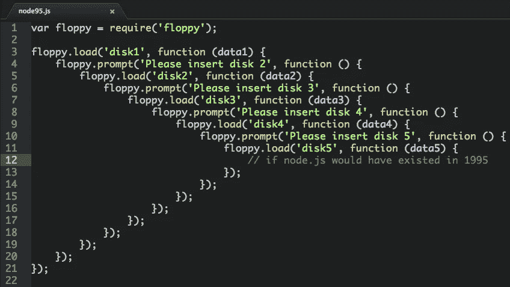

# 为什么我总是喜欢异步/等待

> 原文：<https://javascript.plainenglish.io/why-i-always-prefer-async-await-72fd325792f2?source=collection_archive---------0----------------------->

## 如何处理 JavaScript 中的异步性？


Photo by [Clément H](https://unsplash.com/@clemhlrdt?utm_source=medium&utm_medium=referral) on [Unsplash](https://unsplash.com?utm_source=medium&utm_medium=referral)

# 这是什么？

这是用 Javascript 编写异步代码的一种方式。语言本身是单线程的，本质上是阻塞的，这意味着在任何给定的时刻都只有一件事情发生。

环境在事件循环的帮助下创造了异步的本质。这个循环由每个标签中的浏览器提供，由每个进程中的 NodeJS 提供，并且是 Javascript 的一个核心概念，我们不会详细讨论它是如何工作的，但是会研究如何将它用于异步代码。

# 有多少选择？

如今，如何处理`asynchronous`手术有多种选择:

*   使用`callbacks`
*   使用`Promises`
*   使用`async/await`

那么，为什么我更喜欢后者呢？让我们把它们都检查出来。

# 复试

我们可以传入一个函数，这个函数将在以后执行。让我们看一个 REST API 调用的例子。我们有不同路由的 API 对象和一个 API 调用。

```
const catApi = {
   listCats: (callback) => {
     // fetching cats, filtering out the dogs
     callback(null, result);
   }
}catApi.listCats((err, result) => {
   console.log(result);
});
```

现在看起来没那么糟了，是吗？如果只有一件事要做，它就不会，在某些场景中，它可能是一个有用的设计模式。

但是如果我们必须做一连串的动作呢？然后它迅速分裂，我们受到回调地狱的欢迎。这甚至没有任何错误处理！

```
catApi.listCats((err, result) => {
   result.forEach((cat) => {
      creditService.isRich(cat, (err, result) => {
          presentService.giveExtraAttention(cat);
      });
   });
});
```

根据需求的不同，这可能会变得非常难看和难以阅读，从而导致更多的错误，在添加新的逻辑和维护整个事物时花费更多的时间。



# 承诺

令人欣慰的是，回调情况被视为一个问题，一种补救措施被创造出来，称为承诺。它们有点难以理解，但是如果你想写干净漂亮的代码，理解它们是必须的。在这里可以找到对它们的很好的解释[。对于我们正在进行的 cat API 示例，让我们使用承诺来代替回调:](https://developer.mozilla.org/en-US/docs/Web/JavaScript/Guide/Using_promises)

```
const catApi = {
    listCats: () => {
        return new Promise((resolve, reject) => {
            // fetching cats, filtering out the dogs  
            resolve(result);
        });
    }
}catApi.listCats()
.then((result) => {
    console.log(result);
})
.catch((err) => {
    console.error("There is a dog!");
});
```

看起来不同，但感觉相似，因为我们仍在传递函数，一个传递成功，一个传递错误。

承诺的袖子里有一张王牌——它们是可以用链子拴住的，不再需要我们去无限远的地方然后回来(尽管，如果你愿意，你仍然可以这么做，你这个怪物)。

```
catApi.listCats()
.then((cats) => {
    console.log(cats);
    return cats;
})
.then((cats) => {
    return cats.map((cat) => {return `${cat}_1`});
})
.then((cats) => {
    console.log(cats);
})
```

获取我们的猫，注销它们，混淆它们的名字，并再次输出它们。这看起来和感觉现在都很好，虽然有一个更好的方法，甚至更直接。

# **异步/等待**


This feels really good

有了这两个关键词，我们就可以顾名思义，`await` 就一诺千金了。有一个问题，这个函数必须声明为`async`才能工作，尽管我认为这是为了极度清晰而付出的小小代价。

```
const cats = await catApi.listCats();
console.log(cats);
```

如果我们想连续做多个操作呢？

```
const cats = await catApi.listCats();
console.log(cats);const fedCats = await catApi.feedCats(cats);
console.log(fedCats);
```

等等，你不是在检查错误。如果一个承诺被拒绝，错误就会被抛出，我们所要做的就是在某个地方捕捉它。

```
try {
    const cats = await catApi.listCats();
    console.log(cats); const fedCats = await catApi.feedCats(cats);
    console.log(fedCats);
} catch(e) {
    console.log(e);
}
```

我发现这种类型的代码在阅读时产生的认知负荷最少，因为几乎没有嵌套，没有回调，也很少出现混乱。