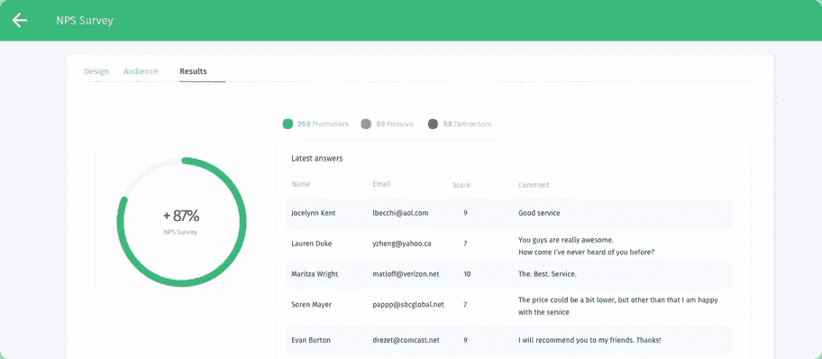

# 为什么我选择 React 和 Firebase 来创建一个客户调查应用程序

> 原文：<https://javascript.plainenglish.io/why-i-chose-reactjs-and-firebase-to-create-a-customer-survey-app-e6b7172291a?source=collection_archive---------5----------------------->

NPS surveys through the app — [https://app.promotedsurveys.com](https://app.promotedsurveys.com)

几周前，我拿着客户的电子邮件地址清单，开始询问他们是否喜欢我的产品。我知道有很多网站提供客户调查服务，但没有一个网站足够便宜或易于使用。所以我决定自己创造一个。

我唯一的要求是该应用程序必须美观和具有反应性，也就是说，它能实时向客户展示反馈。

**剧透提示:**如果你想看完整功能的应用程序，请继续阅读。

# 堆栈的选择至关重要

我对 EmberJS、Spring Boot (Java)和 MySQL 最有经验。因此，对堆栈的直观选择应该是这些技术的组合。但我的目标是从一无所有到真正快速地投入生产，建立和管理如此繁重的环境的想法促使我研究其他选择。

与 SQL 数据库结合的 Java 后端本质上需要管理至少两个不同的组件。为了启动并运行它，我需要在本地设置数据库服务器，配置 Spring Boot 与数据库通信(可能与 ORM 如 Hibernate 通信),并在本地运行一个后端。虽然在开发模式下这听起来相对容易，但是将这样的应用程序部署到生产环境中是开销的起点。另外，与 SQL 没有反应。

# 无服务器是潮流

无服务器架构最近变得流行起来，因为它们(在某种程度上)消除了管理和部署服务器的需要。当然，仍然有服务器在运行，但是管理它们的重担被外包给了像谷歌或亚马逊这样的公司。

谷歌的 Firebase 提供 Firestore，这是一个 NoSQL 的云托管数据库，可以通过易于使用的 SDK 从客户端直接访问。Web，iOS，Android 都支持。Firestore 安全规则可以配置为只允许授权人员访问数据，并且是开箱即用的。

然而，Firestore 并没有完全消除对后端的需求，因为现实世界的应用程序通常需要与第三方服务进行通信。

对于这些情况，Google 已经创建了 Firebase 函数，它是 Firebase 基础设施的一部分。一个功能可以与其他功能分开部署，并且仅在请求时运行。

# Firestore 的痛点

Firestore 针对扩展进行了高度优化，不支持 SQL 的一些琐碎功能。

例如，如何计算一个集合中的文档数？你被迫在一个单独的字段中自己计数，或者一次阅读所有的文档，从时间和金钱的角度来看，这是低效的，因为你要为读和写付费。

此外，包含“不在”操作符的查询在 Firestore 中根本不可用，因为 Firestore 利用索引，并且您不能为不存在的事物创建索引。差点忘了——也不支持“或”运算符。

# 对余烬做出反应

Ember 有一个很好的名为 EmberFire 的库，它包装了 Firebase SDK，并提供了一个用于数据获取的适配器，而 React 有 Redux-Firestore 绑定，同样易于使用。

这不是一篇关于哪个更好的文章，因为我认为两个框架都很棒。我只是想使用 TypeScript，我认为它比 Ember 更适合 React。

# 运行中的应用

如果你想调查你的客户，你可以使用[https://promotedsurveys.com](https://promotedsurveys.com)上的应用程序

感谢您的阅读，请在评论区告诉我您的想法！

## 进一步阅读

 [## 如何构建自己的调查并使用定制的 JavaScript 扩展它们

### 这是一本关于如何使用自己的 JS 函数来扩充 SurveyJS 附带的条件逻辑和验证器的入门书。

javascript.plainenglish.io](/how-to-build-your-own-surveys-extend-them-with-custom-javascript-b4c7eb5648c4) 

*更多内容看* [***说白了。报名参加我们的***](https://plainenglish.io/) **[***免费周报***](http://newsletter.plainenglish.io/) *。关注我们关于* [***推特***](https://twitter.com/inPlainEngHQ)[***LinkedIn***](https://www.linkedin.com/company/inplainenglish/)*[***YouTube***](https://www.youtube.com/channel/UCtipWUghju290NWcn8jhyAw)*[***不和***](https://discord.gg/GtDtUAvyhW) *。*****