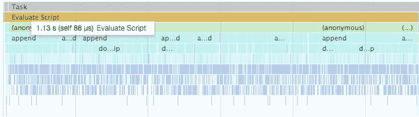
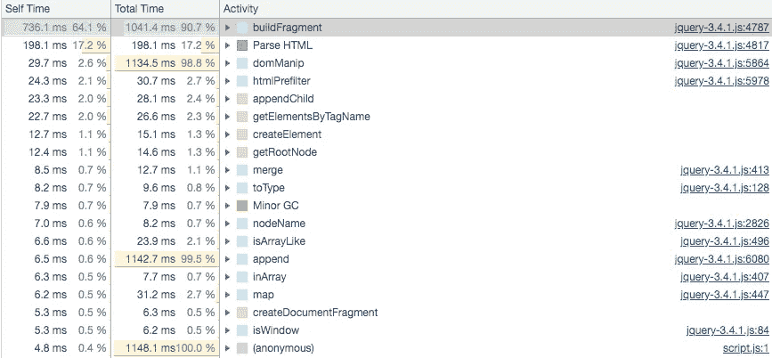
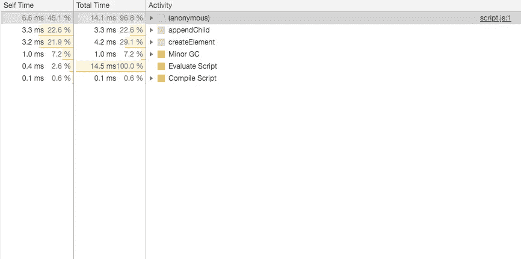
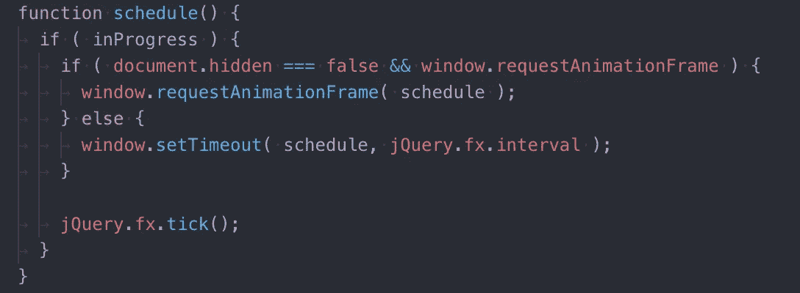
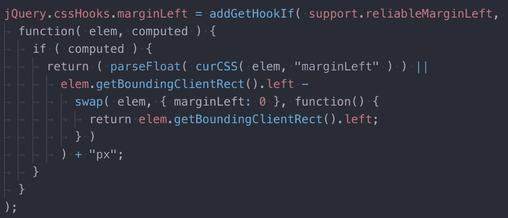

# 为什么我决定和 jQuery 分手

> 原文：<https://javascript.plainenglish.io/why-i-decided-to-break-up-with-jquery-d597d4b8c84f?source=collection_archive---------2----------------------->


Photo by [Thomas Drouault](https://unsplash.com/@thomasdrouaultphotography?utm_source=medium&utm_medium=referral) on [Unsplash](https://unsplash.com?utm_source=medium&utm_medium=referral)

你们中的许多人可能使用过 *jQuery* ，或者至少听说过一次。但对我来说，自从我从 2010 年年中开始学习 web 编程以来，我与 *jQuery* 的关系一直很新鲜。但是有几个原因让我想停止和它的关系。:(

> **免责声明**
> 这篇文章不打算讨论你应该停止使用 jQuery 的原因。也许正在阅读这篇文章的一些人仍然在团队项目中使用 jQuery。这篇文章将要讨论的内容也将适用于其他图书馆。本帖给你个人观点。

# 非常简短地介绍了我是如何认识 jQuery 的

我在大学时是计算机科学专业的，该专业的大部分课程都是针对 C 语言的。指针，链表，联合，什么的……C 里面有那么多知识欺负我。所以有一段时间我对编程感到厌倦，可能超过两年。

一天，当我在网上冲浪时，发现了 JavaScript。我不知道 JavaScript 是什么。我正在看的那个页面上也有 jQuery。人们说 jQuery 要容易得多。我不仅可以在浏览器上看到操作 DOM 的结果，而且使用起来非常简单。然后，我和 *jQuery* 之间产生了火花。:)

## 但是我仍然不知道 jQuery 有什么功能

我用的方法不到 10 种。*动画*、*绑定*、*淡入*等。但是 *jQuery* 的代码行大概有一万*(带 v.3.4.1)* 。也许您使用的函数比我使用的多，但是我很确定您使用的函数不到 30 个，即使您非常熟悉 jQuery。 [*点击这里查看常用 jQuery 函数列表。*](https://code.tutsplus.com/tutorials/20-helpful-jquery-methods-you-should-be-using--net-10521)

许多开发人员不想在现代基于 JavaScript 的项目中使用 jQuery。但是他们为什么这么不喜欢呢？这有几个原因。

# 原因 1。尽管 jQuery 是一个方便的库，但对于我真正需要的东西来说，它太重了。

jQuery 帮助开发者使用函数来操作 DOM。但是它内部有如此多的包装函数，甚至可以抓取元素。我们来看一个简短的对比。

我通过 CDN 抓取了 *jQuery* ，加载了脚本文件。

示例代码非常简单。他们做的都是抓取 *div* 元素，追加一个新标签， *p* ，一万次。在你的真实项目中，你可能没有机会添加这么多这样的 DOM。但是请记住，这只是一个比较示例。



Performance record when using jQuery


Performance record when using Pure JavaScript

因此，我在 Google 开发者工具上捕捉到了性能评估。上面的截图是我使用 *jQuery* 时的，下面的是我使用纯 JavaScript 时的。

注意， *jQuery* 花费了 1.13 秒，而 Vanilla(我从现在开始称纯 JavaScript 为 Vanilla JavaScript)JavaScript 只花了 13.01 毫秒。在那个例子中，普通的 JavaScript 比 T4 的 jQuery 快 87 倍。那么**为什么**与普通 JavaScript 相比，jQuery 花了这么长时间？

让我们更详细地看看当 *jQuery* 试图追加一个 DOMelement 时会发生什么。



Call tree when jQuery tries to append a DOM



Call tree when Vanilla JavaScript tries to append a DOM

这是 *jQuery* 在 *div* 元素中追加 10000 个标签后的调用树截图。*位于列表最顶端的 buildFragment* ，是 *jQuery* 的核心方法，生成一个新的 DOM 元素，并将其添加到 [*片段元素*](https://developer.mozilla.org/en-US/docs/Web/API/Document/createDocumentFragment) 中。另一方面，第二张截图看起来很干净，也相当空洞。

```
// jQuery
... [Total Time] [Activity]
... 1041.4ms     buildFragment --> slower!// Vanilla
... [Total Time] [Activity]
... 14.1ms       (anonymous)   --> faster!
```

这意味着 *jQuery* 很舒服，但是里面有很多包装函数；如果你在一个相当大的项目中使用它，它会减慢你的页面速度。

# 原因二。有许多专注于一种功能的库

如今，许多库都支持以更好的方式访问 DOM。这是一个基于 React 的获取元素的例子。

如果在 React 中使用 *ref* ，React 会将 DOM 的对象存储在 *ref* 树中，并允许您在需要时使用它。然而，jQuery 通过使用*文档*对象的函数来访问 DOM。然后，它总是从*文档的*标签开始到你要找的标签。当然，*的反应方式比*更快更有效。

如果你更熟悉 *React* 钩子，这是为了让你更好的理解这个例子。

> **注意**尽管我选择 React 来给你一些特性的例子，但这并不意味着 React 在任何时候都优于 jQuery。根据具体情况，jQuery 可能比其他任何库都方便。

# 原因三。jQuery 诞生时并不是为了提高性能。

《T42》杂志制作 jQuery 的时间是 2006 年中期。网络不像今天这么新奇。许多开发人员瞧不起 JavaScript，认为它不是一种编程语言。但是现在呢？前端变成了一个巨大的领域，所以使用 JavaScript 的开发者最后知道了很多知识。

然而 *jQuery* 仍然停留在过去。有许多更新，但是由于 *jQuery* 不是为性能而创建的，我可以看到许多行看起来很旧。



This method is called during Animation

这是一个运行 *tick* 方法的 *jQuery* 核心方法，该方法在*动画*函数中。*调度*创建 *requestAnimationFrame* 如果存在，或者创建 *setTimeout* 。与没有存储在回调列表中的 *setTimeout* 不同，一旦运行了 *requestAnimationFrame* 中的回调，就应该调用 *cancelAnimationFrame* 。虽然没有 *cancelAnimationFrame* 。

你可能想看看这篇关于 JavaScript 定时器函数的文章。



这是另一个例子。这也是一个 jQuery 的核心方法，当你试图获取一个元素的顶部或左边的值时，就会调用这个方法。你发现奇怪的地方了吗？

```
elem.getBoundingClientRect().left
```

尽管我们不能理解那个函数是做什么的，但有一点是清楚的，那就是有一个多余的代码，我在上面写了，问题是`getBoundingClientRect()`在你的浏览器中强制[回流](https://stackoverflow.com/questions/27637184/what-is-dom-reflow)。如果`getBoundingClientRect()`会强制回流，那我们不应该只调用一次吗？

强制回流的方法还有很多，而 *jQuery* 在创建的时候并没有在意它们。[*你可以点击这里获得这方面的进一步信息。*](https://gist.github.com/paulirish/5d52fb081b3570c81e3a)

# 结论

第一次和 *jQuery* 见面很牛逼，一切都很好。但是时间过得太快了，网络的世代也改变了。

我并不是想告诉你，如果你正在使用 jQuery 的话，现在就停止使用它。然而，你应该考虑它对你的项目和你的需求是否真的有必要。