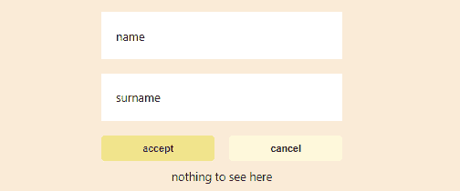

# 为什么我喜欢样式组件

> 原文：<https://javascript.plainenglish.io/why-i-love-styled-components-ffec043293bb?source=collection_archive---------5----------------------->


Photo by [Andrew Ridley](https://unsplash.com/@aridley88?utm_source=medium&utm_medium=referral) on [Unsplash](https://unsplash.com?utm_source=medium&utm_medium=referral)

现在每个人都可能听说过它们，尽管许多人可能已经被“JS 中的 CSS”这个词吓跑了。我不会责怪他们，当我第一次听到组合这个词时，我非常悲观。

如果把`css`放在`HTML`被认为是不好的做法，为什么把它放在`js`会更好呢，对吗？我们有我们的`HTML`、`JS`和`CSS`文件，完美的平衡，就像一切一样，尽管在`React`的情况下，我们的组件由返回`JSX`的函数组成，我们的`HTML`基本上是最小的，带有一个 div 供`React`挂载。

或许`js`中的`css`终究不是某种异端？

# 一个有点简单的例子

为了让它更有趣一点，让我们使用不同的方法重新创建相同的组件:普通的`css`、`css`和最后的`styled-components`。



love those shades of beige

# 普通 CSS

让我们看看输入字段的样式在不使用任何花哨工具的情况下会是什么样子——会有多糟糕呢？

```
.input {
  padding: 23px;
  font-size: 16px;
  width: 100%;
  box-sizing: border-box;
  outline: none;
  border: none;
}.input-label {
  position: absolute;
  top: 22px;
  left: 20px;
}.input:focus + .input-label {
  color: crimson;
  transition: ease-in-out 0.3s;
  top: 3px;
  left: 23px;
  font-size: 14px;
  font-weight: 600;
}.name-input:hover ~ .info-box::after {
  content: "hello";
  font-weight: bold;
  transition: ease-in-out 0.2s;
}.surname-input:hover ~ .info-box::after {
  content: "almost done";
  font-weight: bold;
  transition: ease-in-out 0.2s;
}
```

看起来很棒，对吧？是的，当然，但是使用普通香草也有明显的缺点:

*   类是全局的，这意味着你可以有意地继承或覆盖某些东西，这可能并不明显。
*   没有嵌套，选择器是独立的代码块，这本身不是问题，但是它需要额外的脑力来处理，而且一些同事可能不会将与一个类相关的所有内容按顺序放置——这为人为错误留出了空间

# 带有预处理器

顾名思义，当使用`css`预处理程序时，你的样式表在被浏览器理解之前必须被处理。它们有很多不错的特性:混合、继承、变量，最重要的是——嵌套。让我们看看使用`Sass`预处理器时的代码:

```
.input {
  padding: 23px;
  font-size: 16px;
  width: 100%;
  box-sizing: border-box;
  outline: none;
  border: none; &:focus + .input-label {
    color: crimson;
    transition: ease-in-out 0.3s;
    top: 3px;
    left: 23px;
    font-size: 14px;
    font-weight: 600;
  }
}.input-label {
  position: absolute;
  top: 22px;
  left: 20px;
}.name-input {
  &:hover ~ .info-box {
    &::after {
      content: "hello";
      font-weight: bold;
      transition: ease-in-out 0.2s;
    }
  }
}.surname-input {
  &:hover ~ .pre-info-box {
    &::after {
      content: "almost done";
      font-weight: bold;
      transition: ease-in-out 0.2s;
    }
  }
}
```

由于我们现在在`css`中有了嵌套，理解这里发生的事情变得更加容易，所以我们已经解决了一个问题——全局类名仍然存在。

## 中断

我们已经用香草解决了一个主要的问题，那么第二个呢？好吧，这可以很容易地通过使用`css-modules`来解决，这将使所有的类都在一个给定的文件范围内，`create-react-app`附带了对这个的支持，你只需要给你的文件命名`xyz.module.scss`，它甚至对普通的`css`有效！

等等，看起来我们已经解决了所有问题——为什么还要继续呢？因为有更多的收获:)

# 使用样式化组件

他们也解决了上面提到的问题，否则我不会爱上他们。无论如何，我们的输入风格是:

```
const LabelElement = styled.label`
    position: absolute;
    top: 22px;
    left: 20px;
`;const InputElement = styled.input`
  padding: 23px;
  font-size: 16px;
  width: 100%;
  box-sizing: border-box;
  outline: none;
  border: none; :focus + ${LabelElement} {
    color: crimson;
    transition: ease-in-out 0.3s;
    top: 3px;
    left: 23px;
    font-size: 14px;
    font-weight: 600;
  }
`;
```

与使用`scss`的行数大致相同，但这存在于我们的`JS`文件中，嘘呼，没什么大不了的。有些人可能已经注意到，我们没有代码来更改悬停在这里的信息框，这是因为我们现在可以在使用这些代码来更改信息框时，通过扩展我们的基本组件来放置这些代码:

```
const NameInput = styled(Input)`
  grid-column: 1/3; :hover ~ ${InfoBox}::after {
    content: "hello";
    font-weight: bold;
    transition: ease-in-out 0.2s;
  }
`;const SurnameInput = styled(Input)`
  grid-column: 1/3; :hover ~ ${InfoBox}::after {
    content: "almost done";
    font-weight: bold;
    transition: ease-in-out 0.2s;
  }
`;
```

我们也可以使用这种方法来定位它们，这很简单，但是我甚至还没有触及主要的原因——代码看起来怎么样，是时候这样做了。

# javascript

有了香草`css`和预处理`css`，我们的主要 javascript 组件看起来如下:

```
<div className="vanilla">
  <div className="simple-form">
    <Input className="both-columns name-input" label="name" />
    <Input className="both-columns surname-input" label="surname" />
    <Button clasName="left-button" label="accept" variant="primary" />
    <Button clasName="right-button" label="cancel" variant="secondary" />
    <div className="info-box both-columns"></div>
  </div>
</div>
```

我们有`div’s`类，类名与 React 组件捆绑在一起，没有快速的方法来检查给定`css`类的代码，总的来说，它看起来确实很吵，但是我们已经习惯了，接受它作为一个生活的事实，但是当我们看着`styled-components` `js`看起来是什么样子的时候，它让我窒息:

```
<Container>
  <Form>
    <NameInput label="name" />
    <SurnameInput label="surname" />
    <Primary label="accept" />
    <Secondary label="cancel" />
    <ThisInfoBox />
  </Form>
</Container>
```

如此简洁，如此干净。没有类名被传来传去，没有草皮漂浮，看着这个纯粹的快乐。我不认为自己会回去..

干杯。

*所有三种实现的完整代码都可以在这里找到:*[*https://github.com/MustSeeMelons/css-playground*](https://github.com/MustSeeMelons/css-playground)

## **简单明了的 JavaScript**

你知道我们有三个出版物和一个 YouTube 频道吗？在 [**找到所有东西的链接！**](https://plainenglish.io/)