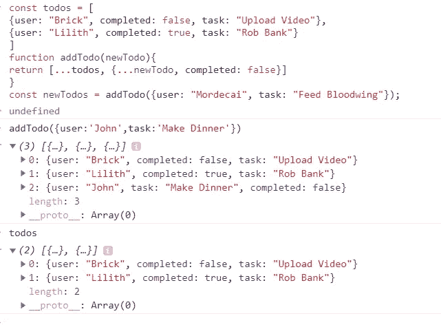

# 为什么我喜欢传播运营商

> 原文：<https://javascript.plainenglish.io/why-i-love-the-spread-operator-58f396dbbb78?source=collection_archive---------6----------------------->

## ES6 最有用的 JavaScript 特性


Photo by [Mario Mesaglio](https://unsplash.com/@seimesa?utm_source=medium&utm_medium=referral) on [Unsplash](https://unsplash.com?utm_source=medium&utm_medium=referral)

在过去的几年里，JavaScript 的语法和功能有了很大的改进，增加了许多新特性。

这些新特性中最有用的一个是**扩展操作符*(又名…操作符)***

Spread 非常有用，但是它的语法乍一看并不特别有意义。它并没有告诉你它是做什么的。幸运的是，一旦你学会了 Spread 的三个主要用途，它将成为 JS 工具箱中你最喜欢的工具之一！

***根据 MDN:*** “扩展语法允许在预期零个或多个参数(用于函数调用)或元素(用于数组文字)的地方扩展可迭代对象，如数组表达式或字符串，或者在预期零个或多个键值对(用于对象文字)的地方扩展对象表达式。”

有三个地方可以使用 spread:

1.  函数调用
2.  数组文字
3.  对象文字

# 传播和功能

当向函数传递参数时，我们可以使用 spread 来扩展 iterable 元素。我们可以将每一项作为参数“展开”,而不必单独传递每一个参数。

`**Math.min**` 是一个接受任意数量的参数并返回最小值的函数。如果我们想找到一个数组的最小值，将整个数组传入是行不通的:

```
const temperatures = [76,72,68,79,54,65];Math.min(temperatures)//Result
▶ NaN
```

相反，我们可以使用 spread 来扩展数组，将每个元素作为参数传入:

```
const temperatures = [**76,72,68,79,54,65**];
Math.min(...temperatures) 
//the same as Math.min(**76,72,68,79,54,65**)//Result
▶ 54
```

这里还有一个使用`console.log`的例子。如果我们将整个数组传递给`console.log`

```
const tvShows = ["**Six Feet Under", "Chernobyl", "Black Mirror", "Fleabag**" ] 
console.log(tvShows);
```

这就是我们所看到的:

```
▶(4) ["Six Feet Under", "Chernobyl", "Black Mirror", "Fleabag"]
```

整个数组被视为一个参数。如果我们使用 Spread，我们最终会将四个参数传递给`console.log`

```
const tvShows = ["**Six Feet Under", "Chernobyl", "Black Mirror", "Fleabag**" ]//I can pass each element in tvShows as a separate argument using spread: console.log(...tvShows);▶ Six Feet Under Chernobyl Black Mirror Fleabag
```

# 展开和数组文字

## **组合数组**

我们还可以使用 spread 语法，利用现有的数组创建新的数组。例如，要合并两个数组，我们可以这样做:

```
const parents = [**"Lorie", "John"**]; 
const kids = ["**Jackson", "Ana", "Jessy**"];  
const fullFamily = **[...parents, ...kids]**;▶ //[**"Lorie", "John", "Jackson", "Ana", "Jessy"**]
```

在给定的表达式中，我们可以任意多次使用 spread。

```
const parents = [**"Lorie", "John"**]; 
const kids = ["**Jackson", "Ana", "Jessy**"]; 
const dogs = ["**Olie", "Cosmo"**];
const fullFamily = **[...parents, ...kids, "Me", ...dogs, "Unnamed Turtle"];**▶ //[**"Lorie", "John", "Jackson", "Ana", "Jessy", "Me", "Olie", "Cosmo", "Unnamed Turtle**"]
```

## 复制数组

Spread 也常用于创建数组的副本。

```
const originals = [**"Mona Lisa", "American Gothic", "The School of Athens"**]; 
const copies = **[...originals]**;  
originals.push("Nighthawks"); 
console.log(copies);▶ ["Mona Lisa", "American Gothic", "The School of Athens"]
```

*重要提示:复制数组时，展开仅深入“一级”。它不执行嵌套数组的深度复制！*

# 跨页和对象文字

就像使用数组一样，我们可以使用 spread 来组合现有的对象:

我们可以对对象做同样的事情，我们可以将现有对象的属性复制到新对象中。

```
const lion = {hasTail: true, legs: 4}; 
const eagle = {canFly: true }; 
const hybrid = {name: "Gryphon", ...lion, ...eagle};▶//{name: "Gryphon", hasTail: true, legs: 4, canFly: true}
```

# 扩散和不变性

现在这里还有最后一个话题，这真的很重要，它与您为什么应该关注这个问题有关，我将使用 **React 的示例。**

在像 **React** 这样的框架中，重要的是不要改变特定的数据(特别是状态)。由于 React 的编写方式，直接在状态中更新 arrays &对象可能会导致应用程序在应该呈现或重新呈现时无法呈现的问题。在这种情况下，你会经常看到 Spread。

这里有一个简单的例子说明**不要做什么**。我们有一个数组`todos`，我们想在数组的末尾添加一个新的 todo。“简单”的方法是简单地推进到`todos` **，但是这会改变数组！**

```
const todos = [  
{user: "Brick", completed: false, task: "Upload Video"},  
{user: "Lilith", completed: true, task: "Rob Bank"} 
]function addTodo(newTodo){   
todos.push(newTodo); 
}
```

这里我们有一个函数叫做`addTodo`这是非常幼稚的`addTodo`。在那里我们有一个`todos`阵列。每一个都是你认为添加新待办事项最简单的方法就是按下`todos`键，这就成功了！这本身没有问题，但是如果这是为 **React** 或类似的框架编写的，我们不希望**改变**我们的数据结构。

与其直接改变`todos`数组，我们不如复制一个`todos`数组，它也包含添加在末尾的`newTodo`。传播使这变得相对容易:

```
const todos = [  
{user: "Brick", completed: false, task: "Upload Video"},  
{user: "Lilith", completed: true, task: "Rob Bank"} 
]function addTodo(newTodo){   
return [...todos, {...newTodo, completed: false}] 
}const newTodos = addTodo({user: "Mordecai", task: "Feed Bloodwing"});
```

我们可以这样做，所以我们有同样的数组叫做`todos`，但是这次的`addTodo` a 函数有点不同。在本例中，它返回一个数组，我们将所有现有的`todos`分布到这个数组中。然后在数组的末尾，我们添加一个新的对象。

所以现在如果我调用`addTodo`并传递一个对象。



你会注意到`todos`本身没有更新。我没有变异`todos`

我们做的是创建一个新的数组。

就是这样！希望你喜欢这篇文章，它有助于你的发展。你也可以看我的其他文章。

[](https://medium.com/javascript-in-plain-english/should-i-use-map-or-foreach-in-javascript-af9da3b4adc3) [## JavaScript 中应该用 map()还是 forEach()。

### 了解何时使用哪种类型的数组方法

medium.com](https://medium.com/javascript-in-plain-english/should-i-use-map-or-foreach-in-javascript-af9da3b4adc3) [](https://medium.com/javascript-in-plain-english/make-eye-catching-javascript-popups-with-sweet-alert-470e05ed026d) [## 用“甜蜜警告”制作引人注目的 JavaScript 弹出窗口

### 一个吸引人的用户界面，你可以更好地提醒

medium.com](https://medium.com/javascript-in-plain-english/make-eye-catching-javascript-popups-with-sweet-alert-470e05ed026d) 

继续学习！快乐编码👩‍💻