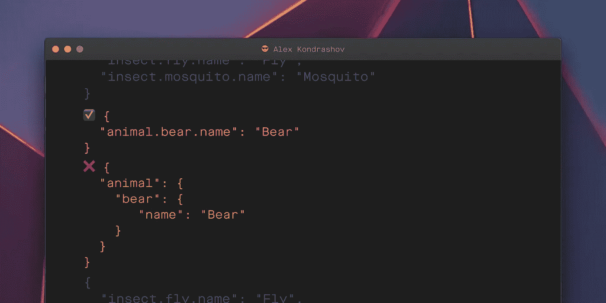
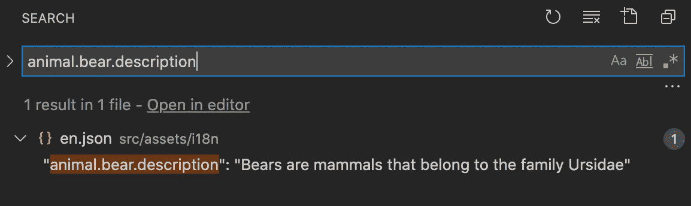
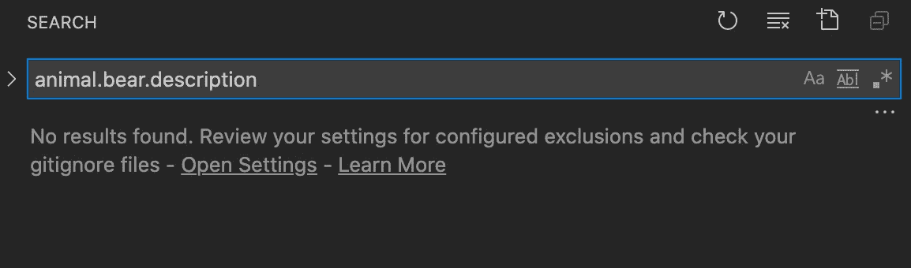
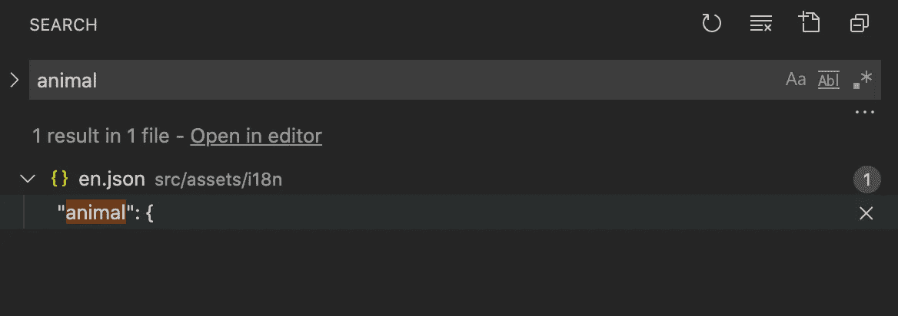

# 为什么命名空间 JSON 格式不利于翻译文件

> 原文：<https://javascript.plainenglish.io/why-namespaced-json-formats-are-bad-for-translation-files-215a87e207a6?source=collection_archive---------13----------------------->

## 修复错别字很无聊。如果我做，我希望它越快越好。

我想讨论一种 JSON 格式，它可能有助于减少这个问题。



# 介绍

如果你在项目中使用 Angular，你可能已经使用了 [ngx-translate](https://github.com/ngx-translate/core) 库来管理你的翻译。这个库使用 JSON 文件来翻译角度组件的字符串。英语翻译字符串通常位于`en.json`中。这可能是它看起来的样子:

```
{
  "animal.bear.name": "Beer",
  "animal.bear.desc": "Bears are mammals that belong to the family Ursidae"
} 
```

要修改 UI 上的文本，您需要:

1.  从角分量中取出关键点
2.  在`en.json`中找到它
3.  修改给定*键*的*值*:

```
"animal.bear.name": "Beer" -> "animal.bear.name": "Bear"
```

⚠️ **重要的**:选择`en.json`的格式，这将有助于搜索正确的翻译。

`en.json`的可用格式:

1.  *标准 JSON 格式*
2.  *命名空间 JSON 格式*

# 标准 JSON 格式

这是`en.json`使用*标准 JSON 格式*的样子:

```
{
  "animal.bear.name": "Bear",
  "animal.bear.desc": "Bears are mammals that belong to the family Ursidae"
}
```

## ✅优势

每当你需要修改翻译时，你可以使用`animal.bear.name`并在你的 IDE 或命令行中搜索。搜索结果会将您直接带到正确的位置:



**提示**:字母顺序有助于改进`en.json`中的导航和结构:

```
{
  "animal.bear.name": "Bear",
  "animal.bear.description": "Bears are mammals that belong to the family Ursidae",
  ...
  "fish.salmon.name" : Salmon,
  ...
  "insect.fly.name": "Fly",
  "insect.mosquito.name": "Mosquito"
}
```

# 命名空间 JSON 格式

让我们看看另一种可以在翻译文件`en.json`中使用的格式

```
{
  "animal": {
    "bear": {
       "name": "Bear",
       "description": "Bears are mammals that belong to the family Ursidae"
    }
  }
}
```

## ❌劣势

这种格式取消了通过`animal.bear.name`进行搜索的能力:



为了在`en.json`中找到正确的位置，我必须通过*子串*进行搜索，例如`animal`:



之后，我必须跳转到`en.json`中的相关部分，继续手动搜索。

## ✅优势？

我花了一些时间思考这种格式相对于其他格式有什么优势。当我努力寻找的时候。我要问你，使用*命名空间 JSON 格式*有什么*优势*吗？

# 结论

花了一些时间翻译 Angular 之后，我更喜欢`en.json`中的*标准 JSON 格式*。我很好奇听到在角度翻译中使用*命名空间 JSON 格式*的其他体验和优势。