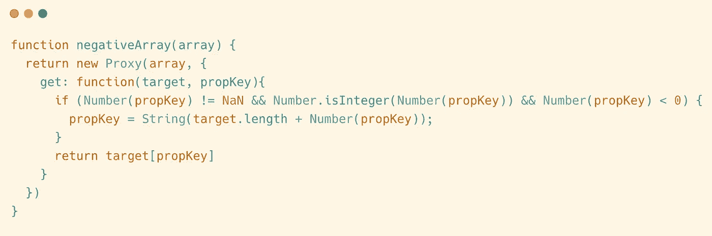
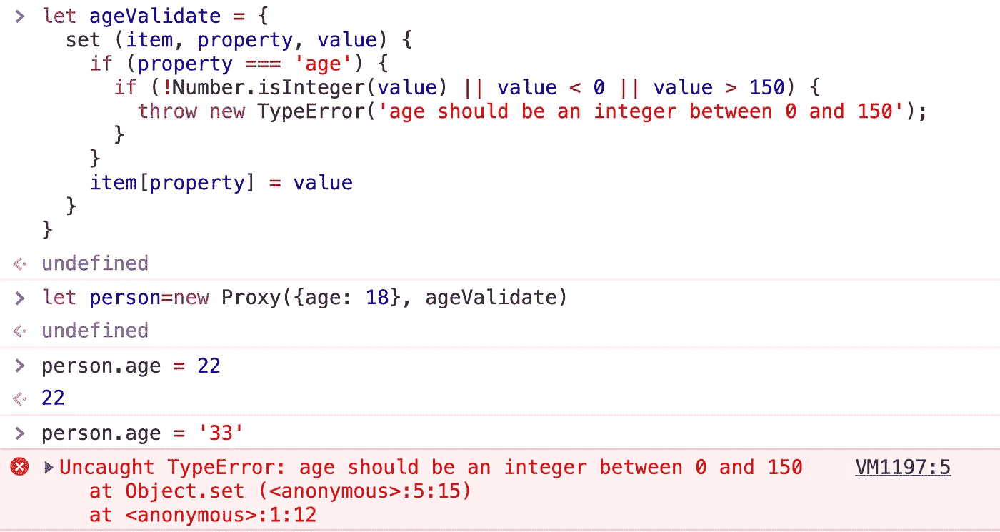

# 为什么代理是 JavaScript 中的瑰宝？

> 原文：<https://javascript.plainenglish.io/why-proxies-in-javascript-are-fantastic-db100ddc10a0?source=collection_archive---------0----------------------->

## 4 个实际例子帮助您掌握 JavaScript 的这一强大特性


Photo by [Christopher Robin Ebbinghaus](https://unsplash.com/@cebbbinghaus?utm_source=medium&utm_medium=referral) on [Unsplash](https://unsplash.com?utm_source=medium&utm_medium=referral)

什么是代理？它到底是做什么的？在解释这一点之前，让我们看一个真实世界的例子。

我们每个人在日常生活中都有很多事情要做，比如看邮件、收快递等等。有些时候，我们可能会感到有些焦虑:我们的邮件列表中有大量的垃圾邮件，需要花费大量的时间来筛选；收到的货物中可能有恐怖分子放置的炸弹，威胁到我们的安全。

这时你可能需要一个忠诚的管家。你希望管家帮你做以下事情:在你开始阅读之前，让它检查你的收件箱并删除所有垃圾邮件；当你收到包裹时，让它用专业设备检查包裹，确保里面没有炸弹。

在上面的例子中，管家是我们的代理。当我们试图做某事时，管家为我们做了额外的事情。

现在让我们回到 JavaScript。我们知道 JavaScript 是面向对象的编程语言，没有对象就写不出代码。但是 JavaScript 对象总是裸着运行的，你可以用它们做任何事情。很多时候，这使得我们的代码不太安全。

ECMAScript2015 中引入的代理功能。通过代理，我们可以为对象找到一个忠实的管家，帮助我们增强对象的原有功能。

在最基本的层面上，使用代理的语法如下所示:

```
// This is a normal object
let obj = {a: 1, b:2}// Configure obj with a housekeeper using Proxy
let objProxy = new Proxy(obj, handler)
```

这只是一个代码提示。因为我们还没有写处理程序，所以这段代码暂时不会正确运行。

对于一个人来说，我们可能会有阅读邮件、收取快递等操作。，管家可以帮我们做。对于一个对象，我们可以读取属性、设置属性等等，这些也可以通过代理对象来增强。

在处理程序中，我们可以列出我们想要代理的动作。例如，如果我们想在控制台中打印出一条语句，同时获取一个对象属性，我们可以这样写:


```
let obj = {a: 1, b:2}
// Use Proxy syntax to find a housekeeper for the object
let objProxy = new Proxy(obj, {
  get: function(item, property, itemProxy){
    console.log(`You are getting the value of '${property}' property`)
    return item[property]
  }
})
```

在上面的例子中，我们的处理程序是:

```
{
  get: function(item, property, itemProxy){
    console.log(`You are getting the value of '${property}' property`)
    return item[propery]
 }
```

当我们试图读取对象的属性时，get 函数就会执行。


`get`函数可以接受三个参数:

*   `item`:是物体本身。
*   `proerty`:您正在尝试读取的物业名称。
*   `itemProxy`:是我们刚刚创建的管家对象。

*你可能在别处读过关于 Proxy 的教程，你会注意到我对参数的命名与他们不同。我这样做是为了更接近我之前的例子，以帮助您理解。我希望这对你有用。*

那么`get`函数的返回值就是读取这个属性的结果。因为我们还不想改变任何东西，所以我们只返回原始对象的属性值。

如果有必要，我们也可以改变结果。例如，我们可以这样做:


```
let obj = {a: 1, b:2}let objProxy = new Proxy(obj, {
  get: function(item, property, itemProxy){
    console.log(`You are getting the value of '${property}' property`)
    return item[property] * 2
  }
})
```

以下是读取其属性的结果:


我们将通过真实的例子来说明这个技巧的实际应用。

除了拦截对属性的读取，我们还可以拦截对属性的修改。像这样:


```
let obj = {a: 1, b:2}let objProxy = new Proxy(obj, {
  set: function(item, property, value, itemProxy){
    console.log(`You are setting '${value}' to '${property}' property`)
    item[property] = value
  }
})
```

当我们试图设置对象的属性值时，set 函数被触发。


因为我们需要在设置属性值时传递一个额外的值，所以上面的`set`函数比`get`函数多接受一个参数。

除了拦截对属性的读取和修改，Proxy 还可以拦截对对象的总共 13 个操作。

它们是:

*   **get(item，propKey，itemProxy):** 拦截对象属性的读取操作，如`obj.a`、`ojb['b']`
*   **set(item，propKey，value，itemProxy):** 拦截对象属性的设置操作，如`obj.a = 1`。
*   **has(item，propKey):** 拦截`propKey in objProxy`的运算，返回一个布尔值。
*   **deleteProperty(item，propKey):** 拦截`delete proxy[propKey]`的操作，返回一个布尔值。
*   **ownKeys(item):** 拦截`Object.getOwnPropertyNames(proxy)`、`Object.getOwnPropertySymbols(proxy)`、`Object.keys(proxy)`、`for...in`等操作，返回一个数组。方法返回所有目标对象自身属性的属性名，而`Object.keys()`的返回结果只包含目标对象自身的可枚举属性。
*   **getOwnPropertyDescriptor(item，propKey):** 拦截`Object.getOwnPropertyDescriptor(proxy, propKey)`的操作，返回属性的描述符。
*   **defineProperty(item，propKey，propDesc):** Intercepter 这些操作:`Object.defineProperty(proxy, propKey, propDesc）`，`Object.defineProperties(proxy, propDescs)`，返回一个布尔值。
*   **prevent extensions(item):**拦截`Object.preventExtensions(proxy)`的操作，返回一个布尔值。
*   **getPrototypeOf(item):** 拦截`Object.getPrototypeOf(proxy)`的操作，返回一个对象。
*   **isExtensible(item):** 截取`Object.isExtensible(proxy)`的操作，返回一个布尔值。
*   **setPrototypeOf(item，proto):** 拦截`Object.setPrototypeOf(proxy, proto)`的操作，返回一个布尔值。

如果目标对象是一个函数，还有两个额外的操作需要拦截

*   **apply(item，object，args):** 拦截函数调用操作，如`proxy(...args)`、`proxy.call(object, ...args)`、`proxy.apply(...)`。
*   **construct(item，args):** 拦截代理实例作为构造函数调用的操作，比如`new proxy(...args)`。

有些拦截不常用，就不赘述了。现在让我们进入现实世界的例子，看看代理实际上能为我们做什么。

# 1.实现数组的负索引

我们知道其他一些编程语言，比如 Python，支持对数组的负索引访问。

负索引以数组的最后一个位置为起点，向前计数。比如:

*   arr[-1]是数组的最后一个元素。
*   arr[-3]是数组中倒数第三个元素。

许多人认为这是一个非常有用的特性，但不幸的是，JavaScript 目前不支持负索引语法。


但是 JavaScript 中强大的代理给了我们元编程的能力。

我们可以将数组包装成代理对象。当用户试图访问负索引时，我们可以通过代理的 get 方法拦截这个操作。然后，根据之前定义的规则，将负索引转换为正索引，访问完成。

让我们从一个基本操作开始:截取数组属性的读取。


```
function negativeArray(array) {
  return new Proxy(array, {
    get: function(item, propKey){
      console.log(propKey)
      return item[propKey]
    }
  })
}
```

上面的函数可以包装一个数组，所以让我们看看它是如何使用的。


如您所见，我们对数组属性的读取确实被拦截了。

请注意:*JavaScript 中的对象只能有一个字符串或符号类型的键。当我们写* `*arr[1]*` *的时候，其实就是在访问* `*arr[‘1’]*` *。关键是字符串* `*‘1’*` *，而不是数字* `*1*` *。*

所以现在我们需要做的是:当用户试图访问一个属性，这个属性是一个数组的索引，并且发现它是一个负索引时，那么拦截并相应地处理它；如果属性不是一个指数，或者如果指数是正的，我们不做任何事情。

结合以上需求，我们可以编写下面的模板代码。


```
function negativeArray(array) {
  return new Proxy(array, {
    get: function(target, propKey){
      if(/** the propKey is a negative index */){
        // translate the negative index to positive
      }
      return target[propKey]
  })
}
```

那么我们如何识别负指数呢？很容易出错，所以我要说得更详细一些。

首先，Proxy 的 get 方法会拦截对数组所有属性的访问，包括对数组的一个索引的访问和对数组其他属性的访问。仅当属性名可以转换为整数时，才执行访问数组中元素的操作。我们实际上需要截取这个操作来访问数组中的元素。

我们可以通过检查一个数组的属性是否可以转换成整数来确定它是否是一个索引。

```
Number(propKey) != NaN && Number.isInteger(Number(propKey))
```

所以，完整的代码可以写成这样:



```
function negativeArray(array) {
  return new Proxy(array, {
    get: function(target, propKey){
      if (Number(propKey) != NaN && Number.isInteger(Number(propKey)) && Number(propKey) < 0) {
        propKey = String(target.length + Number(propKey));
      }
      return target[propKey]
    }
  })
}
```

这里有一个例子:


# 2.数据有效性

众所周知，javascript 是一种弱类型语言。通常，当一个对象被创建时，它是裸运行的。任何人都可以修改。

但是大多数情况下，对象的属性值需要满足某些条件。例如，记录用户信息的对象在其年龄字段中应该有一个大于 0 的整数，通常小于 150。

```
let person1 = {
  name: 'Jon',
  age: 23
}
```

但是，默认情况下，JavaScript 不提供安全机制，您可以随意更改该值。

```
person1.age = 9999
person1.age = 'hello world'
```

为了使我们的代码更加安全，我们可以用代理来包装我们的对象。我们可以截取对象的 set 操作，验证 age 字段的新值是否符合规则。


```
let ageValidate = {
  set (item, property, value) {
    if (property === 'age') {
      if (!Number.isInteger(value) || value < 0 || value > 150) {
        throw new TypeError('age should be an integer between 0 and 150');
      }
    }
    item[property] = value
  }
}
```

现在我们尝试修改这个属性的值，我们可以看到我们设置的保护机制正在工作。



# 3.关联属性

很多时候，一个对象的属性是相互关联的。例如，对于存储用户信息的对象，其[邮政编码](https://en.wikipedia.org/wiki/Postal_code)和位置是两个高度相关的属性。当用户的邮政编码确定后，他的位置也就确定了。

为了适应不同国家的读者，我在这里使用一个虚拟的例子。假设位置和邮政编码具有以下关系:

```
JavaScript Street  --  232200Python Street -- 234422Golang Street -- 231142
```

这就是用代码表达他们关系的结果。

```
const location2postcode = {
  'JavaScript Street': 232200,
  'Python Street': 234422,
  'Golang Street': 231142
}const postcode2location = {
  '232200': 'JavaScript Street',
  '234422': 'Python Street',
  '231142': 'Golang Street'
}
```

然后看一个例子:

```
let person = {
  name: 'Jon'
}person.postcode = 232200
```

我们希望能够在设置`person.postcode=232200`时自动触发`person.location='JavaScript Street'`。

以下是解决方案:


```
let postcodeValidate = {
  set(item, property, value) {
    if(property === 'location') {
      item.postcode = location2postcode[value]

    }
    if(property === 'postcode'){
      item.location = postcode2location[value]
    }
  }
}
```


所以我们将`postcode`和`location`绑定在一起。

# 4.私有财产

我们知道 JavaScript 从来不支持私有属性。这使得我们在编写代码的时候无法合理地管理访问权限。

为了解决这个问题，JavaScript 社区的惯例是以字符`_`开头的字段被视为私有属性。

```
var obj = {
  a: 1,
  _value: 22
}
```

上述`_value`房产被视为私有。但是，需要注意的是，这只是一个约定，在语言层面没有这样的规则。

现在我们有了代理，我们可以模拟私有属性特性。

与普通房产相比，私有房产具有以下特点:

*   无法读取此属性的值
*   当用户试图访问对象的键时，该属性不明显

然后，我们可以检查前面提到的代理的 13 个拦截操作，并看到有 3 个操作需要被拦截。


```
function setPrivateField(obj, prefix = "_"){
  return new Proxy(obj, {
    // Intercept the operation of `propKey in objProxy`
    has: (obj, prop) => {}, // Intercept the operations such as `Object.keys(proxy)`
    ownKeys: obj => {}, //Intercepts the reading operation of object properties
    get: (obj, prop, rec) => {})
    });
}
```

然后，我们将适当的判断语句添加到模板中:如果发现用户试图访问以`_`开头的字段，访问将被拒绝。


```
function setPrivateField(obj, prefix = "_"){
  return new Proxy(obj, {
    has: (obj, prop) => {
      if(typeof prop === "string" && prop.startsWith(prefix)){
        return false
      }
      return prop in obj
    },
    ownKeys: obj => {
      return Reflect.ownKeys(obj).filter(
        prop => typeof prop !== "string" || !prop.startsWith(prefix)
      )
    },
    get: (obj, prop) => {
      if(typeof prop === "string" && prop.startsWith(prefix)){
        return undefined
      }
      return obj[prop]
    }
  });
}
```

这里有一个例子:

