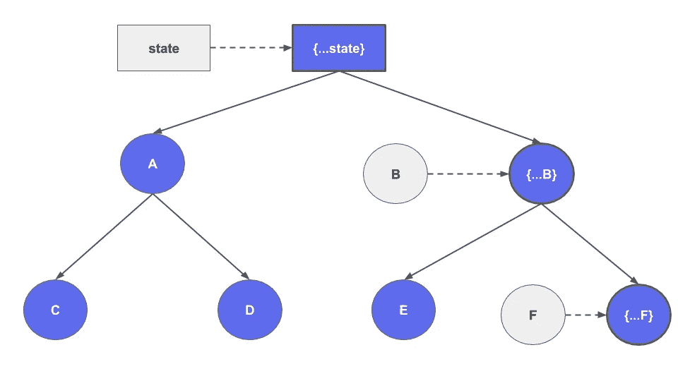
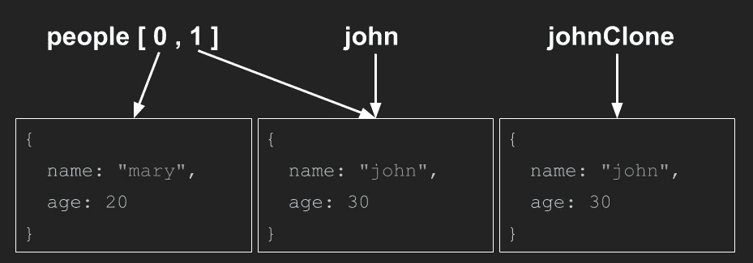
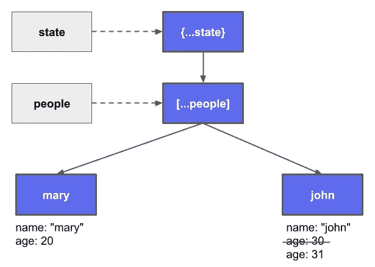
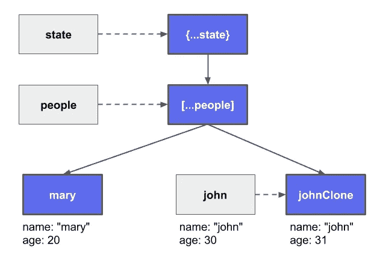

# 为什么 React 和 Redux 需要不可变的数据

> 原文：<https://javascript.plainenglish.io/why-react-and-redux-need-immutable-data-dae3ab3611a0?source=collection_archive---------3----------------------->

## 用图画和例子来解释，这样我们才能最终理解它。

## 简短回答:

React 在决定是否应该重新渲染组件时使用 *shallowCompare* 。

## *参考文献*

为了理解 *shallowCompare* ，我们首先需要知道 JavaScript 如何处理对象引用。让我们看一个例子:

`johnClone`和`john`同名同岁，但他们不是同一个人。
我们在申报`john = people[1]`的时候，并没有把`people[1]`的名字和年龄复制到`john`。两个变量都指向同一个对象作为引用。

## 浅层比较

现在，让我们来看一个*浅层比较*的例子:

如果我们想安慰约翰的更新，我们需要克隆它。这样， *shallowCompare* 就知道道具变了。

## 反应示例

React 使用相同的原理来避免不必要的组件重新渲染。

如果我们单击按钮，组件将不会呈现 john 的更新，因为`people[1]`是上次的相同引用。出于这个原因，我们不能变异`john`。我们需要先克隆`john`，然后更新数组。

意识到我们没有克隆`people[0]`(玛丽)。不可变数据并不意味着我们必须详尽地克隆所有对象的分支。这不是很有效率。我们只需要通过我们更改的路径创建新的引用。