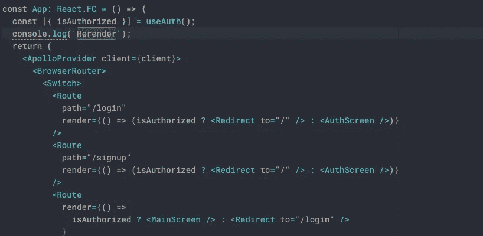
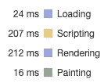
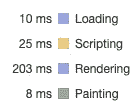
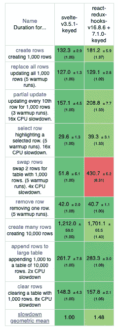
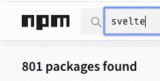
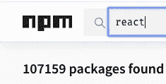

# 为什么苗条不会杀死反应

> 原文：<https://javascript.plainenglish.io/why-svelte-wont-kill-react-3cfdd940586a?source=collection_archive---------0----------------------->

## 这要归咎于现状吗？还是反应简单更好？

当我刚开始阅读《苗条博士》时，我发现它非常鼓舞人心，并打算在 Medium 上写一篇关于它的悼词。在阅读了来自官方博客和社区的几篇文章后，我意识到这不会发生，因为我注意到了 JavaScript 世界中一些常见言论的迹象——这种言论让我**非常不安。**

> 嘿，还记得那个人类强大的头脑 30 年来一直试图解决的问题吗？我刚刚找到了一个通用的解决方案！为什么它还没有征服世界？应该很明显。脸书的营销团队正在密谋反对我们。

在我看来，与现有的工具相比，可以说你的工具是革命性的。很难对你自己的创作完全没有偏见，我明白。这里有一个正面的例子——我认为 Vue 在[方面做得非常好](https://vuejs.org/v2/guide/comparison.html),与其他解决方案相比。是的，有一些我不同意的值得怀疑的说法，但它们传达了一个建设性的信息:

> 我们有这种方法，这里有一些其他现有的方法。我们认为我们的更好，原因如下。这里有一些常见的反驳论点。

相反，官方的苗条博客最终通过只展示硬币的一面来欺骗读者，有时通过关于网络技术和其他 libs 的预先虚假陈述(我主要指的是 React，因为我更了解它)。所以在今天的文章中，我将主要烤苗条只是为了平衡它。话虽如此，我仍然认为这背后有一个绝妙的想法，我会在文章的最后告诉你为什么😊


[imgflip.com](https://imgflip.com/i/122lno)

# 什么是苗条？

Svelte 是一个构建用户界面的工具。与更流行的框架(如 React 和 Vue)不同，它们利用虚拟 DOM 从组件输出中发出高效的 DOM 更新，Svelte 使用静态分析在构建时创建 DOM 更新代码。这是一个细长组件的样子:

**App.svelte**

```
<script>
 import Thing from './Thing.svelte';let things = [
  { id: 1, color: '#0d0887' },
  { id: 2, color: '#6a00a8' },
  { id: 3, color: '#b12a90' },
  { id: 4, color: '#e16462' },
  { id: 5, color: '#fca636' }
 ];function handleClick() {
  things = things.slice(1);
 }
</script><button on:click={handleClick}>
 Remove first thing
</button>{#each things as thing}
 <Thing color={thing.color}/>
{/each}
```

**身材苗条**

```
<script>
 export let color;
</script><p>
 <span style="background-color: {color}">current</span>
</p><style>
 span {
  display: inline-block;
  padding: 0.2em 0.5em;
  margin: 0 0.2em 0.2em 0;
  width: 4em;
  text-align: center;
  border-radius: 0.2em;
  color: white;
 }
</style>
```

等效反应组分:

```
import React, {useState} from 'react'
import styled from 'styled-components';const things = [
  { id: 1, color: '#0d0887' },
  { id: 2, color: '#6a00a8' },
  { id: 3, color: '#b12a90' },
  { id: 4, color: '#e16462' },
  { id: 5, color: '#fca636' }
 ];const Block = styled.span`
  display: inline-block;
  padding: 0.2em 0.5em;
  margin: 0 0.2em 0.2em 0;
  width: 4em;
  text-align: center;
  border-radius: 0.2em;
  color: white;
  background-color: ${props => props.backgroundColor}
`;const Thing = ({color}) => {
  return (
    <p>
      <Block backgroundColor={color} />
    </p>
  );
}export const App = () => {
  const [things, setThings] = useState(things);
  const removeFirstThing = () => setThings(things.slice(1))
  return (
    <>
      <button onClick={removeFirstThing} />
      {things.map(thing =>
        <Thing key={thing.key} color={thing.color} />
      }
    </>
  );
}
```

## 苗条不是一个框架——它是一种语言

它不仅仅是用`<script>`和`<style>`添加类似 Vue 的“单个文件组件”。它向语言中添加了一些构造来解决 UI 开发中最复杂的问题之一——状态管理。

[我的上一篇文章](https://medium.com/swlh/what-is-the-best-state-container-library-for-react-b6989a45f236)介绍了使用 JavaScript 在 React 中解决这个问题的各种方法。Svelte 利用其作为编译器的地位，使反应性成为一种语言特征。在 Svelte 中有两个新的语言结构服务于这个目的。

*   子句[前的`$:`运算符使该子句成为反应性的](https://svelte.dev/tutorial/reactive-declarations)，即每次它读取的一些变量更新时，都会重新执行该子句。一个语句可以是一个赋值(又名“相关”或“派生”变量)，或者一个代码块或一个调用(又名“效果”)。这有点类似于 MobX 方法，但是内置于语言中。
*   `$`操作员[创建一个对存储库](https://svelte.dev/tutorial/auto-subscriptions)(状态容器)的订阅，当组件被卸载时，该订阅被自动取消

Svelte 的反应性概念允许使用常规 JS 变量作为状态——不需要状态容器。但是真的能提高 DX 吗？


[reddit.com](https://www.reddit.com/r/PrequelMemes/comments/arg2rb/when_people_think_obiwan_only_says_i_dont_think/)

# 斯维尔特的反应性

> React 最初的承诺是，你可以在每次状态改变时重新渲染整个应用程序，而不用担心性能。实际上，我不认为这是准确的。如果是的话，就不需要像`shouldComponentUpdate`(这是一种告诉 React 什么时候可以安全跳过某个组件的方法)——Rich Harris，Svelte 的维护者
> 
> 真正的问题是程序员在错误的地方和错误的时间花了太多的时间担心效率；**过早优化是编程中所有罪恶(或者至少是大部分罪恶)的根源**。—唐纳德·克努特，美国 scientist⁴计算机公司

首先，我们先说清楚。即使你的代码中没有任何单个的`shouldComponentUpdate`，React **也不会在每次状态改变时**重新呈现你的整个应用。检查起来非常简单——你需要做的就是给你的应用程序的根组件添加一个`console.log`调用。



在这种特殊情况下，`App`不会被重新渲染，除非`isAuthorized`状态改变。对任何子组件的更改都不会导致`App`组件被重新渲染。仅当组件自身的状态发生变化时，或者由 React 上下文触发时，或者在父组件重新渲染期间，才会重新渲染组件。

后一种情况为所谓的*浪费的渲染*创造了空间——这是一种预先知道父级重新渲染不会导致子级 DOM 层次结构发生任何变化，但子级仍然被重新渲染的情况。当子道具不变或者这种特殊的变化不应该影响屏幕上的可见内容时，就会发生这种情况。为了避免浪费渲染，你可以定义 shouldComponentUpdate(或者使用`React.memo`作为一个更现代的功能替代)。

## 优化必须是例外的，而不是默认的

在绝大多数情况下，浪费渲染没有任何问题。它们占用的资源如此之少，以至于人眼根本无法察觉。事实上，与简单地重新渲染整个子树相比，将每个组件的属性与其之前的属性进行比较(我甚至没有深入讨论)可能会占用更多的资源。这也是 React 默认回退到`shouldComponentUpdate: () => true`的原因。此外，React 团队甚至从开发工具中删除了“高亮更新”功能，因为人们过去常常痴迷于浪费的渲染，而 it⁵.背后没有任何理由

这是一种非常危险的做法，因为每次优化都意味着做出假设。如果你正在压缩一个图像，你假设一些有效负载可以被删除而不会严重影响质量，如果你在后端添加一个缓存，你假设 API 将返回相同的结果。正确的假设可以让你节省资源。一个错误的假设会在你的应用中引入一个 bug。这就是为什么优化要有意识的去做。

Svelte 选择了相反的方法。它不会在更新时重新运行组件的代码，除非使用`$:`操作符明确地告诉它这样做。我不想花费几十个小时来搜索我忘记添加的地方，并试图找出为什么我的应用程序不工作——以便我的用户可以享受 20 毫秒更快的重新渲染。如果偶尔有分量重的，我会优化，但那是极其罕见的场合。这将是毫无意义的围绕它旋转我的 DX。

## Svelte 的优化不是最佳的

顺便说一下，如果我们得到技术，Svelte 的检查是否需要更新并不总是最佳的。让我们假设我有一个计算非常昂贵的组件，它接受以下形状的道具:`Array<{id: string, otherProps}>`。假设我知道 id 是惟一的，数组项是不可变的，我可以使用下面的代码来判断是否需要更新:

```
const shouldUpdate = (prevArr, nextArr) => {
  if (prevArr.length !== nextArr.length) return true;
  return nextArr.some((item, index) => item.id !== prevArr[index].id)
}
```

没有办法在 Svelte 中指定自定义反应比较器，它将回退到这个比较数组:

```
export function safe_not_equal(a, b) { 
  return a != a ? b == b : a !== b 
    || ((a && typeof a === 'object') || typeof a === 'function');
}
```

我知道我可以在苗条者的比较器上使用一些第三方记忆工具**，但是我在这里的观点是——没有神奇的药丸,“开箱即用”的优化通常会有局限性。**

## 不明确的状态更新

每当你需要更新 React 中的状态时，你必须调用`setState`。为了让你的状态更新得更苗条:

> …更新变量的名称必须出现在赋值的左边。

Svelte 神奇地添加了一个调用内部运行时无效函数来触发反应。这可能会带来一些疯狂的模式。

```
const foo = obj.foo;
foo.bar = 'baz';
obj = obj; // If you don't do this, update will not happen
```

使用`push`或其他变异方法更新数组也不会自动触发组件更新。所以你必须使用数组或对象展开:

```
arr = [...arr, newItem];
obj = {...obj, updatedValue: newValue};
```

基本上与 React 相同，除了在 React 中你调用一个函数并将更新后的状态传递给它，而在 Svelte 中你会有一种错觉，你正在处理常规的可变变量。这就把这个魔术的要点简化为“嘿，看多酷啊，Svelte 是个编译器”。

# 虚拟 DOM

> 虚拟 DOM 是有价值的，因为它允许你在不考虑状态转换的情况下构建应用，其性能一般来说足够好——svelte⁶的维护者 Rich Harris

在这个苗条的博客中，几乎每一篇文章都声称虚拟 DOM [是一个不必要的开销](https://svelte.dev/blog/virtual-dom-is-pure-overhead)，而且相当高，可以很容易地用预生成的 DOM 更新程序免费替换。但是这种说法正确吗？部分地。


[quickmeme.com](http://www.quickmeme.com/meme/362wa3)

## 虚拟 DOM 会增加开销吗？

是的，完全正确。vDOM 不是一个特性，只是把它添加到你的应用程序中并不能神奇地让底层的“真正的”DOM 和浏览器变得更快。这只是将易于编写、阅读和调试的声明性代码转换成执行成本相对较低的高效命令式 DOM 操作的可能方法之一。

但是开销总是不好的吗？我相信不会——否则苗条的维护者将不得不用 Rust 或 C 编写他们的编译器，因为垃圾收集器是 JavaScript 的最大开销。我想当他们决定编译器的堆栈时，他们做了一个权衡——开销有多高与社区在交换中得到的好处。在这种情况下，开销相对较低——您的设备上没有持续运行的编译器，您只是不时地运行它，涉及的计算相对较少，几秒钟不会对 UX 产生很大影响。另一方面，因为 Svelte 基于 JavaScript，并以 JavaScript 作为执行环境，用 TS/JS 编写工具为 DX 提供了相对巨大的好处——每个对该工具感兴趣的人——因此可能想要贡献或可能需要研究编译器源代码——都可能知道 JavaScript。

所以开销总是一个权衡。在虚拟 DOM 的情况下，这样做值吗？

## 虚拟 DOM 的成本

下载、解析和渲染一个 React 应用需要多长时间？

第一个问题由里奇·哈里斯自己回答:

> 我们向用户发送了太多的代码。像许多前端开发人员一样，我一直否认这个事实，认为在页面加载上提供 100kb 的 JavaScript 是没问题的——只需要少用一个[。jpg！](https://twitter.com/miketaylr/status/227056824275333120) ⁷

但是他接着写了一张纸条:

> 100 千磅的。js 并不等同于 100kb 的. jpg。不仅仅是网络时间会扼杀你的应用程序的启动性能，而是花在解析和评估你的脚本上的时间，在此期间，浏览器变得完全没有反应。⁷

听起来很严重，让我们用谷歌浏览器的审计工具做一些测量。幸运的是，多亏了现实世界，我们才有了这种可能性。

[React-redux](https://react-redux.realworld.io/) :



[身材苗条](https://realworld.svelte.dev/):



差别是 0.15 秒——这意味着可以忽略不计。

但是基准呢？svelet 博客提到的基准测试表明，刷 1000 行需要 React 430.7ms 毫秒，而 svelet 可以在 51.8 毫秒内完成

但这一指标并不可靠，因为 React 做出的[协调假设](https://reactjs.org/docs/reconciliation.html)导致这一特定操作是 React 的弱点——这种情况在现实世界的应用中非常罕见，相同的基准测试表明 React 和 Svelte 在几乎所有其他情况下的差异也可以忽略不计。



Svelte an React-redux on hooks comparation

现在是我们最终意识到应该有所保留地对待这些基准的时候了。我们有窗口和虚拟化，一次呈现 1000 行无论如何都不是一个好主意。说真的，你做过吗？


[tenor.com](https://tenor.com/view/well-then-your-are-lost-you-are-lost-obi-wan-kenobi-starwars-gif-7897510)

但是苗条的维护者声称 vDOM 是完全不必要的——那么为什么要浪费任何资源呢？

## vDOM 的黑仔特性

vDOM 有一个杀手锏，是 Svelte 无可替代的。它是将组件层次结构视为一个对象的能力。

反应代码:

```
const UnorderedList = ({children}) => (
  <ul>
    {
      children.map((child, i) => <li key={i}>{child}</li>
    }
  </ul>
)const App = () => (
  <UnorderedList>
    <a href="http://example.com">Example</a>
    <span>Example</span>
    Text
  </UnorderedList>
);
```

这对于 React 来说是一个非常简单的任务，而对于 Svelte 来说几乎是不可能的。因为模板不是图灵完全的，即使是，它们也需要 vDOM。这看起来可能是一件小事，但对我来说，这比给我的应用程序增加 0.15-0.25 秒的交互时间更有道理。这正是我们需要 vDOM 的原因——我们可能不需要它来进行反应式状态更新、条件渲染或列表渲染，但只要我们拥有它，我们就可以将组件层次结构视为完全动态和可控的对象。如果没有这个特性，你就不能编写一个真正的完全声明性的应用程序。

# 临时限制(将来可能会得到解决)

这里有几个不使用苗条身材的额外理由，它们可能会被修正。但这需要大量的社区努力，只要成本大于收益，这就不会发生。

## 不支持类型脚本

因为 Svelte 使用模板，所以很难实现我们在 React 中喜欢的带有道具检查的完整类型支持。这要么需要对 Microsoft TypeScript 实现进行重大修改(这不太可能发生，因为 Svelte 的影响力远不如 React)，要么需要某种需要持续维护的分支。代码生成也是一个选项，但是对元素层次结构中的每个细微变化运行 codegen 是一个可怕的 DX。

## 粗糙

> 考虑互操作性。想要`npm install cool-calendar-widget`并在你的 app 中使用？以前，只有当你已经在使用(一个正确版本的)小部件设计的框架时，你才能这样做——如果`cool-calendar-widget`是在 React 中构建的，而你使用的是 Angular，那么，嗯，硬奶酪。但是如果 widget 的作者使用了 Svelte，那么使用它的应用程序可以使用任何你喜欢的技术来构建。—里奇·哈里斯，Svelte⁷的维护者

我已经有了我能想到的任何 React 工具——十几个 GraphQL 客户端、30 多个表单状态管理器、数百个日期时间输入。



NPM search for “svelte”



NPM search for “react”

这在 2013 年可能会是一个杀手级的功能，但现在已经不重要了。

# 前途光明？

尽管有上述限制，我认为苗条实际上提出了一个宝贵的想法。是的，在不牺牲灵活性和代码可重用性的情况下，你无法通过模板完全表达一个现代的应用程序。但是**我们的应用程序所做的绝大多数事情都只是条件和列表渲染。话又说回来，如果我只使用了`onChange={e => setState(e.target.value)}`并在我的组件中渲染了十几个`<div>`，为什么我需要在我的包中支持键盘事件、滚轮事件和内容可编辑？**

老实说，我不相信苗条在它目前的形式能打败反应和征服世界。如果有一个框架，不增加任何特定的限制，但是 100%树摇动所有未使用的部分，这将是很酷的。并产生一些可以在运行时使用的关于其正确执行的构建时提示。

# 关于可读性的一个注记

我们已经知道，Svelte 的关键特性不是性能(好处可以忽略不计)，不是魔力(对于 JavaScript 来说，有一些不自然的警告，以至于你很难对它们进行推理，+缺乏开发工具增加了额外的乐趣)，也不是互操作性(在 2014 年将是一件大事，但今天我们几乎拥有 React-NG-Vue“三巨头”的一切)。但是可读性呢？

> 差别如此明显是不寻常的——根据我的经验，一个 React 组件通常比它的瘦对等物——svelte⁸.的维护者 Rich Harris 大 40%左右


[youtube.com](https://www.youtube.com/watch?v=byP3lzjuQH4)

每段代码你只写一遍，读很多遍。我知道这是一个品味问题，也是一个有争议的问题，我发现 JSX 和常规的 javascript 流操作符比任何种类的`{#blocks}`和指令更具可读性。在 Vue 的人气达到顶峰之前，我曾经是它的忠实粉丝。然后在某个时刻，我偶然发现了模板的局限性和不可表达性，并开始到处使用 JSX——因为 JSX 不是 Vue 的典型事物，我切换到随着时间的推移做出反应。我不想后退一步。

**感谢阅读！😍**

我希望你喜欢这篇文章。如果你有笔记，想要讨论或辩论——我们竭诚欢迎你发表评论！

参考资料:

【1】:[https://svelte.dev/](https://svelte.dev/)

[2]:[https://github . com/sveltejs/rfcs/blob/master/text/0001-reactive-assignments . MD](https://github.com/sveltejs/rfcs/blob/master/text/0001-reactive-assignments.md)

【3】:[https://svelte.dev/blog/virtual-dom-is-pure-overhead](https://svelte.dev/blog/virtual-dom-is-pure-overhead)

【4】:[https://en.wikiquote.org/wiki/Donald_Knuth](https://en.wikiquote.org/wiki/Donald_Knuth)

[5]:[https://www . Reddit . com/r/react js/comments/cqx 554/introducing _ the _ new _ react _ dev tools/ex 1 r9 nb/](https://www.reddit.com/r/reactjs/comments/cqx554/introducing_the_new_react_devtools/ex1r9nb/)

[6]:[https://svelte.dev/blog/virtual-dom-is-pure-overhead](https://svelte.dev/blog/virtual-dom-is-pure-overhead)

[7]:[https://svelte.dev/blog/frameworks-without-the-framework](https://svelte.dev/blog/frameworks-without-the-framework)

[8]:https://svelte.dev/blog/write-less-code