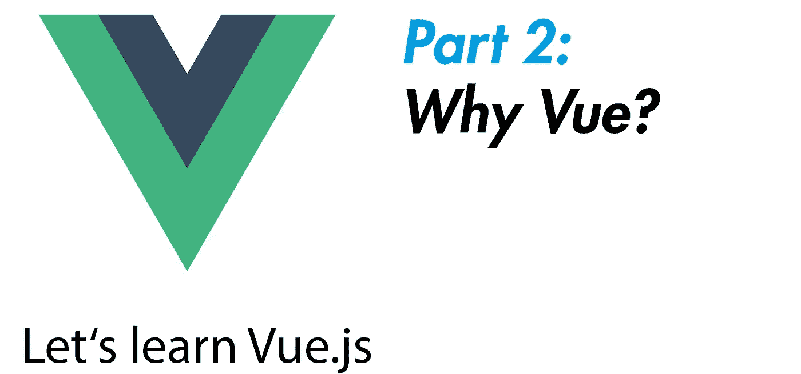

# 为什么是 Vue.js？—让我们学习 Vue.js(第二部分)

> 原文：<https://javascript.plainenglish.io/why-vue-js-lets-learn-vue-js-part-2-a53f1db62a81?source=collection_archive---------4----------------------->

## 让我们学习 Vue.js 系列的第二部分——这次的主题是:“为什么是 Vue.js？”—这里有几个近距离观察 Vue 的好理由



***你错过了第 1 部分？没问题，在那里你可以找到:***

[](https://medium.com/javascript-in-plain-english/our-first-component-lets-learn-vue-js-part-1-2803e2f0656e) [## 我们的第一个组件—让我们学习 Vue.js(第 1 部分)

### 这一系列文章将不断扩展，旨在帮助您开始使用 Vue.js。我们将一点一点地介绍…

medium.com](https://medium.com/javascript-in-plain-english/our-first-component-lets-learn-vue-js-part-1-2803e2f0656e) 

# 我们走吧

是的，不可否认，这是一个奇怪的命令，但我肯定我必须让你相信 Vue.js，然后你才有兴趣继续跟我学习 Vue.js。
和剧透警告:这不是一篇旨在让 Vue 成为唯一&完美选择的肤浅扯淡文章，好像 React & Angular 等所有其他大竞争对手都没有存在的权利。

那不是我的目标，因为那也完全是胡扯。每个大的库/框架都有它存在的权利，它的优点和缺点——但是最终，很多事情都是个人喜好的问题。
这就是为什么这篇文章只旨在向你展示 Vue.js 有很多很棒的站点，所以值得学习。

以下是我最喜欢的你至少应该尝试 Vue.js 的理由

# 围绕 Vue.js，构建了一个具有多种可能性的复杂环境

许多现代框架来自所有的库&基于它们的其他框架。
举个例子，如果没有 Redux &没有 React 路由器，React.js 会是什么样子？Angular，React &公司也有用于其他目的的其他技术，例如服务器端渲染、静态页面、路由、服务器集成等等。甚至智能手机应用程序现在也可以用大型框架库来实现。

## 因此，这里列出了一些技术，它们可以为您带来更多 Vue 功能，让您做更多事情:

*   [**nuxt . js**](https://nuxtjs.org/)**:**哪里有 Next.js for React，哪里就有 Nuxt.js for Vue。对于需要在浏览器中更快渲染的大型应用程序来说，服务器端渲染是绝对必要的。更重要的是，Nuxt.js 提供了将你的 Vue 应用轻松集成到节点后端的功能，就像 Next.js 一样。
*   [此外，VuePress 提供了一些性能改进，例如预取页面，以便您的应用程序像单页应用程序一样在浏览器中运行。](https://vuepress.vuejs.org/)
*   **组件框架:**CSS 框架中绝对经典的当然是 Bootstrap。除了它的 React.js 版本之外，e 还有 [BootstrapVue](https://bootstrap-vue.js.org/) 来帮你省去很多工作。在 vue 社区中也非常受欢迎的是 Vuetify，它专门从事材料设计。
*   **CSS-in-JS:** 我喜欢风格化组件。你也是吗？别担心，Vue 也有人照顾。[https://www.npmjs.com/package/vue-styled-components](https://www.npmjs.com/package/vue-styled-components)
*   **状态管理:**这里的绝对经典大概是 Redux。你甚至可以把它包含在你的 Vue 应用程序中，但是有一个官方的状态管理解决方案:非常棒的 Vuex 。
*   **路由:**这里还有一个官方的解决方案，叫做 [Vue 路由器](https://router.vuejs.org/)。
*   **智能手机应用** : [Vue Native](https://vue-native.io/) 或 [NativeScript](https://www.nativescript.org/) 用于 React Native 这样的原生应用，或者直接使用流行的 [Ionic](https://ionicframework.com/docs/vue/overview) 。

正如你所看到的，Vue 拥有你需要的一切——尽管 Vue 背后没有 React 或 Angular 这样的大公司。只是哇。

# 带不带 CLI？没关系！

关于 Vue，我最喜欢的一点是，你可以使用官方的 CLI，也可以将 Vue 作为脚本标签嵌入到 HTML 中来开始使用。当然，你也可以用 React.js 做到这一点，但你见过它是什么样子吗？如果没有，这里有一个例子:

***同 JSX:***

```
const Message = (props) => ( <h1>{props.msg}</h1> )const Index = () => {
  return (
    <div><Message msg=”hi there” /></div>
  )
}
```

***没有 JSX:***

```
var Message = function Message(props) {
  return _react.default.createElement(“h1”, null, props.msg);
};var Index = function Index() {
  return _react.default.createElement(“div”, null,
    _react.default.createElement(Message, {
      msg: “hi there”
  }));
};
```

是啊，不太好。

这也是现在大家都在用 React 官方 CLI 的原因。
但是对于 Vue.js 来说，这并不是真正必要的，当然对于更大的项目来说，CLI 绝对是值得的，
但是仅仅是为了进入 Vue，甚至作为第一个框架，你可以放松一下，
就像我们在这个系列中所做的那样，不需要 CLI 就可以开始。

而且说到 Vue CLI，绝对棒。Vue CLI 不仅能让您从控制台创建简单的 Vue 应用程序，还能让您随心所欲地构建项目。例如，它让你选择你想要使用的 CSS 预处理程序。
这样你可以在设置项目时节省大量时间&你也可以在 CLI 中直接保存你想要的设置，以便经常访问。

# Vue 的学习曲线非常简单

它被很好地记录下来&有一个巨大的社区。另外，Vue.js 就像是 Angular 和 React 最好的东西的混合体，似乎&将它设置为已知的(比如 Angular.js 的部分语法)。
默认情况下，Vue.js 项目非常清晰，初学者友好&你不需要非常熟悉更复杂的 JavaScript 特性，甚至不需要非常熟悉 Angular 这样的 TypeScript。
尽管 React 在这方面有所改进，但你仍然可以在 React 中找到许多现有的带有经典的基于类的组件的代码，这些组件需要类&构造函数的知识。

# 限定范围的 CSS——保持控制

如果必要的话，Vue 组件的样式是有范围的，即绑定到组件的 HTML 代码——这可以非常方便地避免 CSS 令人讨厌的副作用，例如，如果 CSS 属性突然出现在它们不应该出现的地方。
例如，我们可以在 Vue 中创建两个组件，它们在 HTML 代码中使用相同的 CSS 类名。
在带有“scoped”属性的 style-section 中，我们可以为两个类定义不同的 css 属性——最终一切都会正常工作，一个组件的 CSS 属性不会影响另一个组件的样式，即使它们使用相同的 CSS 类或 ID。

## 这些只是让 Vue.js 尝试一下的一些好的果岭——在我们系列的下一部分再见:让我们学习 Vue.js！

# 关于这个系列

这个系列是这样工作的:在每篇文章中，我们将涉及 Vue.js 的一个重要主题。要学习 Vue.js，你至少应该有 HTML 和 JavaScript 的基础知识。

你总是会在当前文章的末尾找到本系列的下一篇文章作为链接。所以你可以从头到尾点进去。如果你没有找到一篇新文章的链接，说明还没有新文章。如果你想确保不错过一个，那就跟我到 Medium 来。

# 关于 Vue.js 的更多资源:

*   官方[文档](https://vuejs.org/)
*   Udemy，尤其是 Maximilian Schwarzüller 的课程
*   最受好评的[书籍之一](https://amzn.to/2HqFHYN)
*   有用的[备忘单](https://devhints.io/vue)