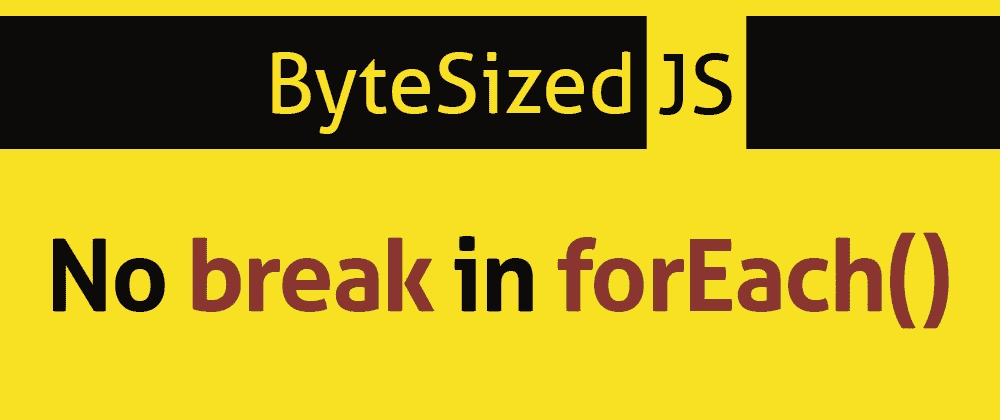

# 为什么在 JavaScript 中不能中断 forEach 循环

> 原文：<https://javascript.plainenglish.io/why-you-cant-break-a-foreach-loop-in-javascript-83f270269e1c?source=collection_archive---------0----------------------->



No break in ForEach()

我最近参加了一次编码面试，涉及到评估一个模式和另一个模式。细节并不重要，但是(在面试过程中)有一点是你不能打破循环。我已经忘记了那件小事，它可能会毁了我被雇用的机会。在你读完这篇文章后，希望你不会犯和我一样的错误！不要像我一样。


# 视频版本

如果你喜欢看而不是读，看看这个的视频版本！

# MDN 无所不知

正如 MDN 所指出的:

> *除了抛出异常，没有其他方法可以停止或中断 forEach()循环。如果需要这样的行为，forEach()方法就是错误的工具*

这是来自 MDN 文档的一些硬核 sass。然而，他们是对的，知道选择哪种工具很重要。

在我们深入了解为什么你不能打破一个`forEach()`之前，让我们检查一下什么是循环，以及`forEach()`从何而来。

# 什么是循环

编程中的一个循环解决了一个很常见的问题:我需要对所有这些数据运行相同的代码。简单来说，就是:

> *一遍又一遍地重复相同的代码(循环)，直到我们达到一个定义的结束状态。*

# 问题是

为了便于比较，我们将使用不同的循环类型来解决同一个问题。问题是这样的:

比较两个数组，看其中的项是否相同。

下面是我们要比较的数据:

```
const jedis = ["Anakin","Luke"]
const sith = ["Palpatine", "Anakin"]
```

我们有两个数组，都有几个名字。你可能会注意到阿纳金既是绝地又是西斯。这是一个微不足道的例子，然而与我在面试中被测试的内容相差不远。

# 一种方式

我不想让你从这篇文章中得到的是一个循环比另一个循环好。它们都提供独特的编程解决方案，并有特定的用例。诀窍在于知道何时使用哪一个。

# 传统 For 循环

如果你曾经上过任何类型的编程课程，你可能已经接触过我们的好朋友`for`循环。很长一段时间以来，它一直是程序员的一个方便工具，今天仍然有用。让我们用它来解决我们的问题。

```
// Our data again, for reference
const jedis = ["Anakin", "Luke"];
const sith = ["Palpatine", "Anakin"];
// start our loop, define our iterator variable
for (let i = 0; i < jedis.length; i++) {
  // create a variable we can reference
  const thisJedi = jedis[i];
  // see if the item in the array we are testing exists
  if (sith.includes(thisJedi)) {
    // If it does exist, then that jedi is also a sith
    console.log(`${thisJedi} is also a Sith`);
    // we can exit out
    break;
  }
  console.log(`${thisJedi} is not a Sith`);
}
```

如果满足我们选择的条件，for 循环提供了一种非常方便的退出代码的方法。这在处理大量数据时非常有用。它对解决一些项目欧拉问题非常有帮助，特别是[这个](https://codeburst.io/project-euler-problem-5-solved-with-javascript-13427e907e71)。

# 新的另一种方式

除此之外，`forEach()`在 2009 年和所有其他在 ES5 中给我们的好处一起被印在了规范中。它是一种方便的方法，可以用来编写简洁的代码，轻松地遍历数组中的项。

# 它在做什么？

`forEach()`循环是对数组中的每一项运行另一个函数(回调)的函数。我们定义回调函数中发生的事情。JS 很好，在函数中给了我们三个参数:

1.  数组中的项目
2.  项目的索引
3.  整个阵列

让我们用一个`forEach()`循环来看看我们的问题。我已经在函数中包含了所有三个参数，但是我们只使用了第一个，即项目，我将它命名为`jedi`

```
// We have to create a global state variable to keep track
    let matching
    // loop over array 
    jedis.forEach((jedi,index,array) => {
      // check to see if jedi is in sith
      if(!sith.includes(jedi)) {
        // if it isn't, set global variable to false
        matching = false
      }
      // it keeps going...
    })
    console.log(matching) // false
```

如果更有意义，可以将回调函数重构为命名函数。我认为这使它更具可读性。它还允许我们在任何需要的地方重用这个函数。耶函数式编程！

```
let matching
function isJediAlsoSith(jedi,index,array) {
    if(!sith.includes(jedi)) {
      matching = false
   }
}
jedis.forEach(isJediAlsoSith)
```

我们的解决方案本质上做同样的事情。唯一的区别是它会一直运行，直到到达`jedis`数组的末尾。对于这么小的数组，我怀疑它会带来多大的性能差异。

# 但是为什么呢？

这终于给我们带来了问题的答案，为什么我们不能打破`forEach()`循环？这是因为循环在每个项目上运行回调函数，所以即使你写了一个`return`，它也只是在函数的那个实例上返回。它继续前进。对于`forEach()`函数，它不会对返回的代码做任何事情。请注意，对于其他一些数组方法来说，情况并非如此。

此外，因此，`break`或`continue`不是有效的语句。

# 其他方式

有相当多不同类型的循环。它们都有不同的目的，我建议仔细研究每一种。你并不总是需要一个`forEach()`循环。


# forEach()与 map()

很可能，教程中最常见的数组方法是`forEach()`和`map()`。两者最大的区别就是`map`会返回一个新数组，而 a `forEach()`不会。

# 传统循环

while 循环

# 数组方法

Array.forEach()

Array.map()

Array.filter()

Array.reduce()

Array.reduceRight()

Array.every()

Array.some()

Array.indexOf()

Array.lastIndexOf()

Array.find()

Array.findIndex()

# 可迭代对象循环(包括数组)

因为在

对于...来说

# 这是方法


正如先前那些非常时髦的 MDN 文档所提到的，选择正确的工具对成功至关重要。一开始，选项的数量可能看起来有点多，但是我喜欢采取这样的方法:“如果它有效，它就是正确的工具。”

一般来说，你可以重构你的代码，但是你只是在浪费时间，你可以构建东西。在我的面试中，我使用了正确的工具，错误的方式。如果我知道并记得不能中断 forEach 循环，事情可能会有所不同🤷🏼‍♂️.

如果你有任何额外的信息分享，请写在下面的评论里！

一如既往，快乐编码。

# 插头

# 书

我正在写一本关于图形设计及其与软件开发的关系的书！如果你感兴趣，在这里注册更新。

[https://digitalnutt.substack.com/p/coming-soon?r=34slo&UTM _ campaign = post&UTM _ medium = web&UTM _ source = copy](https://digitalnutt.substack.com/p/coming-soon?r=34slo&utm_campaign=post&utm_medium=web&utm_source=copy)

# 音乐

我也写音乐！看看这里:[Spotify](https://open.spotify.com/artist/1o6CGTMPjk1C0IdK9jV2H1)|[Youtube](https://www.youtube.com/channel/UCqxQspCPTcE_wH0KBE5J-aw)|[Apple Music](https://music.apple.com/us/artist/modulo/1499420471)

# 支持

如果你喜欢这篇文章并想看更多，最好的方法是订阅/关注我！如果你觉得亲切，你可以请我喝杯咖啡！

## **用简单的英语写的 JavaScript 的注释:**

我们总是有兴趣帮助推广高质量的内容。如果你有一篇文章想用简单的英语提交给 JavaScript，用你的 Medium 用户名给我们发邮件到[submissions@javascriptinplainenglish.com](mailto:submissions@javascriptinplainenglish.com)，我们会把你添加为作者。