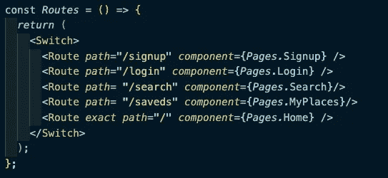
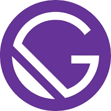
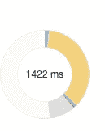
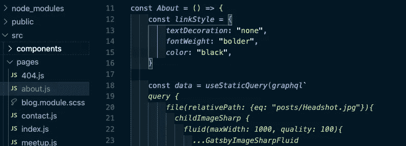
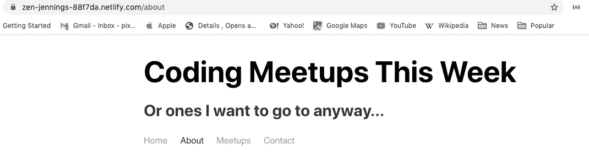
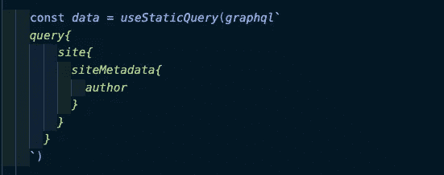
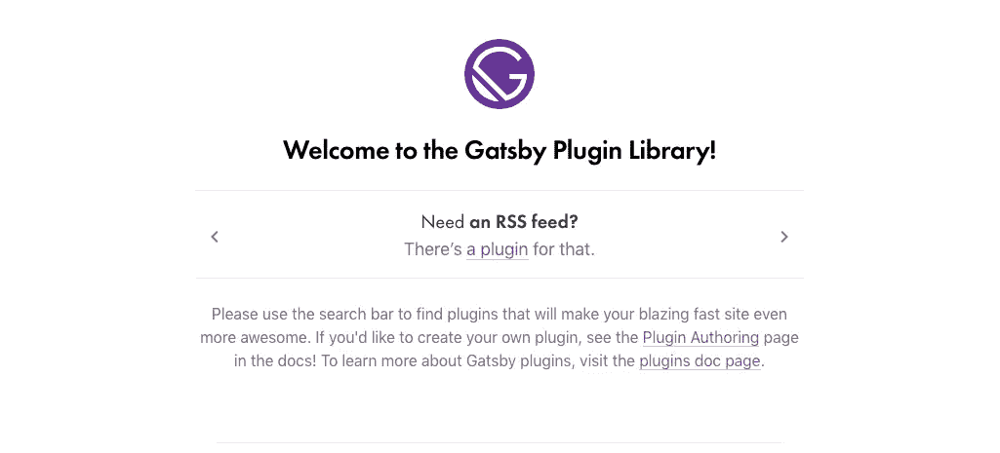

# 为什么你应该用盖茨比

> 原文：<https://javascript.plainenglish.io/why-you-should-be-using-gatsby-a94c1c6efc15?source=collection_archive---------4----------------------->

## {useGatsby}或“我如何学会不再担心并爱上静态站点生成器”

Holy crap I forgot they even made this. Leo! Why???

作为一名最近加入荣耀[**React.js**](https://reactjs.org/) 及其令人敬畏的模块化组件的人，我发现自己不知道自己的学习下一步该何去何从。我觉得自己对 [**Redux**](https://react-redux.js.org/) 有了很好的了解，并建立了几个站点，将较小的部分重构为功能组件，但作为一个不需要学习 C 的爱发牢骚的年轻程序员，我仍然有怨言。

React 可能需要一段时间来加载数据，状态管理可能会很慢，并导致渲染有点跳动，容易因“竞争条件”而出错。( [React 实际上最近开始用一个实验测试版解决这个问题](https://reactjs.org/docs/concurrent-mode-suspense.html))还有， [**React 路由器**](https://reacttraining.com/react-router/) 很烦人！

A lot!

即使这里有超级干净的路由代码(几乎完全抄袭自编码天才 [Mazen Alswar](https://medium.com/u/b72ac0bfd7b?source=post_page-----a94c1c6efc15--------------------------------) )，也有路径，有“精确路径”，有称为“开关”的东西，有“反应路由器”和“反应路由器 Dom”。不要让我开始传递道具！如果我想让这些页面中的任何一个使用父容器中的道具来呈现，我必须将它们抽象成一个函数的返回值([还好我使用了像 Redux 这样的状态管理系统，在需要的地方使用 useSelector](https://medium.com/javascript-in-plain-english/redux-hooks-profit-bf3f576e066d) 来获取值！

所以，如果当我需要用数据构建一个好的站点时，我可以用一些东西来帮我做大部分的事情，这不是很好吗？进入**盖茨比**。

This is the real Gatsby! Not that faker Leo!

Gatsby.js 是一个静态网站生成器，它使用 React 以及一些很酷的元素和插件(稍后会详细介绍)来制作看起来很棒的网站，管理状态也很棒，并带有一些很棒的内置功能。所以让我们来看看它的一些优点。

1.  盖茨比速度极快。

This is fast!

Gatsby 使用**服务器端渲染获取 JavaScript 并将其转换成直接的 HTML5** 然后提供给用户/客户端/这意味着我的 Gatsby 网站加载到**的速度是我的简单 React 应用程序的两倍**和复杂网站如 LinkedIn 的五倍！

如果你想向未来的雇主(像我一样)炫耀，这是一个很好的选择，但也适用于互联网速度较慢的地区，因为 Gatsby 可以用于为当地政府、非政府组织或社区组织动态提供更新。

**2。盖茨比渲染页面和路由没有问题。**

pages!

在这里你会看到我为我的 Gatsby 站点准备了一些页面组件。这个“关于”页面在 pages 文件夹中，这是我在 React 应用程序中使用的良好惯例，但在 React 应用程序中，它只是惯例。在我的 pages 文件夹中有一个组件并没有什么特别的。如果这是我的 React 应用程序，我仍然需要为它绘制一条路线，用一个开关把它包起来，也许还要绘制一条精确的路径并给它命名。但是在《盖茨比》中:

Tada!

在我的“pages”文件夹中有一个名为“about.js”的组件，Gatsby 已经为我生成了页面！我根本不用做任何工作。要链接到它，我可以从 Gatsby 导入{Link}并链接到“/about”。没有路由器，没有交换机，什么都没有。说到我之前展示的一些代码:

**3。Gatsby 教你 GraphQL，一个流行的商业中间件。**

easy-peasy, graph and squeezy

Gatsby 没有使用 Redux，而是使用 [GraphQL](https://graphql.org/) 进行状态管理，这种方式越来越多地用于 Node.js 和 Apollo 服务器，所以这是一个很好的学习方法。使用 GraphQL，您可以使用类似“useStaticQuery”的挂钩从应用程序内部获取您需要的任何数据。

但是你怎么知道你是否得到了正确的东西呢？这听起来很难，令人困惑！

嗯，有几件事:

1.  Gatsby 的网站上有很多很棒的免费教程，教你如何做任何你想做的事情。
2.  有一个很棒的 YouTube 教程，由著名的 Udemy guy 提供，也是完全免费的。
3.  每个月你都可以去纽约参加由[奥列格·丘尔辛](https://medium.com/u/86dc2173e9ec?source=post_page-----a94c1c6efc15--------------------------------)和马克·贝洛举办的很棒的[盖茨比聚会](https://www.meetup.com/Gatsby-NYC/)，你可以去那里问问题，和友善的人交谈！
4.  甚至有一个内置的搜索教程和测试任何查询！它叫做 [GraphiQL](https://www.gatsbyjs.org/docs/running-queries-with-graphiql/) ，内置于任何有盖茨比的网站！你可以用它来测试查询，查看交互式文档，并简单地复制粘贴你想要的！

Look! It me I’m finding!

使用 Andrew 的教程，我能够浏览 GraphiQL 并找到我在任何 gatsby 项目中包含的“gatsby-config”文件中编写的一段数据。GraphQL 查询使用 ES6 中引入的[模板字符串来查找 GraphQL 中间件内部的数据，并将这些数据放在站点上的任何地方。因为您的 GraphQL 数据是在您的服务器启动时设置的，这意味着它的加载速度非常快并且非常可靠，因为在它上线之前您有时间对其进行测试！](https://developer.mozilla.org/en-US/docs/Web/JavaScript/Reference/Template_literals)

**4。盖茨比有很多插件和它能做的很酷的事情！**

So many things!

[**Gatsby 插件库**](https://www.gatsbyjs.org/plugins/) 是开源和免费的，包含了从 Google Maps 集成到 JSON API 解析器到 RSS 提要的所有内容。

It’s my Gatsby app!

这是我的盖茨比页面，一个简单的网站，我每周都会去那里参加编码聚会。

如果你在慢速连接上看这个网站，你会发现不仅这个[令人敬畏的 BMO](https://adventuretime.fandom.com/wiki/BMO) 的图像具有[“延迟加载”](https://en.wikipedia.org/wiki/Lazy_loading)的特征，而且质量实际上是根据屏幕的大小而增加或减少的！这是因为我使用了附带的“gatsby-image”和可选的[“Gatsby-plugin-sharp”](https://www.gatsbyjs.org/packages/gatsby-plugin-sharp/?=)插件，你们实际上早就看到了！

remember me!

通过设置这些插件(使用 yarn add 或 npm install ),我可以从我的系统中取出一个文件，选择“流体”宽度，并将其用作从“gatsby-image”导入的“Img”组件的源，突然间我的图像变得很酷，响应也很快，就像我对它们做了很多工作一样(查看 [Mark Sauer-Utley](https://medium.com/u/6212b5c2848e?source=post_page-----a94c1c6efc15--------------------------------) 的[博客了解更多关于 gatsby-images 的信息](https://blog.marksauerutley.com/gatsby-images/)！)

我还使用“ [gatsby-source-contentful](https://www.gatsbyjs.org/packages/gatsby-source-contentful/?=content) ”来用 [CMS](https://en.wikipedia.org/wiki/Content_management_system) 更新我的站点，来实践 gatsby 的一个用例:为企业和不会编码的人创建站点！使用像 Contentful 和 Wordpress 这样的工具，企业主可以在他们的网站上“张贴”看起来很棒的东西，并且只需要你或他们最少的努力，通过 Gatsby 的魔力和一点点设置，新的帖子本身就以页面的形式出现，动态生成！

所以这有点针对盖茨比！如果你正在制作下一个脸书或一些疯狂的加密交易应用程序，Gatsby 可能不适合你，因为它主要适合变化不太频繁的快速网站。

但是，如果你想成为一名自由网络开发者，或者为学校或非营利组织创建公共用途的网站，或者[参加像我这样的聚会](https://zen-jennings-88f7da.netlify.com/)，盖茨比是一个很好的选择，它将帮助你学习和拓展你的技能，同时在这个过程中创造一些乐趣。

再次特别感谢[奥列格](https://medium.com/u/86dc2173e9ec?source=post_page-----a94c1c6efc15--------------------------------)、马克[、马克](https://medium.com/u/6212b5c2848e?source=post_page-----a94c1c6efc15--------------------------------)和[安德鲁](https://medium.com/u/d02908cbd91e?source=post_page-----a94c1c6efc15--------------------------------)对他们学习《盖茨比》的所有帮助，我希望你把它考虑到你的下一个项目中，永远不要看莱昂纳多·迪卡普里奥的电影；).

oh yes

顺便说一句，如果我不向你们介绍住在一起的法国和英国实验室 Cicero 和 Leviathan，就不会有我的帖子。他们都喜欢依偎，但西塞罗(小)喜欢拥抱别人，列夫喜欢和小狗玩耍。他们都喜欢拥抱，但西塞罗打鼾！甜蜜的(塞住耳朵的)梦狗世界！