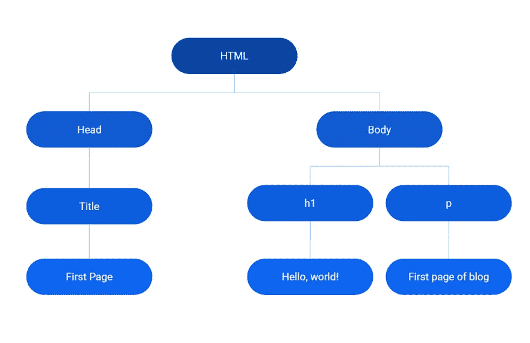
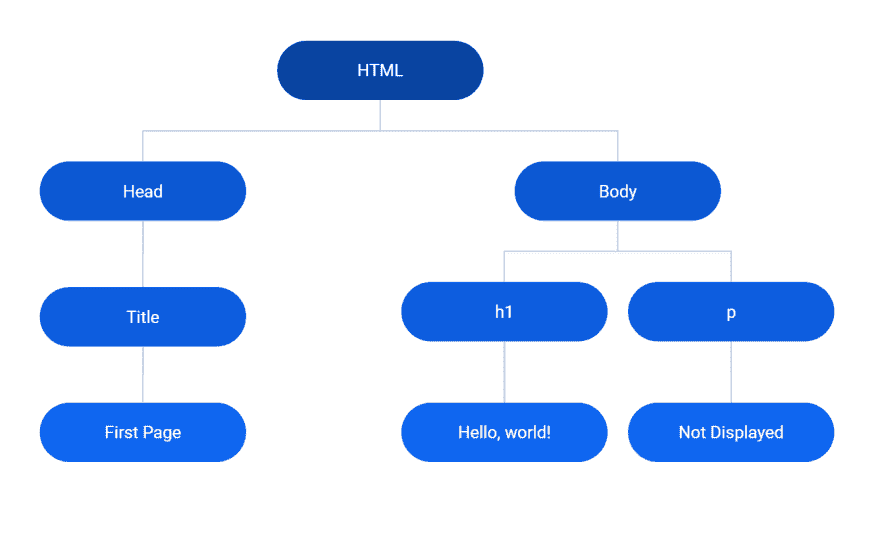
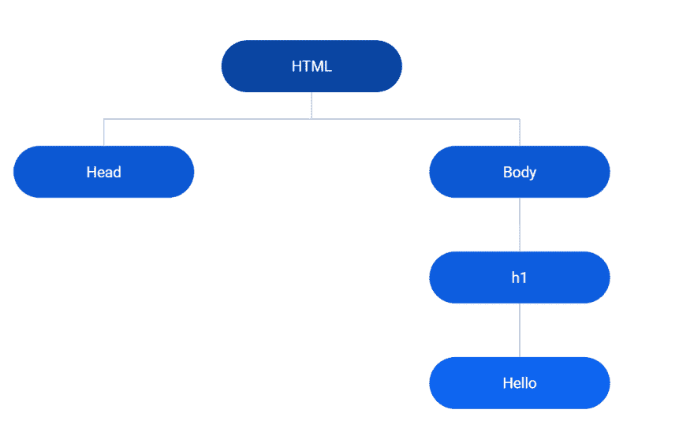

# 为什么您应该关心浏览器在 React 中的工作方式

> 原文：<https://javascript.plainenglish.io/why-you-should-care-about-how-the-browsers-work-in-react-749bcbecc32f?source=collection_archive---------10----------------------->


[@richygreat](https://unsplash.com/@richygreat) unsplash.com

## 了解 DOM 与 JavaScript 的关系

第一次读到 React 时，会出现虚拟 DOM(文档对象模型)的概念。如果你没有遇到这个术语，不要担心！要开始理解什么是虚拟 DOM，第一个重要的步骤是先对 DOM 有一个概述，然后了解 React 为什么使用虚拟 DOM。在本文中，我们将浏览 DOM，以增强您为什么想了解 React 的这个特性。

最简单地说，DOM 为 web 浏览器提供了一个内存中的结构，以传达屏幕上显示的页面结构。

当你开始使用 HTML 创建网站时，浏览器必须能够解释你写的代码。浏览器通过创建 HTML 标签的层次结构来实现，这个层次结构被表示为一棵树。该树的创建由浏览器的渲染引擎完成。它通过将每个 HTML 标记转换成一个称为节点的对象来实现这一点。

所有这些节点构成了一棵树，而这棵树的根称为文档对象。这整个树简称为文档对象模型或 DOM。

```
<!doctype html>
<html lang="en">
 <head>
   <title>First page</title>
  </head>
 <body>
    <h1>Hello, world!</h1>
    <p>First Page of Blog</p>
  </body>
</html>
```

下面是 DOM 表示的样子



每个 DOM 节点都有一个类型，这对于区分不同的节点非常重要。它还具有该节点独有的独特属性和方法。下面是常见节点类型的列表，这不是一个详尽的列表！

1.  文档节点—指定整个 HTML 文档，
2.  元素节点—访问每个 HTML 标记
3.  文本节点—访问 HTML 文档中的文本
4.  document fragment——一个轻量级的 DOM，在浏览网站时保存在浏览器内存中。它提供了一种实时更新 DOM 的方法(这听起来熟悉吗？)
5.  DocumentType —声明呈现给浏览器的文档是 HTML ( )

现在澄清一些你可能听说过的关于 DOM 的问题

# DOM 不是你在浏览器上看到的样子

你在浏览器上看到的是 DOM 和 CSS 表示的组合！这被称为渲染树。渲染树和 DOM 的区别在于 DOM 不会排除 HTML 中隐藏的元素。

一个例子是

```
<!doctype html>
<html lang="en">
 <head>
   <title>First page</title>
  </head>
 <body>
    <h1>Hello, world!</h1>
    <p style="display: none> Not displayed </p>
</body>
</html>
```

DOM 表示



# DOM 不是源 HTML 文档

DOM 实际上纠正了一些错误，比如我们忘记在 HTML 中添加 body 标签。

```
<!doctype html>
<html lang="en"
    <h1>Hello</h1>
  </body>
</html>
```

DOM 表示



注意 body 元素是如何插入到 DOM 中的？HTML 是宽容的！

# DOM 和 JavaScript

这与 React 或 JavaScript 有什么关系呢？

使用 JavaScript 创建和添加 DOM 节点是可能的。与 JavaScript 的关系，DOM 的目的是为 JavaScript 提供一个能够改变它的接口(添加节点、移除节点、替换、添加事件)。正是这种 DOM 操作赋予了 JavaScript 提供我们在网站上经常看到的动态功能的能力。这些 DOM 节点中的每一个都有自己独有的属性和方法，可以被使用和操作。

关于 DOM 与 JavaScript 的交互，可能会问的一个问题是，当浏览器遇到。

浏览器停止创建 DOM，它阻止任何进一步的创建，并执行我们编写的脚本。一旦脚本运行完毕，DOM 的其余部分就创建好了。

现在我们在高层次上理解了 DOM，这与 React 有什么关系呢？React 使用一种叫做虚拟 DOM 的东西，它只在需要的基础上与 DOM 交互。

为了完整地回答这个问题，我们必须考虑为什么在 React 中使用它而不是普通的 JavaScript？(提示不是因为 DOM 慢！).我们将在另一篇文章中讨论这个问题。

# 其他文章

[](https://medium.com/javascript-in-plain-english/embed-a-qr-code-scanner-and-browser-into-your-next-mobile-app-42245cbdebf) [## 将二维码扫描仪和浏览器嵌入你的下一款手机应用

### 如何使用 React Native 嵌入二维码扫描仪和网络浏览器

medium.com](https://medium.com/javascript-in-plain-english/embed-a-qr-code-scanner-and-browser-into-your-next-mobile-app-42245cbdebf) [](https://medium.com/javascript-in-plain-english/why-do-we-have-to-wrap-react-components-b168232dbd3a) [## 为什么我们必须包装 React 组件？

### 理解 React 应用程序中的 div 包装！

medium.com](https://medium.com/javascript-in-plain-english/why-do-we-have-to-wrap-react-components-b168232dbd3a) 

# 关于作者

我是一名执业医师和教育家，也是一名网站开发者。请点击此处查看我的博客和其他帖子中关于项目的更多细节。如果你想和我联系，请在这里联系
[aaron . Smith . 07 @ aberdeen . AC . uk](mailto:aaron.smith.07@aberdeen.ac.uk)