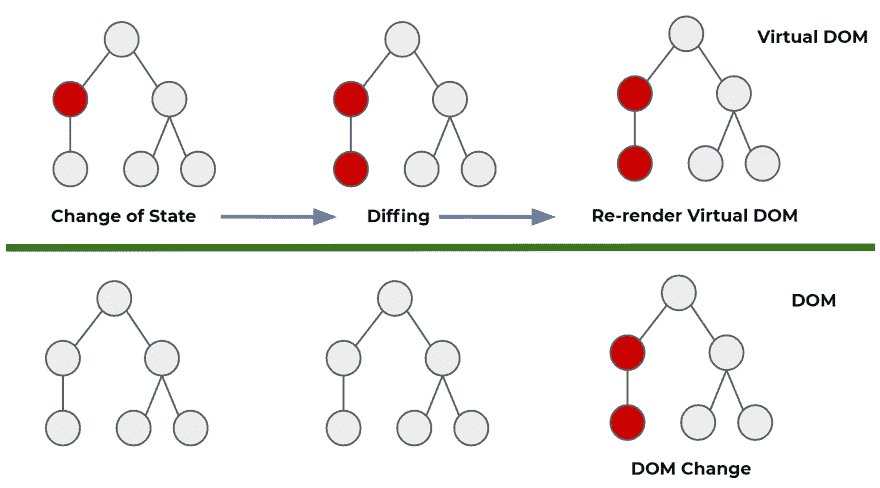

# 为什么您应该关注虚拟 DOM

> 原文：<https://javascript.plainenglish.io/why-you-should-care-about-the-virtual-dom-4452cae95f10?source=collection_archive---------20----------------------->


[@florianolv](https://unsplash.com/@florianolv) unsplash.com

## 了解 React 如何使用虚拟 DOM

虚拟 DOM 是 React 库中的一个概念，是其工作原理的核心。在本文中，您将逐渐理解它是什么，它可能看起来像什么以及 React 为什么使用它的基本抽象。

# 什么是虚拟 DOM？

把虚拟 DOM 想象成一个概念，在 React 代码库中没有叫做虚拟 DOM 的东西。它作为一个有用的工具来完成 React 的任务，创建处理状态的用户界面组件(我们将在下面简要定义状态)

虚拟 DOM 是 DOM 的内存表示。它有相同的属性，但是没有像 DOM 一样把它放到屏幕上的开销。当 DOM 第一次被构思的时候，频繁地改变页面上的内容并不是一个真正的概念。然而，随着网站变得越来越复杂，拥有这种频繁改变的能力是一个主要的优势。

你会看到很多关于虚拟 DOM 的文章，但本质上它只是一个普通的旧 JavaScript 对象。这个对象可以很容易地操作，这也是 React 使用它作为构造的原因。

虚拟 DOM 的另一个经常变化的方面是状态的概念。本质上，状态是一种在组件中存储数据的方式，该组件可以更改，并可用于在页面上显示您希望动态显示的内容。你可以想象在一个复杂的网站中，可能有很多东西你想改变，并保持跟踪记录。通过普通的 DOM 操作来做这件事变成了一项笨拙的任务。React 在这方面做得最好，所以当我谈到处理状态的用户界面时，这就是我的意思。

React 还允许我们进行声明，也就是说，我们不关心 React 如何做我们想要做的事情。我们只是希望能够告诉它我们希望组件处于什么状态，并让 React 最终相应地操作 DOM。此外，每次状态改变时，虚拟 DOM 都会更新。这是我们跟踪所有状态的方法。

# 虚拟 DOM 的基本抽象

让我们把一些代码放进去。这是虚拟 DOM 的一个非常精简的版本。

假设我们有一个列表组件，它对应于一个无序列表。它可能看起来像这样

```
const list = {
    tagName: "ul",
    attributes: { "class": "list" },
    children: [
        {
            tagName: "li",
            attributes: { "class": "list__item" },
            textContent: "List item"
        }
    ]
};
```

所以你现在一定在想这个虚拟 DOM 是怎么创建的？任何时候我们写任何 JSX，它都会被转换成一个`React.Element`函数。这将返回一个对象，而这个对象就是虚拟 DOM 的一部分。每当你对此感到困惑时，回想一下。

# React 如何使用虚拟 DOM

当需要进行更改时，可以通过创建一个新的虚拟 DOM 来更新虚拟 DOM，并应用预期的更改。

每次使用`ReactDOM.render()`函数渲染 JSX 元素时，都会创建一个全新的虚拟 DOM。乍一看，这似乎是低效的，但这样做的成本是微不足道的，我们实际上是在创建一组对象。

下面是一个 React 在非常基础的层面上做什么的例子，这里我们复制了上面的虚拟 DOM 的例子

```
const copy = {
    tagName: "ul",
    attributes: { "class": "list" },
    children: [
        {
            tagName: "li",
            attributes: { "class": "list__item" },
            textContent: "List item one"
        },
        {
            tagName: "li",
            attributes: { "class": "list__item" },
            textContent: "List item two"
        }
    ]
};
```

然后将这个新的 DOM 副本与之前的虚拟 DOM 的快照进行比较。React 然后产生一组指令，告诉我们在这两个版本的虚拟 DOM 之间需要改变什么。这个过程叫做 diffing。React 决定如何有效地进行这些更改，并且只更改这些更改的 DOM。

```
const diffs = [
    {
        newNode: { /* new version of list item one */ },
        oldNode: { /* original version of list item one */ },
        index: /* index of element in parent's list of child nodes */
    },
    {
        newNode: { /* list item two */ },
        index: { /* */ }
    }
]
```



它本质上同步了虚拟 DOM 和 DOM。这也意味着 React 只改变 DOM 一次。这个比较和改变虚拟 DOM 到最终 DOM 操作的整个过程被称为协调。

这样做的好处是，我们作为编码人员不必关心这是如何发生的，React 将这个负担从我们身上带走，并允许我们关注其他问题。

所以现在您应该已经很好地掌握了虚拟 DOM 的基础知识，以及 React 如何从高层结构中工作。下次见！

## 其他文章

[](https://medium.com/javascript-in-plain-english/why-you-should-care-about-how-the-browsers-work-in-react-749bcbecc32f) [## 为什么您应该关心浏览器在 React 中的工作方式

### 了解 DOM 与 JavaScript 的关系

medium.com](https://medium.com/javascript-in-plain-english/why-you-should-care-about-how-the-browsers-work-in-react-749bcbecc32f) [](https://medium.com/javascript-in-plain-english/why-do-we-have-to-wrap-react-components-b168232dbd3a) [## 为什么我们必须包装 React 组件？

### 理解 React 应用程序中的 div 包装！

medium.com](https://medium.com/javascript-in-plain-english/why-do-we-have-to-wrap-react-components-b168232dbd3a) [](https://medium.com/javascript-in-plain-english/why-you-should-be-using-react-fragments-a5d8314a59ff) [## 为什么应该使用 React 片段

### 如何使用 React 提升 React 应用程序？碎片

medium.com](https://medium.com/javascript-in-plain-english/why-you-should-be-using-react-fragments-a5d8314a59ff) 

## 关于作者

我是一名执业医师和教育家，也是一名网站开发者。请点击[这里](https://dev.to/aaronsm46722627/www.coding-medic.com)了解我在博客和其他帖子上关于项目的更多细节。如果你想和我联系，请在这里联系:[aaron . Smith . 07 @ aberdeen . AC . uk](mailto:aaron.smith.07@aberdeen.ac.uk)或在推特上@aaronsmithdev。