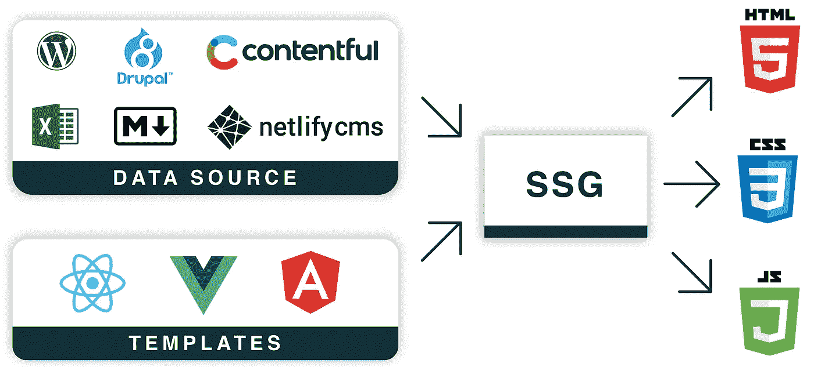

# 为什么你应该考虑使用静态站点生成器

> 原文：<https://javascript.plainenglish.io/why-you-should-consider-using-a-static-site-generator-2eaff669259?source=collection_archive---------0----------------------->

## 超快、轻量级、面向未来——这就是静态站点生成器的描述。

Image of complex machine

这篇博文描述了什么是静态站点和静态站点生成器，并指出为什么应该考虑使用它们。

# 什么是静态网站？💡

Diagram of serving static website

静态网站是完全按照存储内容交付给用户的网站。如果我们将静态网站与大多数互联网网站进行比较，就会发现大多数网站都在动态地构建文件，为客户提供服务。如果我们有一个静态网站——页面已经建立，用户不必等到服务器生成内容。

# 那么有什么优势呢？📚

## 1.网站快得不能再快了

如前所述——用户不必等到服务器的运行时生成 *HTML* 、 *CSS* 和 *JS* 文件。服务器已经准备好了它们，并立即将它们提供给用户。

## 2.网站非常安全

静态网站的服务器不包含任何复杂的软件，这些软件具有潜在的安全缺陷，可能会被用来对付你。即使有，黑客也不会从服务器得到任何额外的东西——无论如何，服务器所包含的都是提供给用户的。

当然，你可能会说黑客会以某种方式对网站所有者造成伤害，但我相信在静态网站的情况下，被黑客攻击的概率和潜在的伤害要小得多。

## 3.易于扩展

扩展一个提供静态文件的服务器比扩展一个有数据库、运行时和管理面板的服务器要容易得多。

其中一个资源比其他资源需要更多或更少的伸缩，在这种情况下，它变得更加复杂。而静态站点服务器是服务于文件的单个实例，并且复杂性低得多。

## 4.廉价托管(通常是免费的)

托管一个提供静态文件的服务器显然比提供运行时、数据库、管理面板和生成文件服务的服务器便宜得多。一些提供商让你完全免费托管一个静态网站，甚至让你有一个自己选择的子域。

## 5.提高搜索引擎优化评级

显然静态网站和搜索引擎更快。此外，静态网站生成器通常会让你对 SEO 有更多的控制，你可以更容易地获得更好的评级。完整的静态站点生成器 SEO 指南请看 Soham Kamani 的博客[。](https://buttercms.com/blog/a-complete-dead-simple-guide-to-seo-for-static-site-generators)

## 6.对网站所做的更改很容易跟踪

当你在管理面板中做了一些更改，但你无法追踪它们，因为所有的更改都被刷新到数据库而不是代码中，你有没有遇到过使用 *Wordpress* 的情况？或者更糟的是，当你需要用 DB 部署你的代码，而你的客户端已经通过管理面板做了一些改变——现在你有两个不同的分叉版本的数据库😖

有了静态网站，你就可以避免所有这些与跟踪变化相关的问题。你对一个网站所做的所有改变都要经过代码，你可以在你的版本控制系统中看到每一个改变。

## 7.对可维护性的需求接近于 0

首先，静态网站没有活动的部分——它只有静态文件。静态文件可以在不做任何改变的情况下被提供给客户端很长时间。

如果我们以一个 *Wordpress* 网站为例，我们必须时刻照看它。每个月打补丁，用 *PHP* 版本的 *Wordpress* 和其他一些可能在短时间内崩溃的部分来保持你的主题。

想象一下，我们从现在开始已经部署了 10 年前的静态网站，没有再碰过。我相信所有的浏览器都会像 10 年前一样显示它，不会有任何问题。

# 什么是静态站点生成器？⚙

Diagram of static site generator

静态网站生成器是一个工具，它获取你的模板(通常用前端框架编写)，用来自数据源的数据填充它们，并吐出 *HTML* 、 *CSS* 和 *JS* 文件，也就是静态网站。

例如在 *GatsbyJS* (一个流行的现代静态站点生成器)中，我们用 *ReactJS* 编写网站的前端，用 *GraphQL* 我们定义如何从数据源获取数据来填充模板。GatsbyJS 的数据来源实际上可以是任何东西:文件系统、headless *Wordpress* 、电子表格、数据库、 *Magento* 、markdown 文件……清单还在继续，如果它结束了，你可以根据自己的需要编写一个插件，并从测量空气质量的微控制器中获取数据——这取决于你的想象力。

# 真的比仅仅用 raw HTML 写一个网站好吗？🤔

## 是的。因为静态站点生成器将提供以下优势:

*   编码指南和基础设施已经建立
*   许多插件
*   CMS 支持
*   支持多种数据源
*   有很多开始

# 静态网站生成器很棒，为什么大多数网站都是动态的呢？🙄

## 1.基于静态站点生成器的站点需要时间来更新

我们无法立即看到变化，这对于一些项目来说可能是痛苦的——如果我们更改数据源，就会触发重建，这需要时间，网站上的更新可能需要几分钟。

## 2.通过动态网站提供功能更容易

如果你的网站向用户提供的功能多于内容，你可能会选择一个动态的网站。当一个静态站点在功能上提供内容时，它的全部潜力都得到了利用。

## 3.静态网站生成器需要更多的知识

如果我们比较静态站点生成器和传统的 CMS——CMS 对于琐碎的任务要容易得多。人们希望更快更省力地达到效果，这就是为什么 CMS 被更多地选择的原因。此外，如果你不是开发者，你很难使用静态站点生成器，而非技术人员正在使用。

## 4.静态网站生成器首先需要投入更多的时间

与 CMS 相比，静态站点生成器通常需要投入更多的精力和时间。根据 CMS 和 static site generator 的不同，它可能会有所不同，但通常下载 CMS 并遵循向导会更容易。

## 5.不包括管理界面

如果你想有一个管理界面，你必须自己选择、设置并弄清楚如何使用它，它不包括在静态站点生成器中，至少通常是这样。

# 结论📜

静态站点生成器是非常棒的工具，有很多优点，但是并不是所有时候你都可以利用它们。尽管如此，我建议你想一想，如果你下次可以使用静态站点生成器，你将会为网站选择一个技术栈。为了给你的项目找到**最好的静态站点生成器(SSG)** ，看看 [Mathieu Dionne 的博客文章。](https://snipcart.com/blog/choose-best-static-site-generator)

编码快乐！⌨