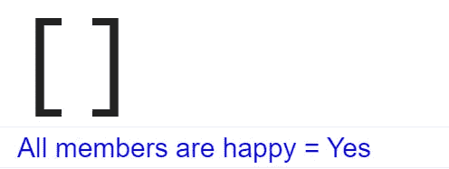

# 为什么你应该知道 JavaScript 中 Array.every 的空洞事实

> 原文：<https://javascript.plainenglish.io/why-you-should-know-the-vacuous-truth-about-array-every-in-javascript-f447213fcdb0?source=collection_archive---------12----------------------->

## 这个博客帮助你理解 JavaScript 中关于方法`Array.every`的一个空洞的事实。


You cant change the truth, but truth can change you

让我们从回顾`Array.every`的用例开始:

*   我有一个项目集合和一个应用于该集合的业务逻辑(谓词函数——接受输入并返回二进制结果的函数，即——布尔值)
*   需要检查集合中的所有项目是否都与逻辑相似(即 true ),我们应用。

那么`Array.every`是接近的正确决定。

例如，将家庭视为一个集合，不同的成员可能会有不同的心情。

Display family members

复制粘贴上述代码，在 chrome 调试器工具中查看家族成员


现在，让我们观察一下——是否所有的家庭成员都快乐。用`Array.every`

```
...
...
console.log(`%c[${family}]`, "font-size: 5rem");// is everyone happy in the family ?
const codeForHappy = "0x1F600";
const isHappy = family.every((member) => member === generateMood(codeForHappy));console.log(`%cAll members are happy = ${isHappy ? "Yes" : "No"}`,"color: blue; font-family:sans-serif; font-size: 20px");
```


members of family with different moods 😄 😝 😅 😙 😜

让我们用笑话来滋养他们，让这个家庭的所有成员都最快乐


```
const codes = [
"0x1F600","0x1F600","0x1F600","0x1F600","0x1F600","0x1F600",
];
```


Happy family 😃

感谢和你在一起，到底什么是空虚，让我们移除所有家庭成员，并尝试检查，是否所有成员都再次快乐。

```
const codes = [];
```



once updating family as empty collection

答案是肯定的。是的——这毫无疑问是真的——当家里没有成员时，家里的所有成员都很快乐是真的。

空洞的真理有时会误导人，因为它对实际上不存在的事物做出合理的断言。

更多虚假陈述的例子:

1.  团队中的所有成员都穿红色 t 恤(团队中没有成员)
2.  孩子说，我吃光了我盘子里的所有蔬菜(可能盘子是空的)

简而言之，空洞的事实是:


谢谢你🙏快乐编码，让我快乐👏让你的家人最快乐😄