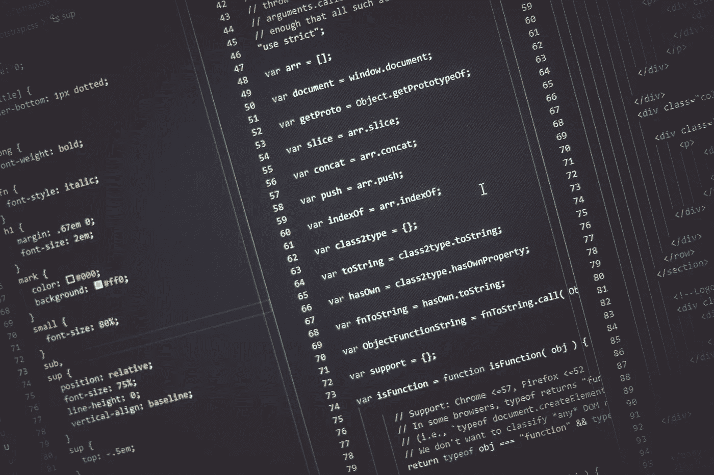

# 为什么你应该学习 JavaScript

> 原文：<https://javascript.plainenglish.io/why-you-should-learn-javascript-74f246c29e0d?source=collection_archive---------2----------------------->

## 如果你正在从事软件开发或者只是想学习如何在代码中乱来，我的建议是试试 JavaScript。

Some JavaScript syntax. Photo by [Bharat Patil](https://unsplash.com/@bharat_patil_photography?utm_source=unsplash&utm_medium=referral&utm_content=creditCopyText) on [Unsplash](https://unsplash.com/s/photos/javascript?utm_source=unsplash&utm_medium=referral&utm_content=creditCopyText)

我在开发者圈子里遇到的很多人都很害羞，不敢表达他们对某一特定语言或框架的热爱。我不是大多数人。我喜欢 JavaScript，出于某种家庭纽带，我也喜欢它的弟弟妹妹 TypeScript。但是为什么呢？

关于我自己的一点背景。我开始我的编程生活，作为一个孩子在基本建设的东西。(是的，那是很久以前的事了)。我逐渐开始学习 html，在高中时，它还是一个全新的概念，后来我转到了 C 和 Java。

后来，在我读大学的时候，我在塞班操作系统(诺基亚手机)和 Windows Mobile PDA 操作系统上使用当时被称为 J2ME 的 Java 变体构建了当时被称为“移动应用”的东西。

在那之后的一段时间里，我完全放弃了软件开发，只是在大约十年前回来学习一点 JavaScript web 开发。熟悉面向对象和 Java 让我更容易理解和理解正在发生的事情。

我发现了 JavaScript:

1.  **很容易学习和掌握**。你几乎可以在任何地方找到 Javascript 教程。其中一些在 YouTube、w3schools、Sololearn 等网站上是免费的，甚至在 udemy 等付费在线课程上也是如此。它非常容易学习和掌握，在这些教程结束时，您应该对 JavaScript 有一些了解，并且可能马上就可以构建东西。
2.  **专为网络设计，但在任何地方都适用。**Javascript 的神奇力量在于，它几乎在任何地方都能工作，尽管它最初只是作为客户端语言工作。除了为网站提供动力之外，Javascript 还可以用于服务器(Nodejs、NestJS)、游戏开发(Unity)、物联网(覆盆子 Pi)、移动应用开发(Ionic Framework、reactor、Vue)、机器学习(TensorflowJS)等等。您只需要学习 JavaScript，并能够构建一个完整的堆栈软件开发应用程序，而不是学习和掌握一种不同的语言，用于开发堆栈中的不同应用程序。从后端服务器，直接到前端应用程序。我对 JavaScript 作为一种编程语言的无处不在以及它在大多数意想不到的地方的可用性感到非常惊讶。
3.  合乎逻辑且易于理解的语法。如果你不熟悉复杂的计算机编程语言，语法可能很难理解。与其他复杂的计算机编程语言不同，JavaScript 的语法很有逻辑性，很容易理解。我在这里可能有优势，因为我是从我以前做过其他编程语言的角度来说的，但是从初学者的角度来看，你可能会惊讶于掌握 JavaScript 是多么容易。
4.  **无需复杂安装。作为起点，可在世界上的每个网络浏览器上使用。**因为 JavaScript 是为客户端设计的，所以开始时，不需要太多东西。当然，你可能需要一个好的 IDE(集成开发环境),比如 VSCode，但是任何简单的文本编辑器，甚至有用的记事本都足够了。另一件你可能需要的东西是浏览器，今天所有的电脑上都有，仅此而已。可以开始学习编程 JavaScript 了。您将来可能需要做的其他事情可以稍后安装，但是作为一个好的起点，您只需要一个 IDE 和一个 internet 浏览器。
5.  **巨大的社区，很容易找到帮助和支持。**无论是仅仅为了能够建立一个简单的输入框界面网站，还是仅仅为了创建一个复杂的服务器端的东西，你可以打赌你只是一个谷歌远离找到解决方案。如果你正在寻找 JavaScript 的支持，在 Google 上很容易找到你需要的东西。由于 JavaScript 与许多框架兼容，对这些框架支持也很容易找到。

所以，如果你和我一样，已经离开计算机科学/软件工程好几年了，或者不久前已经有了某种编程知识，想重新回到编码/编程领域？试试 JavaScript 吧。对我来说，重新捡起来真的很容易，而且学习和使用我在大学早期学到的一些概念是一个愉快的过程。

如果你想重新开始，这里有一些好的起点:

 [## JavaScript 教程

### JavaScript 是 HTML 和 Web 的编程语言。JavaScript 很容易学。本教程将教你…

www.w3schools.com](https://www.w3schools.com/js/)  [## JavaScript 教程

### 我们的教程将教你 JavaScript 编程的基础。你可以学习如何让你的网站更…

www.sololearn.com](https://www.sololearn.com/Course/JavaScript/) 

如果我不提我也是爱奥尼亚的忠实粉丝，那我就失职了。Ionic 是一个专门为移动开发开发的框架。它使用 HTML，CSS 和 TypeScript，基本上就是 JavaScript- ie。JavaScript 和 TypeScript 的语法完全相同。Ionic 的神奇之处在于:只需一个代码库，你就可以为 iOS、Android、web 甚至计算机应用程序构建一个应用程序。如果你想开发应用程序，我建议你试试 Ionic。

 [## Ionic -跨平台移动应用开发

### Ionic 是面向 web 开发者的应用开发平台。构建令人惊叹的跨平台移动、web 和桌面应用程序…

www.ionicframework.com](https://www.ionicframework.com) 

**总结**

如果你没有阅读上面的文章就直接向下滚动到这里，我想告诉你的是，如果你想学习如何编码和/或想进入编码领域，JavaScript 是最好的起点。我已经在上面概述了我的理由。