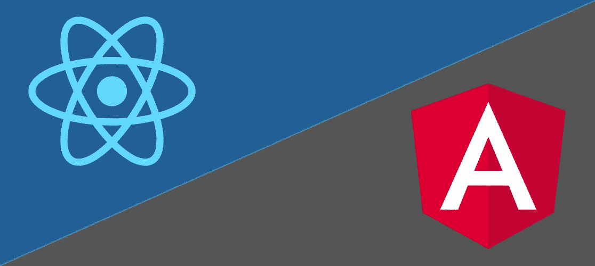
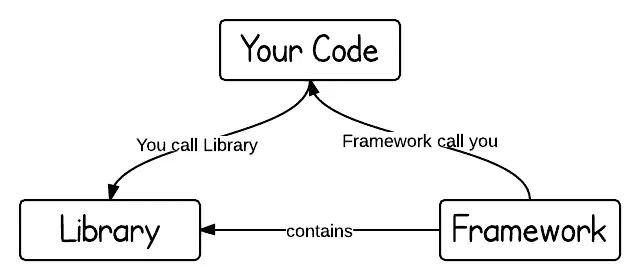
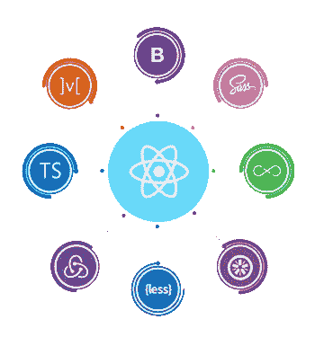
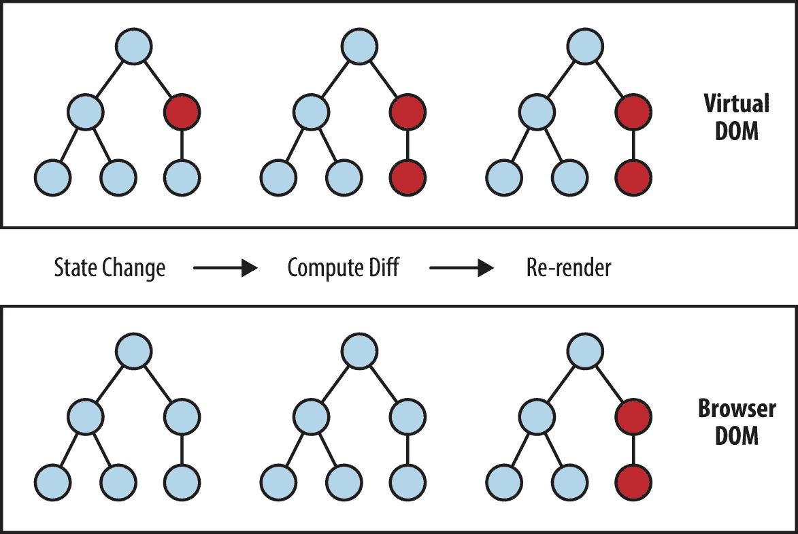
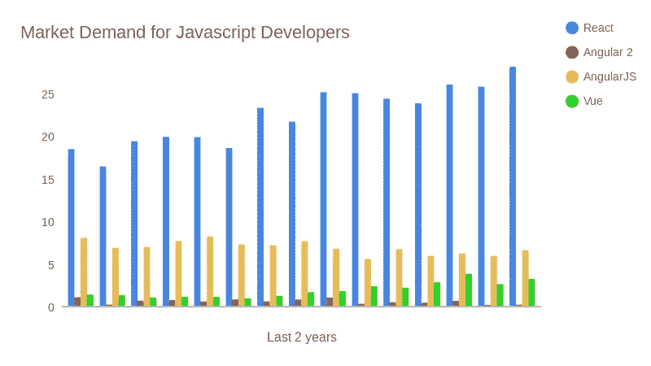

# 为什么你应该学习反应而不是角度

> 原文：<https://javascript.plainenglish.io/why-you-should-learn-react-instead-of-angular-f2333dd1228b?source=collection_archive---------2----------------------->

一旦你认为你已经很好地学习了 JavaScript，对它有了基本的了解，熟悉一个库或框架可能是一个好主意，使编码更愉快和更有效。到目前为止，你可能听说过的两个主要工具是 Angular，一个由 Google 开发的 Javascript 框架，和 React，一个由脸书开发的 JavaScript 库。今天，我们将讨论 React 相对于 Angular 的优势，以及为什么应该使用 ReactJS。

# 反应和角度的区别

在深入研究 ReactJS 相对于 Angular 的优势之前，我们先来看看两者之间的主要区别。首先，React 是一个 JavaScript ***库*** ，而 Angular 是一个 JavaScript ***框架*** 。简单来说，“当你从一个库中调用一个方法时，你就在控制之中。但有了框架，控制权就反过来了:框架给你打电话。”

[Source](https://www.programcreek.com/2011/09/what-is-the-difference-between-a-java-library-and-a-framework/##targetText=Key%20Difference%20and%20Definition%20of,a%20collection%20of%20class%20definitions.)

库比框架给你更多的定制和自由。你可以把图书馆想象成你自己给一个房间添加家具，把框架想象成可以从一组预先安排好家具的房间中进行选择。就开发速度而言，这使得 angular 更容易使用，但是您不能做出与 React 相同的特定更改。如果您想详细了解 Angular 和 React 之间的主要区别，下面的视频提供了大量信息。

简而言之，React 是最基本的，它允许你使用任何你想要的工具。

# 反应给你自由

类似于你如何选择房间里你想要的沙发或椅子，以及你想要它在哪里，React 本质上允许你在你的应用程序中做同样的事情。Angular 是不同的，因为它就像是选择一个已经为你布置好了所有家具的房间。这些是框架和库之间的区别，这意味着像 React s 这样的库会给你比 angular 更多的自由。

[Source](https://blog.usejournal.com/5-super-reasons-to-love-react-js-b57505535ea5)

React 的设计使得它可以同时与其他库一起使用，并给予开发人员基本上所有的控制来做任何需要的事情，这就是为什么如果您试图制作任何独特或复杂的东西，它是非常棒的。在 React 中做一些小的改动也更加实际，因为作为一名开发人员，你将有更多的自由。

# React 使用虚拟 DOM

React 使用所谓的虚拟 DOM(文档对象模型),这使得它非常快。虚拟 DOM 在帮助 React 发展到今天的位置方面发挥了很大的作用。Angular 不使用虚拟 DOM，而是使用常规 DOM，这意味着它没有 React 快。这张图片展示了常规 DOM 和虚拟 DOM 之间的区别。

[Source](https://programmingwithmosh.com/react/react-virtual-dom-explained/)

与常规 DOM 相反，虚拟 DOM 的工作方式是通过它的区分方法。虚拟 DOM 不需要在每次状态发生变化时更新整个 DOM，而是将变化与之前的 DOM 截图进行比较，并且只应用相关的变化，而不是重新更新整个 DOM。如果你想了解更多关于虚拟 DOM 的信息，你可以点击这里。

# 反应是有需求的

据 Codica.com 的[称，React 现在是最受欢迎的 JS 库，在过去的几年里人气大增。出于各种原因，使用流行和现代的东西是好的，如果你正在找工作，这也是很好的。](http://codica.com/)

[Source](https://www.hntrends.com/2018/jun-no-signs-of-slowing-for-react.html?compare1=React&compare2=AngularJS&compare3=Angular+2&compare4=Vue)

从上图可以看出，使用 React 的开发人员比使用其他库和框架的开发人员更受欢迎，其中一个包括 AngularJS，所以如果你正在找工作，你们中的许多人可能都在找工作，React 可能是更好的选择。

# 结束语

除了与 Angular 相比 React 提供的众多优势之外，它还附带了许多其他很酷的功能。其中包括 JSX、虚拟 DOM(如前所述)，以及通过 React Native 创建移动应用程序的能力！如果你对 React 感兴趣，这里还有五个你应该学习它的理由。

 [## 你应该使用 React 的 5 个理由

### 看看你应该开始使用 React JS 的五大理由。

medium.com](https://medium.com/javascript-in-plain-english/5-reasons-why-you-should-be-using-react-238373cc245e) 

*来源*:

[https://www . program creek . com/2011/09/what-is-the-difference-a-Java-library-and-a-framework/# # target text = Key % 20 difference % 20 and % 20 definition % 20 of，a % 20 collection % 20 of % 20 class % 20 definitions](https://www.programcreek.com/2011/09/what-is-the-difference-between-a-java-library-and-a-framework/##targetText=Key%20Difference%20and%20Definition%20of,a%20collection%20of%20class%20definitions)。

[https://www . HN trends . com/2018/jun-no-signs-of-slowing-for-react . html？compare 1 = React&compare 2 = Angular js&compare 3 = Angular+2&compare 4 = Vue](https://www.hntrends.com/2018/jun-no-signs-of-slowing-for-react.html?compare1=React&compare2=AngularJS&compare3=Angular+2&compare4=Vue)

[https://blog . use journal . com/5-super-reasons-to-love-react-js-b 57505535 ea 5](https://blog.usejournal.com/5-super-reasons-to-love-react-js-b57505535ea5)